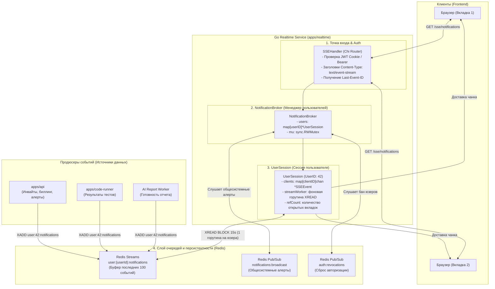
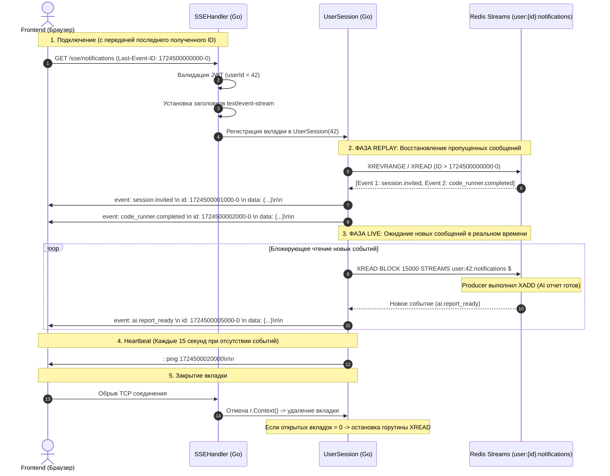

# Server-Sent Events (SSE) Realtime Service: Архитектура, Принципы и Руководство для Go-разработчика

Документ подробно описывает внутреннее устройство подсистемы **Server-Sent Events (SSE)** в сервисе `apps/realtime`, детально объясняет **что, зачем и почему** устроено именно так, разбирает многопоточность в Go (`http.Flusher`, каналы, контексты), интеграцию с **Redis Streams** и гарантированную доставку уведомлений с восстановлением по `Last-Event-ID`.

---

## Оглавление
1. [Введение: Что такое SSE и чем он отличается от WebSocket и HTTP](#1-введение-что-такое-sse)
2. [Когда использовать WebSocket, а когда — SSE?](#2-когда-использовать-websocket-а-когда--sse)
3. [Общая архитектурная схема SSE-сервиса](#3-общая-архитектурная-схема-sse-сервиса)
4. [Жизненный цикл соединения и Replay пропущенных событий](#4-жизненный-цикл-соединения-и-replay)
5. [Анатомия компонентов Go SSE-сервиса](#5-анатомия-компонентов-go-sse-сервиса)
   - [5.1. SSE Handler и интерфейс `http.Flusher`](#51-sse-handler-и-интерфейс-httpflusher)
   - [5.2. NotificationBroker — Диспетчер подписок пользователя](#52-notificationbroker--диспетчер-подписок-пользователя)
   - [5.3. Multi-Tab Multiplexing (Несколько вкладок одного пользователя)](#53-multi-tab-multiplexing-несколько-вкладок-одного-пользователя)
6. [Хранилище данных и очереди: Почему Redis Streams?](#6-хранилище-данных-и-очереди-почему-redis-streams)
   - [Redis Streams (`XADD` + `XREAD BLOCK`) vs Redis Pub/Sub](#redis-streams-vs-redis-pubsub)
   - [Ограничение длины стрима (`MAXLEN ~ 100`) и TTL](#ограничение-длины-стрима-maxlen--100-и-ttl)
7. [Паттерны многопоточности и Concurrency в Go](#7-паттерны-многопоточности-и-concurrency-в-go)
   - [Как работает streaming в стандартном `net/http`](#как-работает-streaming-в-стандартном-nethttp)
   - [Обработка отключения клиента через `r.Context().Done()`](#обработка-отключения-клиента-через-rcontextdone)
   - [Heartbeat Ping (Комментарии SSE) против обрыва связи прокси](#heartbeat-ping-комментарии-sse-против-обрыва-связи-прокси)
   - [Защита от медленных клиентов (Slow Consumer)](#защита-от-медленных-клиентов-slow-consumer)
8. [Протокол передачи данных (W3C EventSource Wire Protocol)](#8-протокол-передачи-данных-w3c-eventsource-wire-protocol)
9. [Справочник типов SSE-событий платформы](#9-справочник-типов-sse-событий-платформы)
10. [Пошаговое руководство: Как отправить и обработать новое SSE-уведомление](#10-пошаговое-руководство-как-отправить-и-обработать-новое-sse-уведомление)
11. [Конфигурация Nginx / Edge Proxy](#11-конфигурация-nginx--edge-proxy)
12. [Словарь терминов Go-разработчика](#12-словарь-терминов)

---

## 1. Введение: Что такое SSE?

**Server-Sent Events (SSE)** — это стандарт W3C, позволяющий серверу открывать **однонаправленный (Server-to-Client)** долгоживущий поток передачи текстовых данных поверх стандартного протокола HTTP.

### Как это работает на транспортном уровне:
1. Браузер делает обычный HTTP-запрос:
   ```http
   GET /sse/notifications HTTP/1.1
   Host: api.mockinterviewai.com
   Accept: text/event-stream
   ```
2. Сервер отвечает успешным статусом и **не закрывает соединение**:
   ```http
   HTTP/1.1 200 OK
   Content-Type: text/event-stream
   Cache-Control: no-cache
   Connection: keep-alive
   ```
3. Каждый раз, когда происходит событие, сервер отправляет чанк данных в открытый сокет и делает `Flush()`.

---

## 2. Когда использовать WebSocket, а когда — SSE?

В архитектуре **MockInterviewAI** строгий водораздел между технологиями:

```
+---------------------------------------------------------------------------------------------------+
|                                        Frontend (Браузер)                                         |
+------------------------------------+--------------------------------------------------------------+
                                     |
           +-------------------------+-------------------------+
           |                                                   |
(Сессионный трафик: 1 комната)                      (Глобальный аккаунт: весь сайт)
           v                                                   v
+------------------------------------+              +------------------------------------+
|        WebSocket Protocol          |              |         SSE Protocol               |
|     /ws/sessions/:sessionId        |              |         /sse/notifications         |
+------------------------------------+              +------------------------------------+
| • Двунаправленный (Bi-directional) |              | • Однонаправленный (Server ➔ Client)|
| • Коллаборативный редактор кода    |              | • Инвайты на собеседования         |
| • Позиции курсоров в реальном врем.|              | • Статусы выполнения тестов (runner)|
| • Текстовый чат сессии             |              | • Готовность AI-отчетов            |
| • Жизненный цикл = интервью (1 ч)  |              | • Жизненный цикл = сессия логина   |
+------------------------------------+              +------------------------------------+
```

### Главные преимущества SSE для уведомлений:
1. **Простота инфраструктуры:** Работает поверх стандартного HTTP/HTTPS, не требует протокольного рукопожатия `101 Switching Protocols`.
2. **Мультиплексирование HTTP/2:** В HTTP/2 десятки SSE-потоков и параллельных REST API запросов используют **одно-единственное TCP-соединение** между клиентом и сервером.
3. **Автоматический Reconnect из коробки:** Браузерный API `EventSource` сам переподключается при обрыве сети и автоматически передает заголовок `Last-Event-ID`, гарантируя, что ни одно уведомление не потеряется при переключении с Wi-Fi на LTE.

---

## 3. Общая архитектурная схема SSE-сервиса



---

## 4. Жизненный цикл соединения и Replay

Ключевая особенность SSE — **гарантия доставки At-Least-Once** благодаря заголовку `Last-Event-ID`:



---

## 5. Анатомия компонентов Go SSE-сервиса

### 5.1. SSE Handler и интерфейс `http.Flusher`

В стандартном `net/http` в Go ответ буферизируется для оптимизации TCP-пакетов. Чтобы отправить чанк клиенту **немедленно**, используется приведение `http.ResponseWriter` к интерфейсу `http.Flusher`.

```go
func (h *SSEHandler) ServeHTTP(w http.ResponseWriter, r *http.Request) {
    // 1. Проверяем, поддерживает ли сервер потоковую передачу (Flushing)
    flusher, ok := w.(http.Flusher)
    if !ok {
        http.Error(w, "Streaming unsupported", http.StatusInternalServerError)
        return
    }

    // 2. Устанавливаем обязательные HTTP-заголовки для SSE
    w.Header().Set("Content-Type", "text/event-stream")
    w.Header().Set("Cache-Control", "no-cache")
    w.Header().Set("Connection", "keep-alive")
    w.Header().Set("X-Accel-Buffering", "no") // Отключает буферизацию в Nginx

    // 3. Отправляем заголовки клиенту немедленно
    flusher.Flush()

    // 4. Подключаем клиента к брокеру пользователя
    eventChan := h.broker.Subscribe(userID, lastEventID)
    defer h.broker.Unsubscribe(userID, eventChan)

    // 5. Главный цикл отправки событий
    for {
        select {
        case <-r.Context().Done():
            // Браузер закрыл вкладку или оборвалась сеть
            return

        case event, ok := <-eventChan:
            if !ok {
                return
            }
            // Записываем форматированный SSE-пакет в response writer
            fmt.Fprintf(w, "event: %s\nid: %s\ndata: %s\n\n", event.Type, event.ID, event.Data)
            flusher.Flush() // Немедленно проталкиваем байты в сетевой сокет!
        }
    }
}
```

---

### 5.2. `NotificationBroker` — Диспетчер подписок пользователя
- **Файл:** `internal/notification/broker.go`
- **Роль:** Хранит в оперативной памяти карту активных сессий пользователей: `users map[string]*UserSession`.
- **Обязанности:**
  - Создает `UserSession` при первом подключении пользователя.
  - Удаляет `UserSession` из памяти, когда пользователь закрыл все вкладки.
  - Слушает глобальный канал Redis Pub/Sub `notifications:broadcast` (для отправки алертов вроде «Через 15 минут техработы» всем подключенным пользователям одновременно).

---

### 5.3. Multi-Tab Multiplexing (Несколько вкладок одного пользователя)

Если пользователь открыл 5 вкладок сайта:
- **Наивный подход (Плохо):** Запустить 5 горутин, каждая из которых делает `XREAD BLOCK` в Redis. Это создаст 5x нагрузку на Redis.
- **Архитектурное решение в `apps/realtime` (Отлично):**
  - Для одного `userID` запускается **ровно одна горутина-воркер**, читающая Redis Stream.
  - Когда сообщение вычитано, оно копируется во внутренние каналы всех 5 локальных вкладок.
  - Нагрузка на Redis остается константной: **1 стрим = 1 читатель**.

---

## 6. Хранилище данных и очереди: Почему Redis Streams?

### Redis Streams vs Redis Pub/Sub:

| Критерий | Redis Pub/Sub | Redis Streams (`XADD` / `XREAD`) |
|---|---|---|
| **Хранение истории** | ❌ Нет (Fire and Forget). Если клиент был оффлайн 1 сек — сообщение потеряно навсегда. | ✅ Да. Сообщения сохраняются в лог с уникальными ID (`1724500000000-0`). |
| **Восстановление после разрыва связи (Replay)** | ❌ Невозможно. | ✅ Да, через передачу `Last-Event-ID` в команду `XREAD`. |
| **Нагрузка на память** | 0 MB (сообщения не сохраняются). | Контролируемая через `MAXLEN ~ 100` и TTL ключа. |
| **Идеально для** | Временных событий (WebRTC signaling, перемещение курсора). | **Персональных уведомлений, статусов тестов, инвайтов**. |

### Ограничение длины стрима (`MAXLEN ~ 100`) и TTL:
Чтобы Redis не переполнялся старыми уведомлениями:
1. Публикация выполняется с модификатором приближенной обрезки (O(1) по сложности):
   ```bash
   XADD user:42:notifications MAXLEN ~ 100 * type "session.invited" data "{...}"
   ```
2. Каждому ключу стрима выставляется TTL 7 дней (`EXPIRE user:42:notifications 604800`). Неактивные пользователи автоматически выгружаются из RAM Redis.

---

## 7. Паттерны многопоточности и Concurrency в Go

### Обработка отключения клиента через `r.Context().Done()`
Когда пользователь закрывает вкладку или блокирует экран смартфона, TCP-соединение разрывается.
- Стандартный `http.Request` в Go автоматически отменяет свой контекст `r.Context()`.
- В цикле обработки обязательно должен быть `case <-r.Context().Done():`, который мгновенно выходит из хэндлера и выполняет `defer cleanup()`.

---

### Heartbeat Ping (Комментарии SSE) против обрыва прокси

Большинство облачных балансировщиков (Nginx, Cloudflare, AWS ALB) имеют таймаут неактивности TCP-соединения (`idle_timeout = 60s`). Если за 60 секунд сервер не отправил ни одного байта, балансировщик принудительно закроет соединение.

#### Решение — SSE-комментарии (Heartbeat):
По спецификации W3C строки, начинающиеся с двоеточия (`:`), считаются комментариями и игнорируются JS-клиентом, но поддерживают TCP-сессию активной:
```go
heartbeatTicker := time.NewTicker(15 * time.Second)
defer heartbeatTicker.Stop()

for {
    select {
    case <-heartbeatTicker.C:
        // Отправка ping-комментария каждые 15 сек
        fmt.Fprintf(w, ": ping %d\n\n", time.Now().UnixMilli())
        flusher.Flush()
    // ...
    }
}
```

---

### Защита от медленных клиентов (Slow Consumer)

Если у пользователя медленный мобильный интернет, запись в канал вкладки может заблокироваться.

```go
func (s *UserSession) Broadcast(event *SSEEvent) {
    s.mu.RLock()
    defer s.mu.RUnlock()

    for clientID, ch := range s.clients {
        select {
        case ch <- event:
            // Успешно доставлено в буфер вкладки
        default:
            // Буфер вкладки (128 msg) переполнен -> дропаем сообщение
            s.logger.Warn("slow consumer detected, dropping SSE frame",
                slog.String("userId", s.userID),
                slog.String("clientId", clientID),
            )
        }
    }
}
```
Клиентский буфер канала имеет емкость 128 событий. Неблокирующий `select` гарантирует, что медленная вкладка не замедлит работу сервера.

---

## 8. Протокол передачи данных (W3C Wire Protocol)

Каждое сообщение SSE формируется в виде текстового блока, разделенного символами перевода строки `\n`:

```http
event: session.invited
id: 1724500001000-0
retry: 3000
data: {"sessionId":"sess-123","sessionTitle":"Go Senior Interview","inviterName":"Alex"}

```

- `event:` — имя события. Позволяет клиенту вешать обработчики вида `eventSource.addEventListener('session.invited', ...)`.
- `id:` — ID сообщения (соответствует ID в Redis Streams). Сохраняется браузером и передается в заголовке `Last-Event-ID` при реконнекте.
- `retry:` — рекомендуемый интервал переподключения в миллисекундах (клиент подождет 3 сек перед реконнектом).
- `data:` — полезная нагрузка (JSON-строка).
- `\n\n` — два перевода строки в конце пакета сообщают парсеру о завершении фрейма.

---

## 9. Справочник типов SSE-событий платформы

| Тип события (`event:`) | Инициатор (Producer) | Описание | Payload DTO |
|---|---|---|---|
| `notification.new` | `apps/api` | Новое персональное уведомление (колокольчик/тост) | `id`, `title`, `message`, `category`, `actionUrl` |
| `notification.badge` | `apps/api` | Обновление счетчика непрочитанных | `unreadCount` |
| `session.invited` | `apps/api` | Приглашение в активную комнату собеседования | `sessionId`, `sessionTitle`, `inviterName`, `joinUrl` |
| `code_runner.status` | `apps/code-runner` | Статус фонового запуска автотестов кандидата | `taskId`, `status` ("running"/"passed"/"failed"), `passedCount`, `totalCount` |
| `ai.report_ready` | `apps/realtime` / AI Worker | Готовность итогового аналитического отчета | `sessionId`, `reportId`, `score`, `reportUrl` |
| `system.broadcast` | Redis Pub/Sub | Общесистемное оповещение (техработы) | `severity` ("info"/"warn"/"crit"), `message` |

---

## 10. Пошаговое руководство: Как отправить и обработать новое SSE-уведомление

Представим задачу: нужно отправлять уведомление **`code_runner.status`**, когда сервис исполнения кода завершил прогон юнит-тестов.

### Шаг 1: Публикация из продюсера (например, из Go-сервиса `code-runner`)
Продюсер формирует JSON и делает `XADD` в Redis Stream целевого пользователя:
```go
payload := map[string]any{
    "taskId":      taskID,
    "sessionId":   sessionID,
    "status":      "passed",
    "passedCount": 15,
    "totalCount":  15,
}
payloadBytes, _ := json.Marshal(payload)

// Публикуем в стрим пользователя с ограничением длины
_, err := redisClient.XAdd(ctx, &redis.XAddArgs{
    Stream: fmt.Sprintf("user:%s:notifications", userID),
    MaxLen: 100,
    Approx: true,
    Values: map[string]any{
        "type": "code_runner.status",
        "data": string(payloadBytes),
    },
}).Result()
```

### Шаг 2: Автоматическая доставка сервером `apps/realtime`
Воркер `UserSession` в `apps/realtime` вычитывает событие из Redis через `XREAD BLOCK`, упаковывает в Wire-формат SSE и отправляет во все открытые вкладки пользователя.

### Шаг 3: Обработка на Frontend (React / TypeScript)
```typescript
const eventSource = new EventSource('/api/sse/notifications', { withCredentials: true });

eventSource.addEventListener('code_runner.status', (event) => {
  const data = JSON.parse(event.data);
  toast.success(`Тесты пройдены: ${data.passedCount}/${data.totalCount}`);
});
```

---

## 11. Конфигурация Nginx / Edge Proxy

Чтобы Nginx не буферизировал SSE-поток и не разрывал соединения по таймауту, в конфигурацию виртуалхоста добавляются директивы:

```nginx
location /sse/ {
    proxy_pass http://realtime_backend;
    
    # 1. Отключаем буферизацию прокси (критично для SSE!)
    proxy_buffering off;
    proxy_cache off;
    
    # 2. Поддержка долгоживущих соединений HTTP/1.1
    proxy_http_version 1.1;
    proxy_set_header Connection "";
    
    # 3. Увеличиваем таймаут ожидания до 1 часа (защита от разрыва)
    proxy_read_timeout 3600s;
    proxy_send_timeout 3600s;
    
    # 4. Пробрасываем заголовки авторизации и Last-Event-ID
    proxy_set_header Host $host;
    proxy_set_header X-Real-IP $remote_addr;
    proxy_set_header Last-Event-ID $http_last_event_id;
}
```

---

## 12. Словарь терминов

- **Server-Sent Events (SSE):** Стандарт W3C для однонаправленной передачи текстовых событий от сервера к клиенту поверх HTTP.
- **`http.Flusher`:** Интерфейс в стандартной библиотеке Go `net/http`, метод `Flush()` которого принудительно отправляет накопленные данные из буфера записи прямо в сетевой TCP-сокет.
- **Redis Streams:** Структура данных в Redis (Append-Only Log), позволяющая сохранять последовательность сообщений с таймстемп-идентификаторами и вычитывать их блокирующим способом (`XREAD BLOCK`).
- **`Last-Event-ID`:** Специальный HTTP-заголовок, который браузер автоматически отправляет при переподключении, сообщая серверу ID последнего успешно принятого сообщения.
- **Replay (Воспроизведение):** Процесс повторной отправки клиенту тех сообщений из Redis Stream, которые он пропустил за время нахождения в оффлайне.
- **Slow Consumer:** Клиент, скорость чтения которого ниже скорости генерации событий сервером, что может приводить к переполнению очередей.
- **Heartbeat (Комментарии SSE):** Периодические пустые строки вида `: ping\n\n`, предотвращающие разрыв соединения промежуточными прокси-серверами по таймауту неактивности.
