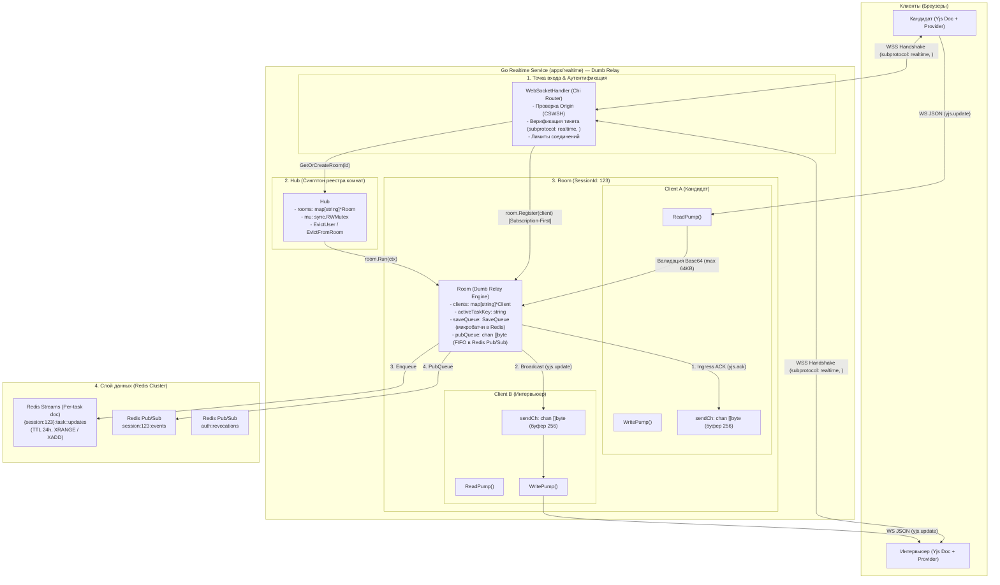
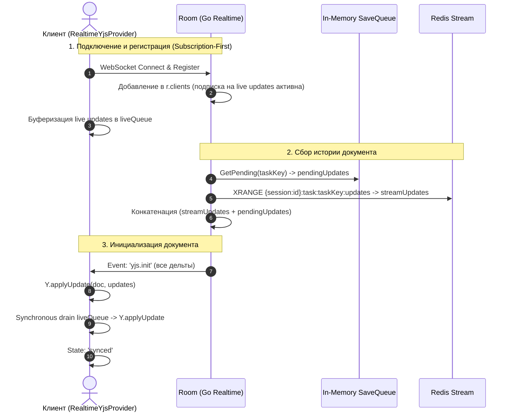

# WebSocket Realtime Service: Архитектура, Принципы и Руководство для Go-разработчика

Документ подробно описывает внутреннее устройство WebSocket-сервиса (`apps/realtime`), детально объясняет **что, зачем и почему** устроено именно так, разбирает архитектуру **Yjs CRDT + Dumb Relay**, паттерны многопоточности в Go, управление памятью, сетевую безопасность и персистентность через Redis Streams.

---

## Оглавление
1. [Введение: Архитектура реального времени и Yjs CRDT](#1-введение-архитектура-реального-времени-и-yjs-crdt)
2. [Общая архитектурная схема сервиса (Yjs CRDT + Dumb Relay)](#2-общая-архитектурная-схема-сервиса)
3. [Жизненный цикл соединения и протокол синхронизации](#3-жизненный-цикл-соединения-и-протокол-синхронизации)
   - [3.1. Subscription-First Ordering](#31-subscription-first-ordering)
   - [3.2. Ingress ACK и гарантии доставки](#32-ingress-ack-и-гарантии-доставки)
   - [3.3. Переключение задач (Task Switching)](#33-переключение-задач-task-switching)
4. [Анатомия компонентов: Hub, Room, Client, SaveQueue](#4-анатомия-компонентов)
   - [4.1. Hub — Глобальный реестр комнат](#41-hub--глобальный-реестр-комнат)
   - [4.2. Room — Изолированная комната сессии](#42-room--изолированная-комната-сессии)
   - [4.3. Client — Сетевое соединение и буферизация](#43-client--сетевое-соединение-и-буферизация)
   - [4.4. SaveQueue — Асинхронное сохранение и in-memory буферизация](#44-savequeue--асинхронное-сохранение-и-in-memory-буферизация)
5. [Паттерны многопоточности и Concurrency в Go](#5-паттерны-многопоточности-и-concurrency-в-go)
   - [Почему именно 2 горутины (ReadPump и WritePump)?](#почему-именно-2-горутины-readpump-и-writepump)
   - [Неблокирующая отправка и защита от зависших клиентов (Slow Consumer)](#неблокирующая-отправка-и-защита-от-зависших-клиентов)
   - [Защита от утечек горутин (Goroutine Leaks)](#защита-от-утечек-горутин-goroutine-leaks)
   - [Мьютексы и предотвращение Deadlock между Hub и Room](#мьютексы-и-предотвращение-deadlock)
6. [Распределенная синхронизация и персистентность через Redis](#6-распределенная-синхронизация-и-персистентность-через-redis)
   - [Redis Streams: Хранение дельт документов per-task doc](#redis-streams-хранение-дельт-документов-per-task-doc)
   - [5-состояний атомарного сидинга (seed_task_doc.lua)](#5-состояний-атомарного-сидинга-seed_task_doclua)
   - [Горизонтальное масштабирование комнат (Pub/Sub)](#горизонтальное-масштабирование-комнат-pubsub)
   - [Мгновенный отзыв токенов (Token Revocation & Eviction)](#мгновенный-отзыв-токенов-token-revocation--eviction)
7. [Безопасность и валидация данных](#7-безопасность-и-валидация-данных)
8. [Протокол сообщений (WebSocket Envelope)](#8-протокол-сообщений-websocket-envelope)
   - [События Yjs CRDT](#события-yjs-crdt)
   - [События медиа и чата](#события-медиа-и-чата)
   - [Вывод из эксплуатации устаревших событий (Retirement Notice)](#вывод-из-эксплуатации-устаревших-событий-retirement-notice)
9. [Пошаговое руководство: Как добавить новое событие](#9-пошаговое-руководство-как-добавить-новое-событие)
10. [Словарь терминов Go-разработчика](#10-словарь-терминов)

---

## 1. Введение: Архитектура реального времени и Yjs CRDT

### Эволюция синхронизации кода: от LWW к Yjs CRDT
Ранее совместное редактирование кода в песочнице строилось на модели **Last-Write-Wins (LWW)**:
- Клиенты отправляли полные строки кода или diff-снимки с инкрементальными версиями (`code.update`).
- При одновременном вводе двумя участниками возникали гонки версий (race conditions), мердж-конфликты, откат правок одного из авторов и рассинхронизация курсоров.

### Архитектура Yjs CRDT + Dumb Relay:
В новой архитектуре кодовая база переведена на **Yjs Conflict-free Replicated Data Types (CRDT)**:
1. **Dumb Relay на Go бэкенде:** Go-сервис `apps/realtime` не парсит, не мерджит и не интерпретирует структуру документа Yjs в оперативной памяти Go. Он функционирует как ультрабыстрый, высоконадежный транзитный ретранслятор (**Dumb Relay**):
   - Валидирует размеры конвертов и Base64-содержимого;
   - Мгновенно рассылает дельты подключенным участникам комнаты ($P_{99} < 10$ мс, по бенчмаркам $\approx 520 \ \mu\text{s}$);
   - Асинхронно персистит дельты в **Redis Streams** для гарантированного восстановления истории при переподключениях.
2. **Deterministic Merge на клиентах:** Все клиенты (браузерные `Y.Doc`) получают бинарные дельты и локально применяют их через CRDT-алгоритмы Yjs. Математически гарантируется строгая сходимость (strong eventual consistency) без необходимости арбитража на сервере.

---

## 2. Общая архитектурная схема сервиса



---

## 3. Жизненный цикл соединения и протокол синхронизации

### 3.1. Subscription-First Ordering
Критически важный паттерн при подключении клиента или смене задачи:
1. **Шаг 1 (Subscription-First):** Сокет клиента сначала регистрируется в комнате (`r.clients[client.ID] = client`). Клиент начинает получать все live-события комнаты в реальном времени. В браузере провайдер складывает их во внутреннюю очередь `liveQueue`.
2. **Шаг 2 (GetPending in-memory snapshot):** Захватывается снимок оперативной очереди `saveQueue.GetPending(taskKey)` — дельты, поступившие в память сервера, но еще не сброшенные в Redis.
3. **Шаг 3 (XRANGE Redis Stream):** Выполняется запрос `XRANGE {session:<id>}:task:<taskKey>:updates - +` для получения всех дельт, персистированных в Redis.
4. **Шаг 4 (Конкатенация истории):** Сервер конкатенирует `streamUpdates` и `pendingUpdates`.
5. **Шаг 5 (`yjs.init` delivery):** Сервер отправляет клиенту конверт `yjs.init`. Клиент атомарно в транзакции применяет историю дельт к локальному документу `Y.Doc`, после чего синхронно опустошает (drains) накопленные в `liveQueue` сообщения. Гарантируется нулевая потеря обновлений между историей и live-потоком!



### 3.2. Ingress ACK и гарантии доставки
- **Протокол Ingress ACK:** При получении `yjs.update` Go-сервер помещает дельту в оперативную очередь `saveQueue` и **немедленно** отправляет клиенту-автору подтверждение `yjs.ack` с `taskKey` и `updateId`.
- **Accepted MVP Risk Window:** Подтверждение отдается сразу после постановки в in-memory очередь (ACK-after-enqueue), до фактического выполнения батч-сброса в Redis Stream (который происходит каждые 50 мс или при накоплении батча). В случае внезапного аварийного падения процесса Go (SIGKILL/паника ОС) в течение этого окна до 50 мс дельты могут быть утрачены. Для MVP это осознанный компромисс ради достижения $P_{99} < 10$ мс broadcast latency.
- **Повторная отправка при обрыве:** На стороне веб-клиента неотвеченные дельты хранятся в `unsentQueue`. При разрыве соединения и реконнекте клиент автоматически выполняет пакетный досыл накопленных дельт.

### 3.3. Переключение задач (Task Switching)
- Переключение активной задачи инициируется конвертом `task.switch { taskKey: "<taskId>:<lang>" }`.
- Go-сервер атомарно выполняет сидинг целевой задачи в Redis (`seed_task_doc.lua`), рассылает широковещательное уведомление `task.switched`, после чего отправляет всем участникам актуальный `yjs.init` для новой задачи.

---

## 4. Анатомия компонентов

### 4.1. Hub — Глобальный реестр комнат (`internal/ws/hub.go`)
- Синглтон реестра комнат `rooms map[string]*Room`.
- Слушает Redis Pub/Sub канал `auth:revocations`. При вызове `Hub.EvictUser(userID)` или `Hub.EvictFromRoom(sessionID, userID)` разрывает соединения с кодом `StatusPolicyViolation`.

### 4.2. Room — Изолированная комната сессии (`internal/ws/room.go`)
- Управляет клиентами сессии, порядком доставки сообщений и очередями сохранения.
- **Политика 1 сокет = 1 пользователь:** Вытесняет дублирующие соединения (`StatusGoingAway: displaced by new connection`).
- **Сворачивание при простое (Idle Timer):** При 0 участников запускает 60-секундный таймер перед выгрузкой из Hub.

### 4.3. Client — Сетевое соединение (`internal/ws/client.go`)
- Обертка над WebSocket-соединением (`coder/websocket`).
- Содержит `sendCh chan []byte` (буфер 256) и `limiter *rate.Limiter` (60 msg/s, burst 120).

### 4.4. SaveQueue — Асинхронное сохранение Yjs (`internal/ws/save_queue.go`)
- Специализированная очередь для дельт Yjs:
  - Буферизирует до 2048 входящих дельт;
  - Метод `GetPending(taskKey)` возвращает поверхностную копию еще не сброшенных дельт для сборки `yjs.init`;
  - Фоновый воркер сбрасывает дельты в Redis Stream пачками (batching) с тайм-аутом 50 мс.

---

## 5. Паттерны многопоточности и Concurrency в Go

### Почему именно 2 горутины (`ReadPump` и `WritePump`)?
`websocket.Conn` **не является потокобезопасным для параллельной записи**. 
- `WritePump` — единственная горутина, вызывающая `conn.Write()` и `conn.Ping()`. Вычитывает байты из `client.sendCh`.
- `ReadPump` — единственная горутина, читающая из сокета через `conn.Read()`.

### Неблокирующая отправка и защита от зависших клиентов
```go
func (c *Client) Send(msg []byte) bool {
    select {
    case <-c.doneCh:
        return false
    case c.sendCh <- msg:
        return true
    default:
        // Slow Consumer: буфер переполнен
        c.logger.Warn("client send buffer full, dropping message")
        return false
    }
}
```
При переполнении буфера медленный клиент принудительно отключается сервером (`StatusPolicyViolation: send buffer overflow`).

### Мьютексы и предотвращение Deadlock
Строгий порядок захвата блокировок:  
`Hub.mu` ➡️ `Room.mu` (и никогда наоборот!).

---

## 6. Распределенная синхронизация и персистентность через Redis

### Redis Streams: Хранение дельт документов per-task doc
Для каждого документа сессии и задачи создается отдельный Redis Stream:
- Ключ: `{session:<sessionId>}:task:<taskKey>:updates`
- Hash tag `{session:<sessionId>}` гарантирует коллокацию ключей одной сессии в одном Redis Cluster слоте.
- TTL: 24 часа (86400 сек).
- Запись дельт: `XADD {session:<id>}:task:<taskKey>:updates * data <base64_delta>`
- Чтение истории: `XRANGE {session:<id>}:task:<taskKey>:updates - +`

### 5-состояний атомарного сидинга (`seed_task_doc.lua`)
Атомарный скрипт предотвращает гонки при создании или восстановлении стрима:
- **KEYS[1]:** `{session:<sessionId>}:seeded_tasks` (Redis Hash маркеров задач)
- **KEYS[2]:** `{session:<sessionId>}:task:<taskKey>:updates` (Redis Stream задачи)

| Случай | Маркер в Hash | Длина Stream | Действие скрипта | Возврат |
|---|---|---|---|---|
| **1** | Есть | $> 0$ | No-op, продление TTL обоих ключей | `0` |
| **2** | Есть | $0$ (истек/удален) | Восстановление стрима: `XADD` стартовой дельты, продление TTL | `3` |
| **3** | Есть | Пуст (аномалия) | `XADD` стартовой дельты, продление TTL | `3` |
| **4** | Нет | $> 0$ | Рассинхронизация: `HSET` маркера без `XADD` (защита от дублей) | `2` |
| **5** | Нет | $0$ / Отсутствует | Первичный сидинг: `XADD` стартовой дельты + `HSET` маркера | `1` |

### Горизонтальное масштабирование комнат (Pub/Sub)
- События публикуются в Redis канал `session:{sessionId}:events`.
- Другие реплики Realtime-сервиса с активной комнатой вычитывают события и отправляют своим клиентам с флагом `isRemote = true` (исключает эхо-рассылку).

---

## 7. Безопасность и валидация данных

| Механизм защиты | Описание реализации |
|---|---|
| **CSWSH Protection** | Проверка `Origin` при WebSocket handshake по `ALLOWED_ORIGINS`. |
| **Аутентификация** | Одноразовый тикет (`POST /realtime/ticket`) в `Sec-WebSocket-Protocol: realtime, <ticket>`; priority: тикет → `Bearer` → `Cookie`. |
| **Лимиты Yjs Envelopes** | Максимальный размер Base64 дельты `yjs.update` — 64 KB (87,384 байт base64). Максимальный размер `yjs.awareness` — 16 KB. Строгая валидация Base64 алфавита без аллокаций. |
| **Санитизация полей** | `senderId`, `userId`, `username`, `role` перезаписываются сервером из верифицированного JWT. |
| **Rate Limiting** | Token Bucket: 60 сообщений/сек, всплеск до 120 на сокет. |
| **Read Limit** | Ограничение размера сокет-фрейма `conn.SetReadLimit(1024 * 1024)` (1 MB). |

---

## 8. Протокол сообщений (WebSocket Envelope)

Формат стандартного конверта:
```json
{
  "type": "yjs.update",
  "version": 1,
  "sessionId": "session-123",
  "requestId": "uuid",
  "timestamp": "2026-09-23T20:00:00Z",
  "payload": { ... }
}
```

### События Yjs CRDT
1. **`yjs.update`** — инкрементальная CRDT-дельта документа:
   ```json
   { "taskKey": "task-1:typescript", "updateId": "uuid-1", "data": "<base64>" }
   ```
2. **`yjs.ack`** — немедленный Ingress ACK клиенту-автору дельты:
   ```json
   { "taskKey": "task-1:typescript", "updateId": "uuid-1" }
   ```
3. **`yjs.init`** — полная история дельт документа для инициализации:
   ```json
   { "taskKey": "task-1:typescript", "updates": ["<base64_1>", "<base64_2>"] }
   ```
4. **`yjs.awareness`** — эфемерное состояние присутствия (курсоры, выбор текста):
   ```json
   { "taskKey": "task-1:typescript", "data": "<base64_awareness>" }
   ```
5. **`task.switch`** / **`task.switched`** — запрос и подтверждение смены задачи:
   ```json
   { "taskKey": "task-2:python" }
   ```
6. **`room.error`** — ошибка уровня комнаты (`code: "SYNC_FAILED"`):
   ```json
   { "code": "SYNC_FAILED", "message": "server queue full", "taskKey": "task-1:typescript" }
   ```

### События медиа и чата
- `room.sync`, `presence.join`, `presence.leave`
- `chat.message`, `ai.suggestion`
- `media.state_update`, `media.recording`, `media.speaker`

### Вывод из эксплуатации устаревших событий (Retirement Notice)
> ⚠️ **RETIRED / DEPRECATED:**  
> Устаревшие события Last-Write-Wins **`code.update`** и **`cursor.move`** выведены из эксплуатации.  
> Клиенты и веб-приложение больше не используют эти события. Все взаимодействие с кодом и многопользовательскими курсорами осуществляется исключительно через события семейства `yjs.*`.

---

## 9. Пошаговое руководство: Как добавить новое событие

1. **Константа типа события** в `internal/ws/message.go`:
   ```go
   const EventCustomAction EventType = "custom.action"
   ```
2. **Структура Payload** в `internal/ws/message.go`:
   ```go
   type CustomActionPayload struct { ... }
   ```
3. **Регистрация в интерфейсе `EventPayload`** в `internal/ws/protocol.go`.
4. **Валидация и санитизация** в `internal/ws/client.go` (`sanitizeIncomingPayload`).
5. **Обработка в комнате** в `internal/ws/room.go` (`handleBroadcast`).
6. **Unit-тесты** в `internal/ws/protocol_test.go` и `internal/ws/room_test.go`.

---

## 10. Словарь терминов

- **CRDT (Conflict-free Replicated Data Type):** Структура данных, обеспечивающая непротиворечивую распределенную репликацию без необходимости централизованного разрешения конфликтов.
- **Dumb Relay:** Архитектурный паттерн, в котором сервер не вскрывает и не парсит полезную нагрузку данных документа, а лишь валидирует envelope, быстро пересылает ее клиентам и сохраняет в хранилище.
- **Subscription-First:** Порядок подключения, при котором сокет регистрируется в канале live-рассылки до запроса исторического снимка, исключая окна потери данных.
- **Ingress ACK:** Подтверждение приема данных сервером в оперативную память (буфер/очередь), возвращаемое клиенту до длительной операции записи на диск или в распределенную БД.
- **Slow Consumer:** Клиент, чей сетевой канал или обработчик не успевает вычитывать сообщения с сервера, вызывая переполнение буфера `sendCh`.

