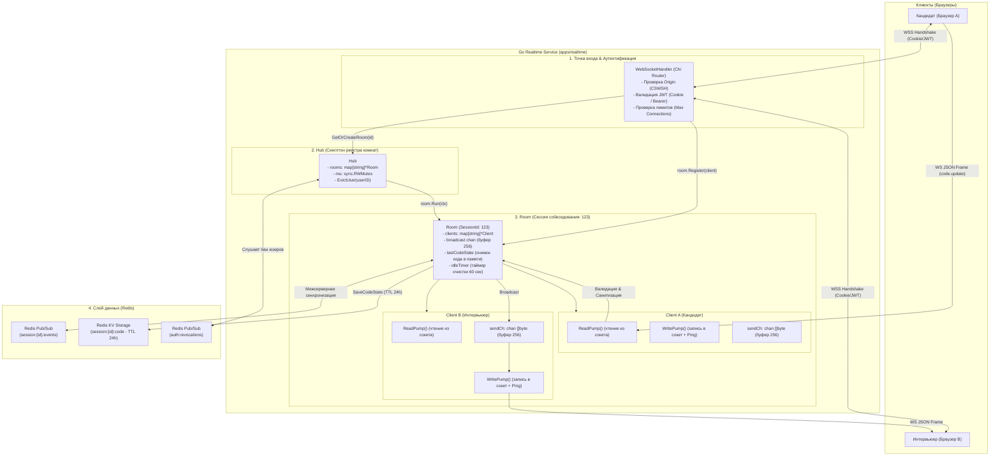
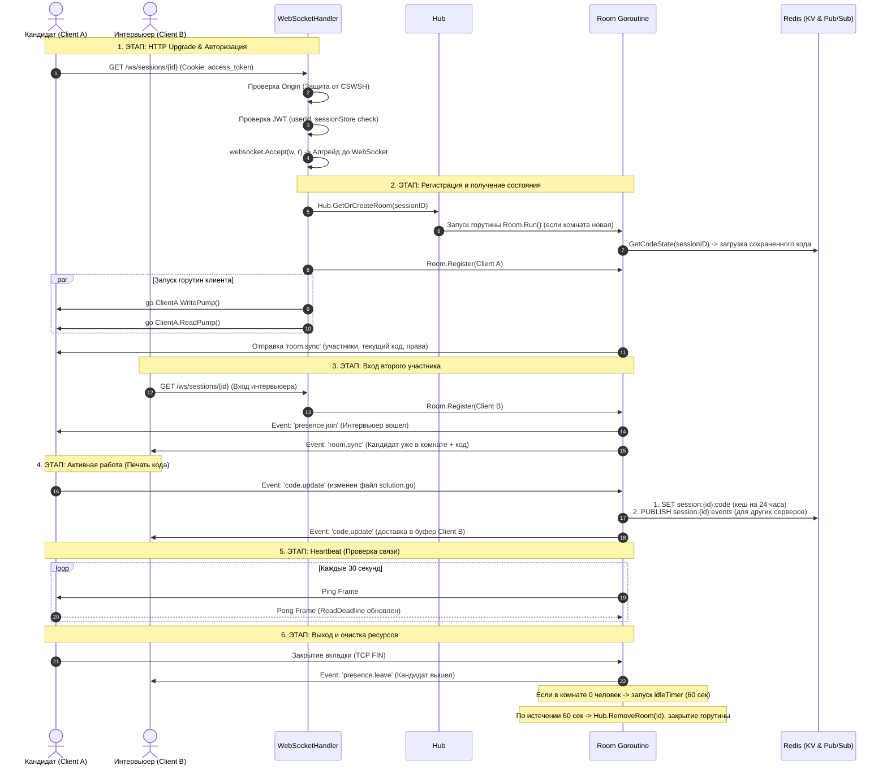

# WebSocket Realtime Service: Архитектура, Принципы и Руководство для Go-разработчика

Документ подробно описывает внутреннее устройство WebSocket-сервиса (`apps/realtime`), детально объясняет **что, зачем и почему** устроено именно так, разбирает основы многопоточности в Go, управление памятью, сетевую безопасность и горизонтальное масштабирование через Redis.

---

## Оглавление
1. [Введение: Зачем нужен WebSocket и в чем отличие от HTTP](#1-введение-зачем-нужен-websocket)
2. [Общая архитектурная схема сервиса](#2-общая-архитектурная-схема-сервиса)
3. [Жизненный цикл соединения (Handshake, Sync, I/O, Cleanup)](#3-жизненный-цикл-соединения)
4. [Анатомия компонентов: Hub, Room, Client](#4-анатомия-компонентов)
   - [4.1. Hub — Глобальный реестр комнат](#41-hub--глобальный-реестр-комнат)
   - [4.2. Room — Изолированная комната сессии](#42-room--изолированная-комната-сессии)
   - [4.3. Client — Сетевое соединение и буферизация](#43-client--сетевое-соединение-и-буферизация)
5. [Паттерны многопоточности и Concurrency в Go](#5-паттерны-многопоточности-и-concurrency-в-go)
   - [Почему именно 2 горутины (ReadPump и WritePump)?](#почему-именно-2-горутины-readpump-и-writepump)
   - [Неблокирующая отправка и защита от зависших клиентов (Slow Consumer)](#неблокирующая-отправка-и-защита-от-зависших-клиентов)
   - [Защита от утечек горутин (Goroutine Leaks)](#защита-от-утечек-горутин-goroutine-leaks)
   - [Мьютексы и предотвращение Deadlock между Hub и Room](#мьютексы-и-предотвращение-deadlock)
6. [Распределенная синхронизация через Redis](#6-распределенная-синхронизация-через-redis)
   - [Горизонтальное масштабирование комнат (Pub/Sub)](#горизонтальное-масштабирование-комнат-pubsub)
   - [Персистентность кода при сбоях и перезапусках](#персистентность-кода-при-сбоях-и-перезапусках)
   - [Мгновенный отзыв токенов (Token Revocation & Eviction)](#мгновенный-отзыв-токенов-token-revocation--eviction)
7. [Безопасность и валидация данных](#7-безопасность-и-валидация-данных)
8. [Протокол сообщений (WebSocket Envelope)](#8-протокол-сообщений-websocket-envelope)
9. [Пошаговое руководство: Как добавить новое событие](#9-пошаговое-руководство-как-добавить-новое-событие)
10. [Словарь терминов Go-разработчика](#10-словарь-терминов)

---

## 1. Введение: Зачем нужен WebSocket?

### Проблема классического HTTP (REST API):
В обычном HTTP протокол работает по модели **«Запрос — Ответ» (Request-Response)**. Инициатором всегда выступает клиент (браузер):
- Клиент отправляет запрос: `GET /api/session/123/code`.
- Сервер отвечает: `{ "code": "..." }` и закрывает TCP-соединение (или возвращает его в пул).
- **Минус для реального времени:** Сервер **не может сам** отправить клиенту сообщение, когда второй участник (интервьюер) что-то напечатал. Если делать опрос (polling) каждые 500 мс — это создает огромную паразитную нагрузку на CPU, сеть и базу данных.

### Решение — WebSocket:
WebSocket устанавливает **постоянное двунаправленное (Full-Duplex) TCP-соединение**:
- И клиент, и сервер могут в любой миллисекундный момент отправить сообщение в сокет без накладных расходов на HTTP-заголовки.
- Задержка между нажатием клавиши кандидатом и отображением у интервьюера составляет **< 20 мс**.

---

## 2. Общая архитектурная схема сервиса



---

## 3. Жизненный цикл соединения

Ниже показана полная последовательность событий от первого клика в браузере до корректного закрытия:



---

## 4. Анатомия компонентов

В коде реализовано строгое разделение ответственности между тремя основными сущностями.

### 4.1. Hub — Глобальный реестр комнат
- **Файл:** `internal/ws/hub.go`
- **Что делает:** Является синглтоном в памяти сервиса и держит карту всех комнат `rooms map[string]*Room`.
- **Зачем нужен:**
  1. Централизует доступ к комнатам — когда приходит новый HTTP-запрос, `Hub` определяет, существует ли уже комната или ее нужно создать (`GetOrCreateRoom`).
  2. Слушает глобальный канал Redis `auth:revocations`. Если служба безопасности заблокировала пользователя или отозван Refresh-токен, `Hub.EvictUser(userID)` мгновенно находит все комнаты, где сидит этот пользователь, и принудительно разрывает сокет с кодом `StatusPolicyViolation`.
  3. Предоставляет метрики для Prometheus: `TotalRooms()`, `TotalClients()`.

### 4.2. Room — Изолированная комната сессии
- **Файл:** `internal/ws/room.go`
- **Что делает:** Управляет отдельным собеседованием (`sessionID`), изолируя его участников от других сессий.
- **Ключевые механизмы:**
  - **Политика «1 пользователь = 1 активное соединение»:** Если кандидат открыл собеседование во второй вкладке браузера, `Room.handleRegister()` находит его старое соединение и мягко вытесняет его (`StatusGoingAway: displaced by new connection`). Это предотвращает рассинхронизацию стейта.
  - **Снимок кода (`lastCodeState`):** Комната всегда держит в памяти актуальный код. При входе нового участника он не ждет, пока кто-то нажмет клавишу, а сразу получает актуальный код через событие `room.sync`.
  - **Автоматическая выгрузка (Reaper Timer):** Пустая комната не висит в памяти вечно. Если из комнаты вышли все участники, включается `idleTimer` на 60 секунд. Если за 60 секунд никто не вернулся — комната удаляется из `Hub` и её горутина завершается.

### 4.3. Client — Сетевое соединение и буферизация
- **Файл:** `internal/ws/client.go`
- **Что делает:** Представляет собой обертку над физическим TCP/WebSocket-соединением конкретного пользователя.
- **Ключевые поля структуры:**
  ```go
  type Client struct {
      ID        string          // Уникальный UUID соединения
      UserID    string          // ID пользователя из JWT
      Username  string          // Отображаемое имя
      Role      string          // Роль: "interviewer" | "candidate"
      SessionID string          // ID сессии
      conn      *websocket.Conn // Сырое соединение (coder/websocket)
      sendCh    chan []byte     // Буферизированный канал отправки (256 msg)
      doneCh    chan struct{}   // Сигнал закрытия соединения
      limiter   *rate.Limiter   // Token Bucket (60 msg/s, burst 120)
  }
  ```

---

## 5. Паттерны многопоточности и Concurrency в Go

Этот раздел — самый важный для понимания того, как писать отказоустойчивый асинхронный код на Go без дедлоков и утечек памяти.

### Почему именно 2 горутины (`ReadPump` и `WritePump`)?

> ⚠️ **Главное ограничение WebSocket-библиотек в Go:**  
> Структура `websocket.Conn` **НЕ является потокобезопасной для одновременной записи**. Если две горутины одновременно вызовут `conn.Write()`, это приведет к порче данных во фреймах протокола или панике рантайма.

#### Решение — Паттерн «Один писатель, один читатель»:
1. **`WritePump` (Единственный писатель):**
   - Только эта горутина вызывает `conn.Write()` и `conn.Ping()`.
   - Она сидит в цикле `select` и ждет сообщений из канала `client.sendCh`.
   - Если серверу нужно отправить сообщение клиенту, он **не пишет в сокет напрямую**, а кладет байты в `client.sendCh`.
2. **`ReadPump` (Единственный читатель):**
   - Только эта горутина вызывает `conn.Read()`.
   - Она блокируется в ожидании байтов от клиента. Как только сообщение пришло — проверяет лимиты, парсит JSON и передает в комнату `room.broadcast <- data`.

```go
// WritePump: Единственная горутина, пишущая в сокет
func (c *Client) WritePump(ctx context.Context) {
    pingTicker := time.NewTicker(30 * time.Second)
    defer pingTicker.Stop()

    for {
        select {
        case <-ctx.Done():
            return
        case <-c.doneCh:
            return
        case <-pingTicker.C:
            // Heartbeat: отправляем Ping кадр
            pingCtx, cancel := context.WithTimeout(ctx, 5*time.Second)
            err := c.conn.Ping(pingCtx)
            cancel()
            if err != nil {
                c.Close(websocket.StatusGoingAway, "heartbeat timeout")
                return
            }
        case msg, ok := <-c.sendCh:
            if !ok {
                return // Канал закрыт
            }
            writeCtx, cancel := context.WithTimeout(ctx, 5*time.Second)
            err := c.conn.Write(writeCtx, websocket.MessageText, msg)
            cancel()
            if err != nil {
                c.Close(websocket.StatusInternalError, "write failure")
                return
            }
        }
    }
}
```

---

### Неблокирующая отправка и защита от зависших клиентов

Что произойдет, если у одного из участников (например, у кандидата в поезде) пропал интернет или завис браузер?
- Его TCP-буфер заполнится.
- Если бы мы писали в канал блокирующим вызовом `c.sendCh <- msg`, то при заполнении буфера горутина комнаты `Room.Run()` **намертво бы заблокировалась**!
- В результате перестали бы доставляться сообщения **всем остальным участникам комнаты**!

#### Решение в `client.Send()`:
Используется конструкция `select` с блоком `default`:
```go
func (c *Client) Send(msg []byte) bool {
    select {
    case <-c.doneCh:
        return false
    case c.sendCh <- msg:
        return true // Успешно положили в буфер
    default:
        // Буфер переполнен (Slow Consumer / сетевой лаг)
        c.logger.Warn("client send buffer full, dropping message")
        return false
    }
}
```
Если буфер канала (256 сообщений) заполнен, вызов не зависает, а мгновенно выходит в `default`.

---

### Защита от утечек горутин (Goroutine Leaks)

Если горутина осталась висеть в памяти навсегда (например, заблокировалась на чтении из канала, который никто не закроет) — память процесса будет расти, пока сервер не упадет с Out of Memory (OOM).

Как мы предотвращаем утечки:
1. **Канал закрытия `doneCh`:** При вызове `c.Close()` срабатывает `sync.Once`, который закрывает `doneCh`. Все циклы `select` реагируют на `case <-c.doneCh:` и немедленно завершают горутины.
2. **Передача `context.Context`:** Все I/O операции (`Read`, `Write`, `Ping`) принимают контекст с таймаутом (`context.WithTimeout`). Если сокет завис, операция принудительно прервется через 5 секунд.
3. **`sync.WaitGroup` в Hub:** При Graceful Shutdown сервер ждет завершения всех горутин комнат (`h.wg.Wait()`).

---

### Мьютексы и предотвращение Deadlock

В сервисе используются два уровня мьютексов:
- `Hub.mu` (`sync.RWMutex`) — защищает карту комнат `rooms`.
- `Room.mu` (`sync.RWMutex`) — защищает список клиентов комнаты `clients` и состояние кода `lastCodeState`.

#### Правило порядка захвата мьютексов:
> Чтобы избежать дедлока, порядок захвата блокировок должен быть **всегда однонаправленным**:  
> `Hub.mu` ➡️ `Room.mu` (и никогда наоборот!).

Если комнате нужно удалить саму себя из `Hub`, она не захватывает `Hub.mu` напрямую изнутри критической секции `Room.mu`, а вызывает переданный колбэк `onEmpty(roomID)`, предварительно освободив все свои мьютексы.

---

## 6. Распределенная синхронизация через Redis

Когда проект вырастает из одного сервера в кластер (несколько реплик бэкенда за балансировщиком нагрузки Nginx / AWS ALB), клиенты одной сессии могут подключиться к разным инстансам:

```
[ Кандидат ] ---> WSS ---> [ Сервер 1 (Go) ] 
                                  │
                             Redis Pub/Sub (session:123:events)
                                  │
[ Интервьюер ] -> WSS ---> [ Сервер 2 (Go) ]
```

### 1. Горизонтальное масштабирование (Pub/Sub):
- Когда Кандидат на Сервере 1 обновляет код, Сервер 1 шлет событие локальным клиентам и публикует в Redis: `PUBLISH session:123:events <data>`.
- Сервер 2, имеющий активную комнату `123`, подписан на этот канал. Он получает событие из Redis и вызывает `BroadcastFromRemote(data)`, пересылая его Интервьюеру.
- **Флаг `isRemote`:** Сообщения, полученные из Redis, помечаются как `isRemote = true`. Это гарантирует, что Сервер 2 **не станет повторно публиковать их в Redis**, предотвращая бесконечный цикл эхо-рассылки.

### 2. Персистентность кода при сбоях (Redis KV Storage):
- При каждом событии `code.update` актуальный исходный код сохраняется в Redis по ключу `session:{sessionId}:code` с TTL 24 часа.
- Если сервер упадет или перезагрузится, при старте новой комнаты код будет автоматически восстановлен из Redis (`r.sessionStore.GetCodeState(ctx, r.ID)`).

### 3. Мгновенный отзыв токенов (Token Revocation):
- При выходе из системы или бане пользователя Auth-сервис публикует событие в канал `auth:revocations` с `userID`.
- Все запущенные инстансы Realtime-сервиса ловят это событие и вызывают `Hub.EvictUser(userID)`, мгновенно закрывая все активные сокеты этого пользователя.

---

## 7. Безопасность и валидация данных

| Механизм защиты | Описание реализации |
|---|---|
| **CSWSH Protection** | Проверка заголовка `Origin` при Handshake через список `ALLOWED_ORIGINS`. Запрещает сторонним сайтам открывать сокет от лица авторизованного пользователя. |
| **Аутентификация** | Извлечение JWT из `HttpOnly Cookie` (или `Authorization: Bearer`). Защита от XSS-атак (JavaScript не имеет доступа к Cookie). |
| **Защита от спуфинга UserID** | Поля `senderId`, `userId`, `username` и `role` в событиях перезаписываются сервером (`sanitizeIncomingPayload`) на основании данных из JWT. Клиент не может выдать себя за другого человека или сменить роль на `interviewer`. |
| **Token Bucket Rate Limiting** | Ограничение частоты: 60 сообщений/сек (всплеск до 120). Защищает бэкенд от флуда и DoS атак. |
| **Read Limit (Размер сообщений)** | Ограничение `conn.SetReadLimit(1024 * 1024)` (1 MB). Предотвращает отправку огромных пакетов данных. |
| **Лимит размера кода и чата** | Максимальный размер текста кода — 500 KB, длина сообщения чата — 4000 символов, длина пути к файлу — 255 символов (защита от Path Traversal). |

---

## 8. Протокол сообщений (WebSocket Envelope)

Все сообщения строго стандартизированы. Они упакованы в обертку (конверт):

```go
type WebSocketEnvelope[T any] struct {
    Type      string    `json:"type"`      // Тип события (например, "code.update")
    Version   string    `json:"version"`   // Версия протокола (всегда "1.0")
    SessionID string    `json:"sessionId"` // ID сессии интервью
    RequestID string    `json:"requestId"` // UUID запроса (для трассировки)
    Timestamp int64     `json:"timestamp"` // Unix timestamp в миллисекундах
    Payload   T         `json:"payload"`   // Полезная нагрузка события
}
```

### Основные типы событий в системе:
- `room.sync` — Полный снимок состояния комнаты при входе (участники + код).
- `presence.join` / `presence.leave` — Вход или выход участника из комнаты.
- `code.update` — Изменение содержимого файла кода кандидатом или интервьюером.
- `cursor.move` — Перемещение курсора в редакторе (строка, колонка).
- `chat.message` — Сообщение в текстовом чате собеседования.
- `ai.suggestion` — Подсказка от AI ассистента для интервьюера.
- `system.error` — Сообщение об ошибке (например, превышение rate limit).

---

## 9. Пошаговое руководство: Как добавить новое событие

Представим задачу: нужно добавить событие **`code.run_request`** (кандидат нажал кнопку «Запустить тесты»).

### Шаг 1: Добавить константу типа события
В файле `internal/ws/protocol.go`:
```go
const (
    EventCodeRunRequest = "code.run_request"
)
```

### Шаг 2: Создать DTO структуру для Payload
В файле `internal/ws/protocol.go`:
```go
type CodeRunRequestPayload struct {
    Language string `json:"language"` // "go", "python", "typescript"
    Code     string `json:"code"`     // Исходный код для исполнения
    Stdin    string `json:"stdin"`    // Пользовательский ввод
}
```

### Шаг 3: Добавить валидацию и санитизацию
В файле `internal/ws/client.go` в метод `sanitizeIncomingPayload()`:
```go
case EventCodeRunRequest:
    payload, err := UnpackPayload[CodeRunRequestPayload](raw)
    if err != nil {
        return nil, err
    }
    
    // Проверяем валидность языка
    if payload.Language == "" {
        return nil, errors.New("language is required")
    }
    
    // Ограничиваем размер кода
    if len(payload.Code) > maxCodeContentLength {
        return nil, errors.New("code exceeds maximum length")
    }

    env := NewEnvelope(raw.Type, c.SessionID, raw.RequestID, payload)
    return env.ToBytes()
```

### Шаг 4: Обработать событие в комнате (если нужна особая логика)
В файле `internal/ws/room.go` в метод `handleBroadcast()`:
```go
if raw.Type == EventCodeRunRequest {
    r.logger.Info("code execution requested",
        slog.String("sessionId", r.ID),
        slog.String("senderId", msg.senderID),
    )
    // Здесь можно отправить задачу в очередь RabbitMQ/Kafka для runner-сервиса
}
```

### Шаг 5: Написать Unit-тест
В файле `internal/ws/protocol_test.go` проверить корректность маршалинга и валидации вашего нового события.

---

## 10. Словарь терминов

- **Full-Duplex (Полнодуплексный режим):** Режим связи, при котором обе стороны могут передавать и принимать информацию одновременно по одному каналу связи.
- **Handshake (Рукопожатие):** Начальный процесс установки соединения, в ходе которого клиент и сервер согласуют переход с протокола HTTP на WebSocket (`HTTP 101 Switching Protocols`).
- **Heartbeat (Ping/Pong):** Периодический обмен пустыми системными кадрами (каждые 30 сек) для проверки того, что соединение живо и сетевой роутер/NAT не закрыл неактивный TCP-сокет.
- **Token Bucket (Корзина токенов):** Алгоритм ограничения частоты запросов (Rate Limiting). Позволяет пропускать кратковременные всплески активности, но ограничивает постоянную среднюю скорость.
- **Slow Consumer (Медленный потребитель):** Клиент, который вычитывает данные медленнее, чем сервер их генерирует.
- **Goroutine Leak (Утечка горутины):** Ситуация, когда запущенная горутина не может завершиться из-за вечной блокировки, оставаясь в памяти процесса навсегда.
- **Deadlock (Взаимная блокировка):** Ситуация в многопоточном коде, когда горутина A ждет ресурс, захваченный горутиной B, а горутина B ждет ресурс, захваченный горутиной A.
- **Data Race (Гонка данных):** Ошибка параллелизма, возникающая, когда две горутины обращаются к одной ячейке памяти одновременно, и хотя бы одно из обращений — это запись.
- **Pub/Sub (Publish/Subscribe):** Паттерн обмена сообщениями через брокер (Redis), где отправитель публикует сообщение в именованный канал, а все подписанные получатели моментально его считывают.
