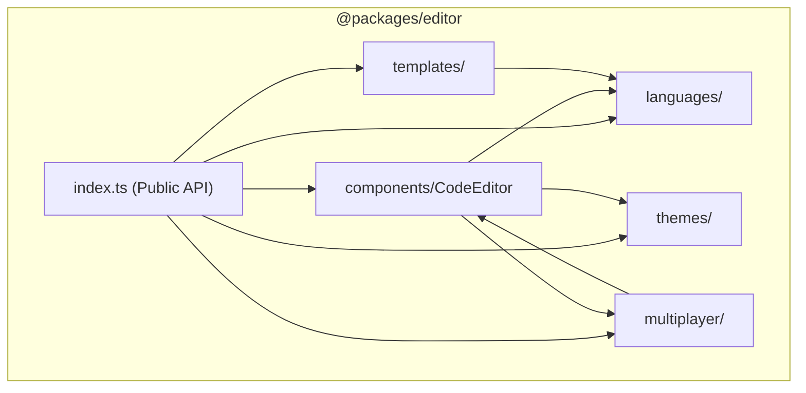
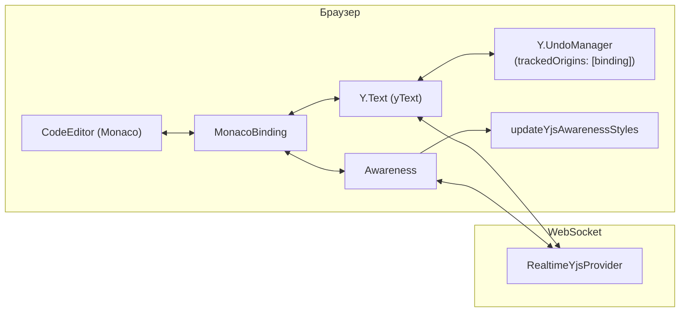

# Редактор кода (Code Editor)

Пакет `packages/editor` (`@packages/editor`) — это обёртка над **Monaco Editor**, предоставляющая полнофункциональный React-компонент для совместного редактирования кода в реальном времени на базе **Yjs CRDT** и **Yjs Awareness**.

---

## 1. Назначение

`@packages/editor` решает три ключевые задачи платформы:
1. **Единый редактор кода** — с подсветкой синтаксиса, автокомплитом и кастомными темами для 8 языков программирования.
2. **Yjs CRDT Мультиплеер** — бесконфликтное совместное редактирование документов в реальном времени с поддержкой многопользовательских курсоров и выделений (Yjs Awareness).
3. **Шаблоны кода** — стартовые бойлерплейты для алгоритмических и SQL-задач.

---

## 2. Технологический стек

| Технология | Роль |
| :--- | :--- |
| **Monaco Editor** (`monaco-editor`) | Ядро редактора (движок VS Code) |
| **@monaco-editor/react** | React-обёртка для интеграции Monaco в компонентную модель |
| **Yjs** (`yjs`) | CRDT-движок для бесконфликтной синхронизации текста |
| **y-monaco** | Официальный биндинг `Y.Text` к модели `ITextModel` Monaco Editor |
| **y-protocols** (`y-protocols/awareness`) | Протокол эфемерного состояния участников (курсоры, выделения, имена, цвета) |
| **@packages/types** | Общий тип `Theme` (`"dark"` \| `"light"`) |
| **Rslib** | Сборка пакета в `dist/` (ESM, `bundle: false`) |
| **Vitest** | Юнит-тесты шаблонов кода и биндингов |
| **Biome** | Линтинг и форматирование |

---

## 3. Архитектура и модульная структура

```text
@packages/editor
├── components/       ← React-компонент CodeEditor + Lazy-обёртка (CodeEditorLazy)
├── languages/        ← Конфиги языков + провайдеры автокомплита
├── themes/           ← Кастомные темы Monaco (dark / light)
├── templates/        ← Стартовые шаблоны кода (algorithm / sql)
└── multiplayer/      ← Утилиты стилизации курсоров Yjs Awareness (cursor-css.ts)
```

### Граф зависимостей внутри пакета



---

## 4. Поддерживаемые языки программирования

| Язык | ID | Tab | Отступы | Автокомплит |
| :--- | :--- | :--- | :--- | :--- |
| TypeScript | `typescript` | 2 | Пробелы | Встроенный IntelliSense Monaco |
| JavaScript | `javascript` | 2 | Пробелы | Встроенный IntelliSense Monaco |
| Python | `python` | 4 | Пробелы | Кастомный (ключевые слова + builtins) |
| Go | `go` | 4 | Табы | Кастомный (ключевые слова + типы) |
| Java | `java` | 4 | Пробелы | Кастомный (ключевые слова + типы) |
| C++ | `cpp` | 4 | Пробелы | Кастомный (ключевые слова + STL) |
| Rust | `rust` | 4 | Пробелы | Кастомный (ключевые слова + макросы) |
| SQL | `sql` | 2 | Пробелы | Кастомный (SQL-команды + агрегаты) |

Автокомплит регистрируется **ровно один раз** (флаг `*ProviderRegistered`), что предотвращает дублирование при ре-рендерах.

---

## 5. Система тем

| Тема | ID | Базовая тема VS Code | Описание |
| :--- | :--- | :--- | :--- |
| Тёмная | `"dark"` | `vs-dark` | Кастомная тёмная палитра MockInterviewAI |
| Светлая | `"light"` | `vs` | Светлая палитра VS Code Light+ |

Тип `Theme` (`"dark" | "light"`) импортируется из `@packages/types`.

---

## 6. Мультиплеер (Yjs CRDT и Awareness)

### 6.1. Архитектура интеграции

Совместная работа построена на модели **CRDT (Conflict-free Replicated Data Types)**:
1. `Y.Text` связывается с моделью Monaco Editor через `MonacoBinding`.
2. Правки синхронизируются бинарными дельтами через `RealtimeYjsProvider` в WebSocket транспорт.
3. Позиции курсоров и выделений соавторов передаются через протокол **Yjs Awareness**.



### 6.2. Изоляция истории Undo/Redo

Для предотвращения отката чужих правок при нажатии `Ctrl+Z` / `Ctrl+Y`:
```typescript
const currentUndoManager = new Y.UndoManager(yText, {
  trackedOrigins: new Set([binding]),
});
```
Стандартные команды Monaco `Undo` / `Redo` перехватываются и делегируются в Yjs `UndoManager`. Изменения удаленных участников приходят с origin провайдера и игнорируются локальным стеком отмены.

### 6.3. Отображение курсоров участников

Функция `updateYjsAwarenessStyles(awareness)` слушает событие `awareness.on("change")` и динамически внедряет CSS-стили для классов `y-monaco`:
- `.yRemoteSelection-${clientID}` — подсветка выделенного соавтором текста (цвет с прозрачностью 25%);
- `.yRemoteSelectionHead-${clientID}` — вертикальная каретка толщиной 2px цвета соавтора;
- `.yRemoteSelectionHead-${clientID}::after` — всплывающий бейдж с именем участника над кареткой.

> ⚠️ **RETIRED:** Устаревшие LWW-механизмы (`collaborators: Collaborator[]`, `onCursorChange`, ручные cursor decorations) выведены из эксплуатации. Совместная работа осуществляется через `yText` и `awareness`.

---

## 7. Шаблоны стартового кода

Функция `getTemplate(language, category)` возвращает стартовый бойлерплейт:

| Категория | Описание | Языки |
| :--- | :--- | :--- |
| `"algorithm"` | Алгоритмическая задача (сигнатура функции `solution`) | TS, JS, Python, Go, Java, C++, Rust |
| `"sql"` | SQL-задача (шаблон `SELECT` запроса) | SQL |

---

## 8. Lazy-загрузка и пропсы

Monaco Editor требует объект `window`. Для Next.js предоставляется `CodeEditorLazy`:

```tsx
import { CodeEditorLazy } from "@packages/editor";

<CodeEditorLazy
  language="typescript"
  theme="dark"
  yText={yText}
  awareness={provider.awareness}
/>
```

### Основные пропсы `CodeEditorProps`:

| Проп | Тип | По умолчанию | Описание |
| :--- | :--- | :--- | :--- |
| `language` | `LanguageId` | `"typescript"` | Язык программирования |
| `theme` | `Theme` | `"dark"` | Тема оформления |
| `readOnly` | `boolean` | `false` | Режим только для чтения |
| `yText` | `Y.Text` | — | Yjs Text для CRDT синхронизации |
| `awareness` | `Awareness` | — | Инстанс Awareness для совместных курсоров |
| `undoManager` | `Y.UndoManager` | — | Внешний менеджер истории отмен |
| `onUndoManagerInit` | `(um) => void` | — | Коллбэк инициализации UndoManager |
| `value` | `string` | `""` | Текст для автономного режима (без Yjs) |
| `onChange` | `(val) => void` | — | Коллбэк изменения текста (без Yjs) |
| `options` | `editor.IStandalone...` | `{}` | Дополнительные опции Monaco Editor |

---

## 9. Интеграция в `apps/web`

Песочница собеседования (`apps/web/src/features/sandbox`):
1. `RealtimeYjsProvider` связывает `Y.Doc` и `awareness` с WebSocket Dumb Relay.
2. `SandboxRoomWorkspace` передает `yText` и `awareness` в `CodeEditorLazy`.
3. При нажатии «Run Code» считывается иммутабельный строковый срез `yText.toString()`.

---

## 10. Сборка и проверка

```bash
# Сборка пакета (Rslib)
pnpm --filter @packages/editor build

# Проверка типов
pnpm --filter @packages/editor typecheck

# Линтинг (Biome)
pnpm --filter @packages/editor lint

# Тесты (Vitest)
pnpm --filter @packages/editor test
```
