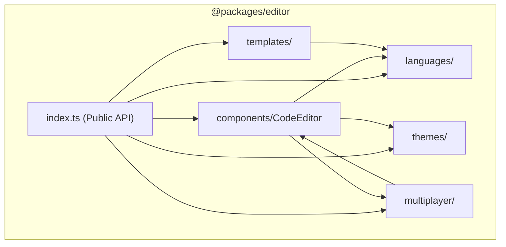
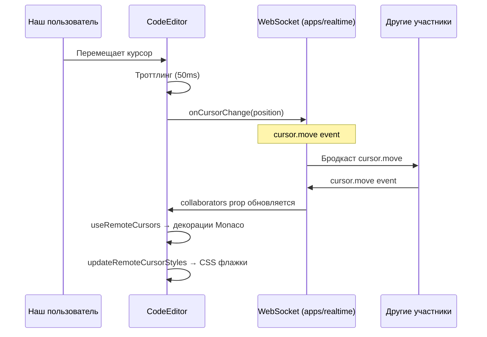

# Редактор кода (Code Editor)

Пакет `packages/editor` (`@packages/editor`) — это обёртка над **Monaco Editor**, предоставляющая готовый React-компонент для совместного редактирования кода в реальном времени на собеседовании.

---

## 1. Назначение

`@packages/editor` решает три задачи:
1. **Единый редактор кода** для всей платформы — с подсветкой синтаксиса, автокомплитом и кастомными темами.
2. **Мультиплеерные курсоры** — отображение позиций курсоров других участников комнаты в реальном времени (аналог Google Docs / VS Code Live Share).
3. **Шаблоны кода** — стартовые бойлерплейты для алгоритмических и SQL-задач на 7+ языках программирования.

---

## 2. Технологический стек

| Технология | Роль |
| :--- | :--- |
| **Monaco Editor** (`monaco-editor`) | Ядро редактора (тот же движок, что и в VS Code) |
| **@monaco-editor/react** | React-обёртка для интеграции Monaco в компонентную модель |
| **@packages/types** | Общий тип `Theme` (`"dark"` \| `"light"`) |
| **Rslib** | Сборка пакета в `dist/` (ESM, `bundle: false`) |
| **Vitest** | Юнит-тесты шаблонов кода |
| **Biome** | Линтинг и форматирование |

---

## 3. Архитектура и модульная структура

```text
@packages/editor
├── components/       ← React-компонент CodeEditor + Lazy-обёртка
├── languages/        ← Конфиги языков + провайдеры автокомплита
├── themes/           ← Кастомные темы Monaco (dark / light)
├── templates/        ← Стартовые шаблоны кода (algorithm / sql)
└── multiplayer/      ← Хук useRemoteCursors + генерация CSS курсоров
```

### Граф зависимостей внутри пакета



---

## 4. Поддерживаемые языки программирования

| Язык | ID | Tab | Отступы | Автокомплит |
| :--- | :--- | :--- | :--- | :--- |
| TypeScript | `typescript` | 2 | Пробелы | Встроенный IntelliSense Monaco |
| JavaScript | `javascript` | 2 | Пробелы | Встроенный IntelliSense Monaco |
| Python | `python` | 4 | Пробелы | Кастомный (ключевые слова + builtins) |
| Go | `go` | 4 | Табы | Кастомный (ключевые слова + типы) |
| Java | `java` | 4 | Пробелы | Кастомный (ключевые слова + типы) |
| C++ | `cpp` | 4 | Пробелы | Кастомный (ключевые слова + STL) |
| Rust | `rust` | 4 | Пробелы | Кастомный (ключевые слова + макросы) |
| SQL | `sql` | 2 | Пробелы | Кастомный (SQL-команды + агрегаты) |

Автокомплит для каждого языка регистрируется **ровно один раз** (флаг-предохранитель `*ProviderRegistered`), что предотвращает дублирование при ре-рендерах React.

---

## 5. Система тем

Пакет регистрирует кастомные темы при инициализации редактора (`beforeMount`):

| Тема | ID | Базовая тема VS Code | Описание |
| :--- | :--- | :--- | :--- |
| Тёмная | `"dark"` | `vs-dark` | Наследует все цвета VS Code Dark+ |
| Светлая | `"light"` | `vs` | Наследует все цвета VS Code Light+ |

Тип `Theme` (`"dark" | "light"`) определён в `@packages/types` и используется для строгой типизации пропа `theme`.

---

## 6. Мультиплеер (совместные курсоры)

### 6.1. Принцип работы



### 6.2. Интерфейсы

```typescript
interface CursorPosition {
  line: number;              // Номер строки (от 1)
  column: number;            // Номер столбца (от 1)
  selectionEndLine?: number; // Конец выделения (строка)
  selectionEndColumn?: number; // Конец выделения (столбец)
}

interface Collaborator {
  id: string;    // Уникальный ID участника
  name: string;  // Имя (отображается на флажке курсора)
  color: string; // HEX-цвет курсора и выделения
  cursor?: CursorPosition;
}
```

> **Совместимость с realtime-протоколом:** поля `CursorPosition` напрямую совпадают с контрактом `CursorPayload` события `cursor.move` WebSocket-протокола, что позволяет маппить данные без трансформаций.

### 6.3. Дизайн курсоров

Каждый курсор соавтора отрисовывается в виде:
- **Вертикальная каретка** (2px, цвет участника)
- **Флажок с именем** над кареткой (фон — цвет участника, текст — белый)
- **Выделение текста** (цвет участника с 25% прозрачностью)

CSS-правила генерируются динамически и инжектируются в `<head>`.

---

## 7. Шаблоны стартового кода

Функция `getTemplate(language, category)` возвращает стартовый бойлерплейт для задачи:

| Категория | Описание | Языки |
| :--- | :--- | :--- |
| `"algorithm"` | Алгоритмическая задача (функция `solution`) | TS, JS, Python, Go, Java, C++, Rust |
| `"sql"` | SQL-задача (шаблон `SELECT` запроса) | SQL |

> **Важно:** пакет `@packages/editor` **не встраивает** шаблоны в редактор автоматически. Приложение (`apps/web`) само решает, когда вызвать `getTemplate` — например, при создании комнаты.

---

## 8. Lazy-загрузка (SSR-совместимость)

Monaco Editor работает **только в браузере** (ему нужен объект `window`). Для использования в Next.js (`apps/web`) предоставляется `CodeEditorLazy`:

```tsx
import { CodeEditorLazy } from "@packages/editor";

// Безопасно рендерится в Next.js без dynamic import
<CodeEditorLazy
  value={code}
  onChange={setCode}
  language="typescript"
  theme="dark"
/>
```

Внутри используется `React.lazy` + `Suspense`.

---

## 9. Интеграция в приложение `apps/web`

```text
apps/web
└── widgets/
    └── session-workspace/
        └── CodeEditorWorkspace      ← Виджет использует @packages/editor
            ├── Подключение к WebSocket (cursor.move, code.update)
            ├── Маппинг участников → Collaborator[]
            └── <CodeEditorLazy ... />
```

```tsx
// ❌ ЗАПРЕЩЕНО (глубокий внутренний импорт)
import { CodeEditor } from "@packages/editor/src/components/CodeEditor/code-editor";

// ✅ РАЗРЕШЕНО (через публичный Public API)
import { CodeEditor, type CodeEditorProps } from "@packages/editor";
```

---

## 10. Настройки по умолчанию

Дефолтные опции Monaco Editor (`DEFAULT_EDITOR_OPTIONS`):

| Опция | Значение | Обоснование |
| :--- | :--- | :--- |
| `minimap` | `{ enabled: false }` | Код на собеседовании обычно небольшой |
| `fontSize` | `14` | Читаемый размер шрифта |
| `wordWrap` | `"on"` | Нет горизонтального скролла |
| `scrollBeyondLastLine` | `false` | Запрет скроллить за пределы кода |
| `smoothScrolling` | `true` | Плавная прокрутка |
| `cursorBlinking` | `"smooth"` | Плавное мигание курсора |
| `formatOnPaste` | `true` | Автоформатирование при вставке |
| `automaticLayout` | `true` | Автоподстройка при ресайзе контейнера |

---

## 11. Сборка и проверка

```bash
# Сборка пакета (Rslib)
pnpm --filter @packages/editor build

# Проверка типов
pnpm --filter @packages/editor typecheck

# Линтинг (Biome)
pnpm --filter @packages/editor lint

# Тесты (Vitest) — 10 кейсов
pnpm --filter @packages/editor test
```
