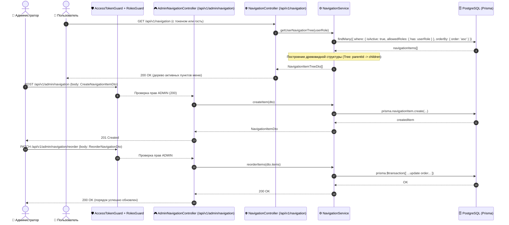

# Задачи: API управления навигацией и сайдбаром (Navigation Menu CRUD & Hierarchy)

Данный документ содержит детальную декомпозицию задач для реализации серверной части управления динамическим меню сайдбара (**Navigation & Sidebar Management API**) в **`apps/api`** (NestJS, Prisma, PostgreSQL), схем валидации и DTO в **`packages/dto`**, общих типов в **`packages/types`**, а также интеграции с ролевой моделью RBAC (`@Roles(UserRole.ADMIN)`).

---

## 1. Архитектурная диаграмма взаимодействия (Navigation Flow)



---

## 2. Структура файлов в монорепозитории

```text
MockInterviewAI/
├── packages/
│   ├── types/
│   │   └── src/
│   │       ├── navigation.ts                  # Типы и enum навигации (NavigationTarget, NavigationItemView)
│   │       └── index.ts
│   │
│   └── dto/
│       └── src/
│           ├── navigation/
│           │   ├── create-navigation-item.dto.ts   # Zod-схема и DTO создания пункта меню
│           │   ├── update-navigation-item.dto.ts   # Zod-схема частичного обновления
│           │   ├── reorder-navigation.dto.ts       # Zod-схема изменения порядка элементов
│           │   ├── navigation-item-response.dto.ts # DTO ответа (с поддержкой children[])
│           │   └── index.ts
│           └── index.ts
│
└── apps/api/
    ├── prisma/
    │   ├── schema.prisma                      # Модель NavigationItem со связью parent/children
    │   └── seed.ts                            # Сид дефолтных системных пунктов навигации
    │
    ├── src/
    │   └── modules/
    │       └── navigation/
    │           ├── navigation.module.ts       # Регистрация контроллеров, сервиса и экспортов
    │           ├── controllers/
    │           │   ├── navigation.controller.ts          # Публичный/клиентский эндпоинт GET /api/v1/navigation
    │           │   ├── admin-navigation.controller.ts    # Админский CRUD /api/v1/admin/navigation
    │           │   └── admin-navigation.controller.spec.ts
    │           ├── services/
    │           │   ├── navigation.service.ts             # Бизнес-логика, сборка дерева, транзакции reorder
    │           │   └── navigation.service.spec.ts        # Unit-тесты сервиса
    │           └── repositories/
    │               └── navigation.repository.ts          # Инкапсуляция запросов к Prisma
    │
    └── test/
        └── navigation.e2e-spec.ts             # E2E тесты: RBAC, CRUD, иерархия, защита системных пунктов
```

---

## 3. Детали технического дизайна и спецификация API

### 3.1. Модель данных Prisma (`schema.prisma`)

```prisma
model NavigationItem {
  id           String           @id @default(uuid()) @db.Uuid
  parentId     String?          @db.Uuid
  parent       NavigationItem?  @relation("NavigationHierarchy", fields: [parentId], references: [id], onDelete: Cascade)
  children     NavigationItem[] @relation("NavigationHierarchy")

  titleRu      String
  titleEn      String
  url          String?          // для групп-аккордеонов может быть null
  icon         String?          // имя иконки из @packages/icons (например, "CodeIcon", "BookIcon")
  order        Int              @default(0)
  target       String           @default("_self") // "_self" | "_blank"
  isActive     Boolean          @default(true)
  isSystem     Boolean          @default(false)   // защищает системные роуты от удаления
  allowedRoles String[]         @default(["USER", "ADMIN"])
  badgeText    String?          // бейдж, например "NEW", "BETA"
  createdAt    DateTime         @default(now())
  updatedAt    DateTime         @updatedAt

  @@map("navigation_items")
  @@index([parentId])
  @@index([order])
  @@index([isActive])
}
```

> [!IMPORTANT]
> **Правила системных пунктов (`isSystem: true`):**
> 1. Пункты с флагом `isSystem: true` **нельзя удалить** через `DELETE /api/v1/admin/navigation/:id` (возвращается `400 Bad Request` с сообщением *"Системные пункты меню не могут быть удалены"*).
> 2. У системных пунктов можно изменять: порядок (`order`), видимость (`isActive`), бейдж (`badgeText`), роли (`allowedRoles`) и иконку (`icon`).

---

### 3.2. Спецификация REST API

#### 1. Клиентский эндпоинт (Для Сайдбара):
- **`GET /api/v1/navigation`**
  - **Доступ:** Публичный / Авторизованный пользователь.
  - **Поведение:**
    1. Извлекает все записи, где `isActive: true` и `allowedRoles` содержит роль пользователя (по умолчанию `USER`).
    2. Сортирует по `order ASC`.
    3. Преобразует плоский список в древовидную структуру (вкладывает дочерние элементы в `children: []`).
  - **Ответ `200 OK`:** `NavigationItemTreeDto[]`

#### 2. Административные эндпоинты (`@Roles(UserRole.ADMIN)`):
- **`GET /api/v1/admin/navigation`**
  - Возвращает **все** пункты меню (включая неактивные и скрытые) со структурой дерева или плоского списка.
- **`POST /api/v1/admin/navigation`**
  - Создание нового пункта меню.
  - Тело запроса: `CreateNavigationItemDto`.
  - Валидация: если указан `parentId`, проверяется существование родителя.
- **`PATCH /api/v1/admin/navigation/:id`**
  - Обновление параметров пункта меню (названия, URL, иконка, роли, активность, бейдж).
- **`PATCH /api/v1/admin/navigation/reorder`**
  - Пакетное обновление порядка элементов:
  ```json
  {
    "items": [
      { "id": "uuid-1", "order": 0, "parentId": null },
      { "id": "uuid-2", "order": 1, "parentId": null },
      { "id": "uuid-3", "order": 0, "parentId": "uuid-1" }
    ]
  }
  ```
  - Выполняется в единой Prisma-транзакции (`$transaction`).
- **`DELETE /api/v1/admin/navigation/:id`**
  - Удаление кастомного пункта меню (каскадно удаляет дочерние элементы).
  - Запрещено для `isSystem: true`.

---

## 4. Чеклист реализации

### 📦 Часть 1: Схема данных и типы (`packages/types`, `packages/dto`, `apps/api`)

- [ ] **Типы (`packages/types/src/navigation.ts`):**
  - Определение enum `NavigationTarget` (`_self`, `_blank`).
  - Интерфейс `NavigationItemView`, `NavigationItemTreeView`.
- [ ] **DTO и Zod-схемы (`packages/dto/src/navigation/`):**
  - `create-navigation-item.dto.ts` с валидацией полей (длина строк, URL формат, роли).
  - `update-navigation-item.dto.ts`.
  - `reorder-navigation.dto.ts`.
  - `navigation-item-response.dto.ts`.
- [ ] **Prisma Schema (`apps/api/prisma/schema.prisma`):**
  - Добавление модели `NavigationItem` с индексами и связями.
  - Генерация клиента Prisma (`pnpm prisma:generate`).
- [ ] **Сид базы данных (`apps/api/prisma/seed.ts`):**
  - Инициализация дефолтных системных пунктов (`Dashboard`, `Interviews`, `Find Partners`, `Statistics`, `Resources`).

---

### ⚙️ Часть 2: Модуль навигации в NestJS (`apps/api/src/modules/navigation`)

- [ ] **Репозиторий (`navigation.repository.ts`):**
  - Методы `findAll()`, `findActiveByRoles(roles: string[])`, `findById(id: string)`, `create(data)`, `update(id, data)`, `delete(id)`, `reorder(items)`.
- [ ] **Сервис (`navigation.service.ts`):**
  - Метод `getUserNavigationTree(role: string)`: построение дерева меню.
  - Метод `createItem(dto: CreateNavigationItemDto)`: валидация родителя и создание.
  - Метод `updateItem(id: string, dto: UpdateNavigationItemDto)`: обновление свойств.
  - Метод `reorderItems(items: ReorderItemDto[])`: транзакционное обновление индексов сортировки.
  - Метод `deleteItem(id: string)`: проверка флага `isSystem` и удаление.
- [ ] **Контроллеры:**
  - `NavigationController` (`/api/v1/navigation`): клиентский доступ.
  - `AdminNavigationController` (`/api/v1/admin/navigation`): доступ только `@UseGuards(AccessTokenGuard, RolesGuard)` + `@Roles(UserRole.ADMIN)`.
- [ ] **Регистрация в `AppModule`:**
  - Подключение `NavigationModule` в `apps/api/src/app.module.ts`.

---

### 🧪 Часть 3: Тестирование

- [ ] **Unit-тесты (`navigation.service.spec.ts`):**
  - Тест корректного формирования дерева `children[]`.
  - Тест фильтрации по роли пользователя и флагу `isActive`.
  - Тест запрета удаления системного пункта меню (`isSystem: true`).
  - Тест транзакции изменения порядка (`reorder`).
- [ ] **E2E-тесты (`navigation.e2e-spec.ts`):**
  - Запрос `GET /api/v1/navigation` без авторизации и с ролью `USER`.
  - Попытка вызова `/api/v1/admin/navigation` обычным пользователем $\to$ `403 Forbidden`.
  - Полный CRUD-цикл администратора: создание, изменение порядка, редактирование, удаление.

---

## 5. Критерии приемки (Definition of Done)

1. Модель `NavigationItem` создана в Prisma и успешно мигрирована в PostgreSQL.
2. При сиде создаются 5 базовых системных пунктов меню (`isSystem: true`).
3. Эндпоинт `GET /api/v1/navigation` возвращает отсортированное дерево только активных пунктов, разрешенных для роли пользователя.
4. Админский API `/api/v1/admin/navigation` защищен Guard'ами и доступен строго для роли `ADMIN`.
5. Попытка удалить системный пункт возвращает ошибку `400 Bad Request`.
6. Пакетное изменение порядка (`reorder`) корректно обновляет `order` и `parentId` в единой транзакции.
7. Все unit- и e2e-тесты проходят успешно (`pnpm --filter @apps/api test`).
