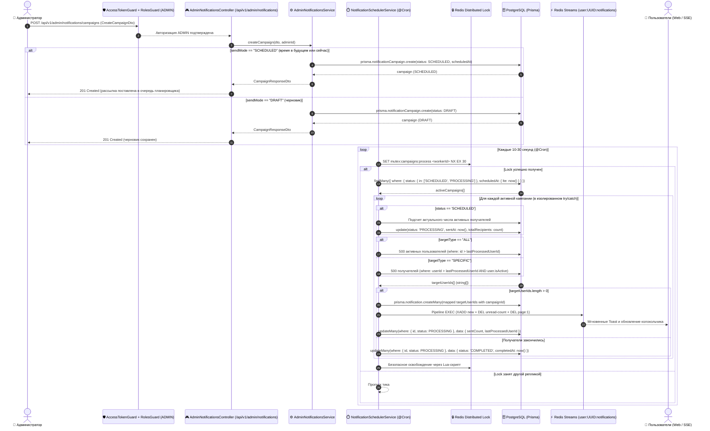

# Задачи: API рассылки уведомлений в панели администратора (Broadcast & Scheduled Notifications API — Chunked Scheduler)

Данный документ содержит детальную декомпозицию задач для проектирования и реализации серверной части массовой рассылки и отложенных уведомлений (**Admin Notifications Broadcast & Scheduling API**) в сервисе **`apps/api`** (NestJS, Prisma, Redis, PostgreSQL), создания моделей DTO и Zod-схем валидации в **`packages/dto`**, общих интерфейсов и перечислений в **`packages/types`**, а также интеграции с ролевой моделью RBAC (`@Roles(UserRole.ADMIN)`), механизмом пошаговой чанковой отправки (Chunking / Batching) и фоновым планировщиком задач (`@nestjs/schedule`).

> [!IMPORTANT]
> **Ключевые архитектурные принципы рассылки:**
> 1. **Исключительно через планировщик (No Immediate Controller Broadcast):**
>    - Вся отправка уведомлений выполняется строго асинхронно через фоновый планировщик (`NotificationSchedulerService`). Контроллер никогда не делает прямую рассылку в рамках HTTP-запроса.
>    - Если администратор хочет отправить рассылку "прямо сейчас", кампания создается или переводится в статус `SCHEDULED` с `scheduledAt = now()`, после чего планировщик забирает её на ближайшем цикле.
> 2. **Пошаговая чанковая отправка (Chunking & Rate Limiting):**
>    - Запрещено отправлять уведомления всей аудитории за один монолитный запрос/транзакцию.
>    - Аудитория делится на чанки фиксированного размера (по умолчанию **500 пользователей**).
>    - Прогресс фиксируется в базе данных (`sentCount`, `lastProcessedUserId`). Кампания находится в статусе `PROCESSING` до тех пор, пока не будут обработаны все чанки.
>    - Обеспечивается отказоустойчивость: при рестарте пода/сервиса рассылка продолжается с сохраненного курсора `lastProcessedUserId`, исключая дублирование уведомлений.
> 3. **Связь уведомлений с кампанией (`Notification.campaignId`):**
>    - Каждое сгенерированное уведомление ссылается на породившую его кампанию. Это позволяет отслеживать конверсию прочтений (`readCount` / Open Rate) и при необходимости отзывать ошибочные уведомления (`onDelete: Cascade`).
> 4. **Изоляция сбоев (Failure Isolation):**
>    - Сбой в обработке одной кампании не прерывает тик планировщика: ошибка изолируется в `try/catch`, кампания переводится в `FAILED`, остальные задачи продолжают выполняться.
> 5. **Аудит администраторов:**
>    - Фиксируются не только создатель черновика (`createdById`), но и инициатор отмены рассылки (`cancelledById`, `cancelledAt`).

---

## 1. Архитектурная диаграмма взаимодействия (Chunked Notification Broadcast Flow)



---

## 2. Модели данных (Prisma Schema)

В схему базы данных `apps/api/prisma/schema.prisma` добавляются новые сущности, а также связи в существующие модели `Notification` и `User`:

```prisma
enum NotificationTargetType {
  ALL       // Все активные пользователи
  SPECIFIC  // Выбранные пользователи по ID
}

enum NotificationCampaignStatus {
  DRAFT       // Черновик (можно редактировать и удалять)
  SCHEDULED   // Запланировано (ожидает даты отправки планировщиком)
  PROCESSING  // В процессе пошаговой отправки чанками
  COMPLETED   // Рассылка успешно завершена
  CANCELLED   // Отменена администратором
  FAILED      // Завершилась с ошибкой
}

model NotificationCampaign {
  id                  String                     @id @default(uuid()) @db.Uuid
  title               String                     @db.VarChar(200)
  message             String                     @db.Text
  category            NotificationType           @default(SYSTEM)
  actionUrl           String?                    @map("action_url") @db.VarChar(500)
  
  targetType          NotificationTargetType     @default(ALL) @map("target_type")
  status              NotificationCampaignStatus @default(DRAFT)
  
  scheduledAt         DateTime?                  @map("scheduled_at")
  sentAt              DateTime?                  @map("sent_at")
  completedAt         DateTime?                  @map("completed_at")
  
  totalRecipients     Int                        @default(0) @map("total_recipients")
  sentCount           Int                        @default(0) @map("sent_count")
  
  // Курсор для пошаговой обработки чанками и продолжения после сбоев
  lastProcessedUserId String?                    @map("last_processed_user_id") @db.Uuid
  failureReason       String?                    @map("failure_reason") @db.Text
  
  // Аудит создателя
  createdById         String                     @map("created_by_id") @db.Uuid
  createdBy           User                       @relation("CampaignsCreated", fields: [createdById], references: [id], onDelete: Restrict)
  
  // Аудит отменившего администратора
  cancelledById       String?                    @map("cancelled_by_id") @db.Uuid
  cancelledBy         User?                      @relation("CampaignsCancelled", fields: [cancelledById], references: [id], onDelete: SetNull)
  cancelledAt         DateTime?                  @map("cancelled_at")

  // Получатели для таргетированной рассылки (SPECIFIC)
  recipients          NotificationCampaignRecipient[]

  // Сгенерированные персональные уведомления
  notifications       Notification[]

  createdAt           DateTime                   @default(now()) @map("created_at")
  updatedAt           DateTime                   @updatedAt @map("updated_at")

  @@index([status, scheduledAt])
  @@index([createdById])
  @@index([cancelledById])
  @@map("notification_campaigns")
}

model NotificationCampaignRecipient {
  id          String               @id @default(uuid()) @db.Uuid
  campaignId  String               @map("campaign_id") @db.Uuid
  campaign    NotificationCampaign @relation(fields: [campaignId], references: [id], onDelete: Cascade)
  userId      String               @map("user_id") @db.Uuid
  user        User                 @relation("CampaignRecipients", fields: [userId], references: [id], onDelete: Cascade)

  createdAt   DateTime             @default(now()) @map("created_at")

  @@unique([campaignId, userId])
  @@index([userId])
  @@map("notification_campaign_recipients")
}

// -------------------------------------------------------------
// Модификация существующих моделей:
// -------------------------------------------------------------

model Notification {
  id         String                @id @default(uuid()) @db.Uuid
  userId     String                @db.Uuid
  campaignId String?               @map("campaign_id") @db.Uuid
  category   NotificationType
  title      String
  message    String
  actionUrl  String?               @map("action_url")
  readAt     DateTime?             @map("read_at")
  deletedAt  DateTime?             @map("deleted_at")
  createdAt  DateTime              @default(now()) @map("created_at")
  updatedAt  DateTime              @updatedAt @map("updated_at")

  user       User                  @relation(fields: [userId], references: [id], onDelete: Cascade)
  campaign   NotificationCampaign? @relation(fields: [campaignId], references: [id], onDelete: Cascade)

  @@index([userId])
  @@index([campaignId])
  @@index([readAt])
  @@index([deletedAt])
  @@map("notifications")
}

// Добавление обратных связей в модель User:
// model User {
//   ...
//   campaignsCreated       NotificationCampaign[]          @relation("CampaignsCreated")
//   campaignsCancelled     NotificationCampaign[]          @relation("CampaignsCancelled")
//   campaignRecipients     NotificationCampaignRecipient[] @relation("CampaignRecipients")
// }
```

---

## 3. Структура файлов в монорепозитории

```text
MockInterviewAI/
├── packages/
│   ├── types/src/
│   │   ├── admin-notifications.ts                 # Enums и интерфейсы кампаний рассылок
│   │   └── index.ts
│   │
│   └── dto/src/
│       ├── admin-notifications/
│       │   ├── create-campaign.dto.ts             # Zod-схема создания (SCHEDULED / DRAFT)
│       │   ├── update-campaign.dto.ts             # Zod-схема обновления
│       │   ├── query-campaigns.dto.ts             # Параметры фильтрации и пагинации
│       │   ├── campaign-response.dto.ts           # DTO ответа кампании с прогрессом и readCount
│       │   └── recipients-preview.dto.ts          # Предпросмотр количества пользователей
│       └── index.ts
│
└── apps/api/src/
    └── modules/
        └── admin/
            ├── admin.module.ts                    # Подключение контроллеров и провайдеров
            ├── controllers/
            │   ├── admin-notifications.controller.ts
            │   └── admin-notifications.controller.spec.ts
            ├── services/
            │   ├── admin-notifications.service.ts
            │   ├── admin-notifications.service.spec.ts
            │   ├── notification-scheduler.service.ts
            │   └── notification-scheduler.service.spec.ts
            └── dto/                               # NestJS Swagger DTO (классы с @ApiProperty)
```

---

## 4. Контракты API (OpenAPI / Endpoints)

Все эндпоинты защищены `@UseGuards(AccessTokenGuard, RolesGuard)` и требуют роль `@Roles(UserRole.ADMIN)`. Префикс пути: `/api/v1/admin/notifications`.

### 4.1. `POST /api/v1/admin/notifications/campaigns`
Создание новой кампании (черновик `DRAFT` или постановка в очередь планировщика `SCHEDULED`).

**Запрос (Request Body):**
```json
{
  "title": "Технические работы на сервере",
  "message": "В субботу с 02:00 до 04:00 МСК сервис будет недоступен в связи с плановым обновлением базы данных.",
  "category": "SYSTEM",
  "actionUrl": "/maintenance-info",
  "targetType": "ALL",
  "sendMode": "SCHEDULED",
  "scheduledAt": "2026-10-01T10:00:00.000Z"
}
```

*Правила валидации и логика создания:*
- `title`: string, `1..200` символов, обязательное поле.
- `message`: string, `1..2000` символов, обязательное поле.
- `category`: `NotificationType` (`SYSTEM`, `INTERVIEW`, `MESSAGE`).
- `actionUrl`: string, optional, относительный путь или валидный HTTPS URL.
- `targetType`: `ALL` или `SPECIFIC`.
- `recipientUserIds`: array UUID, обязателен при `targetType === "SPECIFIC"`, минимум 1 элемент, максимум 1000 элементов. **Автоматически дедуплицируется** (`Array.from(new Set(ids))`). При `ALL` поле должно отсутствовать или быть пустым.
- `sendMode`: `SCHEDULED` | `DRAFT` (опция немедленной синхронной отправки отсутствует, вся рассылка идет через планировщик).
- `scheduledAt`: ISO 8601 дата, опциональна при `sendMode === "SCHEDULED"`. Если указана, должна быть `>= now()`. Если не указана, принимается `now()` для взятия планировщиком в ближайшем тике.
- **Транзакционность:** Создание записи кампании и вставка связей `NotificationCampaignRecipient` выполняются в единой транзакции `prisma.$transaction`.

**Ответ (201 Created):**
```json
{
  "id": "7f8b9a10-2b3c-4d5e-9f0a-1a2b3c4d5e6f",
  "title": "Технические работы на сервере",
  "message": "...",
  "category": "SYSTEM",
  "actionUrl": "/maintenance-info",
  "targetType": "ALL",
  "status": "SCHEDULED",
  "scheduledAt": "2026-10-01T10:00:00.000Z",
  "sentAt": null,
  "completedAt": null,
  "totalRecipients": 1540,
  "sentCount": 0,
  "readCount": 0,
  "lastProcessedUserId": null,
  "failureReason": null,
  "createdById": "a0000000-0000-0000-0000-000000000001",
  "cancelledById": null,
  "cancelledAt": null,
  "createdAt": "2026-09-27T18:00:00.000Z",
  "updatedAt": "2026-09-27T18:00:00.000Z"
}
```

---

### 4.2. `GET /api/v1/admin/notifications/campaigns`
Пагинированный список кампаний с фильтрацией, прогрессом чанков (`sentCount` / `totalRecipients`) и счетчиком прочтений (`readCount`).

**Параметры Query:**
- `page`: number (default: 1)
- `limit`: number (default: 20, max: 100)
- `search`: string (поиск по `title`)
- `status`: `NotificationCampaignStatus` (опциональный фильтр)
- `targetType`: `NotificationTargetType` (опциональный фильтр)
- `sortBy`: `createdAt` | `scheduledAt` | `sentAt` (default: `createdAt`)
- `sortOrder`: `asc` | `desc` (default: `desc`)

**Ответ (200 OK):**
```json
{
  "items": [
    {
      "id": "7f8b9a10-2b3c-4d5e-9f0a-1a2b3c4d5e6f",
      "title": "Технические работы на сервере",
      "category": "SYSTEM",
      "targetType": "ALL",
      "status": "PROCESSING",
      "scheduledAt": "2026-09-27T17:30:00.000Z",
      "sentAt": "2026-09-27T17:30:00.000Z",
      "completedAt": null,
      "totalRecipients": 1540,
      "sentCount": 1000,
      "readCount": 420,
      "createdById": "a0000000-0000-0000-0000-000000000001",
      "createdAt": "2026-09-27T17:29:50.000Z"
    }
  ],
  "meta": {
    "page": 1,
    "limit": 20,
    "total": 1,
    "totalPages": 1
  }
}
```

---

### 4.3. `GET /api/v1/admin/notifications/campaigns/:id`
Получение подробностей кампании, включая текст, статистику прогресса отправки по чанкам, счетчик прочтений `readCount`, автора создания и автора отмены.

---

### 4.4. `PATCH /api/v1/admin/notifications/campaigns/:id`
Редактирование черновика (`DRAFT`) или запланированной рассылки (`SCHEDULED`).
*Бизнес-правило:* Если кампания уже находится в статусе `PROCESSING` или `COMPLETED`, возвращается `400 Bad Request` ("Невозможно изменить уже выполняющуюся или завершенную рассылку").
*Транзакционность:* При обновлении списка получателей (`recipientUserIds`) или смене `targetType` в рамках транзакции `prisma.$transaction` выполняется:
1. Удаление старых связей: `prisma.notificationCampaignRecipient.deleteMany({ where: { campaignId: id } })`.
2. Вставка нового дедуплицированного списка получателей `createMany` (если `targetType === "SPECIFIC"`).
3. Обновление полей кампании `prisma.notificationCampaign.update({ where: { id }, data: { ...fields, totalRecipients } })`.

---

### 4.5. `POST /api/v1/admin/notifications/campaigns/:id/queue`
Постановка черновика (`DRAFT`) в очередь планировщика для отправки (`status = SCHEDULED, scheduledAt = now()`). Отправка начнется при следующем тике планировщика.

---

### 4.6. `POST /api/v1/admin/notifications/campaigns/:id/cancel`
Отмена запланированной рассылки (`SCHEDULED` -> `CANCELLED`) или остановка выполняющейся (`PROCESSING` -> `CANCELLED`).
Фиксирует `cancelledById: admin.id` и `cancelledAt: new Date()`. При этом планировщик немедленно останавливает обработку последующих чанков.

---

### 4.7. `DELETE /api/v1/admin/notifications/campaigns/:id`
Удаление кампании (разрешено только для статусов `DRAFT` и `CANCELLED`). Благодаря связи `onDelete: Cascade` при удалении отмененной ошибочной кампании все созданные ею уведомления автоматически отзываются/удаляются из базы данных.

---

### 4.8. `GET /api/v1/admin/notifications/preview-recipients`
Предпросмотр охвата аудитории перед отправкой.

---

## 5. Алгоритм пошаговой чанковой рассылки (Chunking & Scheduler Mechanics)

```typescript
const CHUNK_SIZE = 500;
```

### 5.1. Безопасная унифицированная выборка получателей
В Prisma нативный `cursor: { id }` крашится с ошибкой `P2025`, если запись курсора была изменена или удалена.
Поэтому выборка строится на безопасном фильтре диапазона **`gt: lastProcessedUserId`**, а результат маппится в единый массив идентификаторов `targetUserIds: string[]`. Для режима `SPECIFIC` также обязательно проверяется активность пользователя (`user.isActive: true, user.deletedAt: null`):

```typescript
let targetUserIds: string[] = [];

if (campaign.targetType === NotificationTargetType.ALL) {
  const usersChunk = await prisma.user.findMany({
    where: {
      isActive: true,
      deletedAt: null,
      ...(campaign.lastProcessedUserId
        ? { id: { gt: campaign.lastProcessedUserId } }
        : {}),
    },
    select: { id: true },
    orderBy: { id: "asc" },
    take: CHUNK_SIZE,
  });
  targetUserIds = usersChunk.map((u) => u.id);
} else {
  const recipientsChunk = await prisma.notificationCampaignRecipient.findMany({
    where: {
      campaignId: campaign.id,
      user: {
        isActive: true,
        deletedAt: null,
      },
      ...(campaign.lastProcessedUserId
        ? { userId: { gt: campaign.lastProcessedUserId } }
        : {}),
    },
    select: { userId: true },
    orderBy: { userId: "asc" },
    take: CHUNK_SIZE,
  });
  targetUserIds = recipientsChunk.map((r) => r.userId);
}
```

---

### 5.2. Пакетная вставка со связью `campaignId` и Redis Pipeline
Все уведомления привязываются к кампании, а события в Redis отправляются одним сетевым пакетом. Также сбрасывается кэш первой страницы уведомлений, чтобы пользователь сразу увидел сообщение в колокольчике:

```typescript
if (targetUserIds.length > 0) {
  // 1. Пакетная вставка в PostgreSQL за 1 транзакцию
  await prisma.notification.createMany({
    data: targetUserIds.map((userId) => ({
      userId,
      campaignId: campaign.id,
      category: campaign.category,
      title: campaign.title,
      message: campaign.message,
      actionUrl: campaign.actionUrl,
    })),
  });

  // 2. Отправка в Redis Streams и сброс кэша через единый Pipeline (1 сетевой запрос)
  const pipeline = this.redis.pipeline();
  for (const userId of targetUserIds) {
    const streamKey = `user:${userId}:notifications`;
    pipeline.xadd(
      streamKey,
      "MAXLEN", "~", 100,
      "*",
      "event", "notification.new",
      "data", JSON.stringify({
        title: campaign.title,
        message: campaign.message,
        category: campaign.category,
        actionUrl: campaign.actionUrl,
      }),
    );
    pipeline.del(`notifications:${userId}:unread-count`);
    pipeline.del(`notifications:${userId}:page:1:limit:20`);
  }
  await pipeline.exec();
}
```

---

### 5.3. Актуализация `totalRecipients` при старте рассылки
Чтобы избежать расхождений счетчиков из-за изменений в базе пользователей за время ожидания отложенной рассылки, `totalRecipients` актуализируется в момент перехода из `SCHEDULED` в `PROCESSING`:

```typescript
if (campaign.status === NotificationCampaignStatus.SCHEDULED) {
  const actualTotal = campaign.targetType === NotificationTargetType.ALL
    ? await prisma.user.count({ where: { isActive: true, deletedAt: null } })
    : await prisma.notificationCampaignRecipient.count({
        where: {
          campaignId: campaign.id,
          user: { isActive: true, deletedAt: null },
        },
      });

  await prisma.notificationCampaign.update({
    where: { id: campaign.id },
    data: {
      status: NotificationCampaignStatus.PROCESSING,
      sentAt: new Date(),
      totalRecipients: actualTotal,
    },
  });
}
```

---

### 5.4. Атомарное сохранение прогресса и защита от Cancel Race Condition
Фиксация прогресса выполняется через `updateMany` с проверкой `status: PROCESSING`. Если администратор отменил рассылку во время работы воркера, операция обновит 0 строк, и цикл немедленно прервется:

```typescript
if (targetUserIds.length > 0) {
  const lastProcessedId = targetUserIds[targetUserIds.length - 1];

  const updateResult = await prisma.notificationCampaign.updateMany({
    where: {
      id: campaign.id,
      status: NotificationCampaignStatus.PROCESSING,
    },
    data: {
      sentCount: { increment: targetUserIds.length },
      lastProcessedUserId: lastProcessedId,
    },
  });

  if (updateResult.count === 0) {
    this.logger.warn(`Campaign ${campaign.id} was cancelled or modified during chunk processing. Halting.`);
    return;
  }
} else {
  // Все получатели обработаны — завершаем кампанию
  await prisma.notificationCampaign.updateMany({
    where: {
      id: campaign.id,
      status: NotificationCampaignStatus.PROCESSING,
    },
    data: {
      status: NotificationCampaignStatus.COMPLETED,
      completedAt: new Date(),
    },
  });
}
```

---

### 5.5. Изолированная обработка ошибок (Failure Isolation)
Обработка каждой кампании внутри тика планировщика оборачивается в персональный `try/catch`. Сбой одной кампании не роняет весь планировщик:

```typescript
for (const campaign of activeCampaigns) {
  try {
    await this.processCampaignChunk(campaign);
  } catch (error) {
    const errorMessage = error instanceof Error ? error.message : String(error);
    this.logger.error(`Failed to process chunk for campaign ${campaign.id}: ${errorMessage}`);

    await prisma.notificationCampaign.updateMany({
      where: { id: campaign.id, status: NotificationCampaignStatus.PROCESSING },
      data: {
        status: NotificationCampaignStatus.FAILED,
        failureReason: errorMessage,
      },
    });
  }
}
```

---

### 5.6. Безопасный распределенный замок с Lua-скриптом
- Замок захватывается с токеном воркера: `SET mutex:admin-notifications:tick <workerId> NX EX 30`.
- Освобождение выполняется только владельцем через Lua-скрипт:
  ```lua
  if redis.call("get", KEYS[1]) == ARGV[1] then
    return redis.call("del", KEYS[1])
  else
    return 0
  end
  ```

---

## 6. Чеклист задач реализации (Backend Checklist)

- [ ] **1. База данных и схемы Prisma (`apps/api/prisma`):**
  - [ ] Добавить перечисления `NotificationTargetType`, `NotificationCampaignStatus` в `schema.prisma`.
  - [ ] Создать модель `NotificationCampaign` с полями прогресса `sentCount`, `totalRecipients`, `lastProcessedUserId`, а также аудит-полями `cancelledById` и `cancelledAt`.
  - [ ] Создать модель `NotificationCampaignRecipient`.
  - [ ] Добавить поле `campaignId` и связь `@relation(onDelete: Cascade)` в существующую модель `Notification`.
  - [ ] Добавить обратные связи `campaignsCreated`, `campaignsCancelled`, `campaignRecipients` в существующую модель `User`.
  - [ ] Создать миграцию `pnpm --filter api db:migrate:dev --name add_chunked_notification_campaigns`.
  - [ ] Сгенерировать Prisma Client (`pnpm --filter api db:generate`).
- [ ] **2. DTO и валидация (`packages/types`, `packages/dto`):**
  - [ ] Описать типы и интерфейсы в `packages/types/src/admin-notifications.ts` (статусы, режимы `SCHEDULED` и `DRAFT`, поле `readCount`).
  - [ ] Создать Zod-схемы валидации `CreateCampaignSchema`, `UpdateCampaignSchema`, `QueryCampaignsSchema`.
  - [ ] Добавить дедупликацию массива `recipientUserIds` через `z.array(z.string().uuid()).transform(ids => Array.from(new Set(ids)))`.
  - [ ] Запретить немедленную синхронную отправку в схемах валидации; сделать `sendMode: z.enum(['SCHEDULED', 'DRAFT'])`.
  - [ ] Экспортировать типы из пакетов и пересобрать (`pnpm build`).
- [ ] **3. Сервис и контроллер администратора (`apps/api/src/modules/admin`):**
  - [ ] Создать `AdminNotificationsController` с декораторами `@ApiTags('Admin Notifications')`, `@UseGuards(AccessTokenGuard, RolesGuard)`, `@Roles(UserRole.ADMIN)`.
  - [ ] Реализовать `AdminNotificationsService`:
    - CRUD операции над кампаниями (создание со статусом `SCHEDULED` или `DRAFT`, получение списка с подсчетом `readCount`, получение деталей, обновление, удаление, отмена).
    - Транзакционное создание и обновление черновиков через `prisma.$transaction`.
    - Метод `queueCampaign(id)` для перевода черновика в очередь планировщика (`SCHEDULED`).
    - Подсчет общего количества потенциальных получателей (`totalRecipients`) при создании кампании.
    - Валидацию прав и статусов (защита от редактирования рассылок в статусе `PROCESSING`).
- [ ] **4. Сервис пошаговой чанковой отправки и планировщик (`NotificationSchedulerService`):**
  - [ ] Реализовать распределенный замок в Redis с токеном владельца и безопасным Lua-освобождением (`acquireLock`, `releaseLock`).
  - [ ] Реализовать `@Cron(CronExpression.EVERY_10_SECONDS)` для обработки очереди отложенных и выполняющихся кампаний.
  - [ ] Реализовать метод актуализации `totalRecipients` при старте рассылки.
  - [ ] Реализовать унифицированную безопасную выборку `targetUserIds` по диапазону ID (`gt: lastProcessedUserId`) с фильтрацией `isActive: true, deletedAt: null`.
  - [ ] Интегрировать пакетную вставку `prisma.notification.createMany` со связью `campaignId` и групповую отправку через **Redis Pipeline** с инвалидацией `page:1` и `unread-count`.
  - [ ] Реализовать защиту от Cancel Race Condition через `updateMany({ where: { status: PROCESSING } })`.
  - [ ] Реализовать изолированный `try/catch` для каждой кампании с переводом упавшей задачи в `FAILED`.
  - [ ] Корректное обновление прогресса `sentCount` и перевод в `COMPLETED` при завершении всех чанков.
- [ ] **5. Интеграция с OpenAPI и генерация API клиента:**
  - [ ] Запустить `pnpm --filter api generate:openapi`.
  - [ ] Запустить генерацию Orval хуков в `packages/api` (`pnpm --filter @packages/api generate`).
- [ ] **6. Тестирование и надежность:**
  - [ ] Unit-тесты для `AdminNotificationsService` и `NotificationSchedulerService` (`.spec.ts`).
  - [ ] Тесты на корректное пошаговое продвижение диапазона ID (`gt: lastProcessedUserId`) для обоих режимов (`ALL` и `SPECIFIC`).
  - [ ] Тесты на изоляцию ошибок: падение одной кампании не ломает выполнение соседних.
  - [ ] Тесты на возобновление рассылки после имитации сбоя на середине списка пользователей.
  - [ ] Тесты на прерывание обработки чанков при вызове отмены (`CANCELLED`).
  - [ ] E2E тесты на проверку прав доступа (`401` для гостей, `403` для обычных пользователей, `200/201` для админа).
