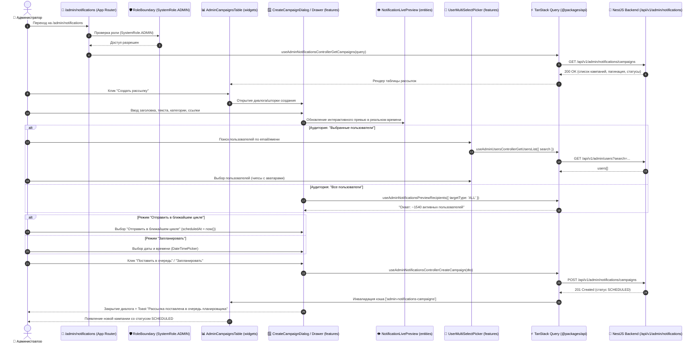

# Задачи: Фронтенд рассылки и планирования уведомлений (Admin Notifications Broadcast & Scheduling UI)

Данный документ содержит детальную декомпозицию задач для реализации пользовательского интерфейса рассылки уведомлений (**Admin Notifications Broadcast & Scheduling UI**) в приложении **`apps/web`** (Next.js App Router, архитектура **FSD**), с использованием дизайн-системы **`@packages/ui`** (`DataTable`, `Dialog`, `Badge`, `Form`, `Toast`, `DropdownMenu`, `Tabs`, `RadioGroup`), иконок **`@packages/icons`**, локализации **`@packages/i18n`** и типизированных хуков **`@packages/api`** (сгенерированных через Orval).

---

## 1. Архитектурная диаграмма взаимодействия компонентов (Admin UI Flow)



---

## 2. Структура файлов в `apps/web` (FSD методология)

```text
apps/web/src/
├── app/
│   └── (protected)/
│       └── admin/
│           └── notifications/
│               ├── page.tsx                           # Главная страница: список кампаний + действия
│               └── [id]/
│                   └── page.tsx                       # Детальная страница кампании (статистика, получатели)
│
├── widgets/
│   ├── admin-notifications-table/                     # Виджет таблицы рассылок
│   │   ├── ui/
│   │   │   ├── AdminNotificationsTable.tsx            # DataTable со статусами, пагинацией и меню
│   │   │   ├── AdminNotificationsFilters.tsx          # Поиск по заголовку, фильтр по статусу/типу
│   │   │   └── AdminCampaignActionsMenu.tsx           # Dropdown: Отправить сейчас, Отменить, Удалить
│   │   └── index.ts
│   │
│   └── admin-campaign-dialog/                         # Модальное окно / Drawer создания рассылки
│       ├── ui/
│       │   ├── CreateCampaignDialog.tsx               # Основной контейнер диалога
│       │   ├── CampaignContentStep.tsx                # Шаг 1: Заголовок, текст, категория, actionUrl
│       │   ├── CampaignAudienceStep.tsx               # Шаг 2: Радио "Все" / "Выбранные" + User Picker
│       │   └── CampaignScheduleStep.tsx               # Шаг 3: Радио "Сейчас" / "По времени" + DateTimePicker
│       └── index.ts
│
├── features/
│   ├── admin-create-campaign/                         # Мутация создания и валидация формы
│   │   ├── model/
│   │   │   ├── useCreateCampaignForm.ts               # React Hook Form + ZodResolver
│   │   │   └── useCreateCampaignMutation.ts           # Orval TanStack Query мутация
│   │   └── index.ts
│   │
│   ├── admin-campaign-actions/                        # Мутации управления состоянием
│   │   ├── model/
│   │   │   ├── useSendCampaignNow.ts                  # POST /campaigns/:id/send
│   │   │   ├── useCancelCampaign.ts                   # POST /campaigns/:id/cancel
│   │   │   └── useDeleteCampaign.ts                   # DELETE /campaigns/:id
│   │   └── index.ts
│   │
│   └── admin-user-multi-picker/                       # Компонент выбора пользователей
│       ├── ui/
│       │   ├── UserMultiSelectPicker.tsx              # Async Combobox с чипами и аватарами
│       │   └── SelectedUserChip.tsx                   # Чип выбранного пользователя
│       └── model/
│           └── useUserSearch.ts                       # Поиск с debounce 300ms
│
└── entities/
    └── admin-notification-campaign/                   # Сущность кампании
        ├── model/
        │   ├── types.ts                               # UI-типы и мапперы
        │   └── constants.ts                           # Цвета бейджей и иконки статусов
        └── ui/
            ├── CampaignStatusBadge.tsx                # Бейдж: SCHEDULED, PROCESSING, COMPLETED и т.д.
            ├── CampaignTargetBadge.tsx                # Бейдж: "Все пользователи" / "N пользователей"
            ├── NotificationLivePreview.tsx            # Интерактивное превью (Bell Card + System Push Toast)
            └── CampaignStatsCard.tsx                  # Метрики: охват, доставлено, прогресс-бар
```

---

## 3. Требования к UI/UX и функционалу

### 3.1. Таблица кампаний (`AdminNotificationsTable`)
1. **Колонки таблицы:**
   - **Заголовок и сообщение:** Заголовок полужирным, категория (SYSTEM, INTERVIEW, MESSAGE), краткий фрагмент текста (truncate 60 символов).
   - **Целевая аудитория:** Бейдж `ALL` ("Все пользователи (~1540)") или `SPECIFIC` ("Выбранные: 14 пользователей").
   - **Статус:** Цветные бейджи (`Badge`):
     - `DRAFT`: Серый (Черновик)
     - `SCHEDULED`: Синий / Индиго (Запланировано на DD.MM.YYYY HH:mm)
     - `PROCESSING`: Желтый / Анимация пульсации с прогрессом чанков (например, "Отправка: 500 / 1540 (32%)")
     - `COMPLETED`: Зеленый (Завершено: 1540 / 1540)
     - `CANCELLED`: Нейтральный зачеркнутый (Отменено)
     - `FAILED`: Красный / Destructive (Ошибка отправки)
   - **Прогресс и прочтения:** Прогресс отправки (`sentCount / totalRecipients`) и конверсия прочтений `readCount` (например, "420 прочли (42%)").
   - **Дата планирования / отправки:** Локализованная дата и время с тултипом UTC.
   - **Создатель / Автор отмены:** Аватар и имя администратора.
   - **Действия (DropdownMenu):**
     - "Поставить в очередь отправки" (для `DRAFT` — переводит в `SCHEDULED` на ближайший цикл планировщика).
     - "Отменить рассылку" (для `SCHEDULED` и прерывание для `PROCESSING`).
     - "Удалить" (для `DRAFT` и `CANCELLED`).
     - "Дублировать как черновик".

2. **Фильтры и поиск:**
   - Строка поиска по заголовку с задержкой ввода (debounce 300ms).
   - Выпадающий список выбора статуса (`Все`, `Запланировано`, `Отправляется`, `Завершено`, `Черновик`).
   - Синхронизация фильтров с URL через `useSearchParams`.

---

### 3.2. Форма создания рассылки (`CreateCampaignDialog`)

Форма может быть выполнена в виде диалога со вкладками (Tabs) или пошагового мастера (Stepper):

#### Вкладка 1: Содержание сообщения
- **Заголовок:** Однострочный ввод (`Input`), валидация до 200 символов, счетчик символов `0 / 200`.
- **Категория:** Выбор типа уведомления (`Select`):
  - `SYSTEM` — Системные оповещения (технические работы, важные анонсы).
  - `INTERVIEW` — Интервью и сессии.
  - `MESSAGE` — Сообщения и обновления платформы.
- **Текст сообщения:** Многострочный ввод (`Textarea`), до 2000 символов, поддержка эмодзи.
- **Ссылка перехода (Action URL):** Опциональное поле ввода с подсказкой (например: `/dashboard` или `https://...`).
- **Интерактивный предпросмотр (Live Preview):**
  - Справа от формы в реальном времени отображается карточка уведомления так, как ее увидит пользователь:
    1. Виджет колокольчика: карточка `NotificationCard` с иконкой категории, временем "только что" и активной ссылкой.
    2. Браузерный Toast: всплывающее окно в правом нижнем углу.

#### Вкладка 2: Целевая аудитория (Target Audience)
- **Переключатель аудитории (`RadioGroup`):**
  - `(o) Все пользователи` — Показывает динамический бейдж с примерным охватом: "Уведомление получат ~1,540 активных пользователей".
  - `( ) Выбранные пользователи` — Открывает блок мультивыбора пользователей.
- **Мультиселект пользователей (`UserMultiSelectPicker`):**
  - Поиск по имени, username или email с автодополнением.
  - Выбранные пользователи отображаются в виде чипсов с аватаром, именем и кнопкой удаления `(x)`.
  - Возможность массовой вставки списка email/UUID через текстовую область.

#### Вкладка 3: Время и параметры отправки (Schedule & Timing)
- **Переключатель режима отправки (`RadioGroup`):**
  - `(o) Отправить в ближайшем цикле планировщика` — Рассылка ставится в очередь со статусом `SCHEDULED` (`scheduledAt = now()`) и начнет обрабатываться чанками на ближайшем тике воркера.
  - `( ) Запланировать на точное время` — Раскрывает выбор даты и времени.
  - `( ) Сохранить как черновик` — Сохранение со статусом `DRAFT` без постановки в очередь.
- **Выбор даты и времени (`DateTimePicker`):**
  - Календарь с ограничением (нельзя выбрать дату и время в прошлом).
  - Выбор часов и минут.
  - Отображение часового пояса администратора (например, "МСК (UTC+3)").

---

## 4. Локализация (`@packages/i18n`)

Все тексты должны быть вынесены в файлы локализации:
- `packages/i18n/src/locales/ru/admin-notifications.json`
- `packages/i18n/src/locales/en/admin-notifications.json`

**Пример структуры ключей:**
```json
{
  "title": "Рассылка уведомлений",
  "subtitle": "Создание и планирование массовых уведомлений для пользователей платформы",
  "createButton": "Создать рассылку",
  "table": {
    "columns": {
      "title": "Уведомление",
      "audience": "Аудитория",
      "status": "Статус",
      "scheduledAt": "Запланировано",
      "sentAt": "Отправлено",
      "actions": "Действия"
    },
    "audienceAll": "Все пользователи",
    "audienceSpecific": "Выбрано: {{count}}",
    "statuses": {
      "draft": "Черновик",
      "scheduled": "Запланировано",
      "processing": "Отправка",
      "completed": "Завершено",
      "cancelled": "Отменено",
      "failed": "Ошибка"
    }
  },
  "form": {
    "titleLabel": "Заголовок уведомления",
    "titlePlaceholder": "Например: Плановые технические работы",
    "messageLabel": "Текст сообщения",
    "categoryLabel": "Категория",
    "actionUrlLabel": "Ссылка для перехода (необязательно)",
    "audienceLabel": "Получатели",
    "targetAll": "Отправить всем пользователям",
    "targetSpecific": "Выбрать определенных пользователей",
    "timingLabel": "Время отправки",
    "sendImmediately": "Отправить прямо сейчас",
    "sendScheduled": "Запланировать на дату и время",
    "saveDraft": "Сохранить как черновик",
    "previewTitle": "Предпросмотр уведомления",
    "previewToast": "Системный Toast",
    "previewBell": "В центре уведомлений"
  },
  "alerts": {
    "createdSuccess": "Рассылка успешно запланирована",
    "sentSuccess": "Рассылка запущена",
    "cancelledSuccess": "Рассылка отменена",
    "deletedSuccess": "Рассылка удалена"
  }
}
```

---

## 5. Чеклист задач реализации (Frontend Checklist)

- [ ] **1. Модель сущности и типы (`entities/admin-notification-campaign`):**
  - [ ] Создать UI-типы и мапперы на основе сгенерированного клиента из `@packages/api`.
  - [ ] Разработать компонент статуса `CampaignStatusBadge` со стилями дизайн-системы.
  - [ ] Разработать компонент аудитории `CampaignTargetBadge`.
  - [ ] Реализовать компонент интерактивного предпросмотра `NotificationLivePreview` (виджет колокольчика + Toast).
- [ ] **2. Компонент выбора пользователей (`features/admin-user-multi-picker`):**
  - [ ] Реализовать асинхронный поиск пользователей с debounce и выводом аватаров/email.
  - [ ] Сделать список выбранных пользователей в виде удаляемых чипсов `SelectedUserChip`.
  - [ ] Добавить счетчик выбранных получателей.
- [ ] **3. Форма создания и модальное окно (`widgets/admin-campaign-dialog`):**
  - [ ] Настроить хук формы `useCreateCampaignForm` с валидацией через Zod.
  - [ ] Реализовать шаг выбора аудитории (радио-баттоны "Все" / "Выбранные" + запрос `previewRecipients`).
  - [ ] Реализовать шаг выбора времени (радио-баттоны "Сейчас" / "Запланировать" + `DateTimePicker`).
  - [ ] Интегрировать превью сообщения в реальном времени.
  - [ ] Подключить мутацию `useCreateCampaignMutation` с показом Toast и сбросом формы.
- [ ] **4. Таблица кампаний (`widgets/admin-notifications-table`):**
  - [ ] Реализовать `AdminNotificationsTable` на базе `DataTable` (`@packages/ui`).
  - [ ] Реализовать фильтрацию по статусу, аудитории и поиск по названию.
  - [ ] Добавить меню быстрых действий строки (Отправить сейчас, Отменить, Удалить).
  - [ ] Реализовать автоматическое обновление данных (polling / `refetchInterval` 5-10 сек) при наличии кампаний в статусе `PROCESSING`.
- [ ] **5. Страница и навигация (`apps/web`):**
  - [ ] Создать страницу `apps/web/src/app/(protected)/admin/notifications/page.tsx`.
  - [ ] Обернуть доступ в проверку роли администратора (`RoleBoundary` / `ADMIN`).
  - [ ] Добавить пункт "Рассылки" / "Уведомления" в меню навигации админ-панели (`AdminNav`).
- [ ] **6. Локализация и доступность (A11y / i18n):**
  - [ ] Добавить ключи локализации в `ru` и `en` словари (`@packages/i18n`).
  - [ ] Проверить доступность с клавиатуры (фокусы, модальные окна, ARIA атрибуты).
  - [ ] Проверить адаптивность интерфейса на мобильных и планшетных разрешениях.
