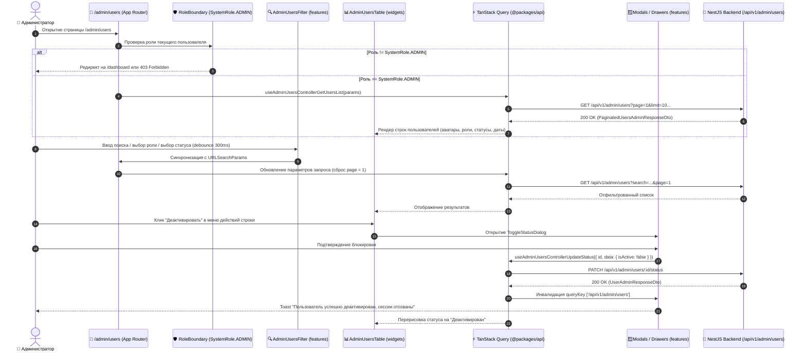

# Задачи: Фронтенд административной панели и управления пользователями (Admin Panel & Users Management UI)

Данный документ содержит детальную декомпозицию задач для реализации пользовательского интерфейса административной панели (**Admin Panel**) и раздела управления пользователями (**Users Management UI**) в приложении **`apps/web`** (Next.js App Router, архитектура **FSD**), с использованием дизайн-системы **`@packages/ui`** (`DataTable`, `Dialog`, `Badge`, `Pagination`, `Form`, `Toast`, `DropdownMenu`, `Drawer`), иконок **`@packages/icons`**, локализации **`@packages/i18n`** и типизированных хуков **`@packages/api`** (сгенерированных через Orval из OpenAPI-спецификации).

---

## 1. Архитектурная диаграмма взаимодействия компонентов (Admin UI Flow)



---

## 2. Структура файлов в `apps/web` (FSD методология)

> [!NOTE]
> В соответствии с правилами монорепозитория (`AGENTS.md`) прямое дублирование HTTP-клиентов запрещено: интеграция с API строится поверх типизированных хуков и моделей из **`@packages/api`** и Zod-схем **`@packages/dto`**.

```text
apps/web/src/
├── app/
│   └── (protected)/
│       └── admin/
│           ├── layout.tsx                                 # RoleBoundary(SystemRole.ADMIN) + Admin Header/Nav
│           └── users/
│               ├── page.tsx                               # Страница /admin/users
│               └── [id]/
│                   └── page.tsx                           # Детальная страница пользователя (опционально)
│
├── entities/
│   └── admin-user/
│       ├── model/
│       │   └── types.ts                                   # Дополнительные UI-типы (колонки, локальные фильтры)
│       ├── ui/
│       │   ├── UserRoleBadge.tsx                          # Бейдж роли: SystemRole.ADMIN (accent) / SystemRole.USER (muted)
│       │   ├── UserStatusBadge.tsx                        # Бейдж статуса: "Активен" (success) / "Деактивирован" (destructive)
│       │   └── UserAvatarCell.tsx                         # Ячейка пользователя: Avatar + displayName + @username
│       └── index.ts
│
├── features/
│   ├── admin-users-filter/
│   │   ├── ui/
│   │   │   ├── AdminUsersFilter.tsx                       # Debounced поиск, селекторы SystemRole и isActive, кнопка сброса
│   │   │   └── AdminUsersFilter.test.tsx
│   │   ├── model/
│   │   │   └── useAdminUsersFilterState.ts                # Синхронизация состояния фильтров с URLSearchParams
│   │   └── index.ts
│   │
│   ├── admin-user-create/
│   │   ├── ui/
│   │   │   ├── CreateUserDialog.tsx                       # Модальное окно создания пользователя (email, password, role, etc.)
│   │   │   └── CreateUserDialog.test.tsx
│   │   ├── model/
│   │   │   └── useCreateUserForm.ts                       # React Hook Form + createUserAdminSchema (@packages/dto)
│   │   └── index.ts
│   │
│   ├── admin-user-edit/
│   │   ├── ui/
│   │   │   ├── EditUserDialog.tsx                         # Модальное окно редактирования профиля и роли (без пароля)
│   │   │   └── EditUserDialog.test.tsx
│   │   ├── model/
│   │   │   └── useEditUserForm.ts                         # React Hook Form + updateUserAdminSchema (@packages/dto)
│   │   └── index.ts
│   │
│   ├── admin-user-status/
│   │   ├── ui/
│   │   │   ├── ToggleStatusDialog.tsx                     # Диалог подтверждения деактивации/активации (с Self-Lockout защитой)
│   │   │   └── ToggleStatusDialog.test.tsx
│   │   └── index.ts
│   │
│   ├── admin-user-reset-password/
│   │   ├── ui/
│   │   │   ├── ResetPasswordDialog.tsx                    # Диалог сброса пароля с отображением временного сгенерированного пароля
│   │   │   └── ResetPasswordDialog.test.tsx
│   │   └── index.ts
│   │
│   └── admin-user-details/
│       ├── ui/
│       │   └── UserDetailsDrawer.tsx                      # Боковой Drawer с подробной статистикой (sessionsCount, participationsCount)
│       └── index.ts
│
├── widgets/
│   ├── admin-header/
│   │   └── ui/
│   │       └── AdminHeader.tsx                            # Заголовок раздела, хлебные крошки, кнопка "+ Добавить пользователя"
│   │
│   ├── admin-users-table/
│   │   ├── ui/
│   │   │   ├── AdminUsersTable.tsx                        # Таблица на базе @packages/ui/DataTable
│   │   │   ├── AdminUsersTableColumns.tsx                 # Описание колонок, сортировки, форматирования дат
│   │   │   ├── AdminUsersTableRowActions.tsx              # Меню действий (DropdownMenu)
│   │   │   └── AdminUsersTable.test.tsx
│   │   └── index.ts
│   │
│   └── admin-sidebar/
│       └── ui/
│           └── AdminSidebarNav.tsx                        # Навигация панели администратора
│
└── shared/
    └── config/
        └── paths.ts                                       # Регистрация маршрута paths.adminUsers = "/admin/users"
```

---

## 3. Детали технического дизайна UI компонентов

### 3.1. Колонки таблицы пользователей (`AdminUsersTableColumns`)
Таблица строится с помощью `DataTable` из `@packages/ui` со следующими колонками:

| Колонка | Описание / Отображение | Сортировка API |
| :--- | :--- | :---: |
| **Пользователь** | `<UserAvatarCell>`: Аватар + `displayName` + `@username` | `sortBy=username` |
| **Email** | Текстовое поле email | `sortBy=email` |
| **Роль** | `<UserRoleBadge>` (`SystemRole.ADMIN` / `SystemRole.USER`) | `sortBy=role` |
| **Статус** | `<UserStatusBadge>` (`Активен` / `Деактивирован`) | `sortBy=isActive` |
| **Дата регистрации** | Форматированная дата (`dd.MM.yyyy HH:mm`) | `sortBy=createdAt` |
| **Действия** | `<DropdownMenu>`: Детали, Редактировать, Сбросить пароль, Статус | — |

> [!IMPORTANT]
> **Физическое удаление пользователя (`DELETE`) отсутствует в UI.**
> В меню действий доступна только мягкая деактивация/активация. Кнопка жесткого удаления отсутствует.

---

### 3.2. Панель фильтрации (`AdminUsersFilter`)
1. **Поле поиска (`Input` с иконкой `SearchIcon`):**
   - Placeholder: *"Поиск по email, имени или username..."*;
   - Debounce 300ms;
   - Автоматический сброс на `page: 1` при вводе.
2. **Селектор роли (`Select`):**
   - Опции: *Все роли*, *USER* (`SystemRole.USER`), *ADMIN* (`SystemRole.ADMIN`).
3. **Селектор статуса (`Select`):**
   - Опции: *Все статусы*, *Только активные* (`isActive=true`), *Только деактивированные* (`isActive=false`).
4. **Сортировка:**
   - Клик по заголовкам колонок таблицы переключает `sortBy` и `sortOrder` (`asc` / `desc`).
5. **Сброс фильтров:**
   - Кнопка "Сбросить", очищающая поисковые параметры до дефолтных.
6. **URL State Synchronization:**
   - Все параметры (`page`, `limit`, `search`, `role`, `isActive`, `sortBy`, `sortOrder`) синхронизированы с `URLSearchParams`.

---

### 3.3. Модальные окна и формы

#### 1. Создание пользователя (`CreateUserDialog`):
- **Схема валидации:** `createUserAdminSchema` из `@packages/dto`.
- **Поля:** `email`, `password` (с генератором/показом пароля), `role` (`SystemRole`), `username` (опционально), `displayName` (опционально).
- **Хук:** `useAdminUsersControllerCreateUser` из `@packages/api`.
- **Обработка ошибок:** 409 Conflict $\to$ подсветка полей `email` / `username`.

#### 2. Редактирование пользователя (`EditUserDialog`):
- **Схема валидации:** `updateUserAdminSchema` из `@packages/dto`.
- **Поля:** `email`, `role`, `username`, `displayName`, `telegramUsername`, `gitUrl`.
- **Особенность:** поле пароля **отсутствует** (пароль не редактируется через общий CRUD).
- **Хук:** `useAdminUsersControllerUpdateUser` из `@packages/api`.

#### 3. Управление статусом (`ToggleStatusDialog`):
- **Хук:** `useAdminUsersControllerUpdateStatus` из `@packages/api`.
- **Предупреждение при деактивации:**
  > *"Вы уверены, что хотите деактивировать пользователя **{email}**? Все его активные сессии будут немедленно завершены, а доступ к платформе заблокирован."*
- **Self-Lockout защита:** Если текущий авторизованный администратор (`currentUserId === targetUserId`), кнопка деактивации в интерфейсе заблокирована (`disabled`) с тултипом *"Нельзя деактивировать собственный аккаунт администратора"*.

#### 4. Сброс пароля администратором (`ResetPasswordDialog`):
- **Хук:** `useAdminUsersControllerResetPassword` из `@packages/api`.
- **Действие:** Генерирует криптографически стойкий временный пароль, сбрасывает сессии пользователя и выводит сгенерированный пароль в диалоге с кнопкой "Скопировать в буфер".

#### 5. Детальная карточка (`UserDetailsDrawer`):
- **Хук:** `useAdminUsersControllerGetUserDetail` из `@packages/api`.
- **Отображение:** ID, email, username, дата создания, дата деактивации, счетчик сессий (`sessionsCount`), счетчик участий в интервью (`participationsCount`).

---

## 4. Чеклист реализации

### 📦 Часть 1: Маршрутизация и сущность (`entities/admin-user`, `shared/config`)

- [ ] **Конфигурация путей (`shared/config/paths.ts`):**
  - Добавить `adminUsers: "/admin/users"` в объект `paths`.
- [ ] **UI-компоненты сущности (`entities/admin-user/ui/`):**
  - `UserRoleBadge`: фиолетовый акцент для `SystemRole.ADMIN`, нейтральный серый для `SystemRole.USER`.
  - `UserStatusBadge`: зеленый для `Активен`, красный для `Деактивирован`.
  - `UserAvatarCell`: аватар с fallback инициалами, имя и `@username`.

---

### 🔍 Часть 2: Фильтрация и синхронизация с URL (`features/admin-users-filter`)

- [ ] **Хук синхронизации с URL (`useAdminUsersFilterState`):**
  - Чтение и запись параметров `page`, `limit`, `search`, `role`, `isActive`, `sortBy`, `sortOrder` в URL search query.
- [ ] **Компонент фильтров (`AdminUsersFilter.tsx`):**
  - Поисковый Input с debounce 300ms.
  - Select-фильтры по роли (`SystemRole`) и статусу активности (`isActive`).
  - Кнопка сброса при наличии активных фильтров.
  - Unit-тесты `AdminUsersFilter.test.tsx`.

---

### 📊 Часть 3: Таблица пользователей и пагинация (`widgets/admin-users-table`)

- [ ] **Колонки и рендер (`AdminUsersTableColumns.tsx`):**
  - Форматирование дат через `@packages/utils` / `Intl.DateTimeFormat`.
  - Интерактивная сортировка по клику на заголовки колонок (`sortBy`, `sortOrder`).
- [ ] **Меню действий строки (`AdminUsersTableRowActions.tsx`):**
  - `DropdownMenu`: Детали (Drawer), Редактировать (Dialog), Сбросить пароль (Dialog), Деактивировать / Активировать (Dialog).
  - Блокировка деактивации для собственного аккаунта (`currentUserId === row.id`).
- [ ] **Виджет таблицы (`AdminUsersTable.tsx`):**
  - Интеграция с хуком `useAdminUsersControllerGetUsersList` из `@packages/api`.
  - Состояния: Skeleton-загрузка, Empty-стейт "Пользователи не найдены", Error-стейт с кнопкой повтора.
  - Серверная пагинация с выбором лимита строк (`10, 20, 50, 100`).
  - Unit-тесты `AdminUsersTable.test.tsx`.

---

### 🪟 Часть 4: Диалоговые окна действий (`features/admin-user-*`)

- [ ] **Создание пользователя (`features/admin-user-create`):**
  - `CreateUserDialog` с формой `react-hook-form` + `createUserAdminSchema` (`@packages/dto`).
  - Интеграция с мутацией `useAdminUsersControllerCreateUser`.
  - Валидация пароля (мин. 8 символов), уникальности email/username.
  - Toast-уведомление об успешном создании, инвалидация кэша списка.
- [ ] **Редактирование пользователя (`features/admin-user-edit`):**
  - `EditUserDialog` с формой `updateUserAdminSchema` (`@packages/dto`).
  - Интеграция с мутацией `useAdminUsersControllerUpdateUser`.
  - Поля пароля отсутствуют.
- [ ] **Управление статусом (`features/admin-user-status`):**
  - `ToggleStatusDialog` с подтверждением и описанием отзыва сессий.
  - Интеграция с мутацией `useAdminUsersControllerUpdateStatus`.
- [ ] **Сброс пароля (`features/admin-user-reset-password`):**
  - `ResetPasswordDialog` с вызовом `useAdminUsersControllerResetPassword` и безопасным показом временного пароля.
- [ ] **Детальная информация (`features/admin-user-details`):**
  - `UserDetailsDrawer` с интеграцией `useAdminUsersControllerGetUserDetail`.

---

### 🧭 Часть 5: Лейаут и сборка страницы (`app/(protected)/admin`)

- [ ] **Административный лейаут (`app/(protected)/admin/layout.tsx`):**
  - Обертка авторизации и роли `<RoleBoundary allowedRoles={[SystemRole.ADMIN]}>`.
  - Верхняя панель `AdminHeader` и боковая навигация `AdminSidebarNav`.
- [ ] **Страница пользователей (`app/(protected)/admin/users/page.tsx`):**
  - Размещение `AdminUsersFilter` и `AdminUsersTable`.
  - Кнопка "+ Добавить пользователя", открывающая `CreateUserDialog`.

---

### 🧪 Часть 6: Тестирование (Vitest & Playwright)

- [ ] **Unit & Component тесты (Vitest / React Testing Library):**
  - `AdminUsersTable`: корректный рендер строк, бейджей, пагинации.
  - `AdminUsersFilter`: debounce поиска, вызовы обновления фильтров.
  - `CreateUserDialog`: валидация обязательных полей по схеме Zod, отправка мутации.
  - `ToggleStatusDialog`: блокировка кнопки деактивации для текущего админа.
  - `ResetPasswordDialog`: подтверждение сброса и отображение временного пароля.
- [ ] **E2E тесты (Playwright):**
  - Авторизация под `ADMIN` $\to$ переход на `/admin/users`.
  - Поиск пользователя по имени $\to$ отображение отфильтрованного результата.
  - Создание нового пользователя $\to$ отображение в таблице.
  - Смена роли пользователя $\to$ обновление бейджа.
  - Деактивация пользователя $\to$ смена статуса на `Деактивирован`.
  - Попытка пользователя с ролью `USER` перейти на `/admin/users` $\to$ редирект / 403 Forbidden.

---

## 6. Критерии приемки (Definition of Done)

1. Раздел `/admin/users` доступен исключительно пользователям с ролью `SystemRole.ADMIN`.
2. Таблица отображает все поля из контракта `UserAdminResponseDto` с серверной пагинацией, сортировкой и поиском.
3. Поиск работает с debounce (300ms) и синхронизируется с `URLSearchParams`.
4. Создание пользователя валидируется через `createUserAdminSchema` из `@packages/dto`.
5. Редактирование пользователя валидируется через `updateUserAdminSchema` без раскрытия/редактирования пароля.
6. Сброс пароля и деактивация работают надежно с подтверждением; деактивация собственного аккаунта заблокирована на UI и API уровнях.
7. Физическое удаление пользователей (`DELETE`) полностью отсутствует в UI.
8. Все мутации сопровождаются Toast-уведомлениями и инвалидацией TanStack Query кэша.
9. Все unit- и e2e-тесты проходят без ошибок (`pnpm test`, `pnpm lint`).
