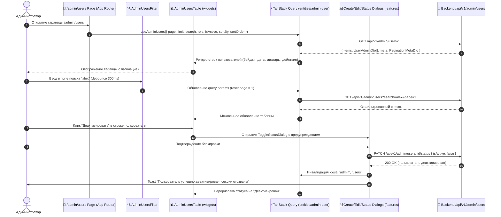

# Задачи: Фронтенд административной панели и управления пользователями (Admin Panel & Users Management UI)

Данный документ содержит детальную декомпозицию задач для реализации пользовательского интерфейса административной панели (**Admin Panel**) и раздела управления пользователями (**Users Management UI**) в приложении **`apps/web`** (Next.js App Router, архитектура **FSD**), с использованием дизайн-системы **`@packages/ui`** (`DataTable`, `Dialog`, `Badge`, `Pagination`, `Form`, `Toast`), иконок **`@packages/icons`** и интеграции с **Admin Users API**.

---

## 1. Архитектурная диаграмма взаимодействия компонентов (Admin UI Flow)



---

## 2. Структура файлов в `apps/web` (FSD методология)

```text
apps/web/src/
├── app/
│   └── (protected)/
│       └── admin/
│           ├── layout.tsx                                 # Обертка RoleBoundary(ADMIN) + админский лейаут
│           └── users/
│               ├── page.tsx                               # Страница /admin/users
│               └── [id]/
│                   └── page.tsx                           # Детальная карточка пользователя (опционально)
│
├── entities/
│   └── admin-user/
│       ├── api/
│       │   ├── admin-users.api.ts                         # Вызовы REST API (getUsers, getUser, createUser, updateUser, toggleStatus)
│       │   └── admin-users.queries.ts                     # TanStack Query хуки: useAdminUsers, useAdminUserDetail
│       ├── model/
│       │   └── types.ts                                   # Типы фильтров, таблицы, статусов
│       ├── ui/
│       │   ├── UserRoleBadge.tsx                          # Бейдж роли: "ADMIN" (фиолетовый) / "USER" (серый)
│       │   ├── UserStatusBadge.tsx                        # Бейдж статуса: "Активен" (зеленый) / "Деактивирован" (красный)
│       │   └── UserAvatarCell.tsx                         # Ячейка с аватаром, именем и username
│       └── index.ts
│
├── features/
│   ├── admin-users-filter/
│   │   ├── ui/
│   │   │   ├── AdminUsersFilter.tsx                       # Поисковая строка (debounced), селекторы роли и активности, сброс
│   │   │   └── AdminUsersFilter.test.tsx
│   │   ├── model/
│   │   │   └── useAdminUsersFilterState.ts                # Синхронизация фильтров с URLSearchParams
│   │   └── index.ts
│   │
│   ├── admin-user-create/
│   │   ├── ui/
│   │   │   ├── CreateUserDialog.tsx                       # Модальное окно создания пользователя (email, password, role, etc.)
│   │   │   └── CreateUserDialog.test.tsx
│   │   ├── model/
│   │   │   ├── useCreateUserForm.ts                       # React Hook Form + Zod валидация
│   │   │   └── useCreateUserMutation.ts                   # TanStack Mutation + toast + инвалидация кэша
│   │   └── index.ts
│   │
│   ├── admin-user-edit/
│   │   ├── ui/
│   │   │   ├── EditUserDialog.tsx                         # Модальное окно редактирования (без пароля!)
│   │   │   └── EditUserDialog.test.tsx
│   │   ├── model/
│   │   │   ├── useEditUserForm.ts
│   │   │   └── useUpdateUserMutation.ts
│   │   └── index.ts
│   │
│   ├── admin-user-status/
│   │   ├── ui/
│   │   │   ├── ToggleStatusDialog.tsx                     # Диалог подтверждения деактивации/активации
│   │   │   └── ToggleStatusDialog.test.tsx
│   │   ├── model/
│   │   │   └── useToggleStatusMutation.ts
│   │   └── index.ts
│   │
│   └── admin-user-details/
│       ├── ui/
│       │   └── UserDetailsDrawer.tsx                      # Боковой Drawer с подробной информацией о пользователе
│       └── index.ts
│
├── widgets/
│   ├── admin-header/
│   │   └── ui/
│   │       └── AdminHeader.tsx                            # Заголовок раздела, хлебные крошки, кнопка "+ Добавить пользователя"
│   │
│   ├── admin-users-table/
│   │   ├── ui/
│   │   │   ├── AdminUsersTable.tsx                        # Таблица на базе @packages/ui/DataTable
│   │   │   ├── AdminUsersTableColumns.tsx                 # Описание колонок, сортировки, форматирования дат
│   │   │   ├── AdminUsersTableRowActions.tsx              # Меню действий (DropdownMenu: Просмотр, Редактировать, Активировать/Деактивировать)
│   │   │   └── AdminUsersTable.test.tsx
│   │   └── index.ts
│   │
│   └── admin-sidebar/
│       └── ui/
│           └── AdminSidebarNav.tsx                        # Навигация панели администратора
│
└── shared/
    └── config/
        └── paths.ts                                       # Маршруты paths.admin.users, paths.admin.dashboard
```

---

## 3. Детали технического дизайна UI компонентов

### 3.1. Колонки таблицы пользователей (`AdminUsersTableColumns`)
Таблица строится с помощью `DataTable` из `@packages/ui` со следующими колонками:

| Колонка | Описание | Возможность сортировки |
| :--- | :--- | :---: |
| **Пользователь** | Аватар + `displayName` + `@username` | `sortBy=username` |
| **Email** | Почтовый адрес пользователя | `sortBy=email` |
| **Роль** | Бейдж `<UserRoleBadge>` (`ADMIN` / `USER`) | `sortBy=role` |
| **Статус** | Бейдж `<UserStatusBadge>` (`Активен` / `Деактивирован`) | `sortBy=isActive` |
| **Дата регистрации** | Форматированная дата (`dd.MM.yyyy HH:mm`) | `sortBy=createdAt` |
| **Действия** | `<DropdownMenu>`: Детали, Редактировать, Активировать/Деактивировать | — |

> [!IMPORTANT]
> **Физическое удаление пользователя (`DELETE`) отсутствует в UI.**
> В меню действий доступна только мягкая деактивация/активация. Кнопка "Удалить" не отображается.

---

### 3.2. Панель фильтрации (`AdminUsersFilter`)
1. **Поле поиска (`Input` с иконкой лупы):**
   - Placeholder: *"Поиск по email, имени или username..."*;
   - Поиск с задержкой (Debounce 300ms);
   - Автоматический сброс страницы на `page: 1` при изменении поисковой строки.
2. **Селектор роли (`Select`):**
   - Опции: *Все роли*, *USER*, *ADMIN*.
3. **Селектор статуса (`Select`):**
   - Опции: *Все статусы*, *Только активные*, *Только деактивированные*.
4. **Сортировка:**
   - Выбор поля и направления через клик по заголовкам колонок таблицы.
5. **Сброс фильтров:**
   - Кнопка "Сбросить", возвращающая значения по умолчанию.
6. **URL State Synchronization:**
   - Все параметры (`page`, `limit`, `search`, `role`, `isActive`, `sortBy`, `sortOrder`) синхронизируются с `URLSearchParams` через Next.js Router (`useSearchParams`, `useRouter`).

---

### 3.3. Модальные окна и формы

#### 1. Модалка создания (`CreateUserDialog`):
- **Поля:** `email` (input), `password` (password input с генератором/показом пароля), `role` (select: USER/ADMIN), `username` (input), `displayName` (input).
- **Валидация:** Zod-схема (`createUserAdminSchema` из `@packages/dto`).
- **После сохранения:** закрытие диалога, всплывающий toast "Пользователь успешно создан", инвалидация кэша списка.

#### 2. Модалка редактирования (`EditUserDialog`):
- **Поля:** `email`, `role`, `username`, `displayName`, `telegramUsername`, `gitUrl`.
- **Особенность:** поле пароля **отсутствует** (пароль не редактируется через общий CRUD).
- **Инвалидация:** при смене роли пользователю сбрасываются сессии (информирование админа в Toast).

#### 3. Диалог подтверждения деактивации (`ToggleStatusDialog`):
- Предупреждение:
  > *"Вы уверены, что хотите деактивировать пользователя **{email}**? Все его активные сессии будут немедленно завершены, и он потеряет доступ к платформе."*
- **Self-Lockout защита:** Если текущий авторизованный администратор (`currentUserId === targetUserId`), кнопка деактивации в интерфейсе блокируется (`disabled`) с тултипом *"Нельзя деактивировать собственный аккаунт администратора"*.

---

## 4. Чеклист реализации

### 📦 Часть 1: Слой данных и TanStack Query (`entities/admin-user`)

- [ ] **API Клиент (`entities/admin-user/api/admin-users.api.ts`):**
  - Метод `getAdminUsers(params: AdminUsersQueryParams): Promise<PaginatedResponse<UserAdminDto>>`.
  - Метод `getAdminUserById(id: string): Promise<UserAdminDetailDto>`.
  - Метод `createAdminUser(data: CreateUserAdminDto): Promise<UserAdminDto>`.
  - Метод `updateAdminUser(id: string, data: UpdateUserAdminDto): Promise<UserAdminDto>`.
  - Метод `toggleAdminUserStatus(id: string, isActive: boolean): Promise<UserAdminDto>`.
- [ ] **TanStack Query хуки (`entities/admin-user/api/admin-users.queries.ts`):**
  - Хук `useAdminUsers(params)` с поддержкой `keepPreviousData: true` (для плавной пагинации).
  - Мутации: `useCreateAdminUserMutation`, `useUpdateAdminUserMutation`, `useToggleAdminUserStatusMutation`.
  - Инвалидация ключа запроса `['admin', 'users']` при любых мутациях.
- [ ] **UI-компоненты сущности (`entities/admin-user/ui/`):**
  - `UserRoleBadge`: фиолетовый для `ADMIN`, нейтральный серый для `USER`.
  - `UserStatusBadge`: зеленый с точкой для `Активен`, красный для `Деактивирован`.
  - `UserAvatarCell`: аватар с fallback инициалами, имя и юзернейм.

---

### 🔍 Часть 2: Панель фильтрации и поиска (`features/admin-users-filter`)

- [ ] **Хук синхронизации с URL (`useAdminUsersFilterState`):**
  - Чтение и запись параметров в URL search query.
  - Поддержка быстрого копирования и шаринга ссылки с фильтрами.
- [ ] **Компонент фильтров (`AdminUsersFilter.tsx`):**
  - Debounced Input (300ms) для поиска по подстроке.
  - Select-фильтры по роли и статусу.
  - Кнопка сброса при наличии активных фильтров.
  - Написание unit-тестов `AdminUsersFilter.test.tsx`.

---

### 📊 Часть 3: Таблица пользователей и пагинация (`widgets/admin-users-table`)

- [ ] **Колонки и рендер (`AdminUsersTableColumns.tsx`):**
  - Настройка форматирования дат через `date-fns` / `Intl.DateTimeFormat`.
  - Настройка интерактивной сортировки по клику на заголовки.
- [ ] **Меню действий строки (`AdminUsersTableRowActions.tsx`):**
  - `DropdownMenu`: Просмотр информации (Drawer), Редактировать (Modal), Деактивировать / Активировать (Modal).
  - Блокировка деактивации для текущего пользователя (`currentUserId === row.id`).
- [ ] **Таблица (`AdminUsersTable.tsx`):**
  - Использование `DataTable` / `Table` из `@packages/ui`.
  - Состояния: Skeleton-загрузка при запросе, Empty-стейт "Пользователи не найдены".
  - Пагинация: выбор страницы и лимита элементов (`10, 20, 50, 100`).

---

### 🪟 Часть 4: Модальные окна действий (`features/admin-user-*`)

- [ ] **Создание пользователя (`features/admin-user-create`):**
  - Модалка `CreateUserDialog` с формой `react-hook-form` + `@hookform/resolvers/zod`.
  - Валидация пароля (мин 8 символов), уникальности email.
  - Обработка серверных ошибок (409 Conflict $\to$ подсветка поля `email`/`username`).
- [ ] **Редактирование пользователя (`features/admin-user-edit`):**
  - Модалка `EditUserDialog` с предзаполнением начальных данных пользователя.
  - Отсутствие полей пароля.
- [ ] **Управление статусом (`features/admin-user-status`):**
  - Модалка подтверждения `ToggleStatusDialog` с описанием последствий деактивации.
- [ ] **Просмотр детальной информации (`features/admin-user-details`):**
  - Компонент `UserDetailsDrawer` с датами создания, обновления, статусом, ID, соцсетями (GitHub, Telegram).

---

### 🧭 Часть 5: Сборка страницы и лейаута (`app/(protected)/admin`)

- [ ] **Админский лейаут (`app/(protected)/admin/layout.tsx`):**
  - Обертка `<RoleBoundary allowedRoles={[UserRole.ADMIN]}>`.
  - Хедер с навигацией и кнопками быстрых действий.
- [ ] **Страница пользователей (`app/(protected)/admin/users/page.tsx`):**
  - Размещение `AdminHeader`, `AdminUsersFilter` и `AdminUsersTable`.
  - Кнопка "+ Создать пользователя" в верхнем тулбаре, открывающая `CreateUserDialog`.

---

### 🧪 Часть 6: Тестирование (Vitest & Playwright E2E)

- [ ] **Unit & Component тесты (Vitest):**
  - Тест `AdminUsersTable`: корректный рендер строк, пагинации и бейджей.
  - Тест `AdminUsersFilter`: debounce поиска и вызов функции обновления параметров.
  - Тест `CreateUserDialog`: валидация обязательных полей, отправка мутации.
  - Тест `ToggleStatusDialog`: блокировка кнопки деактивации для себя.
- [ ] **E2E тесты (Playwright):**
  - Авторизация под ADMIN $\to$ переход на `/admin/users`.
  - Поиск пользователя по имени $\to$ отображение отфильтрованного результата.
  - Создание нового пользователя через диалог $\to$ проверка появления в таблице.
  - Редактирование роли пользователя $\to$ обновление бейджа на `ADMIN`.
  - Деактивация пользователя $\to$ проверка смены статуса на `Деактивирован`.
  - Попытка обычного пользователя перейти на `/admin/users` $\to$ редирект на `/dashboard`.

---

## 5. Критерии приемки (Definition of Done)

1. Страница `/admin/users` доступна только администраторам (`ADMIN`) и открывается без мерцания.
2. Таблица пользователей отображает все поля, поддерживает серверную пагинацию, сортировку и фильтрацию.
3. Поиск работает с debounce (300ms) и обновляет URL-параметры страницы.
4. Создание пользователя работает через модальное окно с Zod-валидацией.
5. Редактирование пользователя работает без раскрытия и изменения пароля.
6. Активация и деактивация работают надежно с подтверждением в диалоге; деактивация самого себя заблокирована.
7. Физическое удаление пользователей **полностью отсутствует** в интерфейсе.
8. Все мутации сопровождаются Toast-уведомлениями и автоматической инвалидацией кэша TanStack Query.
9. Все unit- и e2e-тесты проходят без ошибок (`pnpm test`, `pnpm test:e2e`).
