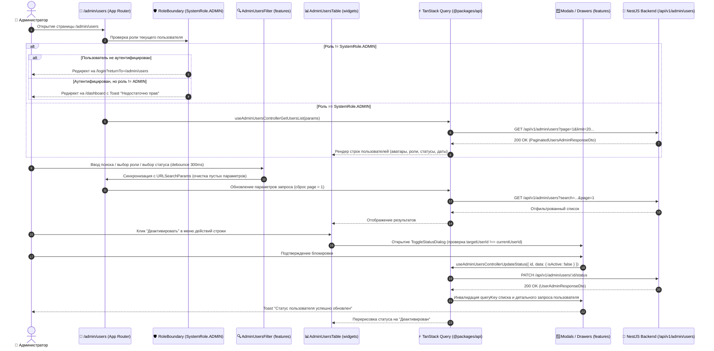

# Задачи: Фронтенд административной панели и управления пользователями (Admin Panel & Users Management UI)

Данный документ содержит детальную декомпозицию задач для реализации пользовательского интерфейса административной панели (**Admin Panel**) и раздела управления пользователями (**Users Management UI**) в приложении **`apps/web`** (Next.js App Router, архитектура **FSD**), с использованием дизайн-системы **`@packages/ui`** (`DataTable`, `Dialog`, `Badge`, `Pagination`, `Form`, `Toast`, `DropdownMenu`, `Drawer`), иконок **`@packages/icons`**, локализации **`@packages/i18n`** и типизированных хуков **`@packages/api`** (сгенерированных через Orval из OpenAPI-спецификации).

---

## 1. Архитектурная диаграмма взаимодействия компонентов (Admin UI Flow)


```mermaid
sequenceDiagram
    autonumber
    actor Admin as 👑 Администратор
    participant Page as 📄 /admin/users (App Router)
    participant RB as 🛡️ RoleBoundary (SystemRole.ADMIN)
    participant Filter as 🔍 AdminUsersFilter (features)
    participant Table as 📊 AdminUsersTable (widgets)
    participant Hooks as ⚡ TanStack Query (@packages/api)
    participant Modal as 🪟 Modals / Drawers (features)
    participant API as 🚀 NestJS Backend (/api/v1/admin/users)

    Admin->>Page: Открытие страницы /admin/users
    Page->>RB: Проверка роли текущего пользователя
    alt Роль != SystemRole.ADMIN
        alt Пользователь не аутентифицирован
            RB-->>Admin: Редирект на /login?returnTo=/admin/users
        else Аутентифицирован, но роль != ADMIN
            RB-->>Admin: Редирект на /dashboard с Toast "Недостаточно прав"
        end
    else Роль == SystemRole.ADMIN
        Page->>Hooks: useAdminUsersControllerGetUsersList(params)
        Hooks->>API: GET /api/v1/admin/users?page=1&limit=20...
        API-->>Hooks: 200 OK (PaginatedUsersAdminResponseDto)
        Hooks-->>Table: Рендер строк пользователей (аватары, роли, статусы, даты)
    end

    %% Поиск и фильтрация
    Admin->>Filter: Ввод поиска / выбор роли / выбор статуса (debounce 300ms)
    Filter->>Page: Синхронизация с URLSearchParams (очистка пустых параметров)
    Page->>Hooks: Обновление параметров запроса (сброс page = 1)
    Hooks->>API: GET /api/v1/admin/users?search=...&page=1
    API-->>Hooks: Отфильтрованный список
    Hooks-->>Table: Отображение результатов

    %% Деактивация / Активация
    Admin->>Table: Клик "Деактивировать" в меню действий строки
    Table->>Modal: Открытие ToggleStatusDialog (проверка targetUserId !== currentUserId)
    Admin->>Modal: Подтверждение блокировки
    Modal->>Hooks: useAdminUsersControllerUpdateStatus({ id, data: { isActive: false } })
    Hooks->>API: PATCH /api/v1/admin/users/:id/status
    API-->>Hooks: 200 OK (UserAdminResponseDto)
    Hooks->>Modal: Инвалидация queryKey списка и детального запроса пользователя
    Modal-->>Admin: Toast "Статус пользователя успешно обновлен"
    Hooks-->>Table: Перерисовка статуса на "Деактивирован"
```

---

## 2. Структура файлов в монорепозитории

> [!NOTE]
> В соответствии с правилами монорепозитория (`AGENTS.md`):
> 1. Прямое дублирование HTTP-клиентов запрещено: интеграция с API строится поверх типизированных хуков и моделей из **`@packages/api`** и Zod-схем **`@packages/dto`**.
> 2. Не создаётся отдельный `AdminSidebarNav`: общий шелл приложения **`@widgets/sidebar`** (`SidebarPanel`) уже содержит автоподключение группы `ADMIN_NAV_ITEMS` при роли `ADMIN`.
> 3. Компонент **`DataTable`** в `@packages/ui` дорабатывается для универсальной поддержки как клиентской, так и серверной пагинации и сортировки.

```text
packages/
├── ui/src/components/DataTable/
│   ├── types.ts                                           # Расширение DataTableProps и DataTablePaginationConfig (режимы client/server)
│   ├── data-table.tsx                                     # Поддержка server-side пагинации (без локального slice) и внешнего onSortChange
│   └── data-table.test.tsx                                # Тестирование client и server режимов пагинации
│
└── i18n/src/locales/
    ├── ru/common.json                                     # Локализация таблицы, фильтров, бейджей, диалогов и уведомлений (RU)
    └── en/common.json                                     # Локализация (EN)

apps/web/src/
├── app/
│   └── (protected)/
│       └── admin/
│           ├── layout.tsx                                 # RoleBoundary(SystemRole.ADMIN) + Sidebar (уже создан, интеграция с общим шеллом)
│           └── users/
│               ├── page.tsx                               # Страница /admin/users (Header, Filters, Table)
│               └── [id]/
│                   └── page.tsx                           # Детальная страница пользователя (опционально / drawer fallback)
│
├── entities/
│   └── admin-user/
│       ├── model/
│       │   └── types.ts                                   # Дополнительные UI-типы (колонки, локальные фильтры)
│       ├── ui/
│       │   ├── UserRoleBadge.tsx                          # Бейдж роли: SystemRole.ADMIN (accent) / SystemRole.USER (muted)
│       │   ├── UserStatusBadge.tsx                        # Бейдж статуса: "Активен" (success) / "Деактивирован" (destructive)
│       │   └── UserAvatarCell.tsx                         # Ячейка пользователя: Avatar + displayName + @username
│       └── index.ts
│
├── features/
│   ├── admin-users-filter/
│   │   ├── ui/
│   │   │   ├── AdminUsersFilter.tsx                       # Debounced поиск, селекторы SystemRole и isActive, кнопка сброса
│   │   │   └── AdminUsersFilter.test.tsx
│   │   ├── model/
│   │   │   └── useAdminUsersFilterState.ts                # Синхронизация состояния фильтров с URLSearchParams (с очисткой пустых)
│   │   └── index.ts
│   │
│   ├── admin-user-create/
│   │   ├── ui/
│   │   │   ├── CreateUserDialog.tsx                       # Модальное окно создания пользователя (email, role, username, displayName)
│   │   │   └── CreateUserDialog.test.tsx
│   │   ├── model/
│   │   │   └── useCreateUserForm.ts                       # React Hook Form + createUserAdminSchema (@packages/dto)
│   │   └── index.ts
│   │
│   ├── admin-user-edit/
│   │   ├── ui/
│   │   │   ├── EditUserDialog.tsx                         # Модальное окно редактирования (с защитой от смены собственной роли)
│   │   │   └── EditUserDialog.test.tsx
│   │   ├── model/
│   │   │   └── useEditUserForm.ts                         # React Hook Form + updateUserAdminSchema (нормализация "" -> null)
│   │   └── index.ts
│   │
│   ├── admin-user-status/
│   │   ├── ui/
│   │   │   ├── ToggleStatusDialog.tsx                     # Диалог подтверждения деактивации/активации (с Self-Lockout защитой)
│   │   │   └── ToggleStatusDialog.test.tsx
│   │   └── index.ts
│   │
│   ├── admin-user-reset-password/
│   │   ├── ui/
│   │   │   ├── ResetPasswordDialog.tsx                    # Диалог подтверждения сброса пароля (без показа пароля в UI)
│   │   │   └── ResetPasswordDialog.test.tsx
│   │   └── index.ts
│   │
│   └── admin-user-details/
│       ├── ui/
│       │   └── UserDetailsDrawer.tsx                      # Боковой Drawer с подробной статистикой (useAdminUsersControllerGetUserById)
│       └── index.ts
│
└── widgets/
    └── admin-users-table/
        ├── ui/
        │   ├── AdminUsersTable.tsx                        # Таблица на базе обновлённого @packages/ui/DataTable (mode: "server")
        │   ├── AdminUsersTableColumns.tsx                 # Описание колонок, сортировки, форматирования дат
        │   ├── AdminUsersTableRowActions.tsx              # Меню действий (DropdownMenu) с проверкой currentUserId
        │   └── AdminUsersTable.test.tsx
        └── index.ts
```

---

## 3. Детали технического дизайна компонентов

### 3.1. Универсализация `@packages/ui/DataTable` для серверной и клиентской пагинации

Для устранения бага с локальным срезом данных (`sortedData.slice`) и локальной сортировкой, компонент `DataTable` расширяется следующими свойствами:

1. **Конфигурация пагинации (`DataTablePaginationConfig`):**
   ```ts
   export interface DataTablePaginationConfig {
     /** Режим работы пагинации: 'client' (по умолчанию) или 'server'. */
     mode?: "client" | "server";
     /** Текущая страница (начиная с 1). */
     page?: number;
     /** Количество строк на странице. */
     pageSize?: number;
     /** Общее количество записей (обязательно в режиме 'server'). */
     totalItems?: number;
     /** Общее количество страниц (опционально, если передан totalItems). */
     totalPages?: number;
     /** Показывать ли селектор размера страницы (10, 20, 50, 100). */
     showPageSizeSelect?: boolean;
     /** Колбэк изменения страницы. */
     onPageChange?: (page: number) => void;
     /** Колбэк изменения размера страницы. */
     onPageSizeChange?: (pageSize: number) => void;
   }
   ```
2. **Логика рендера строк (`displayData`):**
   - Если `mode === "server"`: `displayData = data` (данные не нарезаются через `.slice()`, так как сервер уже вернул нужную страницу).
   - Если `mode === "client"`: сохраняется текущее поведение с локальным срезом.
   - Количество страниц в режиме `server` рассчитывается как `totalPages ?? Math.max(1, Math.ceil((totalItems ?? 0) / pageSize))`.
3. **Серверная сортировка (`sortState` и `onSortChange` в `DataTableProps`):**
   ```ts
   export interface DataTableProps<T extends DataTableRow = DataTableRow> {
     // ...
     /** Внешнее состояние сортировки (для контролируемого/серверного режима). */
     sortState?: DataTableSortState | null;
     /** Колбэк при клике на сортируемую колонку (для передачи параметров sortBy / sortOrder на сервер). */
     onSortChange?: (sortState: DataTableSortState | null) => void;
   }
   ```
   В режиме серверной сортировки клик по заголовку колонки вызывает `onSortChange`, а локальная сортировка через `[...filteredData].sort(...)` отключается.

---

### 3.2. Колонки таблицы пользователей (`AdminUsersTableColumns`)

Таблица строится с помощью `DataTable` из `@packages/ui` в режиме `mode: "server"`:

| Колонка | Описание / Отображение | Сортировка API |
| :--- | :--- | :---: |
| **Пользователь** | `<UserAvatarCell>`: Аватар + `displayName` + `@username` | `sortBy=username` |
| **Email** | Текстовое поле email | `sortBy=email` |
| **Роль** | `<UserRoleBadge>` (`SystemRole.ADMIN` / `SystemRole.USER`) | `sortBy=role` |
| **Статус** | `<UserStatusBadge>` (`Активен` / `Деактивирован`) | — |
| **Дата регистрации** | Форматированная дата (`dd.MM.yyyy HH:mm`) | `sortBy=createdAt` |
| **Действия** | `<DropdownMenu>`: Детали, Редактировать, Сбросить пароль, Статус | — |

> [!IMPORTANT]
> **Физическое удаление пользователя (`DELETE`) отсутствует в UI.**
> В меню действий доступна только мягкая деактивация/активация. Кнопка жесткого удаления отсутствует.

---

### 3.3. Панель фильтрации (`AdminUsersFilter`)

1. **Поле поиска (`Input` с иконкой `SearchIcon`):**
   - Placeholder из i18n (`admin.users.filters.searchPlaceholder`);
   - Debounce 300ms;
   - Автоматический сброс на `page: 1` при вводе.
2. **Селектор роли (`Select`):**
   - Опции: *Все роли*, *USER* (`SystemRole.USER`), *ADMIN* (`SystemRole.ADMIN`).
3. **Селектор статуса (`Select`):**
   - Опции: *Все статусы*, *Только активные* (`isActive=true`), *Только деактивированные* (`isActive=false`).
4. **Сортировка:**
   - Клик по заголовкам колонок таблицы переключает `sortBy` и `sortOrder` (`asc` / `desc`).
5. **Сброс фильтров:**
   - Кнопка "Сбросить", очищающая поисковые параметры до дефолтных.
6. **URL State Synchronization (`useAdminUsersFilterState`):**
   - Все параметры (`page`, `limit`, `search`, `role`, `isActive`, `sortBy`, `sortOrder`) синхронизированы с `URLSearchParams`.
   - Пустые параметры (`""`, `undefined`) удаляются из URL, не засоряя строку запроса.

---

### 3.4. Модальные окна, формы и безопасность (Self-Protection)

#### 1. Создание пользователя (`CreateUserDialog`):
- **Схема валидации:** `createUserAdminSchema` из `@packages/dto`.
- **Поля:** `email` (обязательный), `role` (`SystemRole`, default: `USER`), `username` (опционально), `displayName` (опционально).
- **Примечание:** Поле `password` **отсутствует** — сервер генерирует временный пароль самостоятельно (Zero-Knowledge).
- **Хук:** `useAdminUsersControllerCreateUser` из `@packages/api`.
- **Обработка ошибок:** 409 Conflict $\to$ подсветка полей `email` / `username`.

#### 2. Редактирование пользователя (`EditUserDialog`):
- **Схема валидации:** `updateUserAdminSchema` из `@packages/dto`.
- **Поля:** `email`, `role`, `username`, `displayName`, `telegramUsername`, `gitUrl`.
- **Защита от смены собственной роли (Self-Role Protection):** Если редактируется собственный аккаунт (`targetUserId === currentUserId`, полученный через `useSession()`), селектор роли заблокирован (`disabled`) с тултипом/сообщением: *"Нельзя изменить роль собственного аккаунта"* (соответствует валидации бэкенда).
- **Нормализация пустых строк:** Значения `telegramUsername` и `gitUrl` при очистке инпута преобразуются в `null` (`value.trim() === "" ? null : value`), чтобы пройти regex-валидацию схемы.
- **Хук:** `useAdminUsersControllerUpdateUser` из `@packages/api`.

#### 3. Управление статусом (`ToggleStatusDialog`):
- **Хук:** `useAdminUsersControllerUpdateStatus` из `@packages/api`.
- **Self-Lockout защита:** Если текущий авторизованный администратор (`currentUserId === targetUserId`), кнопка деактивации в интерфейсе заблокирована (`disabled`) с тултипом *"Нельзя деактивировать собственный аккаунт администратора"*.

#### 4. Сброс пароля администратором (`ResetPasswordDialog`):
- **Хук:** `useAdminUsersControllerResetPassword` из `@packages/api`.
- **Действие:** После подтверждения вызывает `POST /api/v1/admin/users/:id/reset-password`. Сервер генерирует временный пароль, обновляет `passwordHash` и отзывает сессии.
- **Ответ:** `UserAdminResponseDto`. Временный пароль **не возвращается** клиенту и не отображается в UI; Toast информирует об успешном сбросе.

#### 5. Детальная карточка (`UserDetailsDrawer`):
- **Хук:** `useAdminUsersControllerGetUserById` из `@packages/api`.
- **Отображение:** ID, email, username, дата создания, дата деактивации, счетчик сессий (`sessionsCount`), счетчик участий в интервью (`participationsCount`).

#### 6. Стратегия инвалидации кэша TanStack Query:
После любой мутации (`createUser`, `updateUser`, `updateStatus`, `resetPassword`) синхронно инвалидируются:
1. Кэш списка пользователей: `queryClient.invalidateQueries({ queryKey: ['/api/v1/admin/users'] })`.
2. Кэш детальной карточки пользователя (если открыт Drawer): `queryClient.invalidateQueries({ queryKey: ['/api/v1/admin/users', id] })`.

---

### 3.5. Дополнительные архитектурные и платформенные нюансы (Gotchas & Best Practices)

1. **Исключение soft-deleted пользователей (`isDeleted: false`):**
   - В бэкенде `AdminUsersService.getUsersList` при отсутствии параметра `isDeleted` выбираются все записи, включая удаленные (`deletedAt !== null`).
   - Если попытаться активировать удаленного пользователя через `updateStatus({ isActive: true })`, бэкенд возвращает ошибку `400: Cannot activate deleted user. Use restore instead`.
   - **Решение:** Хук запроса списка пользователей в таблице обязан по умолчанию передавать параметр `isDeleted: false`.

2. **Нормализация пустых строк в `CreateUserDialog`:**
   - Поля `username` и `displayName` в `createUserAdminSchema` являются опциональными, но при наличии значений строго проверяются regex (`3-30` символов) и `min(1)`.
   - Пустой ввод из HTML-инпута (`""`) вызовет сбой валидации Zod.
   - **Решение:** Пустые строки перед сабмитом приводятся к `undefined` (`username: values.username?.trim() || undefined`).

3. **Ограничение Radix UI `Select` (запрет `value=""`):**
   - Библиотека `@packages/ui/Select` построена на Radix UI, который выбрасывает рантайм-ошибку при передаче пустого значения `<Select.Item value="">`.
   - **Решение:** Для опций «Все роли» и «Все статусы» используется константа `"ALL"`, которая в хуке `useAdminUsersFilterState` преобразуется в `undefined`.

4. **Предотвращение дублирования строки поиска:**
   - Компонент `AdminUsersFilter` уже содержит поле поиска с debounce 300ms.
   - В виджете таблицы пропс `searchable` у `DataTable` обязательно выставляется в `false`, чтобы избежать рендера двух параллельных поисковых инпутов.

5. **Оптимизация рендера модальных окон (Предотвращение DOM Bloat):**
   - Рендер диалогов редактирования, смены статуса, сброса пароля и шторки деталей внутри каждой строки таблицы порождает сотни узлов в DOM (20–100 строк $\times$ 4 модалки).
   - **Решение:** Состояние активного диалога и выбранного пользователя (`activeDialog: { type: 'edit' | 'status' | 'reset' | 'details', user: UserAdminResponseDto } | null`) хранится на уровне виджета `AdminUsersTable`, а компоненты диалогов монтируются в единственном экземпляре.

6. **Предотвращение автоскролла страницы в Next.js App Router:**
   - Вызов `router.replace(url)` при вводе в поиск или переключении пагинации по умолчанию может скроллить окно наверх (`scroll: true`).
   - **Решение:** Вызывать синхронизацию параметров URL строго с флагом `{ scroll: false }`.

7. **Безопасность гидратации при форматировании дат (SSR Hydration Match):**
   - Форматирование даты `createdAt` через `Intl.DateTimeFormat` при SSR на сервере и в браузере клиента может вызывать несовпадение часовых поясов (UTC против локального пояса).
   - **Решение:** Использовать хелпер форматирования с фиксированным часовым поясом либо атрибут `suppressHydrationWarning` на контейнере даты.

8. **Конфигурация Drawer для десктопного интерфейса:**
   - По умолчанию `@packages/ui/Drawer` открывается снизу (`side="bottom"`).
   - Для детальной карточки пользователя в `UserDetailsDrawer` для `Drawer.Content` явно задаётся `side="right"` для отображения в виде боковой панели.

---

## 4. Чеклист реализации

### 🛠️ Часть 0: Доработка базовых пакетов (`@packages/ui`, `@packages/i18n`)

- [x] **Расширение `@packages/ui/DataTable`:**
  - Добавить `mode?: "client" | "server"`, `totalItems?: number`, `totalPages?: number` в `DataTablePaginationConfig`.
  - Добавить `sortState?: DataTableSortState | null` и `onSortChange?: (state: DataTableSortState | null) => void` в `DataTableProps`.
  - Отключить клиентский `slice` и клиентскую сортировку при работе в режиме `mode: "server"`.
  - Покрыть unit-тестами оба режима пагинации (`data-table.test.tsx`).
- [x] **Локализация `@packages/i18n`:**
  - Добавить секцию `admin.users.*` в `packages/i18n/src/locales/ru/common.json` и `packages/i18n/src/locales/en/common.json` (заголовки колонок, статусы, бейджи, кнопки, плейсхолдеры, диалоговые окна, тосты).

---

### 📦 Часть 1: Сущность пользователя (`entities/admin-user`)

- [x] **UI-компоненты сущности (`entities/admin-user/ui/`):**
  - `UserRoleBadge`: акцентный фиолетовый для `SystemRole.ADMIN`, нейтральный серый для `SystemRole.USER`.
  - `UserStatusBadge`: зеленый для `Активен`, деструктивный красный для `Деактивирован`.
  - `UserAvatarCell`: аватар с инициалами-фоллбэком, отображаемое имя и `@username`.

---

### 🔍 Часть 2: Фильтрация и URL-синхронизация (`features/admin-users-filter`)

- [x] **Хук состояния фильтрации (`useAdminUsersFilterState`):**
  - Чтение и запись `page`, `limit`, `search`, `role`, `isActive`, `sortBy`, `sortOrder`.
  - Очистка пустых значений из строки запроса (`clean URL`).
  - Передача `{ scroll: false }` при `router.replace` для предотвращения автоскролла страницы наверх при вводе в поиск и пагинации.
  - Маппинг sentinel-значения `"ALL"` в `undefined` для корректной работы с Radix UI Select.
- [x] **Компонент фильтров (`AdminUsersFilter.tsx`):**
  - Поисковый Input с debounce 300ms.
  - Селекторы роли (`SystemRole`) и активности (`isActive`) с использованием `value="ALL"` вместо запрещенного в Radix UI `value=""`.
  - Кнопка сброса фильтров.
  - Unit-тесты `AdminUsersFilter.test.tsx`.

---

### 📊 Часть 3: Таблица пользователей (`widgets/admin-users-table`)

- [ ] **Конфигурация колонок (`AdminUsersTableColumns.tsx`):**
  - Интерактивная сортировка по клику (`sortBy`, `sortOrder`).
  - Форматирование дат через `@packages/utils` / `Intl.DateTimeFormat` с защитой от SSR Hydration Mismatch (`suppressHydrationWarning` или фиксированный часовой пояс).
- [ ] **Меню действий строки (`AdminUsersTableRowActions.tsx`):**
  - Кнопка вызова действий (DropdownMenu) без монтирования диалогов внутри каждой строки: передача событий открытия наружу (`onAction(type, user)`).
  - Блокировка пункта деактивации для текущего пользователя (`currentUserId === row.id`).
- [ ] **Виджет таблицы (`AdminUsersTable.tsx`):**
  - Интеграция с `useAdminUsersControllerGetUsersList` с обязательной передачей `isDeleted: false` по умолчанию (исключение soft-deleted пользователей).
  - Интеграция с `DataTable` в режиме `mode: "server"` с явным отключением встроенного поиска (`searchable={false}`).
  - Централизованное состояние активного действия на уровне таблицы (`activeDialog: { type, user } | null`) — монтирование диалогов в единственном экземпляре для предотвращения DOM Bloat.
  - Отображение состояний: загрузка (Skeleton), пустой результат (Empty state), ошибка (Error state с кнопкой повтора).
  - Серверная пагинация с выбором лимита строк (`10, 20, 50, 100`).
  - Unit-тесты `AdminUsersTable.test.tsx`.

---

### 🪟 Часть 4: Диалоговые окна и Drawer (`features/admin-user-*`)

- [ ] **Создание пользователя (`features/admin-user-create`):**
  - `CreateUserDialog` с `react-hook-form` + `createUserAdminSchema` (без поля пароля).
  - Нормализация пустых строк: опциональные поля `username` и `displayName` при отсутствии ввода преобразуются в `undefined`, предотвращая ошибку Zod-валидации.
  - Мутация `useAdminUsersControllerCreateUser`, обработка 409 Conflict.
- [ ] **Редактирование пользователя (`features/admin-user-edit`):**
  - `EditUserDialog` с `updateUserAdminSchema`.
  - Блокировка смены роли при `row.id === currentUserId` (Self-Role Protection).
  - Нормализация пустых полей `telegramUsername` и `gitUrl` в `null`.
  - Мутация `useAdminUsersControllerUpdateUser`.
- [ ] **Управление статусом (`features/admin-user-status`):**
  - `ToggleStatusDialog` с подтверждением и блокировкой деактивации себя (Self-Lockout Protection).
  - Мутация `useAdminUsersControllerUpdateStatus`.
- [ ] **Сброс пароля (`features/admin-user-reset-password`):**
  - `ResetPasswordDialog` с подтверждением.
  - Мутация `useAdminUsersControllerResetPassword` (без показа временного пароля в UI).
- [ ] **Детальная информация (`features/admin-user-details`):**
  - `UserDetailsDrawer` с хуком `useAdminUsersControllerGetUserById`.
  - Явное указание `side="right"` для отображения боковой панели на десктопе.
- [ ] **Инвалидация кэша TanStack Query:**
  - Инвалидация списка `['/api/v1/admin/users']` и деталей пользователя `['/api/v1/admin/users', id]`.

---

### 🧭 Часть 5: Страница и лейаут (`app/(protected)/admin`)

- [ ] **Административный лейаут (`app/(protected)/admin/layout.tsx`):**
  - Сохранение существующей проверки `<RoleBoundary allowedRoles={[SystemRole.ADMIN]}>` (уже протестирована в `admin-routing.test.tsx`).
  - Интеграция в стандартный каркас `<Sidebar headerActions={<NotificationBell />}>`.
- [ ] **Страница пользователей (`app/(protected)/admin/users/page.tsx`):**
  - Заголовок с кнопкой "+ Добавить пользователя".
  - Размещение `AdminUsersFilter` и `AdminUsersTable`.

---

### 🧪 Часть 6: Тестирование (Vitest & Playwright)

- [ ] **Unit & Component тесты (Vitest):**
  - `DataTable`: корректная работа в режимах `client` и `server`.
  - `AdminUsersTable`: рендер строк, серверная пагинация, вызов сортировки, передача `isDeleted: false`, отсутствие дублирования поиска.
  - `AdminUsersFilter`: debounce поиска, сброс параметров, работа sentinel `"ALL"`, обновление URL с `{ scroll: false }`.
  - `CreateUserDialog`: валидация по Zod без пароля, нормализация пустых строк `"" -> undefined`.
  - `EditUserDialog`: блокировка изменения роли собственного аккаунта.
  - `ToggleStatusDialog`: блокировка деактивации собственного аккаунта.
  - `UserDetailsDrawer`: открытие справа (`side="right"`), отображение данных.
- [ ] **E2E тесты (Playwright):**
  - Полный сценарий управления пользователями под ролью `ADMIN`.
  - Проверка защиты от доступа пользователя с ролью `USER` (редирект / 403).

---

## 5. Критерии приемки (Definition of Done)

1. Раздел `/admin/users` доступен исключительно пользователям с ролью `SystemRole.ADMIN`.
2. Компонент `DataTable` поддерживает режим `mode: "server"`, сохраняя обратную совместимость для всех существующих мест с `mode: "client"`.
3. Таблица отображает данные из контракта `UserAdminResponseDto` с серверной пагинацией, серверной сортировкой и поиском.
4. Запрос пользователей по умолчанию исключает удалённые записи (`isDeleted: false`).
5. Поиск работает с debounce (300ms) и синхронизируется с `URLSearchParams` без пустых параметров в URL и без скролла окна наверх (`{ scroll: false }`).
6. Селекторы Radix UI не используют `value=""` (используется sentinel `"ALL"`).
7. `searchable={false}` задан в `DataTable` таблицы для исключения двух полей поиска.
8. Состояние модалок вынесено на уровень виджета таблицы, исключая раздувание DOM (DOM Bloat).
9. Создание пользователя валидируется через `createUserAdminSchema` (пароль генерируется сервером, пустые строки нормализуются в `undefined`).
10. Редактирование пользователя валидируется через `updateUserAdminSchema`, пустые опциональные поля нормализуются в `null`.
11. Защита Self-Protection работает на обоих уровнях: деактивация себя и смена роли собственной учетной записи заблокированы на UI и API уровнях.
12. Физическое удаление пользователей (`DELETE`) полностью отсутствует в UI.
13. `UserDetailsDrawer` открывается с правой стороны (`side="right"`).
14. Форматирование дат защищено от ошибок SSR-гидратации.
15. Все строковые литералы вынесены в `@packages/i18n` (`ru` и `en`).
16. Все мутации сопровождаются Toast-уведомлениями и инвалидацией запросов списка и конкретного пользователя.
17. Все unit- и e2e-тесты проходят без ошибок (`pnpm test`, `pnpm lint`).
