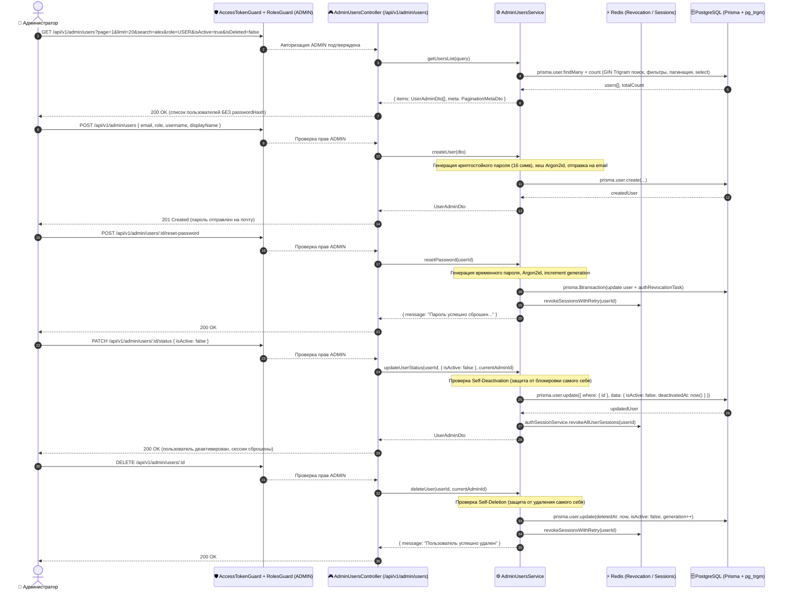

# Задачи: API управления пользователями (CRUD, фильтрация, пагинация, активация/деактивация)

Данный документ содержит детальную декомпозицию задач для создания административного API управления пользователями (**Admin Users Management API**) в **`apps/api`**, схем DTO и валидации в **`packages/dto`**, общих типов в **`packages/types`**, а также интеграции с ролевой моделью RBAC (`@Roles(UserRole.ADMIN)`) и защитой сессий.

---

## 1. Архитектурная диаграмма взаимодействия (Admin Users Management Flow)



---

## 2. Структура файлов в монорепозитории

```text
MockInterviewAI/
├── packages/
│   ├── types/
│   │   └── src/
│   │       ├── user.ts                        # Типы статусов пользователя (UserStatus, UserAdminView)
│   │       └── pagination.ts                  # Общий тип пагинации PaginationMeta, PaginatedResponse<T>
│   │
│   └── dto/
│       └── src/
│           ├── admin/
│           │   ├── admin-users-query.dto.ts   # Zod-схема и DTO query-параметров: page, limit, search, role, isActive, isDeleted, sortBy, sortOrder
│           │   ├── create-user-admin.dto.ts   # Zod-схема создания пользователя админом (БЕЗ пароля - Zero-Knowledge)
│           │   ├── update-user-admin.dto.ts   # Zod-схема обновления полей и роли (с валидацией email)
│           │   ├── user-status-admin.dto.ts   # Zod-схема изменения статуса (isActive: boolean)
│           │   ├── user-admin-response.dto.ts # DTO ответа пользователя (без passwordHash, с ISO-датами и deletedAt)
│           │   └── index.ts
│           └── index.ts
│
└── apps/api/
    ├── prisma/
    │   ├── schema.prisma                      # Поля isActive, deactivatedAt, generation, deletedAt
    │   └── migrations/
    │       ├── 20260914150000_add_generation_fields/
    │       └── 20260914160000_add_trigram_search_indices/ # pg_trgm + GIN индексы
    │
    ├── src/
    │   ├── common/
    │   │   └── constants/
    │   │       └── user-select.constants.ts   # Безопасный селектор USER_ADMIN_SELECT (строго без passwordHash)
    │   │
    │   └── modules/
    │       ├── admin/
    │       │   ├── admin.module.ts            # Модуль административной панели
    │       │   ├── controllers/
    │       │   │   ├── admin-users.controller.ts      # REST-эндпоинты /api/v1/admin/users
    │       │   │   └── admin-users.controller.spec.ts # Unit-тесты контроллера
    │       │   └── services/
    │       │       ├── admin-users.service.ts         # Бизнес-логика CRUD, сброса пароля, восстановления, Trigram поиска
    │       │       └── admin-users.service.spec.ts    # Unit-тесты сервиса
    │       │
    │       └── auth/
    │           └── auth.service.ts            # Проверка флага isActive при авторизации (блокировка входа деактивированным)
    │
    └── test/
        └── admin-users.e2e-spec.ts            # E2E-тесты: пагинация, поиск, CRUD, сброс пароля, удаление/восстановление
```

---

## 3. Детали технического дизайна и спецификация API

### 3.1. Изменения в Prisma Schema
> [!IMPORTANT]
> **Физическое удаление пользователей (`HARD DELETE`) категорически запрещено.**
> Для ограничения доступа используется мягкая деактивация (`isActive: false` и фиксация даты `deactivatedAt`).

```prisma
model User {
  id               String    @id @default(uuid()) @db.Uuid
  email            String    @unique
  passwordHash     String
  role             UserRole  @default(USER)
  isActive         Boolean   @default(true)
  deactivatedAt    DateTime?
  displayName      String?
  username         String?   @unique
  avatarUrl        String?
  telegramUsername String?
  gitUrl           String?
  deletedAt        DateTime?
  generation       Int       @default(1)
  createdAt        DateTime  @default(now())
  updatedAt        DateTime  @updatedAt

  notifications    Notification[]
  sessions         InterviewSession[]
  participations   InterviewParticipant[]

  @@map("users")
  @@index([username])
  @@index([role])
  @@index([isActive])
  @@index([deletedAt])
  @@index([createdAt])
}
```

---

### 3.2. Спецификация эндпоинтов `/api/v1/admin/users`

Все эндпоинты требуют аутентификации и роли администратора: `@Roles(UserRole.ADMIN)` + `@ApiBearerAuth()`.

#### 1. `GET /api/v1/admin/users` — Список пользователей с фильтрацией и пагинацией
- **Query параметры (`AdminUsersQueryDto`):**
  - `page`: `number` (опционально, default: `1`, min: `1`);
  - `limit`: `number` (опционально, default: `20`, min: `1`, max: `100`);
  - `search`: `string` (опционально, поиск без учета регистра по `email`, `username`, `displayName` с поддержкой Trigram GIN-индексов);
  - `role`: `UserRole` (`USER` | `ADMIN`, опционально);
  - `isActive`: `boolean` (опционально, `z.union([z.boolean(), z.enum(["true", "false"])]).transform(...)`);
  - `isDeleted`: `boolean` (опционально, фильтр по удаленным `deletedAt !== null` / активным `deletedAt === null`);
  - `sortBy`: `createdAt` | `email` | `username` | `displayName` | `role` | `updatedAt` (default: `createdAt`);
  - `sortOrder`: `asc` | `desc` (default: `desc`).
- **Ответ (200 OK):**
  ```json
  {
    "items": [
      {
        "id": "a0eebc99-9c0b-4ef8-bb6d-6bb9bd380a11",
        "email": "user@example.com",
        "username": "alex_dev",
        "displayName": "Alex Developer",
        "role": "USER",
        "isActive": true,
        "deactivatedAt": null,
        "avatarUrl": "https://s3.storage.com/avatars/alex.png",
        "telegramUsername": "alex_tg",
        "gitUrl": "https://github.com/alexdev",
        "deletedAt": null,
        "createdAt": "2026-09-01T10:00:00.000Z",
        "updatedAt": "2026-09-10T12:00:00.000Z"
      }
    ],
    "meta": {
      "total": 142,
      "page": 1,
      "limit": 20,
      "totalPages": 8,
      "hasNextPage": true,
      "hasPreviousPage": false
    }
  }
  ```

---

#### 2. `GET /api/v1/admin/users/:id` — Детальная информация о пользователе
- **URL Params:** `id` (UUID пользователя).
- **Ответ (200 OK):** `UserAdminResponseDto` (базовая инфо, статус активности, статус удаления, социальные профили).
- **Ошибки:** `404 Not Found` если пользователь не существует.

---

#### 3. `POST /api/v1/admin/users` — Создание нового пользователя администратором (Zero-Knowledge)
> [!IMPORTANT]
> **Zero-Knowledge парольная политика:** Администратор **не задает пароль** вручную.
> Поле `password` исключено из `CreateUserAdminDto`. Сервер генерирует криптографически стойкий временный пароль (16 символов, алфавит: `a-zA-Z0-9!@#$%^&*`), хеширует его через Argon2id, а сам пароль отправляет на email пользователя.

- **Body (`CreateUserAdminDto`):**
  - `email`: `string` (валидация: `.min(1, "Email обязателен").pipe(z.email("Некорректный email")).transform(normalizeEmail)`);
  - `role`: `UserRole` (опционально, default: `USER`);
  - `username`: `string` (опционально, 3-30 символов, `^[a-zA-Z0-9_-]+$`);
  - `displayName`: `string` (опционально, 1-100 символов);
  - `isActive`: `boolean` (опционально, default: `true`).
- **Ответ (201 Created):** `UserAdminResponseDto` (`passwordHash` **строго исключен**).
- **Ошибки:** `409 Conflict` (если `email` или `username` уже заняты).

---

#### 4. `PATCH /api/v1/admin/users/:id` — Обновление данных и роли пользователя
- **Body (`UpdateUserAdminDto`):**
  - `email?`: `string` (валидация: `.pipe(z.email("Некорректный email")).transform(normalizeEmail)`);
  - `displayName?`: `string | null`;
  - `username?`: `string | null`;
  - `role?`: `UserRole`;
  - `avatarUrl?`: `string | null`;
  - `telegramUsername?`: `string | null`;
  - `gitUrl?`: `string | null`.
- **Бизнес-правила и безопасность:**
  1. **Self-Role Modification Guard:** Администратор не может изменить свою собственную роль (`currentAdminId === id && roleChanged` $\to$ `400 Bad Request` `"Cannot change own administrator role"`).
  2. **Инвалидация сессий:** При изменении учетных данных (`role`, `email`, `username`, включая сброс `username: null`) инкрементируется `generation: { increment: 1 }` и вызывается немедленный отзыв сессий в Redis (`revokeSessionsWithRetry`).
  3. **Очистка S3:** При замене или удалении аватара старый файл удаляется из S3 хранилища (`storageService.deleteFile`).
- **Ответ (200 OK):** `UserAdminResponseDto`.

---

#### 5. `PATCH /api/v1/admin/users/:id/status` — Активация / Деактивация пользователя
- **Body (`UserStatusAdminDto`):**
  - `isActive`: `boolean` (обязательное).
- **Бизнес-правила и безопасность:**
  1. **Self-Deactivation Protection:** Администратор не может деактивировать сам себя (проверка `currentAdminId === targetUserId` $\to$ `400 Bad Request`).
  2. **При деактивации (`isActive: false`):**
     - Поле `isActive` устанавливается в `false`, `deactivatedAt` устанавливается в `new Date()`.
     - Вызывается инвалидация всех сессий пользователя в Redis (`authSessionService.revokeAllUserSessions(userId)`).
  3. **При повторной активации (`isActive: true`):**
     - Поле `isActive` устанавливается в `true`, `deactivatedAt` сбрасывается в `null`.
  4. **Авторизация деактивированного пользователя:** В `AuthService.login` и `AuthService.refreshSession` проверка: если `!user.isActive`, возвращается единый generic `401 Unauthorized` ("Invalid credentials") для предотвращения перечисления пользователей (anti-enumeration, CWE-204).
- **Ответ (200 OK):** `UserAdminResponseDto`.

---

#### 6. `POST /api/v1/admin/users/:id/reset-password` — Сброс пароля пользователя
- **URL Params:** `id` (UUID пользователя).
- **Поведение:**
  - Сервер генерирует случайный 16-значный временный пароль;
  - Хеширует через Argon2id и обновляет в БД с инкрементом `generation: { increment: 1 }`;
  - Немедленно отзывает все активные сессии пользователя в Redis;
  - Отправляет временный пароль на почту пользователя.
- **Ответ (200 OK):** `{ "message": "Пароль успешно сброшен и отправлен пользователю" }`.

---

#### 7. `DELETE /api/v1/admin/users/:id` — Мягкое удаление пользователя
- **URL Params:** `id` (UUID пользователя).
- **Бизнес-правила и безопасность:**
  1. **Self-Deletion Guard:** Администратор не может удалить сам себя (`currentAdminId === id` $\to$ `400 Bad Request` `"Cannot delete own administrator account"`).
  2. **Мягкое удаление:** Устанавливает `deletedAt: new Date()`, `isActive: false`, инкрементирует `generation` и отзывает все активные сессии пользователя в Redis.
- **Ответ (200 OK):** `{ "message": "Пользователь успешно удален" }`.

---

#### 8. `POST /api/v1/admin/users/:id/restore` — Восстановление пользователя
- **URL Params:** `id` (UUID пользователя).
- **Поведение:**
  - Проверяет наличие пользователя; если аккаунт не был удален (`deletedAt === null`), возвращает `400 Bad Request` `"User is not deleted"`;
  - Сбрасывает `deletedAt: null` и восстанавливает активность `isActive: true`.
- **Ответ (200 OK):** `UserAdminResponseDto`.

---

### 3.3. Гарантия безопасности: Исключение `passwordHash`

Для исключения утечки хешей паролей на уровне архитектуры:
1. В слое доступа к данным объявляется константа селектора Prisma:
```typescript
export const USER_ADMIN_SELECT = {
  id: true,
  email: true,
  username: true,
  displayName: true,
  role: true,
  isActive: true,
  deactivatedAt: true,
  avatarUrl: true,
  telegramUsername: true,
  gitUrl: true,
  deletedAt: true,
  createdAt: true,
  updatedAt: true,
} as const;
```
2. Все запросы в `AdminUsersService` (`findMany`, `findUnique`, `create`, `update`, `restore`) используют `select: USER_ADMIN_SELECT`.
3. Схемы DTO в `packages/dto` строго типизированы через Zod и не содержат полей `passwordHash` или `password` в схемах ответов.

---

## 4. Чеклист реализации

### 📦 Часть 1: Схемы DTO и типы (`packages/types`, `packages/dto`)

- [x] **Общие типы пагинации (`packages/types`):**
  - Интерфейс `PaginationMeta` (`total`, `page`, `limit`, `totalPages`, `hasNextPage`, `hasPreviousPage`).
  - Обобщенный тип `PaginatedResponse<T>`.
- [x] **Zod-схемы и DTO (`packages/dto/src/admin`):**
  - `adminUsersQuerySchema` и `AdminUsersQueryDto` (строгая валидация `page`, `limit`, `isActive`, `isDeleted`, `search`, `role`, `sortBy`, `sortOrder`).
  - `createUserAdminSchema` (Zero-Knowledge: БЕЗ пароля, валидация email `.pipe(z.email("Некорректный email"))`).
  - `updateUserAdminSchema` (обновление полей профиля и роли).
  - `userStatusAdminSchema` (изменение статуса `isActive: boolean`).
  - `userAdminResponseSchema` (ISO-даты `z.iso.datetime()`, включено поле `deletedAt`).
  - Экспорт DTO и схем в `packages/dto/src/index.ts`.

---

### 🗄️ Часть 2: Схема базы данных и миграции (`apps/api/prisma`)

- [x] **Добавление полей и индексов в `schema.prisma`:**
  - `isActive Boolean @default(true)`.
  - `deactivatedAt DateTime?`.
  - `deletedAt DateTime?`.
  - `generation Int @default(1)`.
  - Индексы `@@index([isActive])`, `@@index([deletedAt])`, `@@index([createdAt])`.
- [x] **Миграции БД:**
  - `20260914150000_add_generation_fields`: добавление столбцов `generation` в таблицы `users` и `auth_revocation_tasks`.
  - `20260914160000_add_trigram_search_indices`: подключение `pg_trgm` и GIN-индексов для `email`, `username`, `displayName`.

---

### 🚀 Часть 3: Сервисный слой бэкенда (`AdminUsersService`)

- [x] **Реализация метода `getUsersList(query: AdminUsersQueryDto)`:**
  - Оптимизированный поиск через `ILIKE` и Trigram-индексы;
  - Фильтры по `role`, `isActive`, `isDeleted` (`deletedAt: null / not: null`);
  - Параллельный `prisma.$transaction([findMany, count])` с пагинацией и `USER_ADMIN_SELECT`.
- [x] **Реализация метода `getUserById(id: string)`:**
  - Поиск через `USER_ADMIN_SELECT`, выброс `NotFoundException` при отсутствии.
- [x] **Реализация метода `createUser(dto: CreateUserAdminDto)`:**
  - Zero-Knowledge: генерация криптостойкого пароля (16 символов) на сервере;
  - Хеширование через Argon2id;
  - Отправка пароля на email пользователя;
  - Создание записи с `USER_ADMIN_SELECT`.
- [x] **Реализация метода `updateUser(id: string, dto: UpdateUserAdminDto, currentAdminId: string)`:**
  - Self-Role Guard: запрет смены роли самому себе;
  - Отзыв сессий и инкремент `generation` при изменении учетных данных (`role`, `email`, `username`);
  - Очистка старого аватара в S3 через `storageService.deleteFile`.
- [x] **Реализация метода `updateStatus(id: string, dto: UserStatusAdminDto, currentAdminId: string)`:**
  - Self-Deactivation Guard: запрет блокировки самого себя;
  - Установка `isActive` / `deactivatedAt` и отзыв активных сессий в Redis.
- [x] **Реализация метода `resetPassword(id: string)`:**
  - Генерация 16-значного временного пароля, хеш Argon2id, инкремент `generation`, отзыв сессий и отправка на email.
- [x] **Реализация методов `deleteUser(id: string, currentAdminId: string)` и `restoreUser(id: string)`:**
  - Self-Deletion Guard при удалении;
  - Мягкое удаление (`deletedAt = now()`, `isActive = false`, отзыв сессий);
  - Восстановление (`deletedAt = null`, `isActive = true`).
- [x] **Unit-тесты `admin-users.service.spec.ts` (100% прохождение).**

---

### 🎮 Часть 4: Контроллер и модуль (`AdminUsersController` & `AdminModule`)

- [x] **Контроллер `AdminUsersController` (`/api/v1/admin/users`):**
  - `GET /` — пагинированный список с фильтрами (`isDeleted`, `isActive`, `role`, `search`);
  - `GET /:id` — детальный просмотр пользователя;
  - `POST /` — создание пользователя (Zero-Knowledge);
  - `PATCH /:id` — редактирование профиля и роли (с `currentAdminId`);
  - `PATCH /:id/status` — активация / деактивация (с `currentAdminId`);
  - `POST /:id/reset-password` — сброс пароля;
  - `DELETE /:id` — мягкое удаление (с `currentAdminId`);
  - `POST /:id/restore` — восстановление.
- [x] **Unit-тесты `admin-users.controller.spec.ts`.**

---

### 🔒 Часть 5: Блокировка деактивированных пользователей в Auth-модуле

- [x] **Проверка `isActive` в `AuthService`:**
  - При логине (`loginByPassword`, `loginByGithub`, `loginByTelegram`): если `!user.isActive`, возвращается generic `401 Unauthorized` ("Invalid credentials", CWE-204).
  - При `refreshSession`: проверка актуального флага `isActive` и `generation`.

---

### 📜 Часть 6: OpenAPI / Swagger документация

- [x] **Swagger аннотации и генерация клиента:**
  - Подробные описания всех 8 эндпоинтов, параметров и DTO схем.
  - Автоматическая кодогенерация `@packages/api` через `pnpm codegen`.

---

### 🧪 Часть 7: E2E Тестирование (`apps/api/test/admin-users.e2e-spec.ts`)

- [x] **E2E сценарии:**
  - RBAC: 401 для анонимов, 403 для `role: USER`, 200 для `role: ADMIN`;
  - Пагинация, фильтрация по `isDeleted`, Trigram поиск;
  - Создание пользователя без пароля в DTO (пароль генерируется и хешируется);
  - Сброс пароля с генерацией временного пароля;
  - Self-Protection: попытка сменить свою роль $\to$ 400; деактивировать себя $\to$ 400; удалить себя $\to$ 400;
  - Мягкое удаление и восстановление аккаунта.

---

## 5. Критерии приемки (Definition of Done)

1. Эндпоинты `/api/v1/admin/users` доступны **исключительно** администраторам (`@Roles(UserRole.ADMIN)`).
2. Парольная политика соответствует Zero-Knowledge: администратор не передает и не видит пароли пользователей.
3. Валидация email единообразна и содержит понятные русскоязычные сообщения об ошибках.
4. Поиск пользователей ускорен через PostgreSQL Trigram GIN-индексы (`pg_trgm`).
5. Сессии пользователя немедленно отзываются в Redis при деактивации, удалении, сбросе пароля или смене учетных данных.
6. Действуют защитные механизмы от действий администратора над своим собственным аккаунтом (Self-Role, Self-Deactivation, Self-Deletion).
7. Все unit- и e2e-тесты монорепозитория успешно проходят.
