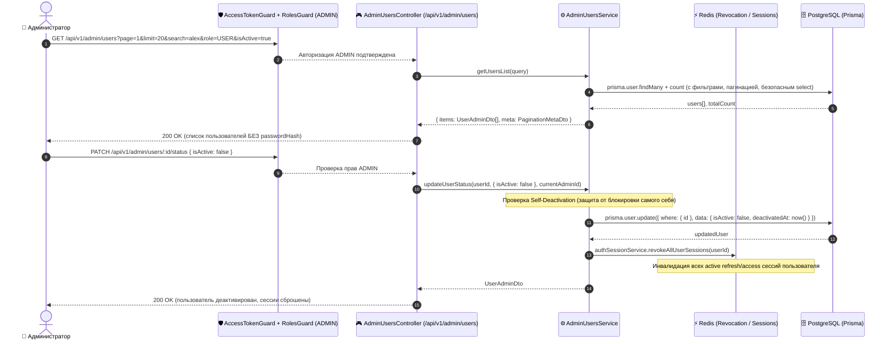

# Задачи: API управления пользователями (CRUD, фильтрация, пагинация, активация/деактивация)

Данный документ содержит детальную декомпозицию задач для создания административного API управления пользователями (**Admin Users Management API**) в **`apps/api`**, схем DTO и валидации в **`packages/dto`**, общих типов в **`packages/types`**, а также интеграции с ролевой моделью RBAC (`@Roles(UserRole.ADMIN)`) и защитой сессий.

---

## 1. Архитектурная диаграмма взаимодействия (Admin Users Management Flow)



---

## 2. Структура файлов в монорепозитории

```text
MockInterviewAI/
├── packages/
│   ├── types/
│   │   └── src/
│   │       ├── user.ts                        # Типы статусов пользователя (UserStatus, UserAdminView)
│   │       └── pagination.ts                  # Общий тип пагинации PaginationMeta, PaginatedResponse<T>
│   │
│   └── dto/
│       └── src/
│           ├── admin/
│           │   ├── admin-users-query.dto.ts   # Zod-схема и DTO query-параметров: page, limit, search, role, isActive, sortBy, sortOrder
│           │   ├── create-user-admin.dto.ts   # Zod-схема создания пользователя админом
│           │   ├── update-user-admin.dto.ts   # Zod-схема обновления полей и роли
│           │   ├── user-status-admin.dto.ts   # Zod-схема изменения статуса (isActive: boolean)
│           │   ├── user-admin-response.dto.ts # DTO ответа пользователя (без passwordHash)
│           │   └── index.ts
│           └── index.ts
│
└── apps/api/
    ├── prisma/
    │   ├── schema.prisma                      # Добавление полей isActive: Boolean @default(true), deactivatedAt: DateTime?
    │   └── migrations/
    │       └── YYYYMMDDHHMMSS_add_user_active_status/
    │
    ├── src/
    │   ├── common/
    │   │   └── constants/
    │   │       └── user-select.constants.ts   # Безопасный селектор USER_ADMIN_SELECT (строго без passwordHash)
    │   │
    │   └── modules/
    │       ├── admin/
    │       │   ├── admin.module.ts            # Модуль административной панели
    │       │   ├── controllers/
    │       │   │   ├── admin-users.controller.ts      # REST-эндпоинты /api/v1/admin/users
    │       │   │   └── admin-users.controller.spec.ts # Unit-тесты контроллера
    │       │   └── services/
    │       │       ├── admin-users.service.ts         # Бизнес-логика CRUD, пагинации, фильтрации, сброса сессий
    │       │       └── admin-users.service.spec.ts    # Unit-тесты сервиса
    │       │
    │       └── auth/
    │           └── auth.service.ts            # Проверка флага isActive при авторизации (блокировка входа деактивированным)
    │
    └── test/
        └── admin-users.e2e-spec.ts            # E2E-тесты: пагинация, поиск, CRUD, защита пароля, деактивация + 403/401
```

---

## 3. Детали технического дизайна и спецификация API

### 3.1. Изменения в Prisma Schema
> [!IMPORTANT]
> **Физическое удаление пользователей (`HARD DELETE`) категорически запрещено.**
> Для ограничения доступа используется мягкая деактивация (`isActive: false` и фиксация даты `deactivatedAt`).

```prisma
model User {
  id               String    @id @default(uuid()) @db.Uuid
  email            String    @unique
  passwordHash     String
  role             UserRole  @default(USER)
  isActive         Boolean   @default(true)
  deactivatedAt    DateTime?
  displayName      String?
  username         String?   @unique
  avatarUrl        String?
  telegramUsername String?
  gitUrl           String?
  deletedAt        DateTime?
  createdAt        DateTime  @default(now())
  updatedAt        DateTime  @updatedAt

  notifications    Notification[]
  sessions         InterviewSession[]
  participations   InterviewParticipant[]

  @@map("users")
  @@index([username])
  @@index([role])
  @@index([isActive])
  @@index([deletedAt])
  @@index([createdAt])
}
```

---

### 3.2. Спецификация эндпоинтов `/api/v1/admin/users`

Все эндпоинты требуют аутентификации и роли администратора: `@Roles(UserRole.ADMIN)` + `@ApiBearerAuth()`.

#### 1. `GET /api/v1/admin/users` — Список пользователей с фильтрацией и пагинацией
- **Query параметры (`AdminUsersQueryDto`):**
  - `page`: `number` (опционально, default: `1`, min: `1`);
  - `limit`: `number` (опционально, default: `20`, min: `1`, max: `100`);
  - `search`: `string` (опционально, поиск без учета регистра по `email`, `username`, `displayName`);
  - `role`: `UserRole` (`USER` | `ADMIN`, опционально);
  - `isActive`: `boolean` (опционально, фильтр активных / деактивированных);
  - `sortBy`: `createdAt` | `email` | `username` | `displayName` | `role` | `updatedAt` (default: `createdAt`);
  - `sortOrder`: `asc` | `desc` (default: `desc`).
- **Ответ (200 OK):**
  ```json
  {
    "items": [
      {
        "id": "a0eebc99-9c0b-4ef8-bb6d-6bb9bd380a11",
        "email": "user@example.com",
        "username": "alex_dev",
        "displayName": "Alex Developer",
        "role": "USER",
        "isActive": true,
        "deactivatedAt": null,
        "avatarUrl": "https://s3.storage.com/avatars/alex.png",
        "telegramUsername": "alex_tg",
        "gitUrl": "https://github.com/alexdev",
        "createdAt": "2026-09-01T10:00:00.000Z",
        "updatedAt": "2026-09-10T12:00:00.000Z"
      }
    ],
    "meta": {
      "total": 142,
      "page": 1,
      "limit": 20,
      "totalPages": 8,
      "hasNextPage": true,
      "hasPreviousPage": false
    }
  }
  ```

---

#### 2. `GET /api/v1/admin/users/:id` — Детальная информация о пользователе
- **URL Params:** `id` (UUID пользователя).
- **Ответ (200 OK):** `UserAdminDetailResponseDto` (базовая инфо + статистика: количество проведенных сессий, дата последней активности).
- **Ошибки:** `404 Not Found` если пользователь не существует.

---

#### 3. `POST /api/v1/admin/users` — Создание нового пользователя администратором
- **Body (`CreateUserAdminDto`):**
  - `email`: `string` (валидный email, обязательное, trim + lowercase);
  - `password`: `string` (min 8 символов, обязательное);
  - `role`: `UserRole` (опционально, default: `USER`);
  - `username`: `string` (опционально, 3-30 символов, `^[a-zA-Z0-9_-]+$`);
  - `displayName`: `string` (опционально, 1-100 символов);
  - `isActive`: `boolean` (опционально, default: `true`).
- **Поведение:** пароль хешируется через `Argon2id`. Поле `passwordHash` **никогда не возвращается в ответе**.
- **Ответ (201 Created):** `UserAdminResponseDto`.
- **Ошибки:** `409 Conflict` (если `email` или `username` уже заняты).

---

#### 4. `PATCH /api/v1/admin/users/:id` — Обновление данных и роли пользователя
- **Body (`UpdateUserAdminDto`):**
  - `email?`: `string`;
  - `displayName?`: `string | null`;
  - `username?`: `string | null`;
  - `role?`: `UserRole`;
  - `avatarUrl?`: `string | null`;
  - `telegramUsername?`: `string | null`;
  - `gitUrl?`: `string | null`.
- **Поведение:**
  - Пароль через данный метод **не передается и не изменяется**.
  - Если у пользователя изменяется `role`, все его текущие сессии в Redis принудительно инвалидируются (`authSessionService.revokeAllUserSessions(userId)`), чтобы пользователь переавторизовался с новым JWT-токеном.
- **Ответ (200 OK):** `UserAdminResponseDto`.

---

#### 5. `PATCH /api/v1/admin/users/:id/status` — Активация / Деактивация пользователя
- **Body (`UserStatusAdminDto`):**
  - `isActive`: `boolean` (обязательное).
- **Бизнес-правила и безопасность:**
  1. **Self-Deactivation Protection:** Администратор не может деактивировать сам себя (проверка `currentAdminId === targetUserId` $\to$ `400 Bad Request` / `403 Forbidden`).
  2. **При деактивации (`isActive: false`):**
     - Поле `isActive` устанавливается в `false`, `deactivatedAt` устанавливается в текущий timestamp `new Date()`.
     - Вызывается инвалидация всех сессий пользователя в Redis (`authSessionService.revokeAllUserSessions(userId)` и `publishUserRevocation(userId)`).
  3. **При повторной активации (`isActive: true`):**
     - Поле `isActive` устанавливается в `true`, `deactivatedAt` сбрасывается в `null`.
  4. **Авторизация деактивированного пользователя:** В `AuthService.login` и `AuthService.refreshSession` добавляется проверка: если `!user.isActive`, возвращать `403 Forbidden` ("Ваш аккаунт деактивирован. Обратитесь к администратору").
- **Ответ (200 OK):** `UserAdminResponseDto`.

---

#### 6. Попытка удаления (`DELETE /api/v1/admin/users/:id`)
- **Поведение:** Метод **НЕ реализуется** в контроллере.
- Запросы `DELETE` возвращают стандартный `405 Method Not Allowed` / `404 Not Found`.
- В документации и спецификации фиксируется запрет на физическое удаление сущности `User`.

---

### 3.3. Гарантия безопасности: Исключение `passwordHash`

Для исключения утечки хешей паролей на уровне архитектуры:
1. В слое доступа к данным объявляется константа селектора Prisma:
```typescript
export const USER_ADMIN_SELECT = {
  id: true,
  email: true,
  username: true,
  displayName: true,
  role: true,
  isActive: true,
  deactivatedAt: true,
  avatarUrl: true,
  telegramUsername: true,
  gitUrl: true,
  createdAt: true,
  updatedAt: true,
} as const;
```
2. Все запросы в `AdminUsersService` (`findMany`, `findUnique`, `create`, `update`) используют `select: USER_ADMIN_SELECT`.
3. Схемы DTO в `packages/dto` строго типизированы через Zod и не содержат полей `passwordHash` или `password` в схемах ответов.

---

## 4. Чеклист реализации

### 📦 Часть 1: Схемы DTO и типы (`packages/types`, `packages/dto`)

- [ ] **Общие типы пагинации (`packages/types`):**
  - Описать интерфейс `PaginationMeta` (`total`, `page`, `limit`, `totalPages`, `hasNextPage`, `hasPreviousPage`).
  - Описать `PaginatedResponse<T>`.
- [ ] **Zod-схемы и DTO (`packages/dto/src/admin`):**
  - Создать `adminUsersQuerySchema` и `AdminUsersQueryDto` (валидация query-параметров с приведением типов `page` / `limit` к `number`, `isActive` к `boolean`).
  - Создать `createUserAdminSchema` и `CreateUserAdminDto`.
  - Создать `updateUserAdminSchema` и `UpdateUserAdminDto`.
  - Создать `userStatusAdminSchema` и `UserStatusAdminDto`.
  - Создать `userAdminResponseSchema` и `UserAdminResponseDto`.
  - Зарегистрировать и экспортировать DTO в `packages/dto/src/index.ts`.

---

### 🗄️ Часть 2: Схема базы данных и миграции (`apps/api/prisma`)

- [ ] **Добавление полей статуса в `schema.prisma`:**
  - Добавить `isActive Boolean @default(true)`.
  - Добавить `deactivatedAt DateTime?`.
  - Добавить индекс `@@index([isActive])`.
  - Добавить индекс `@@index([createdAt])` для оптимизации пагинации и сортировки.
- [ ] **Миграция БД:**
  - Сгенерировать и применить миграцию: `pnpm prisma migrate dev --name add_user_active_status`.
  - Выполнить `pnpm prisma generate`.

---

### 🚀 Часть 3: Сервисный слой бэкенда (`AdminUsersService`)

- [ ] **Реализация метода `getUsersList(query: AdminUsersQueryDto)`:**
  - Формирование Prisma `where` объекта:
    - Поиск `search`: `OR: [{ email: { contains: search, mode: 'insensitive' } }, { username: { contains: search, mode: 'insensitive' } }, { displayName: { contains: search, mode: 'insensitive' } }]`;
    - Фильтр по `role`;
    - Фильтр по `isActive`.
  - Выполнение параллельного запроса `prisma.$transaction([findMany, count])` с `skip = (page - 1) * limit` и `take = limit`.
  - Расчет `totalPages`, `hasNextPage`, `hasPreviousPage`.
- [ ] **Реализация метода `getUserById(id: string)`:**
  - Поиск пользователя по `id` через `USER_ADMIN_SELECT`.
  - Выброс `NotFoundException('Пользователь не найден')` при отсутствии.
- [ ] **Реализация метода `createUser(dto: CreateUserAdminDto)`:**
  - Проверка уникальности `email` и `username`.
  - Хеширование пароля через Argon2id (`hashPassword`).
  - Создание записи через `prisma.user.create` с `USER_ADMIN_SELECT`.
- [ ] **Реализация метода `updateUser(id: string, dto: UpdateUserAdminDto)`:**
  - Обновление профиля.
  - При смене `role` $\to$ инвалидация сессий в Redis (`authSessionService.revokeAllUserSessions(id)`).
- [ ] **Реализация метода `updateStatus(id: string, dto: UserStatusAdminDto, currentAdminId: string)`:**
  - Защита: `if (id === currentAdminId && !dto.isActive)` $\to$ выброс `BadRequestException('Нельзя деактивировать собственный аккаунт администратора')`.
  - Обновление `isActive` и `deactivatedAt`.
  - Если `!dto.isActive` $\to$ сброс сессий в Redis (`authSessionService.revokeAllUserSessions(id)`).
- [ ] **Unit-тесты `admin-users.service.spec.ts`:**
  - Покрытие тестами всех методов, фильтрации, пагинации, обработки конфликтов и исключений.

---

### 🎮 Часть 4: Контроллер и модуль (`AdminUsersController` & `AdminModule`)

- [ ] **Создание `AdminUsersController` (`/api/v1/admin/users`):**
  - Декораторы класса: `@ApiTags('Admin / Users')`, `@ApiBearerAuth()`, `@Roles(UserRole.ADMIN)`, `@Controller('admin/users')`.
  - `GET /` — получение пагинированного списка.
  - `GET /:id` — получение деталей пользователя.
  - `POST /` — создание пользователя.
  - `PATCH /:id` — обновление данных пользователя.
  - `PATCH /:id/status` — активация / деактивация.
  - Использование `@CurrentUser('sub')` для получения ID текущего администратора в `updateStatus`.
- [ ] **Регистрация в `AdminModule`:**
  - Создать `apps/api/src/modules/admin/admin.module.ts`.
  - Подключить `AdminUsersController`, `AdminUsersService`.
  - Импортировать `AdminModule` в `AppModule`.

---

### 🔒 Часть 5: Блокировка деактивированных пользователей в Auth-модуле

- [ ] **Проверка `isActive` в `AuthService`:**
  - При попытке логина (`loginByPassword`, `loginByGithub`, `loginByTelegram`): если `user.isActive === false`, выбрасывать `ForbiddenException('Аккаунт деактивирован администратором')`.
  - В `AccessTokenGuard` или при обновлении refresh-токена проверять активность пользователя.

---

### 📜 Часть 6: OpenAPI / Swagger документация

- [ ] **Swagger аннотации эндпоинтов:**
  - Подробные описания query-параметров (`@ApiQuery`) и ответов (`@ApiResponse`).
  - Документирование статусов: 200, 201, 400, 401, 403, 404, 409.
  - Регистрация Zod-схем в Swagger (`registerSchema`).

---

### 🧪 Часть 7: E2E Тестирование (`apps/api/test/admin-users.e2e-spec.ts`)

- [ ] **Тестовые сценарии:**
  - Попытка доступа обычного пользователя (`role: USER`) $\to$ `403 Forbidden`.
  - Попытка доступа неавторизованного пользователя $\to$ `401 Unauthorized`.
  - Администратор: успешное получение списка пользователей с пагинацией и поиском по подстроке.
  - Администратор: создание пользователя и проверка, что в ответе нет поля `password` или `passwordHash`.
  - Администратор: редактирование данных пользователя.
  - Администратор: попытка деактивировать самого себя $\to$ `400 Bad Request`.
  - Администратор: деактивация другого пользователя $\to$ пользователь деактивирован, его сессии сброшены, вход под его учетной записью блокируется с кодом 403.
  - Администратор: повторная активация пользователя $\to$ пользователь снова может войти в систему.

---

## 5. Критерии приемки (Definition of Done)

1. Эндпоинты `/api/v1/admin/users` доступны **исключительно** пользователям с ролью `ADMIN`.
2. Список пользователей корректно пагинируется (`page`, `limit`) и фильтруется (`search`, `role`, `isActive`, сортировка).
3. Пароль и `passwordHash` **никогда не возвращаются** ни в одном из ответов API.
4. Физическое удаление пользователя **запрещено**; поддерживается только деактивация (`isActive: false`).
5. При деактивации пользователя все его активные сессии в Redis мгновенно отзываются, а повторный вход блокируется.
6. Действует защита от блокировки администратором самого себя.
7. Все unit- и e2e-тесты успешно проходят (`pnpm test`).
