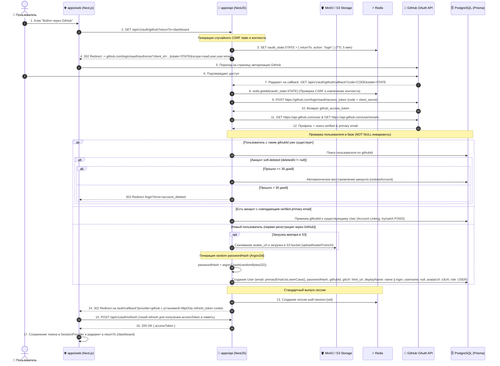

# Задачи: Авторизация и регистрация через GitHub OAuth 2.0

Данный документ содержит декомпозицию задач для **Backend** и **Frontend**, архитектурные диаграммы, разбор безопасности и структуру файлов монорепозитория.

---

## 1. Архитектурная диаграмма взаимодействия (OAuth 2.0 Flow)



---

## 2. Ключевые архитектурные решения

### 2.1. Неизменность схемы User (NOT NULL инварианты)
* **`email String @unique` (NOT NULL):** Email извлекается из GitHub API (`/user/emails`) со строгой фильтрацией: `email.verified === true && email.primary === true` и обязательной нормализацией `.trim().toLowerCase()`. Если верифицированного email нет — вход отклоняется.
* **`passwordHash String` (NOT NULL):** Для пользователей генерируется криптостойкий случайный пароль (`crypto.randomBytes(32).toString('hex')`) и хешируется через **Argon2id**. Вход в 1 клик сохраняется.

### 2.2. Заполнение профиля (`displayName`, `username`, `avatarUrl`)
* **Никнейм (`username`):** При регистрации через GitHub поле `username` **остается `null`**, чтобы избежать конфликтов уникальности с существующими пользователями. Имя или логин GitHub сохраняется в `displayName` (`name || login`).
* **Аватар (`avatarUrl`):** GitHub `avatar_url` скачивается и сохраняется в **S3/MinIO** хранилище (`storageService.uploadAvatarFromUrl`), в БД сохраняется постоянный S3 URL.
* **Ссылка на GitHub (`gitUrl`):** Заполняется из `html_url` профиля GitHub.

### 2.3. Безопасность, Concurrency и Жизненный цикл
1. **CSRF State & Context:** `state` генерируется криптографически случайно (`randomBytes(32)`), сохраняется в Redis с TTL 5 минут вместе с параметрами (`returnTo`, `action`, `userId`).
2. **Soft-Delete (Восстановление аккаунта):** При входе через GitHub удаленный менее 30 дней назад аккаунт восстанавливается (`restoreAccount`).
3. **Обработка отмены (User Cancelation):** При `?error=access_denied` выполняется редирект на `/login?error=oauth_cancelled`.
4. **Race Conditions:** Обработка ошибок `P2002` при создании дубликатов (idempotent lookup) и привязке аккаунтов (`409 Conflict`).
5. **Open Redirect Protection:** Параметр `returnTo` строго проверяется регулярным выражением на относительный путь.
6. **Доставка токена на фронтенд:** Редирект на `/auth/callback?provider=github` с автоматической инициализацией сессии через `POST /api/v1/auth/refresh`.

---

## 3. Структура файлов в монорепозитории

### 3.1. Backend (`apps/api`):
```text
apps/api/src/
├── config/
│   └── env.validation.ts                  # GITHUB_CLIENT_ID, GITHUB_CLIENT_SECRET, GITHUB_CALLBACK_URL
│
└── modules/
    ├── storage/
    │   └── storage.service.ts             # Метод uploadAvatarFromUrl(userId, url)
    │
    └── auth/
        ├── auth.controller.ts             # GET /auth/github, GET /auth/github/callback
        ├── auth.controller.spec.ts
        ├── auth.module.ts
        └── services/
            ├── github-oauth.service.ts    # Обмен code на token, получение verified email, генерация Argon2id
            └── github-oauth.service.spec.ts
```

### 3.2. Frontend (`apps/web` по FSD):
```text
apps/web/src/
├── app/
│   ├── (auth)/
│   │   ├── login/
│   │   │   └── page.tsx                   # Кнопка "Войти через GitHub"
│   │   ├── register/
│   │   │   └── page.tsx                   # Кнопка "Регистрация через GitHub"
│   │   └── callback/
│   │       └── page.tsx                   # Промежуточная страница инициализации сессии через refresh
│
└── features/
    └── auth/
        └── oauth/
            ├── ui/
            │   └── GithubLoginButton.tsx  # Кнопка с официальной иконкой GitHub
            ├── model/
            │   └── useGithubAuth.ts       # Инициация редиректа на эндпоинт авторизации
            └── index.ts
```

---

## 4. Декомпозиция задач

### 🐙 Часть 1: Backend (`apps/api`, Redis, Storage, Prisma)

**Заголовок:** `feat(api): бэкенд для авторизации и регистрации через GitHub OAuth 2.0`

#### Чеклист:
- [ ] **Prisma & База данных:**
  - Добавить поле `githubId String? @unique` и индекс `@@index([githubId])` в модель `User`.
  - Поля `email` и `passwordHash` остаются обязательными (`NOT NULL`).
  - Применить миграцию (`pnpm run db:migrate`).
- [ ] **Сервис хранилища (`storage.service.ts`):**
  - Метод `uploadAvatarFromUrl(userId: string, imageUrl: string): Promise<string>` для загрузки аватара GitHub в S3.
- [ ] **Сервис GitHub OAuth (`github-oauth.service.ts`):**
  - Метод генерации ссылки авторизации (`read:user`, `user:email`, случайный `state` в Redis с TTL 5 мин).
  - Метод валидации `state` (`redis.getdel`) и обмена `code` на токен GitHub.
  - Запрос профиля (`/user`) и emails (`/user/emails`) со строгой фильтрацией `verified && primary` и нормализацией email.
  - Проверка `deletedAt` (восстановление аккаунта при <= 30 дней).
  - Загрузка аватара в S3 через `uploadAvatarFromUrl`.
  - При создании нового пользователя: генерация `passwordHash` через `argon2.hash(randomBytes(32))`, установка `displayName: name || login`, `username: null`, `gitUrl: html_url`.
  - Защита от race conditions `P2002`.
  - Интеграция с созданием Redis-сессии (`AuthSessionService`).
- [ ] **Контроллеры (`auth.controller.ts`):**
  - `GET /api/v1/auth/github` — старт OAuth flow с `@UseGuards(AuthThrottlerGuard)`.
  - `GET /api/v1/auth/github/callback` — обработка callback, отмена пользователем (`error=access_denied`), установка HttpOnly cookie и 302 редирект на `/auth/callback`.
- [ ] **Конфигурация:**
  - Валидация переменных окружения в `env.validation.ts` и обновление `.env.example`.
- [ ] **Тестирование:**
  - Unit-тесты для `GithubOAuthService` и `AuthController`.

---

### 🎨 Часть 2: Frontend (`apps/web`, `@packages/ui`, `@packages/i18n`)

**Заголовок:** `feat(web): интеграция кнопки GitHub OAuth и страницы callback`

#### Чеклист:
- [ ] **UI-компоненты:**
  - Добавить компонент `GithubLoginButton` с иконкой GitHub из `@packages/icons` на страницы `/login` и `/register`.
- [ ] **Страница `/auth/callback`:**
  - Обработка возврата после OAuth: вызов `POST /api/v1/auth/refresh` для получения `accessToken` в память `SessionProvider`.
  - Редирект в целевой раздел (`returnTo` или `/dashboard`).
  - Отображение понятной ошибки при `error=oauth_cancelled` или сбое входа.
- [ ] **Локализация (`@packages/i18n`):**
  - Ключи для кнопки GitHub и сообщений об ошибках OAuth в `ru/auth.json` и `en/auth.json`.

---

## 5. Acceptance Criteria

1. Пользователь может войти и зарегистрироваться через GitHub в 1 клик.
2. `email` и `passwordHash` в базе данных всегда заполнены (`NOT NULL`), `username: null`, `displayName` заполнен.
3. Аватарка из GitHub скачивается и загружается в S3 бакет.
4. Soft-deleted аккаунты восстанавливаются при входе в течение 30 дней.
5. Поддерживается безопасный Account Linking по подтвержденному email из GitHub (с отловом 409 Conflict).
6. Токены доставляются безопасно через страницу callback и тихий refresh.
7. При отмене авторизации в GitHub пользователь возвращается на страницу логина с информативным сообщением.
8. Typecheck, линтинг и тесты проходят успешно.
