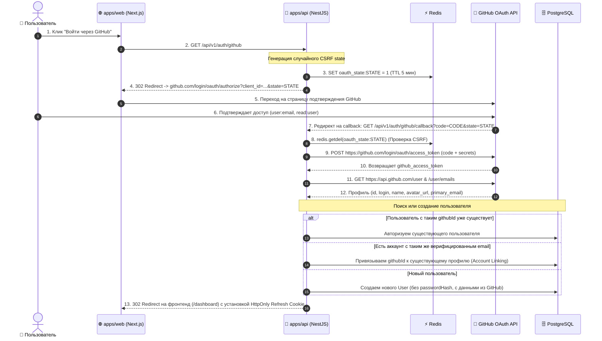

# Задачи: Авторизация и регистрация через GitHub OAuth 2.0

Данный документ содержит декомпозицию задач для **Backend** и **Frontend**, архитектурные диаграммы и структуру файлов монорепозитория.

---

## 1. Архитектурная диаграмма взаимодействия (OAuth 2.0 Flow)



---

## 2. Структура файлов в монорепозитории

### 2.1. Backend (`apps/api`):
```text
apps/api/src/
├── config/
│   └── env.validation.ts                  # Валидация GITHUB_CLIENT_ID, GITHUB_CLIENT_SECRET, GITHUB_CALLBACK_URL
│
└── modules/
    └── auth/
        ├── auth.controller.ts             # Эндпоинты GET /auth/github и GET /auth/github/callback
        ├── auth.controller.spec.ts        # Unit-тесты контроллера
        ├── auth.module.ts                 # Регистрация GithubOAuthService
        └── services/
            ├── github-oauth.service.ts    # Генерация URL, обмен токена, получение профиля
            └── github-oauth.service.spec.ts
```

### 2.2. Frontend (`apps/web` по FSD):
```text
apps/web/src/
├── app/
│   └── (auth)/
│       ├── login/
│       │   └── page.tsx                   # Кнопка "Войти через GitHub"
│       └── register/
│           └── page.tsx                   # Кнопка "Регистрация через GitHub"
│
├── features/
│   └── auth/
│       └── oauth/
│           ├── ui/
│           │   └── GithubLoginButton.tsx  # Компонент кнопки с иконкой GitHub
│           ├── model/
│           │   └── useGithubAuth.ts       # Обработка редиректа на эндпоинт инициации
│           └── index.ts
│
└── shared/
    └── ui/                                # Кнопки и иконки из @packages/ui и @packages/icons
```

---

# 🐙 Часть 1: Backend (`apps/api`, `packages/dto`, Redis)

### Заголовок задачи:
`feat(api): бэкенд для авторизации и регистрации через GitHub OAuth 2.0`

### Чеклист задач:
- [ ] **Prisma & База данных:**
  - В модели `User` сделать `passwordHash` опциональным (`String?`).
  - Добавить поле `githubId String? @unique` и индекс `@@index([githubId])`.
  - Создать и применить миграцию Prisma (`pnpm run db:migrate`).
- [ ] **Сервис GitHub OAuth (`github-oauth.service.ts`):**
  - Генерация ссылки авторизации с криптографическим `state` (сохранение в Redis с TTL 5 минут).
  - Валидация `state` (`redis.getdel`) и обмен `code` на `access_token` через GitHub API.
  - Получение профиля (`/user`) и верифицированного email (`/user/emails`).
- [ ] **Контроллеры (`auth.controller.ts`):**
  - `GET /api/v1/auth/github` — старт OAuth (генерация state и 302 редирект на GitHub).
  - `GET /api/v1/auth/github/callback` — обработка ответа, создание/связывание аккаунта, выдача JWT и HttpOnly `refresh_token` куки, редирект на фронтенд.
- [ ] **Конфигурация:**
  - Добавить `GITHUB_CLIENT_ID`, `GITHUB_CLIENT_SECRET`, `GITHUB_CALLBACK_URL` в `env.validation.ts` и `.env.example`.
- [ ] **Тестирование:**
  - Unit-тесты для `GithubOAuthService` и `AuthController`.

---

# 🎨 Часть 2: Frontend (`apps/web`, `@packages/ui`, `@packages/i18n`)

### Заголовок задачи:
`feat(web): интеграция кнопки и сценария входа через GitHub OAuth`

### Чеклист задач:
- [ ] **UI-компоненты:**
  - Добавить кнопку «Войти через GitHub» (с официальной иконкой GitHub из `@packages/icons`) на страницы `/login` и `/register`.
- [ ] **Поток авторизации:**
  - По клику на кнопку перенаправлять пользователя на эндпоинт инициации OAuth: `${API_URL}/auth/github`.
- [ ] **Обработка возврата (Callback / Redirect):**
  - Обработка успешного редиректа из бэкенда в личный кабинет `/dashboard` с обновлением сессии авторизации (TanStack Query / Zustand).
- [ ] **Локализация (`@packages/i18n`):**
  - Добавить переводы для подписи кнопки входа через GitHub в `ru/auth.json` и `en/auth.json`.
