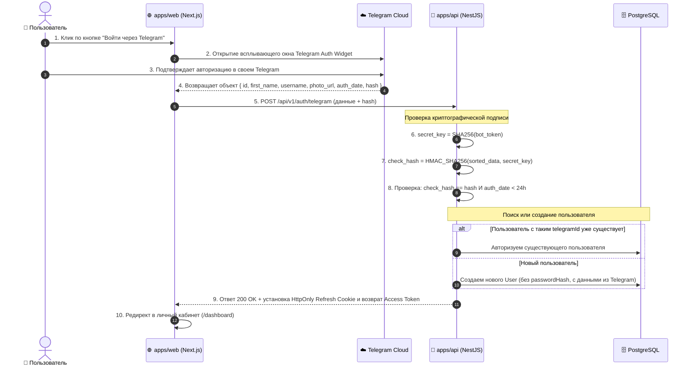

# Задачи: Авторизация и регистрация через Telegram Login Widget

Данный документ содержит декомпозицию задач для **Backend** и **Frontend**, архитектурные диаграммы и структуру файлов монорепозитория.

---

## 1. Архитектурная диаграмма взаимодействия (Telegram Login Flow)



---

## 2. Структура файлов в монорепозитории

### 2.1. Backend (`apps/api` и `packages/dto`):
```text
packages/dto/src/
└── auth/
    ├── telegram-auth.dto.ts               # Zod-схема валидации полей виджета Telegram
    └── index.ts

apps/api/src/
├── config/
│   └── env.validation.ts                  # TELEGRAM_BOT_TOKEN, TELEGRAM_BOT_USERNAME
│
└── modules/
    └── auth/
        ├── auth.controller.ts             # POST /api/v1/auth/telegram
        ├── auth.controller.spec.ts
        ├── auth.module.ts
        └── services/
            ├── telegram-oauth.service.ts  # HMAC-SHA256 валидация подписи
            └── telegram-oauth.service.spec.ts
```

### 2.2. Frontend (`apps/web` по FSD):
```text
apps/web/src/
├── app/
│   └── (auth)/
│       ├── login/
│       │   └── page.tsx                   # Страница логина с кнопкой Telegram
│       └── register/
│           └── page.tsx                   # Страница регистрации с кнопкой Telegram
│
└── features/
    └── auth/
        └── telegram-login/
            ├── ui/
            │   └── TelegramLoginButton.tsx # Обертка виджета с асинхронным скриптом
            ├── model/
            │   └── useTelegramAuth.ts     # Мутация POST /api/v1/auth/telegram
            └── index.ts
```

---

# ✈️ Часть 1: Backend (`apps/api`, `packages/dto`, Prisma)

### Заголовок задачи:
`feat(api): бэкенд для авторизации и валидации Telegram Login Widget`

### Чеклист задач:
- [ ] **Prisma & База данных:**
  - Сделать `email String? @unique` опциональным (Telegram не предоставляет email).
  - Добавить поля `telegramId BigInt? @unique`, `telegramUsername String?` и индекс `@@index([telegramId])`.
  - Создать и применить миграцию Prisma (`pnpm run db:migrate`).
- [ ] **DTO и валидация (`packages/dto`):**
  - Создать `TelegramAuthDto` (`id`, `first_name`, `last_name`, `username`, `photo_url`, `auth_date`, `hash`).
- [ ] **Сервис валидации Telegram (`telegram-oauth.service.ts`):**
  - Проверка криптографической подписи HMAC-SHA256 (`SHA256(bot_token)` + `HMAC(data)`).
  - Проверка срока жизни `auth_date` (< 24 часов) для защиты от Replay-атак.
- [ ] **Контроллер (`auth.controller.ts`):**
  - `POST /api/v1/auth/telegram` — эндпоинт приема данных виджета, создание/авторизация пользователя, выдача Access Token и HttpOnly `refresh_token` куки.
- [ ] **Конфигурация:**
  - Добавить `TELEGRAM_BOT_TOKEN` и `TELEGRAM_BOT_USERNAME` в валидацию окружения и `.env.example`.
- [ ] **Тестирование:**
  - Unit-тесты для HMAC-валидатора (корректные данные, невалидный хэш, устаревший `auth_date`).

---

# 🎨 Часть 2: Frontend (`apps/web`, `@packages/ui`, `@packages/i18n`)

### Заголовок задачи:
`feat(web): интеграция Telegram Login Widget на страницах авторизации`

### Чеклист задач:
- [ ] **Компонент виджета Telegram:**
  - Создать компонент `TelegramLoginButton` с асинхронной загрузкой скрипта `https://telegram.org/js/telegram-widget.js`.
  - Настроить передачу callback-функции `onTelegramAuth(user)` при успешном подтверждении пользователем.
- [ ] **Страницы логина и регистрации:**
  - Разместить компонент на страницах `/login` и `/register`.
- [ ] **Интеграция с API:**
  - Отправка полученного от Telegram объекта на `POST /api/v1/auth/telegram` через API-клиент.
  - Обработка успешного входа (сохранение токена, редирект в `/dashboard`).
  - Обработка ошибок сети или отклонения авторизации.
- [ ] **Локализация (`@packages/i18n`):**
  - Добавить необходимые текстовые константы в `auth.json`.
