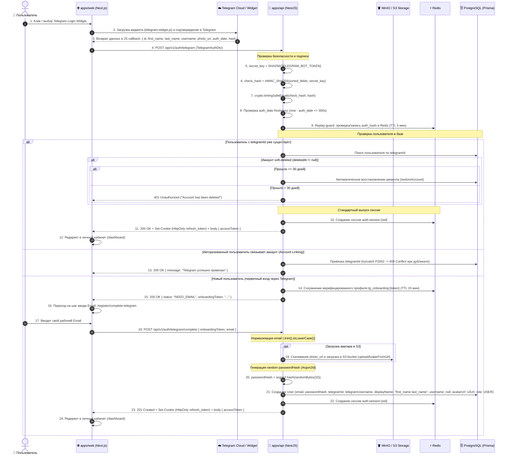

# Задачи: Авторизация и регистрация через Telegram Login Widget

Данный документ содержит декомпозицию задач для **Backend** и **Frontend**, архитектурные диаграммы, разбор безопасности и структуру файлов монорепозитория.

---

## 1. Архитектурная диаграмма взаимодействия (Telegram Login Flow)



---

## 2. Ключевые архитектурные решения

### 2.1. Неизменность схемы User (NOT NULL инварианты)
* **`email String @unique` (NOT NULL):** Email остается строго обязательным и уникальным. При первичном входе через Telegram пользователь проходит короткий шаг ввода Email (`/register/complete-telegram`). Все email обязательно нормализуются (`.trim().toLowerCase()`).
* **`passwordHash String` (NOT NULL):** Пароль остается строго обязательным. При регистрации генерируется криптостойкий случайный пароль (`crypto.randomBytes(32).toString('hex')`) и хешируется через **Argon2id**.
  * Повторный вход всегда выполняется в **1 клик** через виджет без ввода пароля.
  * При необходимости пользователь может воспользоваться функцией сброса пароля («Забыли пароль?») или кнопкой «Установить пароль» в профиле.

### 2.2. Заполнение профиля (`displayName`, `username`, `avatarUrl`)
* **Никнейм (`username`):** При регистрации через Telegram поле `username` **не заполняется (остается `null`)**, чтобы исключить коллизии `P2002` с существующими пользователями платформы. Имя пользователя Telegram (`first_name` + опциональный `last_name`) сохраняется в `displayName`. Пользователь может позже выбрать уникальный `username` в настройках профиля.
* **Аватар (`avatarUrl`):** При наличии `photo_url` из Telegram бэкенд скачивает изображение и загружает его в **S3/MinIO** хранилище (`storageService.uploadAvatarFromUrl`). В базу сохраняется внутренний S3 URL. Это предотвращает сбои Next.js `<Image />` и обеспечивает корректную работу `deleteAvatar` / `updateAvatar`.
* **Сериализация `BigInt` (Telegram ID):** `telegramId` хранится как `BigInt? @unique` в PostgreSQL, но на уровне API/DTO и селекторов `UsersService` всегда явно преобразуется в строку (`telegramId?.toString()`), исключая ошибку `TypeError: Do not know how to serialize a BigInt`.

### 2.3. Безопасность, Concurrency и Жизненный цикл
1. **Timing Attacks:** Сравнение хэша виджета и вычисленного HMAC-SHA256 выполняется строго через `crypto.timingSafeEqual`.
2. **Replay Attacks:** Окно проверки `auth_date` составляет 5 минут (300 секунд), хэш кэшируется в Redis (`auth:telegram:replay:{hash}`).
3. **Soft-Delete (Восстановление аккаунта):**
   * Если аккаунт помечен `deletedAt`:
     * Прошло $\le$ 30 дней $\to$ автоматическое восстановление профиля (`restoreAccount`) и вход.
     * Прошло $>$ 30 дней $\to$ отказ `401 Unauthorized` («Срок восстановления аккаунта истек»).
4. **Race Conditions & Concurrency:**
   * При одновременных запросах регистрации блок создания пользователя обрабатывает ошибку `P2002` и возвращает созданного пользователя.
   * При привязке аккаунта (Account Linking) перехват `P2002` возвращает `409 Conflict ("Этот аккаунт Telegram уже привязан к другому профилю")`.
5. **Content Security Policy (CSP):** Настройка заголовков в `next.config.js` (`script-src https://telegram.org`, `frame-src https://oauth.telegram.org https://telegram.org`).

---

## 3. Структура файлов в монорепозитории

### 3.1. DTO (`packages/dto`):
```text
packages/dto/src/
└── auth/
    ├── telegram-auth.dto.ts               # Zod-схемы TelegramAuthDto и TelegramCompleteDto
    └── index.ts
```

### 3.2. Backend (`apps/api`):
```text
apps/api/src/
├── config/
│   └── env.validation.ts                  # TELEGRAM_BOT_TOKEN, TELEGRAM_BOT_USERNAME
│
└── modules/
    ├── storage/
    │   └── storage.service.ts             # Метод uploadAvatarFromUrl(userId, url)
    │
    └── auth/
        ├── auth.controller.ts             # POST /api/v1/auth/telegram, POST /api/v1/auth/telegram/complete
        ├── auth.controller.spec.ts
        ├── auth.service.ts                # Интеграция сессий, генерация Argon2id, soft-delete restoration
        ├── auth.module.ts
        └── services/
            ├── telegram-oauth.service.ts  # HMAC-SHA256 валидация, timingSafeEqual, auth_date, replay guard
            └── telegram-oauth.service.spec.ts
```

### 3.3. Frontend (`apps/web` по FSD):
```text
apps/web/src/
├── next.config.mjs                        # Настройка CSP заголовков для Telegram Widget
│
├── app/
│   └── (auth)/
│       ├── login/
│       │   └── page.tsx                   # Страница логина с виджетом Telegram
│       ├── register/
│       │   ├── page.tsx                   # Страница регистрации с виджетом Telegram
│       │   └── complete-telegram/
│       │       └── page.tsx               # Шаг ввода Email для завершения регистрации
│
└── features/
    └── auth/
        └── telegram-login/
            ├── ui/
            │   ├── TelegramLoginButton.tsx # Безопасная обертка загрузки telegram-widget.js в React
            │   └── CompleteTelegramForm.tsx# Форма ввода Email с Zod-валидацией
            ├── model/
            │   └── useTelegramAuth.ts     # Мутации авторизации и онбординга
            └── index.ts
```

---

## 4. Декомпозиция задач

### ✈️ Часть 1: Backend (`apps/api`, `packages/dto`, Prisma, Storage, Redis)

**Заголовок:** `feat(api): бэкенд для авторизации и онбординга через Telegram Login Widget`

#### Чеклист:
- [ ] **Prisma & База данных:**
  - Добавить поля `telegramId BigInt? @unique`, `telegramUsername String?` и индекс `@@index([telegramId])` в модель `User`.
  - Поля `email` и `passwordHash` остаются обязательными (`NOT NULL`).
  - Применить миграцию (`pnpm run db:migrate`).
- [ ] **DTO и схемы (`packages/dto`):**
  - `telegramAuthSchema` (`id`, `first_name`, `last_name`, `username`, `photo_url`, `auth_date`, `hash`).
  - `telegramCompleteSchema` (`onboardingToken`, `email` с нормализацией `.trim().toLowerCase()`).
- [ ] **Сервис хранилища (`storage.service.ts`):**
  - Добавить метод `uploadAvatarFromUrl(userId: string, imageUrl: string): Promise<string>` для загрузки аватарок из Telegram в S3 бакет.
- [ ] **Сервис валидации Telegram (`telegram-oauth.service.ts`):**
  - Проверка HMAC-SHA256 с ключом `SHA256(bot_token)`.
  - Сравнение через `crypto.timingSafeEqual`.
  - Проверка `auth_date` (TTL <= 300с) и защита от Replay через Redis (`auth:telegram:replay:{hash}`).
- [ ] **Методы авторизации в AuthService & UsersService:**
  - `telegramAuth`:
    - Проверка HMAC подписи и Replay guard.
    - Поиск пользователя по `telegramId`.
    - Если найден:
      - Проверка `deletedAt`: если <= 30 дней $\to$ `restoreAccount`, если > 30 дней $\to$ `401 Unauthorized`.
      - Создание стандартной сессии в Redis и выдача `{ accessToken, refreshToken }`.
    - Если не найден:
      - Сохранение данных профиля в Redis `tg_onboarding:{token}` на 15 минут, возврат `{ status: "NEED_EMAIL", onboardingToken }`.
  - `completeTelegramAuth`:
    - Извлечение данных из Redis по `onboardingToken`.
    - Нормализация `email` и проверка уникальности.
    - Загрузка аватара в S3 через `uploadAvatarFromUrl` (best-effort).
    - Генерация криптостойкого `passwordHash` (`argon2.hash(randomBytes(32))`).
    - Создание `User` (`displayName: first_name + last_name`, `username: null`, `avatarUrl: s3Url`).
    - Обработка race condition `P2002`.
    - Создание сессии в Redis, возврат токенов.
  - `linkTelegram`:
    - Привязка `telegramId` к текущему авторизованному `userId` с отловом `P2002` $\to$ `409 Conflict`.
- [ ] **Контроллер (`auth.controller.ts`):**
  - `POST /api/v1/auth/telegram` — публичный эндпоинт входа/проверки с `AuthThrottlerGuard`.
  - `POST /api/v1/auth/telegram/complete` — публичный эндпоинт завершения регистрации.
  - `POST /api/v1/auth/telegram/link` — защищенный эндпоинт привязки Telegram.
  - Сериализация `telegramId` в строку во всех ответах контроллера.
- [ ] **Тестирование:**
  - Unit-тесты для `TelegramOAuthService`, `AuthService` и контроллера.

---

### 🎨 Часть 2: Frontend (`apps/web`, `packages/api`, `@packages/i18n`)

**Заголовок:** `feat(web): интеграция Telegram Login Widget и экрана онбординга`

#### Чеклист:
- [ ] **Конфигурация CSP (`next.config.mjs`):**
  - Добавить разрешения `script-src https://telegram.org` и `frame-src https://oauth.telegram.org https://telegram.org`.
- [ ] **API-клиент (`packages/api`):**
  - Кодогенерация Orval (`pnpm generate:api`).
- [ ] **Компонент `TelegramLoginButton`:**
  - Динамическая загрузка `https://telegram.org/js/telegram-widget.js` через `useEffect`.
  - Корректная очистка контейнера и `window.onTelegramAuth` при unmount.
- [ ] **Хук `useTelegramAuth` и страница `/register/complete-telegram`:**
  - Если `status === "NEED_EMAIL"` $\to$ сохранение `onboardingToken` и переход на `/register/complete-telegram`.
  - Форма ввода email с валидацией Zod.
  - При успехе $\to$ запись токена в `SessionProvider` и переход в `/dashboard`.
- [ ] **Страницы логина и регистрации:**
  - Размещение виджета на `/login` и `/register`.
- [ ] **Локализация (`@packages/i18n`):**
  - Ключи перевода для онбординга Telegram в `ru/auth.json` и `en/auth.json`.

---

## 5. Acceptance Criteria

1. Существующий Telegram-пользователь авторизуется в 1 клик.
2. Новый Telegram-пользователь указывает свой Email на безопасном шаге онбординга и регистрируется.
3. Поля `email` и `passwordHash` в базе данных всегда заполнены (`NOT NULL`), `username: null`, `displayName` заполнен именем из Telegram.
4. Аватарка из Telegram скачивается и загружается в S3 хранилище.
5. Soft-deleted аккаунты восстанавливаются при входе в течение 30 дней.
6. Ошибки дублирования при одновременных запросах и связывании обрабатываются корректно (409 Conflict / idempotency).
7. Защита от Replay и устаревших данных (`auth_date > 5 минут`) отклоняется с 401.
8. Невалидная подпись HMAC отклоняется сервером с ошибкой `401 Unauthorized`.
9. Typecheck, линтинг и тесты проходят успешно.
