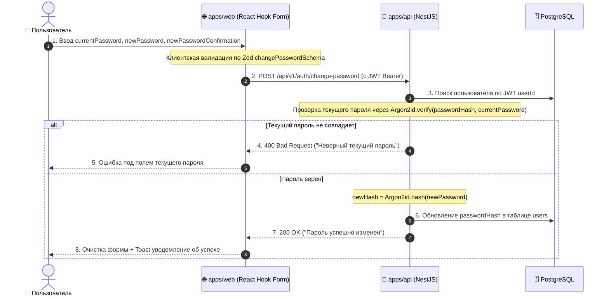

# Задачи: Смена пароля авторизованного пользователя

Данный документ содержит описание задач по реализации смены пароля для авторизованного пользователя, архитектурную диаграмму и структуру файлов.

---

## 1. Архитектурная диаграмма смены пароля



---

## 2. Структура файлов в монорепозитории

### 2.1. Packages (`packages/dto`):
```text
packages/dto/src/
└── auth/
    ├── change-password.dto.ts             # changePasswordSchema (currentPassword, newPassword, newPasswordConfirmation)
    ├── change-password.dto.test.ts        # Unit-тесты схемы валидации
    └── index.ts
```

### 2.2. Frontend (`apps/web` по FSD):
```text
apps/web/src/
├── features/
│   └── change-password/                   # Фича смены пароля
│       ├── ui/
│       │   └── ChangePasswordForm.tsx     # Форма с полями ввода и кнопками Eye/EyeOff
│       ├── model/
│       │   └── useChangePassword.ts       # Мутация POST /api/v1/auth/change-password
│       └── index.ts
│
└── widgets/
    └── profile-settings/
        └── ui/
            └── ProfileSettingsDialog.tsx  # Вкладка "Безопасность" с подключением формы
```

---

# 🎨 Frontend Task (`apps/web`, `@packages/ui`, `@packages/i18n`)

### Заголовок задачи:
`feat(web): форма смены пароля авторизованного пользователя в настройках профиля`

### Чеклист задач:
- [ ] **Компонент формы (`ChangePasswordForm`):**
  - Поля ввода: `currentPassword`, `newPassword`, `newPasswordConfirmation` с кнопками переключения видимости (`Eye`/`EyeOff`).
  - Клиентская валидация по схеме `changePasswordSchema` из `@packages/dto` (длина 8–128 символов, совпадение подтверждения).
- [ ] **Интеграция с API:**
  - Отправка запроса на `POST /api/v1/auth/change-password` через сгенерированный хук/клиент из `@packages/api`.
  - Обработка успешного ответа (очистка формы, всплывающий `Toast`).
  - Обработка ошибок бэкенда (`400/401` — неверный текущий пароль).
- [ ] **Интеграция в модалку настроек:**
  - Добавить вкладки `Tabs` ("Общие" / "Безопасность") в `ProfileSettingsDialog`.
  - Разместить `ChangePasswordForm` во вкладке "Безопасность".
- [ ] **Локализация (`@packages/i18n`):**
  - Добавить переводы полей, кнопок и ошибок в `ru/auth.json` и `en/auth.json`.
