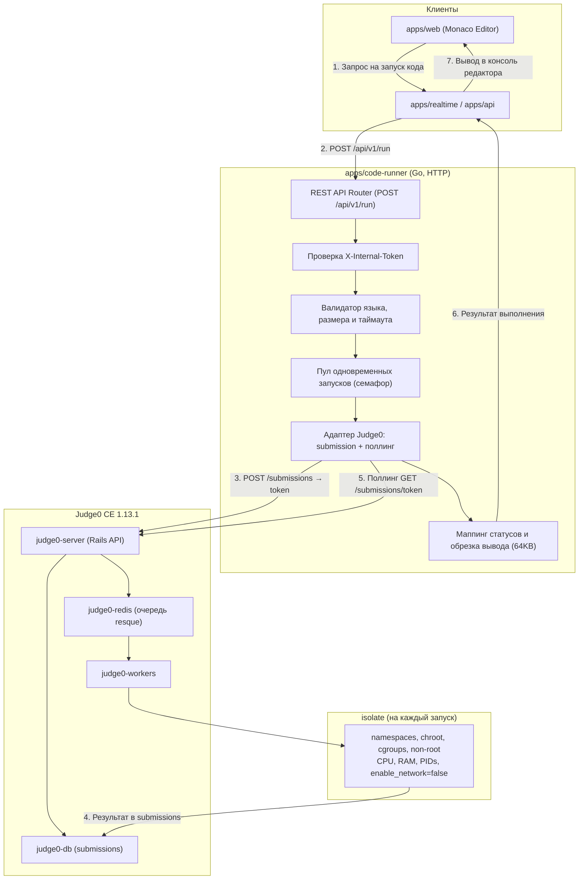

# Техническое задание: Сервис безопасного выполнения кода (apps/code-runner)

Данный документ содержит описание архитектуры, требований безопасности, спецификации API и плана реализации сервиса **`apps/code-runner`** для платформы **MockInterviewAI**.

> **Изменение подхода.** В первой редакции ТЗ песочница описывалась как собственная реализация на Docker/nsjail с ручным управлением namespaces, cgroups и tmpfs. Вместо неё взят готовый движок **Judge0 CE** — он решает ровно эту задачу через `isolate` (песочница из олимпиадного судейства), закрывает изоляцию, лимиты и мультиязычные рантаймы из коробки и снимает необходимость поддерживать собственный код сэндбоксинга. Требования к лимитам, контракт API и политики безопасности сохранены; изменился слой, который их обеспечивает.
>
> Актуальная техническая документация сервиса — [docs/backend/architecture/code-runner.md](../backend/architecture/code-runner.md).

---

## 1. Назначение сервиса

Сервис **`apps/code-runner`** предназначен для безопасного, изолированного и быстрого выполнения пользовательского кода в реальном времени во время технических собеседований (Live Coding).

Сам код сервис не исполняет: он валидирует запрос, применяет лимиты и делегирует выполнение Judge0, после чего транслирует результат в контракт платформы. Собственного состояния и БД у сервиса нет.

### Поддерживаемые языки программирования

Версии рантаймов определяются сборкой Judge0 CE 1.13.1:

| Язык | `language_id` | Рантайм |
| :--- | :--- | :--- |
| JavaScript | `93` | Node.js 18.15.0 |
| TypeScript | `94` | TypeScript 5.0.3 |
| Python 3 | `92` | Python 3.11.2 |
| Go | `95` | Go 1.18.5 |
| C++ | `54` | GCC 9.2.0 |
| Java | `91` | OpenJDK 17.0.6 |

Идентификаторы переопределяются переменной `JUDGE0_LANGUAGE_IDS` без пересборки образа. На старте сервис сверяет их с `GET /languages` и пишет предупреждение при расхождении.

---

## 2. Архитектура и изоляция (Sandbox & Security)

Каждый запуск пользовательского кода выполняется в одноразовой песочнице `isolate` с жёсткими ограничениями ресурсов, чтобы исключить DoS-атаки, майнинг, утечки данных и повреждение хост-системы.



Судейство асинхронное: `POST /submissions` возвращает токен, а не результат. Синхронный режим Judge0 (`wait=true`) не используется — он занимает Rails-воркер на всё время выполнения и не рекомендован в production.

### Требование к хосту: cgroup v1

Judge0 1.13.1 сэндбоксит через `isolate` 1.8, который поддерживает только cgroup v1. Проверка: `stat -fc %T /sys/fs/cgroup` → `tmpfs` (пригоден) либо `cgroup2fs` (запуски будут возвращать `INTERNAL_ERROR`). На Linux решается разовой правкой GRUB; на Docker Desktop под Windows/macOS не обходится.

---

## 3. Политики безопасности и ограничения ресурсов (Hard Limits)

| Параметр | Переменная | Значение | Поведение при превышении |
| :--- | :--- | :--- | :--- |
| **CPU Time Limit** | `RUN_DEFAULT_TIMEOUT_MS` / `RUN_MAX_TIMEOUT_MS` | `3000` / потолок `5000` | Принудительное снятие процесса, статус `TIME_LIMIT_EXCEEDED` |
| **Memory Limit (RAM)** | `RUN_MEMORY_LIMIT_KB` | `262144` (256 МБ) | Снятие процесса, статус `MEMORY_LIMIT_EXCEEDED` |
| **Макс. размер кода** | `RUN_MAX_CODE_BYTES` | `65536` (64 КБ) | Отклонение запроса с `400 Bad Request` |
| **Макс. размер stdin** | `RUN_MAX_STDIN_BYTES` | `65536` (64 КБ) | Отклонение запроса с `400 Bad Request` |
| **Макс. размер stdout/stderr** | `RUN_MAX_OUTPUT_BYTES` | `65536` (64 КБ) | Обрезка вывода с пометкой `[output truncated]`, статус `OUTPUT_LIMIT_EXCEEDED` |
| **Размер файлов в песочнице** | `RUN_MAX_FILE_SIZE_KB` | `4096` | Ошибка записи внутри песочницы |
| **Сетевой доступ** | — | отключён (`enable_network: false`) | Запрещены любые исходящие и входящие соединения |
| **Файловая система** | — | изолированный `/box` в chroot | Запрет модификации системных файлов |
| **Привилегии** | — | непривилегированный пользователь `isolate` | Запуск без root внутри песочницы |
| **Fork-bomb защита** | `RUN_MAX_PROCESSES` | `64` | Запрет создания неконтролируемого количества процессов и потоков |
| **Параллелизм сервиса** | `RUN_MAX_CONCURRENT` / `RUN_QUEUE_WAIT_MS` | `32` / `2000` | `429 Too Many Requests` при занятом пуле |
| **Бюджет ожидания результата** | `JUDGE0_RESULT_TIMEOUT_MS` | `30000` | `504 Gateway Timeout` |

Память взята по верхней границе исходного диапазона (256 МБ вместо 128 МБ): на 128 МБ не стартуют JVM и рантайм Go даже на тривиальных программах.

`RUN_MAX_FILE_SIZE_KB` ограничивает не вывод, а артефакты сборки — бинарь Go занимает единицы мегабайт, и 64 КБ здесь сломали бы компиляцию. Обрезка stdout/stderr выполняется отдельно, на стороне сервиса.

### Доступ к сервису

Сервис исполняет произвольный код и не должен быть вызываемым анонимно. Все запросы, кроме проб, требуют общий секрет `CODE_RUNNER_AUTH_TOKEN` в заголовке `X-Internal-Token` (сравнение за константное время). В production сервис с пустым токеном не стартует (fail-closed).

API самого Judge0 публикуется только на `127.0.0.1`: в версиях до 1.13.1 были уязвимости с побегом из песочницы (CVE-2024-28185, CVE-2024-28189, CVE-2024-29021).

---

## 4. Контракты API (Спецификация)

Базовый эндпоинт: `POST /api/v1/run`. Сервис внутренний и наружу не публикуется: внутри docker-сети он доступен по адресу `http://code-runner:8090`.

| Метод | Путь | Назначение |
| :--- | :--- | :--- |
| `POST` | `/api/v1/run` | Выполнение кода |
| `GET` | `/api/v1/languages` | Список поддерживаемых языков |
| `GET` | `/healthz` | Liveness |
| `GET` | `/readyz` | Readiness, `503` при недоступном Judge0 |

### 4.1. Формат входных данных (Request Body)

```json
{
  "language": "typescript",
  "code": "const sum = (a: number, b: number): number => a + b;\nconsole.log(sum(5, 7));",
  "stdin": "",
  "timeoutMs": 3000
}
```

`language` нечувствителен к регистру и принимает алиасы: `js`/`node`/`nodejs`, `ts`, `py`/`python3`, `c++`, `golang`. Поля `stdin` и `timeoutMs` необязательны.

### 4.2. Формат ответа (Response Body)

```json
{
  "status": "SUCCESS",
  "stdout": "12\n",
  "stderr": "",
  "exitCode": 0,
  "executionTimeMs": 142,
  "memoryUsageBytes": 34521000
}
```

### Возможные статусы (`status`)

* `SUCCESS` — код успешно выполнился и вернул `0`.
* `RUNTIME_ERROR` — ошибка во время выполнения (ненулевой код возврата или необработанный Exception).
* `COMPILATION_ERROR` — ошибка компиляции (для Go, C++, Java, TypeScript); вывод компилятора переносится в `stderr`.
* `TIME_LIMIT_EXCEEDED` — выполнение прервано по таймауту.
* `MEMORY_LIMIT_EXCEEDED` — превышен лимит оперативной памяти.
* `OUTPUT_LIMIT_EXCEEDED` — вывод превысил максимальный допустимый размер.
* `INTERNAL_ERROR` — сбой самого движка песочницы (в т.ч. неверно настроенные cgroups на хосте).

**Неудачное выполнение кода не является ошибкой HTTP**: упавшая программа и не прошедший компиляцию код возвращаются с `200 OK`, причина лежит в `status`. Потребитель показывает это в консоли редактора, а не обрабатывает как исключение.

У Judge0 нет отдельного статуса для превышения памяти — `isolate` снимает процесс сигналом и отдаёт Runtime Error. `MEMORY_LIMIT_EXCEEDED` распознаётся по фактическому пику потребления и тексту сообщения.

### 4.3. Коды ответа

| Код | Причина |
| :--- | :--- |
| `200` | Запуск выполнен, в том числе с ошибкой в коде пользователя |
| `400` | Неизвестный язык, пустой код, превышен размер кода/stdin, `timeoutMs` выше потолка |
| `401` | Отсутствует или неверен `X-Internal-Token` |
| `413` | Тело запроса больше допустимого |
| `429` | Пул запусков занят |
| `502` | Judge0 недоступен или вернул ошибку |
| `504` | Judge0 не отдал финальный статус за отведённый бюджет |

Тело ошибки: `{ "error": "..." }`.

---

## 5. Задачи по реализации

### 1. Архитектура и базовая структура (`apps/code-runner`)
- [x] Инициализировать сервис в `apps/code-runner` (Go).
- [x] Настроить HTTP-сервер с эндпоинтами `POST /api/v1/run`, `GET /api/v1/languages`, `GET /healthz`, `GET /readyz`.
- [x] Настроить graceful shutdown и ограничение числа одновременных запусков.
- [x] Вынести адаптер движка песочницы в отдельный пакет (`internal/judge0`), чтобы движок можно было заменить, не трогая HTTP-контракт.

### 2. Рантаймы и среды выполнения
- [x] Развернуть Judge0 CE как источник рантаймов (Node.js, Python, Go, C++, Java) вместо сборки собственных образов.
- [x] Сопоставить канонические языки сервиса с `language_id` Judge0 и вынести маппинг в конфигурацию (`JUDGE0_LANGUAGE_IDS`).
- [x] Сверять `language_id` с `GET /languages` при старте и предупреждать о расхождениях.
- [x] Реализовать замер времени выполнения и потребления памяти (перевод единиц Judge0 в контракт API).

### 3. Механизмы безопасности
- [x] Настроить изоляцию: сеть отключена (`enable_network: false`, `ALLOW_ENABLE_NETWORK=false`), лимит процессов, лимит размера файлов.
- [x] Передавать лимиты времени и памяти в Judge0; обрабатывать снятие процесса по таймауту (`TIME_LIMIT_EXCEEDED`).
- [x] Ограничить общий бюджет ожидания результата, чтобы зависший запуск не держал соединение бесконечно.
- [x] Реализовать санитизацию и обрезку вывода stdout/stderr до 64 КБ.
- [x] Закрыть сервис общим секретом `X-Internal-Token` (fail-closed в production).
- [x] Не публиковать API Judge0 за пределы loopback.

### 4. Интеграция в монорепозиторий и CI/CD
- [x] Добавить сервис и стек Judge0 в `docker-compose.yml` (dev) отдельным профилем `code-runner`.
- [x] Настроить скрипты сборки, запуска и тестов в `package.json`.
- [x] Добавить переменные окружения в `.env.example`.
- [ ] Добавить сервис в `docker-compose.prod.yml` и workflow сборки образа в GHCR.
- [ ] Подключить клиента в `apps/api` и/или `apps/realtime`.

### 5. Тестирование
- [x] Тесты адаптера против фейкового Judge0: успешный запуск, ошибка компиляции, таймаут, превышение памяти, обрезка вывода, валидация запроса.
- [ ] Тесты выполнения базовых программ для каждого языка на живом Judge0 (Hello World, циклы, ввод-вывод).
- [ ] Тесты безопасности (Security / Exploit Tests) на живом Judge0:
  - Попытка бесконечного цикла (проверка `TIME_LIMIT_EXCEEDED`).
  - Попытка fork bomb (проверка лимита процессов).
  - Попытка сетевого запроса (проверка блокировки сети).
  - Попытка записи в системные директории.

---

## 6. Критерии приемки (Definition of Done)

- [x] Сервис собирается и проходит `go build`, `go vet`, `go test`.
- [x] Контракт `POST /api/v1/run` реализован полностью, включая статусы и коды ответа из раздела 4.
- [x] Лимиты из раздела 3 задаются конфигурацией и передаются в песочницу.
- [ ] Сервис успешно запускается локально в Docker и выполняет код на JS/TS, Python, Go, C++, Java — требует хост на cgroup v1 (см. раздел 2).
- [ ] Все лимиты безопасности (CPU, RAM, Network, PIDs) проверены тестами на живом Judge0.
- [ ] Сервис развёрнут в production-контуре.
