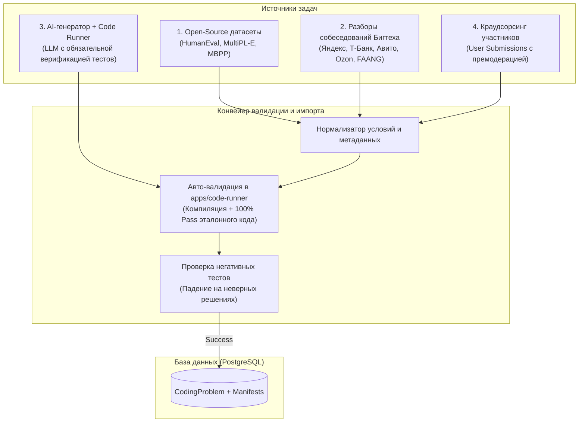
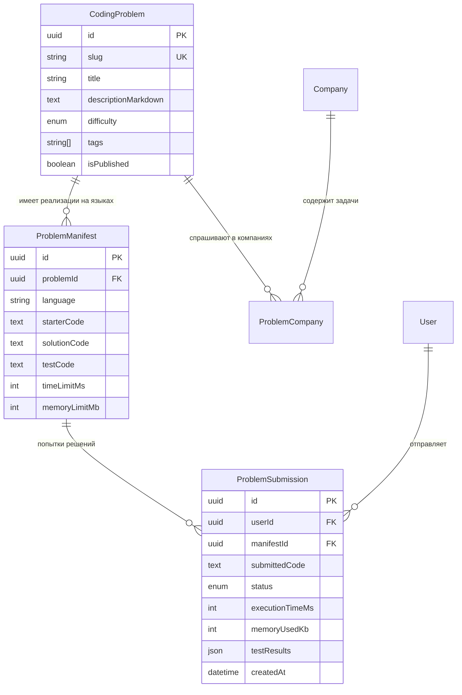

# База практических задач по программированию (Coding Problems Bank)

Данный документ описывает проектирование мультиязычной библиотеки практических задач по программированию для платформы **MockInterviewAI**: структуру мультиязычных манифестов, источники и конвейер наполнения базы, интеграцию с сервисом выполнения кода (`apps/code-runner`), а также схему данных и этапы реализации.

---

## 1. Контекст и цели

### 1.1 Назначение
Предоставить платформе структурированную базу задач для практических секций технических собеседований (Live Coding, алгоритмические секции, практический бэкенд/фронтенд инжиниринг). 

В отличие от теоретической базы вопросов ([`question-bank.md`](../docs/tasks/question-bank.md)), практическая база задач:
- Требует написания исполняемого кода в онлайн-редакторе (Monaco Editor).
- Автоматически проверяется набором unit-тестов в изолированной среде ([`apps/code-runner`](../docs/tasks/code-runner.md)).
- Поддерживает решение одной и той же задачи на разных языках программирования с соблюдением идиом конкретного языка.

### 1.2 Ключевые поддерживаемые языки
1. **TypeScript / JavaScript** (Node.js 20+)
2. **Go** (Golang 1.22+)
3. **Python** (Python 3.12+)
4. **Java** (OpenJDK 21)
5. **C++** (C++20) *(на этапе масштабирования)*

---

## 2. Классификация практических задач

Задачи делятся на три основных типа с разным форматом проверки:

| Тип задачи | Описание | Примеры | Проверка |
|---|---|---|---|
| **Алгоритмические задачи (Algorithm)** | Классические структуры данных и алгоритмы, не зависящие от платформы | *Two Sum*, *LRU Cache*, *Valid Parentheses*, *Merge K Sorted Lists* | Входные данные → Выходные данные (I/O test cases) |
| **Практический инжиниринг (Practical / Concurrency)** | Языково-специфичные паттерны многопоточности, асинхронности и системного программирования | **Go:** *Worker Pool с context*, *Pipeline каналов*, *Rate Limiter с sync.Mutex*<br>**TS:** *Кастомный Promise.all*, *Debounce/Throttle*, *EventEmitter*, *Deep Clone*<br>**Python:** *Asyncio task queue*, *LRU decorator* | Специализированный test-runner файл с ассертами и проверкой на утечки/дедлоки |
| **Поиск багов и код-ревью (Bug Fixing)** | Нахождение тонких ошибок, гонок данных (data race) или утечек памяти | **Go:** *Data race в замыкании горутины*<br>**JS:** *Утечка памяти в EventListener / stale closure* | Запуск с флагом `-race` (Go) или проверка прохождения исправленного теста |

---

## 3. Источники данных: где взять задачи

Для наполнения базы используется комбинированный подход из 4 каналов:



### 3.1 Открытые индустриальные датасеты (Open Source)
- **MultiPL-E (HumanEval мультиязычный)**:
  - 164 эталонные задачи с проверенными unit-тестами, транслированные на 18+ языков (Go, Python, TypeScript, Java, C++).
  - Лицензия: MIT. Идеальная база для быстрого старта алгоритмического ядра.
- **MBPP (Mostly Basic Python Problems)**:
  - 974 задачи от Google Research с набором тестов.
- **Открытые репозитории с разборами**:
  - `alextanhongpin/go-interview` (практические паттерны Go).
  - `lydiahallie/javascript-questions` и `yangshun/tech-interview-handbook`.

### 3.2 Реальные задачи Бигтеха (СНГ и Мир)
- Публичные разборы секций на Хабре (Яндекс Контест, секции платформы Ozon, Т-Банк лайвкодинг).
- Обсуждения в сообществах (LeetCode Discuss вкладки компаний, чаты подготовки).
- Формирование «Золотой коллекции»: 50 самых повторяющихся задач на собеседованиях.

### 3.3 Пайплайн AI-генерации с валидацией через `apps/code-runner`
Для масштабирования базы до сотен задач используется генеративный пайплайн:
1. LLM генерирует манифест задачи: условие (Markdown), сигнатуру стартового кода, эталонное решение и тестовый файл.
2. Сервис отправляет сгенерированное решение и тесты в [`apps/code-runner`](../docs/tasks/code-runner.md).
3. **Критерий допуска в базу**:
   - Эталонный код компилируется без ворнингов и выполняет тесты в пределах `timeLimitMs`.
   - Намеренно тривиальное/пустое решение проваливает тесты (защита от ложноположительных тестов).
4. При успешной проверке задача сохраняется со статусом `DRAFT` для финального ревью администратором или автоматически публикуется.

### 3.4 Пользовательский вклад (Community Submissions)
- Возможность для пользователей отправить задачу, с которой они столкнулись на собеседовании.
- Начисление бонусных мок-интервью за принятую задачу.

---

## 4. Архитектура мультиязычности: Модель данных (Prisma)

Чтобы избежать дублирования условий задач и поддерживать решение одной задачи на любом языке, применяется полиморфная модель:



### Модели для `apps/api/prisma/schema.prisma`

```prisma
enum ProblemDifficulty {
  EASY
  MEDIUM
  HARD
}

enum SubmissionStatus {
  ACCEPTED            // Все тесты пройдены успешно
  WRONG_ANSWER        // Тест вернул неверный результат
  TIME_LIMIT_EXCEEDED // Превышен лимит времени выполнения
  MEMORY_LIMIT        // Превышен лимит памяти
  COMPILATION_ERROR   // Ошибка компиляции / синтаксиса
  RUNTIME_ERROR       // Паника / исключение во время выполнения
}

// Семантическая задача (условие, общее для всех языков)
model CodingProblem {
  id                  String              @id @default(uuid()) @db.Uuid
  slug                String              @unique @db.VarChar(120)
  title               String              @db.VarChar(200)
  descriptionMarkdown String              @map("description_markdown") @db.Text
  hints               String[]            @default([])
  difficulty          ProblemDifficulty   @default(MEDIUM)
  tags                String[]            @default([]) // ["concurrency", "lru", "trees"]
  isPublished         Boolean             @default(true) @map("is_published")
  viewsCount          Int                 @default(0) @map("views_count")
  createdAt           DateTime            @default(now()) @map("created_at")
  updatedAt           DateTime            @updatedAt @map("updated_at")

  manifests           ProblemManifest[]
  companies           ProblemCompany[]

  @@index([difficulty])
  @@index([tags], type: Gin)
  @@map("coding_problems")
}

// Языковая реализация задачи
model ProblemManifest {
  id             String            @id @default(uuid()) @db.Uuid
  problemId      String            @map("problem_id") @db.Uuid
  language       String            @db.VarChar(30) // "go", "typescript", "python", "java"
  
  // Код
  starterCode    String            @map("starter_code") @db.Text // Начальный код в редакторе с сигнатурой функции
  solutionCode   String            @map("solution_code") @db.Text // Авторское эталонное решение
  testCode       String            @map("test_code") @db.Text // Тестовый раннер / unit-тесты
  
  // Лимиты ресурсов
  timeLimitMs    Int               @default(2000) @map("time_limit_ms")
  memoryLimitMb  Int               @default(128) @map("memory_limit_mb")

  problem        CodingProblem     @relation(fields: [problemId], references: [id], onDelete: Cascade)
  submissions    ProblemSubmission[]

  @@unique([problemId, language])
  @@index([language])
  @@map("problem_manifests")
}

// История сабмитов (попыток решения)
model ProblemSubmission {
  id              String           @id @default(uuid()) @db.Uuid
  userId          String           @map("user_id") @db.Uuid
  manifestId      String           @map("manifest_id") @db.Uuid
  submittedCode   String           @map("submitted_code") @db.Text
  status          SubmissionStatus
  executionTimeMs Int?             @map("execution_time_ms")
  memoryUsedKb    Int?             @map("memory_used_kb")
  testResults     Json?            @map("test_results") // Детали по упавшим тестам
  createdAt       DateTime         @default(now()) @map("created_at")

  user            User             @relation(fields: [userId], references: [id], onDelete: Cascade)
  manifest        ProblemManifest  @relation(fields: [manifestId], references: [id], onDelete: Cascade)

  @@index([userId, manifestId])
  @@index([status])
  @@map("problem_submissions")
}

// Связь задачи с компаниями, где ее спрашивают
model ProblemCompany {
  problemId String        @map("problem_id") @db.Uuid
  companyId String        @map("company_id") @db.Uuid
  frequency Int           @default(3) // 1-5

  problem   CodingProblem @relation(fields: [problemId], references: [id], onDelete: Cascade)
  company   Company       @relation(fields: [companyId], references: [id], onDelete: Cascade)

  @@id([problemId, companyId])
  @@index([companyId])
  @@map("problem_companies")
}
```

---

## 5. Формат файлового хранения и импорта (Problem Manifest Spec)

Каждая задача может храниться в репозитории как директория с декларативным файлом `problem.yaml` и исходными файлами решений:

```text
packages/coding-problems/
├── concurrency-worker-pool/
│   ├── problem.yaml              # Метаданные, условия, сложность, теги
│   ├── go/
│   │   ├── starter.go            # Сигнатура функции / структуры для кандидата
│   │   ├── solution.go           # Авторское решение
│   │   └── solution_test.go      # Unit-тесты для раннера
│   └── typescript/
│       ├── starter.ts
│       ├── solution.ts
│       └── solution.test.ts
```

### Пример `problem.yaml`:
```yaml
id: "worker-pool"
title: "Реализация пула воркеров с контекстом и отменой"
difficulty: "MEDIUM"
tags: ["concurrency", "channels", "goroutines"]
companies:
  - slug: "yandex"
    frequency: 5
  - slug: "avito"
    frequency: 4
description: |
  Необходимо реализовать потокобезопасный Worker Pool, который принимает задачи из входного канала,
  обрабатывает их параллельно с использованием фиксированного количества горутин (воркеров),
  и корректно завершает работу при отмене контекста `ctx.Done()`.
```

---

## 6. Взаимодействие с `apps/code-runner`

Когда кандидат нажимает **«Запустить тесты»** в UI:
1. `apps/web` отправляет запрос в `apps/api`: `POST /api/v1/problems/:slug/run` с телом `{ language: "go", code: "..." }`.
2. `apps/api` берет секретный `testCode` манифеста задачи и компонует исполняемый бандл:
   - В зависимости от языка: склеивает код кандидата с файлом тестов либо монтирует их раздельно.
3. `apps/api` вызывает `POST /run` сервиса `apps/code-runner`:
   ```json
   {
     "language": "go",
     "files": [
       { "name": "solution.go", "content": "..." },
       { "name": "solution_test.go", "content": "..." }
     ],
     "command": "go test -v -race ./...",
     "timeLimitMs": 3000,
     "memoryLimitMb": 128
   }
   ```
4. `code-runner` изолированно выполняет тесты в контейнере и возвращает статус:
   - Вывод тестов (pass/fail per test case).
   - Затраченное процессорное время и пиковое потребление памяти.
5. `apps/api` сохраняет сабмит в `problem_submissions` и возвращает результат кандидату.

---

## 7. Этапы реализации

### Этап 1: Схема данных и DTO (`apps/api`, `packages/dto`)
- [ ] Добавить модели `CodingProblem`, `ProblemManifest`, `ProblemSubmission`, `ProblemCompany` в `apps/api/prisma/schema.prisma`.
- [ ] Выполнить миграцию базы данных.
- [ ] Описать DTO сабмита, запуска тестов и получения списка задач в `@packages/dto`.

### Этап 2: Интеграция с Code Runner и эндпоинты API (`apps/api`)
- [ ] Реализовать сервис проверки сабмитов `ProblemExecutionService`.
- [ ] Реализовать эндпоинт `POST /api/v1/problems/:id/run` (запуск открытых примеров).
- [ ] Реализовать эндпоинт `POST /api/v1/problems/:id/submit` (запуск полного набора тестов).
- [ ] Создать фильтрацию каталога задач по языку, компании и сложности.

### Этап 3: Базовый seed «Золотой сотни» (50 стартовых задач)
- [ ] **20 алгоритмических задач**: Two Sum, LRU Cache, Merge Intervals, Group Anagrams, Binary Search, Longest Substring Without Repeating Characters (на Go, TS, Python).
- [ ] **15 практических задач Go**: Worker Pool, Fan-In/Fan-Out, Rate Limiter, In-Memory TTL Cache, Graceful Shutdown runner, Pipeline.
- [ ] **15 практических задач TypeScript**: Custom Promise.all, Debounce & Throttle, Deep Clone, Event Emitter, Flatten Array, Async Task Queue.

### Этап 4: Пользовательский интерфейс (`apps/web`)
- [ ] Страница каталога задач `/problems` с фильтрами по языкам, сложности и компаниям.
- [ ] Экран решения задачи `/problems/[slug]` с Monaco Editor, переключателем языка, панелью тестов и консолью вывода.
- [ ] Виджет истории решений и статусов сабмитов.
