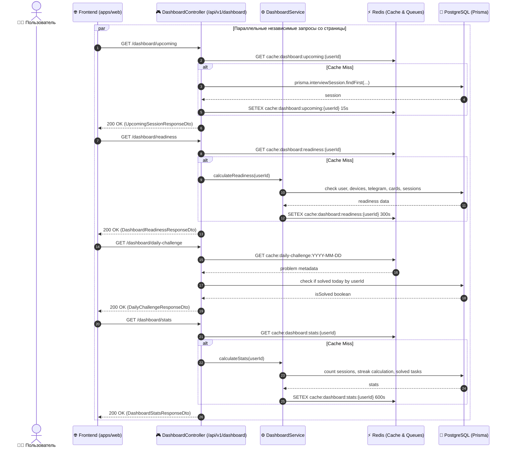
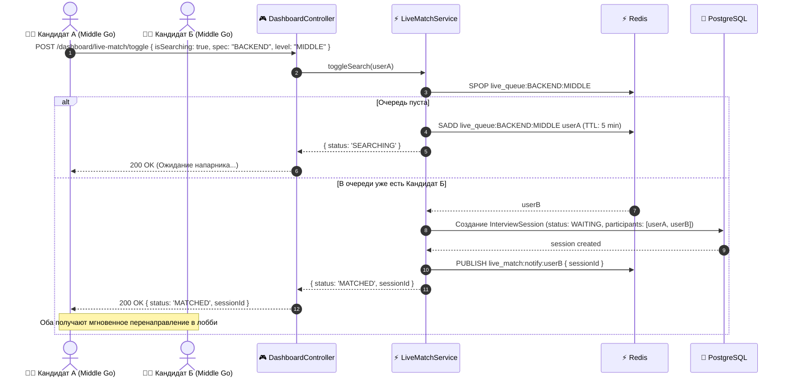

# Задачи: Backend API панели управления (Dashboard API)

Данный документ содержит полную техническую спецификацию, архитектуру данных, DTO-контракты, алгоритмы и исчерпывающую декомпозицию задач для реализации модульных REST-эндпоинтов главной панели управления (**User Dashboard**) в сервисе **`apps/api`** (NestJS, Prisma, PostgreSQL, Redis, Swagger/OpenAPI) и DTO-схем в **`packages/dto`**.

---

## 1. Цели и принципы проектирования

Панель управления (`/dashboard`) — центральный экран кандидата, аккумулирующий статус подготовки, ближайшие встречи, заявки на матчи, активность и алгоритмические задачи.

### Ключевые требования:
1. **Изоляция сбоев (Failure Isolation):** Каждый блок дашборда обслуживается собственной изолированной ручкой. Сбой в расчете AI-инсайтов или статистики не должен блокировать выдачу информации о ближайшем интервью.
2. **Мгновенный TTI (<25 мс):** Критичные данные (`upcoming`, `readiness`, `showcase-status`) кэшируются в Redis или выбираются по индексам.
3. **Безопасность данных (Zero Data Leak):** В селекторах Prisma строго исключаются чувствительные данные (`passwordHash`, сервисные токены, системные метаданные).
4. **Масштабируемость матчмейкинга:** Режим живого поиска (`Live Match`) реализован на базе Redis Sets с автоматическим TTL, исключающим утечки зависших пользователей.
5. **Строгая типизация:** Все DTO описаны с валидацией `class-validator` и Swagger-декораторами для Orval автогенерации клиента в `@packages/api`.

---

## 2. Архитектура и диаграммы взаимодействия

### 2.1 Архитектурная схема компонентов

```text
┌────────────────────────────────────────────────────────────────────────┐
│                        apps/web (TanStack Query)                       │
│  [Upcoming]  [Readiness]  [DailyChallenge]  [LiveMatch]  [Stats] ...   │
└───────────────────────────────────┬────────────────────────────────────┘
                                    │ HTTPS (Bearer JWT)
                                    ▼
┌────────────────────────────────────────────────────────────────────────┐
│                  apps/api (DashboardController)                        │
│            @UseGuards(JwtAuthGuard) /api/v1/dashboard/*                │
├────────────────────────────────────────────────────────────────────────┤
│                       DashboardService (Фасад)                         │
│  ┌─────────────────────────┬─────────────────────────┬───────────────┐ │
│  │ DashboardStatsService   │ DashboardReadinessSvc   │ LiveMatchSvc  │ │
│  ├─────────────────────────┼─────────────────────────┼───────────────┤ │
│  │ DashboardChallengeSvc   │ DashboardCacheService   │ EventListener │ │
│  └─────────────────────────┴─────────────────────────┴───────────────┘ │
└──────────────────┬─────────────────────────────────┬───────────────────┘
                   │                                 │
                   ▼                                 ▼
      ┌─────────────────────────┐       ┌─────────────────────────┐
      │     ⚡ Redis Cache      │       │   🐘 PostgreSQL DB      │
      │  cache:dashboard:*      │       │     Prisma Client       │
      │  live_queue:*           │       │  Sessions, Users, Cards │
      └─────────────────────────┘       └─────────────────────────┘
```

### 2.2 Диаграмма последовательности: параллельный гранулярный запрос



### 2.3 Диаграмма последовательности: Режим Live Match (Мгновенный поиск)



---

## 3. Спецификация контрактов и DTO (`packages/dto`)

Все DTO размещаются в `packages/dto/src/dashboard/` и строго экспортируются в корень пакета.

### 3.1 Ближайшая сессия (`upcoming-session.dto.ts`)
```typescript
import { ApiProperty, ApiPropertyOptional } from '@nestjs/swagger';
import { InterviewParticipantRole, InterviewSessionStatus, Specialization, ExperienceLevel } from '@packages/types';

export class UpcomingPartnerDto {
  @ApiProperty({ example: 'a1b2c3d4-e5f6-7890-abcd-ef1234567890' })
  id: string;

  @ApiProperty({ example: 'Алексей Смирнов' })
  displayName: string;

  @ApiPropertyOptional({ example: 'https://cdn.example.com/avatar.png' })
  avatarUrl?: string;

  @ApiPropertyOptional({ enum: Specialization, example: Specialization.BACKEND })
  specialization?: Specialization;

  @ApiPropertyOptional({ enum: ExperienceLevel, example: ExperienceLevel.MIDDLE })
  level?: ExperienceLevel;
}

export class UpcomingSessionDto {
  @ApiProperty({ example: 'b2c3d4e5-f6a7-8901-bcde-f12345678901' })
  id: string;

  @ApiProperty({ example: 'Mock по System Design и Concurrency' })
  title: string;

  @ApiProperty({ enum: InterviewSessionStatus, example: InterviewSessionStatus.SCHEDULED })
  status: InterviewSessionStatus;

  @ApiProperty({ example: '2026-09-28T16:00:00.000Z' })
  scheduledAt: string;

  @ApiProperty({ enum: InterviewParticipantRole, example: InterviewParticipantRole.CANDIDATE })
  role: InterviewParticipantRole;

  @ApiPropertyOptional({ type: UpcomingPartnerDto })
  partner?: UpcomingPartnerDto;

  @ApiProperty({ 
    description: 'Флаг готовности к входу. true, если до старта <= 10 минут или статус WAITING/ACTIVE',
    example: true 
  })
  isReadyToJoin: boolean;

  @ApiProperty({ description: 'Осталось секунд до старта', example: 450 })
  secondsUntilStart: number;
}

export class UpcomingSessionResponseDto {
  @ApiProperty({ example: true })
  hasUpcoming: boolean;

  @ApiPropertyOptional({ type: UpcomingSessionDto })
  session?: UpcomingSessionDto;
}
```

### 3.2 Чек-лист готовности профиля (`dashboard-readiness.dto.ts`)
```typescript
import { ApiProperty } from '@nestjs/swagger';

export enum ReadinessStepKey {
  EMAIL_CONFIRMED = 'EMAIL_CONFIRMED',
  MEDIA_CONFIGURED = 'MEDIA_CONFIGURED',
  TELEGRAM_LINKED = 'TELEGRAM_LINKED',
  SHOWCASE_CREATED = 'SHOWCASE_CREATED',
  FIRST_MOCK_COMPLETED = 'FIRST_MOCK_COMPLETED',
}

export class ReadinessStepDto {
  @ApiProperty({ enum: ReadinessStepKey, example: ReadinessStepKey.TELEGRAM_LINKED })
  key: ReadinessStepKey;

  @ApiProperty({ example: 'Привязать Telegram для звонков и пушей' })
  title: string;

  @ApiProperty({ example: 'Получайте уведомления о матчах прямо в мессенджер' })
  description: string;

  @ApiProperty({ example: false })
  isCompleted: boolean;

  @ApiProperty({ example: '/dashboard/profile#telegram' })
  actionUrl: string;
}

export class DashboardReadinessResponseDto {
  @ApiProperty({ description: 'Процент готовности профиля от 0 до 100', example: 80 })
  totalPercentage: number;

  @ApiProperty({ example: false })
  isFullyReady: boolean;

  @ApiProperty({ type: [ReadinessStepDto] })
  steps: ReadinessStepDto[];
}
```

### 3.3 Задача дня (`daily-challenge.dto.ts`)
```typescript
import { ApiProperty, ApiPropertyOptional } from '@nestjs/swagger';

export class DailyChallengeResponseDto {
  @ApiProperty({ example: 'problem-lru-cache' })
  problemId: string;

  @ApiProperty({ example: '146. LRU Cache' })
  title: string;

  @ApiProperty({ enum: ['EASY', 'MEDIUM', 'HARD'], example: 'MEDIUM' })
  difficulty: 'EASY' | 'MEDIUM' | 'HARD';

  @ApiProperty({ example: ['Hash Table', 'Linked List', 'Design'] })
  tags: string[];

  @ApiProperty({ description: 'Секунд до смены задачи дня (до 00:00 UTC)', example: 42100 })
  timeUntilResetSeconds: number;

  @ApiProperty({ example: false })
  isSolvedToday: boolean;

  @ApiPropertyOptional({ example: '2026-09-27T08:30:00.000Z' })
  solvedAt?: string;

  @ApiProperty({ description: 'Опыт за решение', example: 50 })
  pointsReward: number;
}
```

### 3.4 Режим Live Match (`live-match.dto.ts`)
```typescript
import { ApiProperty, ApiPropertyOptional } from '@nestjs/swagger';
import { IsBoolean, IsEnum, IsOptional } from 'class-validator';
import { Specialization, ExperienceLevel } from '@packages/types';

export class LiveMatchToggleDto {
  @ApiProperty({ example: true })
  @IsBoolean()
  isSearching: boolean;

  @ApiPropertyOptional({ enum: Specialization })
  @IsOptional()
  @IsEnum(Specialization)
  specialization?: Specialization;

  @ApiPropertyOptional({ enum: ExperienceLevel })
  @IsOptional()
  @IsEnum(ExperienceLevel)
  level?: ExperienceLevel;
}

export enum LiveMatchStatus {
  IDLE = 'IDLE',
  SEARCHING = 'SEARCHING',
  MATCHED = 'MATCHED',
}

export class LiveMatchStatusResponseDto {
  @ApiProperty({ enum: LiveMatchStatus, example: LiveMatchStatus.SEARCHING })
  status: LiveMatchStatus;

  @ApiPropertyOptional({ example: 'c3d4e5f6-a7b8-9012-cdef-123456789012' })
  sessionId?: string;

  @ApiPropertyOptional({ description: 'Примерное время поиска в секундах', example: 45 })
  estimatedWaitSeconds?: number;
}
```

### 3.5 Сводка показателей и стрик (`dashboard-stats.dto.ts`)
```typescript
import { ApiProperty } from '@nestjs/swagger';

export class SolvedTasksBreakdownDto {
  @ApiProperty({ example: 42 })
  total: number;

  @ApiProperty({ example: 20 })
  easy: number;

  @ApiProperty({ example: 18 })
  medium: number;

  @ApiProperty({ example: 4 })
  hard: number;
}

export class DashboardStatsResponseDto {
  @ApiProperty({ example: 15 })
  totalInterviews: number;

  @ApiProperty({ example: 12 })
  completedInterviews: number;

  @ApiProperty({ description: 'Средний балл от 0.0 до 10.0', example: 8.6, nullable: true })
  averageScore: number | null;

  @ApiProperty({ description: 'Текущий стрик дней непрерывной активности', example: 5 })
  currentStreakDays: number;

  @ApiProperty({ example: 14 })
  maxStreakDays: number;

  @ApiProperty({ type: SolvedTasksBreakdownDto })
  solvedTasks: SolvedTasksBreakdownDto;

  @ApiProperty({ description: 'Общее время практики в минутах', example: 780 })
  totalPracticeTimeMinutes: number;
}
```

### 3.6 Входящие заявки на матч (`match-requests.dto.ts`)
```typescript
import { ApiProperty, ApiPropertyOptional } from '@nestjs/swagger';
import { Specialization, ExperienceLevel } from '@packages/types';

export class DashboardMatchRequestItemDto {
  @ApiProperty({ example: 'req-uuid-1234' })
  id: string;

  @ApiProperty({ example: 'usr-uuid-5678' })
  senderId: string;

  @ApiProperty({ example: 'Иван Петров' })
  senderName: string;

  @ApiPropertyOptional({ example: 'https://cdn.example.com/avatar.jpg' })
  senderAvatarUrl?: string;

  @ApiProperty({ enum: Specialization, example: Specialization.BACKEND })
  specialization: Specialization;

  @ApiProperty({ enum: ExperienceLevel, example: ExperienceLevel.MIDDLE })
  level: ExperienceLevel;

  @ApiProperty({ example: ['Golang', 'PostgreSQL', 'Docker'] })
  skills: string[];

  @ApiProperty({ example: '2026-09-27T07:15:00.000Z' })
  createdAt: string;

  @ApiPropertyOptional({ example: 'Привет! Хочу потренировать алгоритмы и concurrency на Go.' })
  message?: string;
}

export class DashboardMatchRequestsResponseDto {
  @ApiProperty({ type: [DashboardMatchRequestItemDto] })
  items: DashboardMatchRequestItemDto[];

  @ApiProperty({ example: 3 })
  totalPendingCount: number;
}
```

### 3.7 Завершенные сессии (`recent-sessions.dto.ts`)
```typescript
import { ApiProperty, ApiPropertyOptional } from '@nestjs/swagger';
import { InterviewParticipantRole, Specialization, ExperienceLevel } from '@packages/types';

export class RecentSessionItemDto {
  @ApiProperty({ example: 'sess-uuid-001' })
  id: string;

  @ApiProperty({ example: 'Mock: System Design Мессенджера' })
  title: string;

  @ApiProperty({ example: '2026-09-26T18:45:00.000Z' })
  completedAt: string;

  @ApiProperty({ example: 60 })
  durationMinutes: number;

  @ApiPropertyOptional({ example: 8.5 })
  score?: number;

  @ApiPropertyOptional({ enum: Specialization, example: Specialization.BACKEND })
  specialization?: Specialization;

  @ApiPropertyOptional({ enum: ExperienceLevel, example: ExperienceLevel.SENIOR })
  level?: ExperienceLevel;

  @ApiProperty({ enum: InterviewParticipantRole, example: InterviewParticipantRole.CANDIDATE })
  role: InterviewParticipantRole;

  @ApiProperty({ example: true })
  hasFeedbackReport: boolean;
}

export class RecentSessionsResponseDto {
  @ApiProperty({ type: [RecentSessionItemDto] })
  items: RecentSessionItemDto[];
}
```

### 3.8 AI-Инсайты (`dashboard-insights.dto.ts`)
```typescript
import { ApiProperty, ApiPropertyOptional } from '@nestjs/swagger';

export class AiInsightItemDto {
  @ApiProperty({ example: 'ins-1' })
  id: string;

  @ApiProperty({ enum: ['ALGORITHMS', 'SYSTEM_DESIGN', 'COMMUNICATION', 'CODE_QUALITY'], example: 'ALGORITHMS' })
  category: 'ALGORITHMS' | 'SYSTEM_DESIGN' | 'COMMUNICATION' | 'CODE_QUALITY';

  @ApiProperty({ example: 'Оценка пространственной сложности (Space Complexity)' })
  headline: string;

  @ApiProperty({ example: 'В последних сессиях вы забывали учесть стек вызовов при рекурсии в графах. Рекомендуем повторить DFS.' })
  recommendation: string;

  @ApiPropertyOptional({ example: '/dashboard/sandbox?topic=graphs' })
  practiceUrl?: string;
}

export class DashboardInsightsResponseDto {
  @ApiProperty({ type: [AiInsightItemDto] })
  insights: AiInsightItemDto[];

  @ApiPropertyOptional({ example: 'Ваш сильный навык — построение архитектуры БД (9.2/10). Фокус недели: алгоритмы.' })
  overallSummary?: string;
}
```

### 3.9 Статус анкеты на витрине (`showcase-status.dto.ts`)
```typescript
import { ApiProperty, ApiPropertyOptional } from '@nestjs/swagger';
import { Specialization, ExperienceLevel } from '@packages/types';

export class ActiveShowcaseCardDetailsDto {
  @ApiProperty({ example: 'card-uuid-999' })
  id: string;

  @ApiProperty({ enum: Specialization, example: Specialization.FRONTEND })
  specialization: Specialization;

  @ApiProperty({ enum: ExperienceLevel, example: ExperienceLevel.MIDDLE })
  level: ExperienceLevel;

  @ApiProperty({ example: true })
  isUrgent: boolean;

  @ApiProperty({ example: '2026-10-10T12:00:00.000Z' })
  expiresAt: string;

  @ApiProperty({ example: 13 })
  daysLeft: number;

  @ApiProperty({ description: 'Можно ли поднять в топ (прошло >= 24ч с последнего bump)', example: true })
  canBump: boolean;

  @ApiProperty({ example: '2026-09-25T10:00:00.000Z' })
  lastBumpedAt: string;

  @ApiProperty({ example: 28 })
  viewsCount: number;

  @ApiProperty({ example: 4 })
  incomingRequestsCount: number;
}

export class ShowcaseStatusResponseDto {
  @ApiProperty({ example: true })
  hasActiveCard: boolean;

  @ApiPropertyOptional({ type: ActiveShowcaseCardDetailsDto })
  card?: ActiveShowcaseCardDetailsDto;
}
```

---

## 4. Алгоритмы бизнес-логики и детали реализации

### 4.1 Алгоритм подсчета непрерывного стрика (`calculateStreak`)
Стрик считается по дням активности. Активностью считается:
* Прохождение интервью (`InterviewSession.status = COMPLETED`);
* Решение задачи дня (`DailyChallenge` решена);
* Успешная сдача задачи в песочнице (`ExecutionSubmission` с прохождением всех тестов).

```typescript
export function calculateStreakFromDates(activityDates: Date[], clientTimeZone = 'UTC'): { current: number; max: number } {
  if (!activityDates.length) return { current: 0, max: 0 };

  // 1. Нормализация дат к началу календарных суток по таймзоне
  const uniqueDayKeys = new Set(
    activityDates.map((date) => formatInTimeZone(date, clientTimeZone, 'yyyy-MM-dd'))
  );
  const sortedDays = Array.from(uniqueDayKeys).sort().reverse(); // от новых к старым

  const todayKey = formatInTimeZone(new Date(), clientTimeZone, 'yyyy-MM-dd');
  const yesterdayKey = formatInTimeZone(subDays(new Date(), 1), clientTimeZone, 'yyyy-MM-dd');

  // Если нет активности ни сегодня, ни вчера — стрик сгорел
  const hasActivityRecently = sortedDays.includes(todayKey) || sortedDays.includes(yesterdayKey);
  if (!hasActivityRecently) {
    return { current: 0, max: calculateMaxStreak(sortedDays) };
  }

  let currentStreak = 0;
  let checkDate = sortedDays.includes(todayKey) ? new Date() : subDays(new Date(), 1);

  while (true) {
    const key = formatInTimeZone(checkDate, clientTimeZone, 'yyyy-MM-dd');
    if (uniqueDayKeys.has(key)) {
      currentStreak++;
      checkDate = subDays(checkDate, 1);
    } else {
      break;
    }
  }

  return { current: currentStreak, max: Math.max(currentStreak, calculateMaxStreak(sortedDays)) };
}
```

### 4.2 Алгоритм Live Match (Быстрый поиск)
* **Структура ключа:** `live_queue:{specialization}:{level}`.
* **Использование `Redis SPOP`:** Атомарное извлечение случайного участника из очереди.
* **Защита от зависших заявок:** Пользователь пишет свой `userId` с timestamp. Воркер или cron проверяет heartbeat (5 мин) и удаляет просроченные заявки.
* **Событие спаривания:** Создается сессия в БД через транзакцию `prisma.$transaction`, обоим пользователям через Redis Pub/Sub и WebSocket (`apps/realtime`) шлется событие `MATCH_FOUND` с ID созданной комнаты.

### 4.3 Алгоритм выбора задачи дня (`DailyChallenge`)
* На входе: системный список алгоритмических задач из базы.
* Детерминированный хэш: `seed = hash('YYYY-MM-DD')`.
* `index = seed % totalProblemsCount`.
* В 00:00 UTC кэш инвалидируется, все пользователи мира в один день получают одну и ту же задачу, что стимулирует обсуждение и совместное решение.

---

## 5. Политика кэширования в Redis и ключи

| Ключ | Тип | TTL | Событие инвалидации |
| :--- | :--- | :--- | :--- |
| `cache:dashboard:upcoming:{userId}` | String (JSON) | 15 сек | Создание сессии, отмена, завершение |
| `cache:dashboard:readiness:{userId}` | String (JSON) | 5 мин | Привязка Telegram, сохранение настроек медиа |
| `cache:daily-challenge:today` | String (JSON) | До 00:00 UTC | Автоматическая ротация суток |
| `cache:dashboard:stats:{userId}` | String (JSON) | 10 мин | Завершение сессии, решение задачи |
| `cache:dashboard:recent:{userId}` | String (JSON) | 60 сек | Завершение сессии |
| `cache:dashboard:insights:{userId}` | String (JSON) | 30 мин | Добавление фидбека по сессии |
| `cache:dashboard:showcase:{userId}` | String (JSON) | 60 сек | Обновление анкеты, нажатие `bump` |
| `live_queue:{spec}:{level}` | Set (userIds) | 5 мин | Выход из поиска, нахождение пары |

---

## 6. Пошаговые задачи реализации (Backend)

### Этап 1: Пакет DTO (`packages/dto`)
- [x] **TASK-BACK-01**: Создать директорию `packages/dto/src/dashboard/`.
- [x] **TASK-BACK-02**: Реализовать `UpcomingSessionResponseDto` и `UpcomingPartnerDto` с валидацией.
- [x] **TASK-BACK-03**: Реализовать `DashboardReadinessResponseDto` и `ReadinessStepDto`.
- [x] **TASK-BACK-04**: Реализовать `DailyChallengeResponseDto`.
- [x] **TASK-BACK-05**: Реализовать `LiveMatchToggleDto` и `LiveMatchStatusResponseDto`.
- [x] **TASK-BACK-06**: Реализовать `DashboardStatsResponseDto` и `SolvedTasksBreakdownDto`.
- [x] **TASK-BACK-07**: Реализовать `DashboardMatchRequestsResponseDto` и `DashboardMatchRequestItemDto`.
- [x] **TASK-BACK-08**: Реализовать `RecentSessionsResponseDto`, `DashboardInsightsResponseDto`, `ShowcaseStatusResponseDto`.
- [x] **TASK-BACK-09**: Экспортировать все схемы в `packages/dto/src/index.ts` и проверить компиляцию пакета `pnpm build`.

### Этап 2: Модуль и контроллер (`apps/api`)
- [x] **TASK-BACK-10**: Создать модуль `apps/api/src/modules/dashboard/dashboard.module.ts` и импортировать в `app.module.ts`.
- [x] **TASK-BACK-11**: Создать `DashboardController` со всеми 9 маршрутами:
  - `GET /api/v1/dashboard/upcoming`
  - `GET /api/v1/dashboard/readiness`
  - `GET /api/v1/dashboard/daily-challenge`
  - `POST /api/v1/dashboard/live-match/toggle`
  - `GET /api/v1/dashboard/match-requests`
  - `GET /api/v1/dashboard/stats`
  - `GET /api/v1/dashboard/recent-sessions`
  - `GET /api/v1/dashboard/insights`
  - `GET /api/v1/dashboard/showcase-status`
- [x] **TASK-BACK-12**: Добавить Swagger-аннотации (`@ApiTags('Dashboard')`, `@ApiBearerAuth()`, `@ApiResponse`).

### Этап 3: Сервисный слой и логика запросов
- [x] **TASK-BACK-13**: Реализовать `DashboardService.getUpcomingSession(userId)`:
  - Выборка ближайшей сессии (`SCHEDULED`, `WAITING`, `ACTIVE`).
  - Вычисление `isReadyToJoin` (до старта <= 10 мин или уже активна).
  - Подгрузка данных собеседника (без паролей и лишних полей).
- [x] **TASK-BACK-14**: Реализовать `DashboardReadinessService.getReadiness(userId)`:
  - Проверка 5 шагов (email, медиа, telegram, витрина, первое интервью).
  - Расчет итогового процента.
- [x] **TASK-BACK-15**: Реализовать `DashboardChallengeService.getDailyChallenge(userId)`:
  - Детерминированный выбор задачи по хэшу даты.
  - Проверка сабмита пользователя за текущие сутки.
- [x] **TASK-BACK-16**: Реализовать `DashboardLiveMatchService.toggleLiveMatch(userId, dto)`:
  - Атомарное добавление/удаление из Redis Set.
  - Создание комнаты при спаривании и отправка события.
- [x] **TASK-BACK-17**: Реализовать `DashboardStatsService.getStats(userId)`:
  - Выборка уникальных дней активности и вызов `calculateStreakFromDates`.
  - Подсчет решенных задач (Easy, Med, Hard).
- [x] **TASK-BACK-18**: Реализовать выборку `DashboardService.getMatchRequests(userId, limit)`.
- [x] **TASK-BACK-19**: Реализовать выборку `DashboardService.getRecentSessions(userId, limit)`.
- [x] **TASK-BACK-20**: Реализовать сервис `DashboardInsightsService` с агрегацией слабых категорий.
- [x] **TASK-BACK-21**: Реализовать выборку `DashboardService.getShowcaseStatus(userId)` с расчетом кулдауна `bump`.

### Этап 4: Кэширование, события и инвалидация
- [x] **TASK-BACK-22**: Реализовать `DashboardCacheService` с типизированными обертками `getOrSet`.
- [ ] **TASK-BACK-23**: Реализовать `DashboardEventsListener`:
  - Инвалидация статистики и истории при `@OnEvent('session.completed')`.
  - Инвалидация готовности при `@OnEvent('telegram.linked')` и сохранении устройств.
  - Инвалидация витрины при `@OnEvent('showcase.bumped')`.

### Этап 5: Тестирование и документация
- [x] **TASK-BACK-24**: Написать юнит-тесты для алгоритма стрика `calculateStreakFromDates` (сценарии: вчера и сегодня, пропуск дня, високосный год, разные таймзоны).
- [x] **TASK-BACK-25**: Написать модульные тесты для `DashboardController` и `DashboardReadinessService`.
- [x] **TASK-BACK-26**: Проверить генерацию OpenAPI и TypeScript клиента через Orval (`pnpm openapi:generate`).


---

## 7. Критерии приемки (Acceptance Criteria)

1. Все 9 эндпоинтов работают независимо. Отказ или таймаут одного эндпоинта не влияет на ответы остальных.
2. Ручки `/upcoming`, `/readiness`, `/daily-challenge` отвечают быстрее 25 мс из кэша Redis.
3. Время жизни очереди Live Match в Redis составляет 5 минут, исключая накопление офлайн-пользователей.
4. Решение задачи дня сразу засчитывается в текущий стрик активности кандидата.
5. Неавторизованные запросы блокируются на уровне `JwtAuthGuard` с кодом 401.
6. В ответах API полностью отсутствуют конфиденциальные данные пользователей (`passwordHash`, `telegramChatId`).

---

## 8. Архитектурный долг и проблемы синхронизации сессий (SessionsService & Redis Mirroring)

В процессе ревью механизма синхронизации сессий (`reconcileMirrors` в `SessionsService`), напрямую влияющего на выдачу активных и ближайших интервью дашборда (`/upcoming`, `/recent-sessions`, `/live-match`), были выявлены критические проблемы целостности данных, безопасности и масштабируемости.

### 8.1 Детальный реестр выявленных проблем

#### 1. Race condition: воскрешение закрытых сессий (Data Inconsistency)
* **Что неправильно:** Метод в начале делает снимок всех активных сессий через `findMany`, а затем в медленном цикле последовательно перезаписывает ключи в Redis:
  ```typescript
  await this.redis.set(activeKey, ACTIVE_VALUE, this.mirrorTtlSeconds);
  ```
* **Почему это проблема:** Если во время выполнения цикла пользователь или админ закрывает сессию через `closeSession(id)` (где статус в Postgres меняется на `CLOSED`, а ключ в Redis выставляется в `"closed"` и инвайт удаляется), итератор cron дойдет до этой сессии и безусловно запишет `ACTIVE_VALUE` и новый инвайт поверх закрытой сессии.
* **Impact:** Закрытая сессия «воскресает» в Redis. Пользователи смогут продолжать подключаться в realtime к уже завершенному интервью, списывая ресурсы сервиса.
* **Как исправить:** Проверять актуальный статус перед записью или использовать Lua-скрипт / транзакцию (не перезаписывать ключ, если он уже выставлен в `CLOSED_VALUE`).

#### 2. Утечка прав и накопление зомби-участников (Security & Authorization Drift)
* **Что неправильно:** Хэш участников в Redis наполняется инкрементально через `hset`:
  ```typescript
  for (const participant of session.participants) {
    await this.redis.hset(membersKey, participant.userId, participant.role.toString(), this.mirrorTtlSeconds);
  }
  ```
* **Почему это проблема:** Хэш `session:{id}:members` **не очищается перед синхронизацией**. Если участник был удален или исключен из сессии в Postgres, его старое поле в Redis Hash останется нетронутым.
* **Impact:** Go realtime service авторизует доступ в комнату по Redis Hash `session:{id}:members`. Исключенный участник сохранит доступ к видеосвязи и коду сессии.
* **Как исправить:** Атомарно перезаписывать хэш участников через pipeline (`DEL membersKey` + мульти-`HSET` + `EXPIRE`).

#### 3. Инвалидация и поломка отправленных приглашений (Broken Links UX)
* **Что неправильно:** `inviteToken` не хранится в Postgres (его нет в схеме Prisma). Если ключ `inviteKey` в Redis отсутствует или истек, cron генерирует совершенно новый случайный токен:
  ```typescript
  if (!existingInvite) {
    const token = this.generateInviteToken(session.id);
    await this.redis.set(inviteKey, token, this.mirrorTtlSeconds);
  }
  ```
* **Почему это проблема:** При перезагрузке Redis или истечении TTL cron генерирует новый псевдослучайный токен.
* **Impact:** Ранее отправленные кандидатам ссылки в Telegram / Email внезапно перестанут работать (`403 Forbidden: Invalid invite token`). Кандидат не сможет зайти на запланированное собеседование.
* **Как исправить:** Сохранять `inviteToken` в таблице `InterviewSession` в Postgres (как source of truth) либо детерминированно вычислять токен через HMAC от `sessionId` + системного секрета.

#### 4. Сетевой N+1 к Redis и блокировка Event Loop (Performance)
* **Что неправильно:** На каждую сессию в цикле последовательно выполняются:
  - `exists(activeKey)` (1 сетевой вызов);
  - `set(activeKey, ...)` (1 сетевой вызов);
  - `hset(membersKey, ...)` для каждого участника (при этом внутри `RedisService.hset` вызывается `HSET` + отдельный `EXPIRE`!);
  - `get(inviteKey)` (1 сетевой вызов);
  - `set(inviteKey, ...)` (1 сетевой вызов).
* **Почему это проблема:** Для 200 активных сессий с 2 участниками это порядка 1600 последовательных `await` roundtrip-запросов по сети к Redis.
* **Impact:** Цикл может выполняться десятки секунд, создавая задержки в очереди Node.js Event Loop.
* **Как исправить:** Использовать Redis Pipeline (`redis.pipeline()`), отправляя команды батчами на сессию.

#### 5. Загрузка всех сессий в память без пагинации (Memory Spike / OOM)
* **Что неправильно:**
  ```typescript
  const sessions = await this.prisma.interviewSession.findMany({
    where: { status: "ACTIVE" },
    include: { participants: true },
  });
  ```
* **Почему это проблема:** Все сессии и все связанные участники единовременно загружаются в память процесса Node.js.
* **Impact:** При масштабировании сервиса (тысячи одновременных активных интервью) это приведет к резкому спайку RAM и риску падения пода по OOM (Out Of Memory).
* **Как исправить:** Обрабатывать батчами (курсорная пагинация или `take`/`skip` батчами по 50-100 сессий).

#### 6. Конкурентный запуск на нескольких репликах (No Distributed Lock)
* **Что неправильно:** Крон `@Cron(CronExpression.EVERY_HOUR)` запускается в каждом запущенном инстансе `apps/api`.
* **Почему это проблема:** При горизонтальном масштабировании (несколько реплик бекенда в Kubernetes/Docker) все поды одновременно начинают выгребать одни и те же сессии и перезаписывать одни и те же ключи в Redis.
* **Impact:** Неконтролируемая нагрузка на Postgres и Redis, race conditions при проверке `exists` и генерации новых `inviteToken` (токены будут перезаписаны несколько раз подряд).
* **Как исправить:** Использовать распределенный замок (`redis.setNx("lock:reconcile-mirrors", podId, 300)`) или вынести запуск в отдельный scheduler worker.

#### 7. Общий `try-catch` обрывает восстановление всех остальных сессий (Fault Tolerance)
* **Что неправильно:** Вся выборка и весь цикл `for (const session of sessions)` завернуты в единый `try-catch`.
* **Почему это проблема:** Если на одной сессии произойдет сбой (таймаут сети или временный сбой соединения с Redis), управление сразу уйдет в `catch`, и остальные сессии **не будут восстановлены**.
* **Impact:** Одна проблемная сессия ломает синхронизацию для всей платформы на целый час.
* **Как исправить:** Изолировать обработку каждой отдельной сессии (или батча) в свой независимый `try-catch`.

#### 8. Магическая строка `"ACTIVE"` вместо Enum (Type Safety)
* **Что неправильно:** `where: { status: "ACTIVE" }` вместо использования типизированного enum.
* **Почему это проблема:** Нарушение type-safety и правил типизации проекта.
* **Impact:** При рефакторинге статусов (или смене enum) TypeScript не отследит эту строку.
* **Как исправить:** Заменить на `InterviewSessionStatus.ACTIVE`.

---

### 8.2 Задачи по устранению техдолга синхронизации (Этап 6)
- [x] **TASK-BACK-27**: Устранить race condition при закрытии сессий в `reconcileMirrors` (проверка `CLOSED_VALUE` перед перезаписью через Lua-скрипт).
- [x] **TASK-BACK-28**: Реализовать атомарную перезапись участников `session:{id}:members` (защита от зомби-участников через `DEL` + `HSET` в Lua-скрипте).
- [x] **TASK-BACK-29**: Защитить валидные инвайт-токены в Redis от сброса и инвалидации при сверке (продление TTL существующего токена в Lua-скрипте).
- [x] **TASK-BACK-30**: Устранить сетевой N+1 и перевести операции в `reconcileMirrors` на атомарный Lua-батчинг (`RECONCILE_SESSION_MIRROR_LUA`).
- [x] **TASK-BACK-31**: Добавить курсорную пагинацию (батчи по 50 сессий) активных сессий в `reconcileMirrors` (защита от OOM).
- [x] **TASK-BACK-32**: Реализовать распределенный замок (`distributed lock`) для крон-задачи через `RedisService.setNx` и безопасное снятие через `compareAndDelete`.
- [x] **TASK-BACK-33**: Добавить изолированный `try-catch` для каждой сессии с логированием метрик ошибок.
- [x] **TASK-BACK-34**: Заменить магическую строку `"ACTIVE"` на `InterviewSessionStatus.ACTIVE`.

