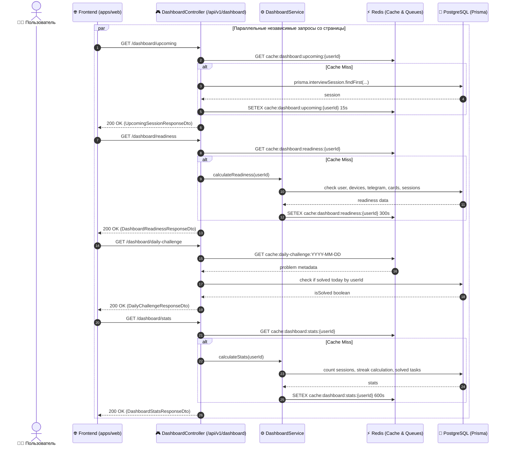
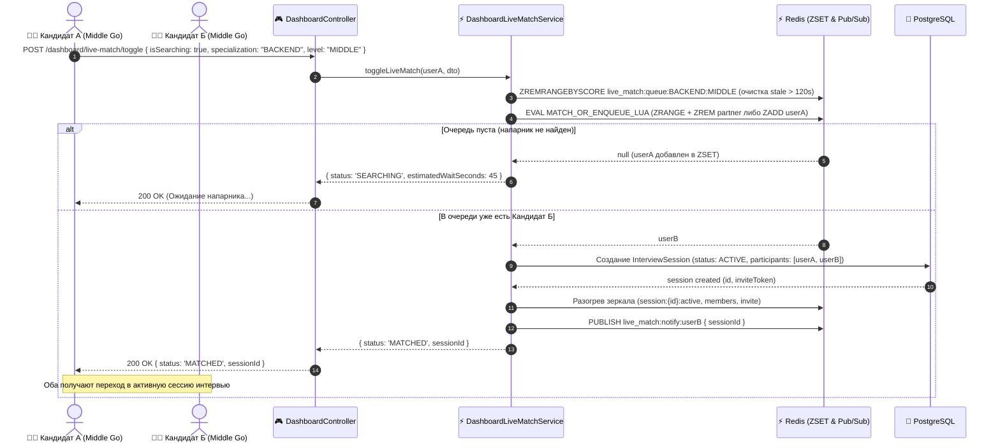

# Задачи: Backend API панели управления (Dashboard API)

Данный документ содержит полную техническую спецификацию, архитектуру данных, DTO-контракты, алгоритмы и исчерпывающую декомпозицию задач для реализации модульных REST-эндпоинтов главной панели управления (**User Dashboard**) в сервисе **`apps/api`** (NestJS, Prisma, PostgreSQL, Redis, Swagger/OpenAPI) и DTO-схем в **`packages/dto`**.

---

## 1. Цели и принципы проектирования

Панель управления (`/dashboard`) — центральный экран кандидата, аккумулирующий статус подготовки, ближайшие встречи, заявки на матчи, активность и алгоритмические задачи.

### Ключевые требования:
1. **Изоляция сбоев (Failure Isolation):** Каждый блок дашборда обслуживается собственной изолированной ручкой. Сбой в расчете AI-инсайтов или статистики не должен блокировать выдачу информации о ближайшем интервью.
2. **Мгновенный TTI (<25 мс):** Критичные данные (`upcoming`, `readiness`, `showcase-status`) кэшируются в Redis или выбираются по индексам.
3. **Безопасность данных (Zero Data Leak):** В селекторах Prisma строго исключаются чувствительные данные (`passwordHash`, сервисные токены, системные метаданные).
4. **Масштабируемость матчмейкинга:** Режим живого поиска (`Live Match`) реализован на базе Redis Sorted Sets (`ZSET`) с атомарным Lua-скриптом (`MATCH_OR_ENQUEUE_LUA`) и time-based очисткой устаревших заявок (120 секунд), исключающим утечки зависших пользователей.
5. **Строгая типизация:** Все DTO описаны через схемы Zod в пакете `packages/dto` и валидируются в NestJS через `ZodValidationPipe`, регистрируясь в OpenAPI/Swagger для Orval-автогенерации клиента в `@packages/api`.

---

## 2. Архитектура и диаграммы взаимодействия

### 2.1 Архитектурная схема компонентов

```text
┌────────────────────────────────────────────────────────────────────────┐
│                        apps/web (TanStack Query)                       │
│  [Upcoming]  [Readiness]  [DailyChallenge]  [LiveMatch]  [Stats] ...   │
└───────────────────────────────────┬────────────────────────────────────┘
                                    │ HTTPS (Bearer JWT)
                                    ▼
┌────────────────────────────────────────────────────────────────────────┐
│                  apps/api (DashboardController)                        │
│            @UseGuards(JwtAuthGuard) /api/v1/dashboard/*                │
├────────────────────────────────────────────────────────────────────────┤
│                       DashboardService (Фасад)                         │
│  ┌─────────────────────────┬─────────────────────────┬───────────────┐ │
│  │ DashboardStatsService   │ DashboardReadinessSvc   │ LiveMatchSvc  │ │
│  ├─────────────────────────┼─────────────────────────┼───────────────┤ │
│  │ DashboardChallengeSvc   │ DashboardCacheService   │ EventListener │ │
│  └─────────────────────────┴─────────────────────────┴───────────────┘ │
└──────────────────┬─────────────────────────────────┬───────────────────┘
                   │                                 │
                   ▼                                 ▼
      ┌─────────────────────────┐       ┌─────────────────────────┐
      │     ⚡ Redis Cache      │       │   🐘 PostgreSQL DB      │
      │  cache:dashboard:*      │       │     Prisma Client       │
      │  live_match:queue:*     │       │  Sessions, Users, Cards │
      └─────────────────────────┘       └─────────────────────────┘
```

### 2.2 Диаграмма последовательности: параллельный гранулярный запрос



### 2.3 Диаграмма последовательности: Режим Live Match (Мгновенный поиск)



---

## 3. Спецификация контрактов и DTO (`packages/dto`)

Все контракты и схемы валидации размещаются в `packages/dto/src/dashboard/dashboard.dto.ts` на базе **Zod** (`z.object`, `z.enum`, `z.infer`), а TypeScript-типы выводятся напрямую из схем. В NestJS спецификация OpenAPI автоматически формируется через helper `registerSchema` (`zod-openapi`), что гарантирует синхронизацию контрактов валидации и документации Swagger.

### 3.1 Ближайшая сессия (`upcoming-session.dto.ts`)
```typescript
import { z } from "zod";
import { interviewParticipantRoleSchema } from "../sessions/participant.dto";
import {
  type InterviewSessionStatus,
  interviewSessionStatusSchema,
} from "../sessions/session-status.dto";
import {
  experienceLevelEnum,
  specializationEnum,
} from "../showcase/showcase.enums";

export { interviewSessionStatusSchema, type InterviewSessionStatus };

export const upcomingPartnerSchema = z.object({
  id: z.string().uuid(),
  displayName: z.string().nullable(),
  username: z.string().nullable(),
  avatarUrl: z.string().nullable(),
  specialization: specializationEnum.nullable().optional(),
  level: experienceLevelEnum.nullable().optional(),
});
export type UpcomingPartnerDto = z.infer<typeof upcomingPartnerSchema>;

export const upcomingSessionSchema = z.object({
  id: z.string().uuid(),
  title: z.string(),
  status: interviewSessionStatusSchema, // CREATED | ACTIVE | CLOSED
  scheduledAt: z.string(),
  role: interviewParticipantRoleSchema,
  partner: upcomingPartnerSchema.nullable().optional(),
  isReadyToJoin: z.boolean(), // true, если сессия уже ACTIVE или до старта <= 10 минут
  secondsUntilStart: z.number().int(),
});
export type UpcomingSessionDto = z.infer<typeof upcomingSessionSchema>;

export const upcomingSessionResponseSchema = z.object({
  hasUpcoming: z.boolean(),
  session: upcomingSessionSchema.nullable().optional(),
});
export type UpcomingSessionResponseDto = z.infer<
  typeof upcomingSessionResponseSchema
>;
```

### 3.2 Чек-лист готовности профиля (`dashboard-readiness.dto.ts`)
```typescript
export const readinessStepKeyEnum = z.enum([
  "EMAIL_PROVIDED",
  "MEDIA_CONFIGURED",
  "TELEGRAM_LINKED",
  "SHOWCASE_CREATED",
  "FIRST_MOCK_COMPLETED",
]);
export type ReadinessStepKey = z.infer<typeof readinessStepKeyEnum>;

export const readinessStepSchema = z.object({
  key: readinessStepKeyEnum,
  title: z.string(),
  description: z.string(),
  isCompleted: z.boolean(),
  actionUrl: z.string(),
});
export type ReadinessStepDto = z.infer<typeof readinessStepSchema>;

export const dashboardReadinessResponseSchema = z.object({
  totalPercentage: z.number().int().min(0).max(100),
  isFullyReady: z.boolean(),
  steps: z.array(readinessStepSchema),
});
export type DashboardReadinessResponseDto = z.infer<
  typeof dashboardReadinessResponseSchema
>;
```

### 3.3 Задача дня (`daily-challenge.dto.ts`)
```typescript
export const challengeDifficultyEnum = z.enum(["EASY", "MEDIUM", "HARD"]);
export type ChallengeDifficulty = z.infer<typeof challengeDifficultyEnum>;

export const dailyChallengeResponseSchema = z.object({
  problemId: z.string(),
  title: z.string(),
  difficulty: challengeDifficultyEnum,
  tags: z.array(z.string()),
  timeUntilResetSeconds: z.number().int().nonnegative(),
  isSolvedToday: z.boolean(),
  solvedAt: z.string().nullable().optional(),
  pointsReward: z.number().int().positive(),
});
export type DailyChallengeResponseDto = z.infer<
  typeof dailyChallengeResponseSchema
>;
```

### 3.4 Режим Live Match (`live-match.dto.ts`)
```typescript
export const liveMatchToggleSchema = z.object({
  isSearching: z.boolean(),
  specialization: specializationEnum,
  level: experienceLevelEnum,
});
export type LiveMatchToggleDto = z.infer<typeof liveMatchToggleSchema>;

export const liveMatchStatusEnum = z.enum(["IDLE", "SEARCHING", "MATCHED"]);
export type LiveMatchStatus = z.infer<typeof liveMatchStatusEnum>;

export const liveMatchStatusResponseSchema = z.object({
  status: liveMatchStatusEnum,
  sessionId: z.string().uuid().nullable().optional(),
  estimatedWaitSeconds: z.number().int().optional(),
});
export type LiveMatchStatusResponseDto = z.infer<
  typeof liveMatchStatusResponseSchema
>;
```

### 3.5 Сводка показателей и стрик (`dashboard-stats.dto.ts`)
```typescript
export const solvedTasksBreakdownSchema = z.object({
  total: z.number().int().nonnegative(),
  easy: z.number().int().nonnegative(),
  medium: z.number().int().nonnegative(),
  hard: z.number().int().nonnegative(),
});
export type SolvedTasksBreakdownDto = z.infer<
  typeof solvedTasksBreakdownSchema
>;

export const dashboardStatsResponseSchema = z.object({
  totalInterviews: z.number().int().nonnegative(),
  completedInterviews: z.number().int().nonnegative(),
  averageScore: z.number().nullable(),
  currentStreakDays: z.number().int().nonnegative(),
  maxStreakDays: z.number().int().nonnegative(),
  solvedTasks: solvedTasksBreakdownSchema,
  totalPracticeTimeMinutes: z.number().int().nonnegative(),
});
export type DashboardStatsResponseDto = z.infer<
  typeof dashboardStatsResponseSchema
>;
```

### 3.6 Входящие заявки на матч (`match-requests.dto.ts`)
```typescript
export const dashboardMatchRequestItemSchema = z.object({
  id: z.string().uuid(),
  senderId: z.string().uuid(),
  senderName: z.string().nullable(),
  senderAvatarUrl: z.string().nullable().optional(),
  specialization: specializationEnum.nullable().optional(),
  level: experienceLevelEnum.nullable().optional(),
  skills: z.array(z.string()),
  createdAt: z.string(),
  message: z.string().nullable().optional(),
});
export type DashboardMatchRequestItemDto = z.infer<
  typeof dashboardMatchRequestItemSchema
>;

export const dashboardMatchRequestsResponseSchema = z.object({
  items: z.array(dashboardMatchRequestItemSchema),
  totalPendingCount: z.number().int().nonnegative(),
});
export type DashboardMatchRequestsResponseDto = z.infer<
  typeof dashboardMatchRequestsResponseSchema
>;
```

### 3.7 Завершенные сессии (`recent-sessions.dto.ts`)
```typescript
export const recentSessionItemSchema = z.object({
  id: z.string().uuid(),
  title: z.string(),
  completedAt: z.string(),
  durationMinutes: z.number().int().nonnegative(),
  score: z.number().nullable().optional(),
  specialization: specializationEnum.nullable().optional(),
  level: experienceLevelEnum.nullable().optional(),
  role: interviewParticipantRoleSchema,
  hasFeedbackReport: z.boolean(),
});
export type RecentSessionItemDto = z.infer<typeof recentSessionItemSchema>;

export const recentSessionsResponseSchema = z.object({
  items: z.array(recentSessionItemSchema),
});
export type RecentSessionsResponseDto = z.infer<
  typeof recentSessionsResponseSchema
>;
```

### 3.8 AI-Инсайты (`dashboard-insights.dto.ts`)
```typescript
export const aiInsightCategoryEnum = z.enum([
  "ALGORITHMS",
  "SYSTEM_DESIGN",
  "COMMUNICATION",
  "CODE_QUALITY",
]);
export type AiInsightCategory = z.infer<typeof aiInsightCategoryEnum>;

export const aiInsightItemSchema = z.object({
  id: z.string(),
  category: aiInsightCategoryEnum,
  headline: z.string(),
  recommendation: z.string(),
  practiceUrl: z.string().optional(),
});
export type AiInsightItemDto = z.infer<typeof aiInsightItemSchema>;

export const dashboardInsightsResponseSchema = z.object({
  insights: z.array(aiInsightItemSchema),
  overallSummary: z.string().nullable().optional(),
});
export type DashboardInsightsResponseDto = z.infer<
  typeof dashboardInsightsResponseSchema
>;
```

### 3.9 Статус анкеты на витрине (`showcase-status.dto.ts`)
```typescript
export const activeShowcaseCardDetailsSchema = z.object({
  id: z.string().uuid(),
  specialization: specializationEnum,
  level: experienceLevelEnum,
  isUrgent: z.boolean(),
  expiresAt: z.string(),
  daysLeft: z.number().int().nonnegative(),
  canBump: z.boolean(),
  lastBumpedAt: z.string(),
  viewsCount: z.number().int().nonnegative(),
  incomingRequestsCount: z.number().int().nonnegative(),
});
export type ActiveShowcaseCardDetailsDto = z.infer<
  typeof activeShowcaseCardDetailsSchema
>;

export const showcaseStatusResponseSchema = z.object({
  hasActiveCard: z.boolean(),
  card: activeShowcaseCardDetailsSchema.nullable().optional(),
});
export type ShowcaseStatusResponseDto = z.infer<
  typeof showcaseStatusResponseSchema
>;
```

---

## 4. Алгоритмы бизнес-логики и детали реализации

### 4.1 Алгоритм подсчета непрерывного стрика (`calculateStreak`)
Стрик считается по дням активности. Активностью считается:
* Прохождение интервью (`InterviewSession.status = CLOSED`);
* Решение задачи дня (`DailyChallenge` решена);
* Успешная сдача задачи в песочнице (`ExecutionSubmission` с прохождением всех тестов).

```typescript
export function calculateStreakFromDates(activityDates: Date[], clientTimeZone = 'UTC'): { current: number; max: number } {
  if (!activityDates.length) return { current: 0, max: 0 };

  // 1. Нормализация дат к началу календарных суток по таймзоне
  const uniqueDayKeys = new Set(
    activityDates.map((date) => formatInTimeZone(date, clientTimeZone, 'yyyy-MM-dd'))
  );
  const sortedDays = Array.from(uniqueDayKeys).sort().reverse(); // от новых к старым

  const todayKey = formatInTimeZone(new Date(), clientTimeZone, 'yyyy-MM-dd');
  const yesterdayKey = formatInTimeZone(subDays(new Date(), 1), clientTimeZone, 'yyyy-MM-dd');

  // Если нет активности ни сегодня, ни вчера — стрик сгорел
  const hasActivityRecently = sortedDays.includes(todayKey) || sortedDays.includes(yesterdayKey);
  if (!hasActivityRecently) {
    return { current: 0, max: calculateMaxStreak(sortedDays) };
  }

  let currentStreak = 0;
  let checkDate = sortedDays.includes(todayKey) ? new Date() : subDays(new Date(), 1);

  while (true) {
    const key = formatInTimeZone(checkDate, clientTimeZone, 'yyyy-MM-dd');
    if (uniqueDayKeys.has(key)) {
      currentStreak++;
      checkDate = subDays(checkDate, 1);
    } else {
      break;
    }
  }

  return { current: currentStreak, max: Math.max(currentStreak, calculateMaxStreak(sortedDays)) };
}
```

### 4.2 Алгоритм Live Match (Быстрый поиск)
* **Структура ключа очереди:** `live_match:queue:{specialization}:{level}` (Redis Sorted Set / ZSET).
* **Атомарный поиск и постановка в очередь (`MATCH_OR_ENQUEUE_LUA`):**
  - Очередь хранит `userId` со скором `score = Date.now()` (время постановки в очередь).
  - Атомарный Lua-скрипт извлекает первого доступного партнера (`ZRANGE queueKey 0 0`), удаляет его из ZSET (`ZREM queueKey partnerId`) и возвращает `partnerId`.
  - Если очередь пуста, скрипт атомарно добавляет текущего пользователя (`ZADD queueKey now userId`) и возвращает `nil`.
* **Очистка устаревших заявок (Time-based Pruning):**
  - Перед операцией спаривания сервис выполняет удаление заявок старше 120 секунд: `ZREMRANGEBYSCORE queueKey -inf (now - 120000)`.
  - При ручной отмене поиска (`isSearching: false`) пользователь удаляется из очереди через `ZREM queueKey userId`.
* **Событие спаривания и прогрев сессии:**
  - При нахождении партнера создается сессия в БД через транзакцию `prisma.$transaction` со статусом `ACTIVE` (инициатор — `CANDIDATE`, партнер — `INTERVIEWER`).
  - Сервис прогревает зеркало сессии в Redis для Go realtime service (`session:{id}:active = true`, `session:{id}:members`, `session:{id}:invite`).
  - Партнеру отправляется Pub/Sub уведомление через Redis-канал `PUBLISH live_match:notify:{partnerId} {sessionId}`.

### 4.3 Алгоритм выбора задачи дня (`DailyChallenge`)
* На входе: системный список алгоритмических задач из базы.
* Детерминированный хэш: `seed = hash('YYYY-MM-DD')`.
* `index = seed % totalProblemsCount`.
* В 00:00 UTC кэш инвалидируется, все пользователи мира в один день получают одну и ту же задачу, что стимулирует обсуждение и совместное решение.

---

## 5. Политика кэширования в Redis и ключи

| Ключ | Тип | TTL | Событие инвалидации |
| :--- | :--- | :--- | :--- |
| `cache:dashboard:upcoming:{userId}` | String (JSON) | 15 сек | Создание сессии, закрытие сессии, join/leave участника |
| `cache:dashboard:readiness:{userId}` | String (JSON) | 5 мин | Привязка Telegram, сохранение настроек медиа, обновление профиля |
| `cache:daily-challenge:today` | String (JSON) | До 00:00 UTC | Автоматическая ротация суток |
| `cache:dashboard:stats:{userId}` | String (JSON) | 10 мин | Закрытие сессии, решение задачи |
| `cache:dashboard:recent:{userId}:{limit}` | String (JSON) | 60 сек | Создание сессии, закрытие сессии |
| `cache:dashboard:insights:{userId}` | String (JSON) | 30 мин | Добавление фидбека по сессии |
| `cache:dashboard:showcase:{userId}` | String (JSON) | 60 сек | Обновление анкеты, нажатие `bump` |
| `live_match:queue:{spec}:{level}` | Sorted Set (ZSET: userId, score=ms) | 120 сек (sliding TTL) | Отмена поиска, нахождение пары, таймаут (`zremrangebyscore`) |
| `live_match:notify:{userId}` | Pub/Sub Channel | — | Уведомление партнера о создании сессии при Live Match |


---

## 6. Пошаговые задачи реализации (Backend)

### Этап 1: Пакет DTO (`packages/dto`)
- [x] **TASK-BACK-01**: Создать директорию `packages/dto/src/dashboard/`.
- [x] **TASK-BACK-02**: Реализовать `UpcomingSessionResponseDto` и `UpcomingPartnerDto` с валидацией.
- [x] **TASK-BACK-03**: Реализовать `DashboardReadinessResponseDto` и `ReadinessStepDto`.
- [x] **TASK-BACK-04**: Реализовать `DailyChallengeResponseDto`.
- [x] **TASK-BACK-05**: Реализовать `LiveMatchToggleDto` и `LiveMatchStatusResponseDto`.
- [x] **TASK-BACK-06**: Реализовать `DashboardStatsResponseDto` и `SolvedTasksBreakdownDto`.
- [x] **TASK-BACK-07**: Реализовать `DashboardMatchRequestsResponseDto` и `DashboardMatchRequestItemDto`.
- [x] **TASK-BACK-08**: Реализовать `RecentSessionsResponseDto`, `DashboardInsightsResponseDto`, `ShowcaseStatusResponseDto`.
- [x] **TASK-BACK-09**: Экспортировать все схемы в `packages/dto/src/index.ts` и проверить компиляцию пакета `pnpm build`.

### Этап 2: Модуль и контроллер (`apps/api`)
- [x] **TASK-BACK-10**: Создать модуль `apps/api/src/modules/dashboard/dashboard.module.ts` и импортировать в `app.module.ts`.
- [x] **TASK-BACK-11**: Создать `DashboardController` со всеми 9 маршрутами:
  - `GET /api/v1/dashboard/upcoming`
  - `GET /api/v1/dashboard/readiness`
  - `GET /api/v1/dashboard/daily-challenge`
  - `POST /api/v1/dashboard/live-match/toggle`
  - `GET /api/v1/dashboard/match-requests`
  - `GET /api/v1/dashboard/stats`
  - `GET /api/v1/dashboard/recent-sessions`
  - `GET /api/v1/dashboard/insights`
  - `GET /api/v1/dashboard/showcase-status`
- [x] **TASK-BACK-12**: Добавить Swagger-аннотации (`@ApiTags('Dashboard')`, `@ApiBearerAuth()`, `@ApiResponse`).

### Этап 3: Сервисный слой и логика запросов
- [x] **TASK-BACK-13**: Реализовать `DashboardService.getUpcomingSession(userId)`:
  - Выборка ближайшей сессии (`CREATED`, `ACTIVE`).
  - Вычисление `isReadyToJoin` (до старта <= 10 мин или уже активна).
  - Подгрузка данных собеседника (без паролей и лишних полей).
- [x] **TASK-BACK-14**: Реализовать `DashboardReadinessService.getReadiness(userId)`:
  - Проверка 5 шагов (email, медиа, telegram, витрина, первое интервью).
  - Расчет итогового процента.
- [x] **TASK-BACK-15**: Реализовать `DashboardChallengeService.getDailyChallenge(userId)`:
  - Детерминированный выбор задачи по хэшу даты.
  - Проверка сабмита пользователя за текущие сутки.
- [x] **TASK-BACK-16**: Реализовать `DashboardLiveMatchService.toggleLiveMatch(userId, dto)`:
  - Атомарное спаривание или постановка в очередь Redis Sorted Set (ZSET) через Lua-скрипт (`MATCH_OR_ENQUEUE_LUA`).
  - Создание ACTIVE-сессии при спаривании, прогрев Redis-зеркала и отправка Pub/Sub события.
- [x] **TASK-BACK-17**: Реализовать `DashboardStatsService.getStats(userId)`:
  - Выборка уникальных дней активности и вызов `calculateStreakFromDates`.
  - Подсчет решенных задач (Easy, Med, Hard).
- [x] **TASK-BACK-18**: Реализовать выборку `DashboardService.getMatchRequests(userId, limit)`.
- [x] **TASK-BACK-19**: Реализовать выборку `DashboardService.getRecentSessions(userId, limit)`.
- [x] **TASK-BACK-20**: Реализовать сервис `DashboardInsightsService` с агрегацией слабых категорий.
- [x] **TASK-BACK-21**: Реализовать выборку `DashboardService.getShowcaseStatus(userId)` с расчетом кулдауна `bump`.

### Этап 4: Кэширование, события и инвалидация
- [x] **TASK-BACK-22**: Реализовать `DashboardCacheService` с типизированными обертками `getOrSet`.
- [x] **TASK-BACK-23**: Реализовать инвалидацию кэша дашборда:
  - Инвалидация статистики, предстоящих сессий и истории при закрытии и создании сессий (`closeSession`, `createSession`, `createLiveMatchSession`, `joinSession`, `removeParticipant`).
  - Инвалидация готовности при привязке Telegram (`linkTelegram`), сохранении устройств (`upsertDeviceSettings`), обновлении профиля и аватара.
  - Инвалидация витрины и готовности при поднятии анкеты (`showcase.bump`), публикации, обновлении и удалении.

### Этап 5: Тестирование и документация
- [x] **TASK-BACK-24**: Написать юнит-тесты для алгоритма стрика `calculateStreakFromDates` (сценарии: вчера и сегодня, пропуск дня, високосный год, разные таймзоны).
- [x] **TASK-BACK-25**: Написать модульные тесты для `DashboardController` и `DashboardReadinessService`.
- [x] **TASK-BACK-26**: Проверить генерацию OpenAPI и TypeScript клиента через Orval (`pnpm openapi:generate`).


---

## 7. Критерии приемки (Acceptance Criteria)

1. Все 9 эндпоинтов работают независимо. Отказ или таймаут одного эндпоинта не влияет на ответы остальных.
2. Ручки `/upcoming`, `/readiness`, `/daily-challenge` отвечают быстрее 25 мс из кэша Redis.
3. Время жизни заявки в очереди Live Match в Redis составляет 120 секунд, исключая накопление офлайн-пользователей.
4. Решение задачи дня сразу засчитывается в текущий стрик активности кандидата.
5. Неавторизованные запросы блокируются на уровне `JwtAuthGuard` с кодом 401.
6. В ответах API полностью отсутствуют конфиденциальные данные пользователей (`passwordHash`, `telegramChatId`).

---

## 8. Архитектурный долг и проблемы синхронизации сессий (SessionsService & Redis Mirroring)

В процессе ревью механизма синхронизации сессий (`reconcileMirrors` в `SessionsService`), напрямую влияющего на выдачу активных и ближайших интервью дашборда (`/upcoming`, `/recent-sessions`, `/live-match`), были выявлены критические проблемы целостности данных, безопасности и масштабируемости.

### 8.1 Детальный реестр выявленных проблем

#### 1. Race condition: воскрешение закрытых сессий (Data Inconsistency)
* **Что неправильно:** Метод в начале делает снимок всех активных сессий через `findMany`, а затем в медленном цикле последовательно перезаписывает ключи в Redis:
  ```typescript
  await this.redis.set(activeKey, ACTIVE_VALUE, this.mirrorTtlSeconds);
  ```
* **Почему это проблема:** Если во время выполнения цикла пользователь или админ закрывает сессию через `closeSession(id)` (где статус в Postgres меняется на `CLOSED`, а ключ в Redis выставляется в `"closed"` и инвайт удаляется), итератор cron дойдет до этой сессии и безусловно запишет `ACTIVE_VALUE` и новый инвайт поверх закрытой сессии.
* **Impact:** Закрытая сессия «воскресает» в Redis. Пользователи смогут продолжать подключаться в realtime к уже завершенному интервью, списывая ресурсы сервиса.
* **Как исправить:** Проверять актуальный статус перед записью или использовать Lua-скрипт / транзакцию (не перезаписывать ключ, если он уже выставлен в `CLOSED_VALUE`).

#### 2. Утечка прав и накопление зомби-участников (Security & Authorization Drift)
* **Что неправильно:** Хэш участников в Redis наполняется инкрементально через `hset`:
  ```typescript
  for (const participant of session.participants) {
    await this.redis.hset(membersKey, participant.userId, participant.role.toString(), this.mirrorTtlSeconds);
  }
  ```
* **Почему это проблема:** Хэш `session:{id}:members` **не очищается перед синхронизацией**. Если участник был удален или исключен из сессии в Postgres, его старое поле в Redis Hash останется нетронутым.
* **Impact:** Go realtime service авторизует доступ в комнату по Redis Hash `session:{id}:members`. Исключенный участник сохранит доступ к видеосвязи и коду сессии.
* **Как исправить:** Атомарно перезаписывать хэш участников через pipeline (`DEL membersKey` + мульти-`HSET` + `EXPIRE`).

#### 3. Инвалидация и поломка отправленных приглашений (Broken Links UX)
* **Что неправильно:** `inviteToken` не хранится в Postgres (его нет в схеме Prisma). Если ключ `inviteKey` в Redis отсутствует или истек, cron генерирует совершенно новый случайный токен:
  ```typescript
  if (!existingInvite) {
    const token = this.generateInviteToken(session.id);
    await this.redis.set(inviteKey, token, this.mirrorTtlSeconds);
  }
  ```
* **Почему это проблема:** При перезагрузке Redis или истечении TTL cron генерирует новый псевдослучайный токен.
* **Impact:** Ранее отправленные кандидатам ссылки в Telegram / Email внезапно перестанут работать (`403 Forbidden: Invalid invite token`). Кандидат не сможет зайти на запланированное собеседование.
* **Как исправить:** Сохранять `inviteToken` в таблице `InterviewSession` в Postgres (как source of truth) либо детерминированно вычислять токен через HMAC от `sessionId` + системного секрета.

#### 4. Сетевой N+1 к Redis и блокировка Event Loop (Performance)
* **Что неправильно:** На каждую сессию в цикле последовательно выполняются:
  - `exists(activeKey)` (1 сетевой вызов);
  - `set(activeKey, ...)` (1 сетевой вызов);
  - `hset(membersKey, ...)` для каждого участника (при этом внутри `RedisService.hset` вызывается `HSET` + отдельный `EXPIRE`!);
  - `get(inviteKey)` (1 сетевой вызов);
  - `set(inviteKey, ...)` (1 сетевой вызов).
* **Почему это проблема:** Для 200 активных сессий с 2 участниками это порядка 1600 последовательных `await` roundtrip-запросов по сети к Redis.
* **Impact:** Цикл может выполняться десятки секунд, создавая задержки в очереди Node.js Event Loop.
* **Как исправить:** Использовать Redis Pipeline (`redis.pipeline()`), отправляя команды батчами на сессию.

#### 5. Загрузка всех сессий в память без пагинации (Memory Spike / OOM)
* **Что неправильно:**
  ```typescript
  const sessions = await this.prisma.interviewSession.findMany({
    where: { status: "ACTIVE" },
    include: { participants: true },
  });
  ```
* **Почему это проблема:** Все сессии и все связанные участники единовременно загружаются в память процесса Node.js.
* **Impact:** При масштабировании сервиса (тысячи одновременных активных интервью) это приведет к резкому спайку RAM и риску падения пода по OOM (Out Of Memory).
* **Как исправить:** Обрабатывать батчами (курсорная пагинация или `take`/`skip` батчами по 50-100 сессий).

#### 6. Конкурентный запуск на нескольких репликах (No Distributed Lock)
* **Что неправильно:** Крон `@Cron(CronExpression.EVERY_HOUR)` запускается в каждом запущенном инстансе `apps/api`.
* **Почему это проблема:** При горизонтальном масштабировании (несколько реплик бекенда в Kubernetes/Docker) все поды одновременно начинают выгребать одни и те же сессии и перезаписывать одни и те же ключи в Redis.
* **Impact:** Неконтролируемая нагрузка на Postgres и Redis, race conditions при проверке `exists` и генерации новых `inviteToken` (токены будут перезаписаны несколько раз подряд).
* **Как исправить:** Использовать распределенный замок (`redis.setNx("lock:reconcile-mirrors", podId, 300)`) или вынести запуск в отдельный scheduler worker.

#### 7. Общий `try-catch` обрывает восстановление всех остальных сессий (Fault Tolerance)
* **Что неправильно:** Вся выборка и весь цикл `for (const session of sessions)` завернуты в единый `try-catch`.
* **Почему это проблема:** Если на одной сессии произойдет сбой (таймаут сети или временный сбой соединения с Redis), управление сразу уйдет в `catch`, и остальные сессии **не будут восстановлены**.
* **Impact:** Одна проблемная сессия ломает синхронизацию для всей платформы на целый час.
* **Как исправить:** Изолировать обработку каждой отдельной сессии (или батча) в свой независимый `try-catch`.

#### 8. Магическая строка `"ACTIVE"` вместо Enum (Type Safety)
* **Что неправильно:** `where: { status: "ACTIVE" }` вместо использования типизированного enum.
* **Почему это проблема:** Нарушение type-safety и правил типизации проекта.
* **Impact:** При рефакторинге статусов (или смене enum) TypeScript не отследит эту строку.
* **Как исправить:** Заменить на `InterviewSessionStatus.ACTIVE`.

---

### 8.2 Задачи по устранению техдолга синхронизации (Этап 6)
- [x] **TASK-BACK-27**: Устранить race condition при закрытии сессий в `reconcileMirrors` (проверка `CLOSED_VALUE` перед перезаписью через Lua-скрипт).
- [x] **TASK-BACK-28**: Реализовать атомарную перезапись участников `session:{id}:members` (защита от зомби-участников через `DEL` + `HSET` в Lua-скрипте).
- [x] **TASK-BACK-29**: Защитить валидные инвайт-токены в Redis от сброса и инвалидации при сверке (продление TTL существующего токена в Lua-скрипте).
- [x] **TASK-BACK-30**: Устранить сетевой N+1 и перевести операции в `reconcileMirrors` на атомарный Lua-батчинг (`RECONCILE_SESSION_MIRROR_LUA`).
- [x] **TASK-BACK-31**: Добавить курсорную пагинацию (батчи по 50 сессий) активных сессий в `reconcileMirrors` (защита от OOM).
- [x] **TASK-BACK-32**: Реализовать распределенный замок (`distributed lock`) для крон-задачи через `RedisService.setNx` и безопасное снятие через `compareAndDelete`.
- [x] **TASK-BACK-33**: Добавить изолированный `try-catch` для каждой сессии с логированием метрик ошибок.
- [x] **TASK-BACK-34**: Заменить магическую строку `"ACTIVE"` на `InterviewSessionStatus.ACTIVE`.

---

## 9. Архитектурный долг и уязвимости управления сессиями (SessionsService & SessionsController)

В ходе углубленного аудита методов жизненного цикла сессий и управления участниками выявлен ряд критических уязвимостей, логических багов и утечек ресурсов.

### 9.1 Реестр выявленных проблем жизненного цикла сессий

#### 1. Критичные баги в `addParticipant`: отсутствие валидаций и лимитов (Bugs & Security)
* **Что неправильно:**
  1. Метод не проверяет статус сессии (`status === CLOSED`).
  2. Метод не проверяет лимит участников (`maxSessionParticipants = 10`).
  3. Не проверяется формат `sessionId` через `UUID_REGEX`.
* **Почему это проблема:**
  - Владелец может через `POST /sessions/:id/participants` добавлять участников в уже **закрытую** сессию, прогревая для них зеркало в Redis.
  - Владелец может добавить 50+ участников, полностью обойдя лимит `MAX_SESSION_PARTICIPANTS` (в то время как в `joinSession` лимит строго контролируется).
  - При невалидном UUID Postgres выбросит `QueryFailedError` с кодом 500 вместо 404/400.
* **Impact:** Нарушение целостности данных, переполнение комнат в realtime-сервисе, 500-е ошибки в API.
* **Как исправить:** Проверять валидность UUID, статус сессии (`!CLOSED`) и текущее количество участников перед `upsert`.

#### 2. Удаление владельца сессии и падение по 500 в `removeParticipant` (Edge cases & Crash)
* **Что неправильно:**
  1. Нет проверки, является ли удаляемый `userId` владельцем сессии (`session.userId`).
  2. Нет проверки на статус сессии `CLOSED`.
  3. `tx.interviewParticipant.delete(...)` вызывается без предварительной проверки существования участника.
* **Почему это проблема:**
  - Владелец (случайно или намеренно) может удалить самого себя из сессии, оставив комнату без интервьюера.
  - Если передать `userId` пользователя, которого **нет** в сессии, Prisma выбросит исключение `P2025 ("Record to delete does not exist")`, которое не перехватывается и возвращает клиенту необработанный **500 Internal Server Error** вместо 404 `NotFoundException`.
* **Impact:** Поломка логики владения сессией, 500-е ошибки в API при некорректном `userId`.
* **Как исправить:** 
  1. Запретить удаление владельца (`if (userId === session.userId) throw new ForbiddenException("Cannot remove session owner")`).
  2. Использовать `findUnique` перед удалением или перехватывать Prisma `P2025` и возвращать `NotFoundException("Participant not found in session")`.

#### 3. Тупик холодного зеркала для новых кандидатов в `joinSession` (UX Deadlock)
* **Что неправильно:**
  В методе `joinSession`:
  ```typescript
  activeInviteToken = await this.redis.get(sessionInviteKey(sessionId));
  // ...
  const isInviteValid = this.validateInviteToken(activeInviteToken, inviteToken);
  if (!isInviteValid) {
    throw new ForbiddenException("User is not invited to this interview session");
  }
  ```
* **Почему это проблема:** Если Redis перезагрузился или TTL инвайт-токена (2 часа) истек до прихода кандидата, `activeInviteToken` равен `null`. Проверка `validateInviteToken(null, inviteToken)` **всегда возвращает false**.
* **Impact:** Новый кандидат с абсолютно валидной ссылкой **никогда не сможет войти** в сессию, пока владелец сессии не зайдет первым и не сгенерирует новый токен. А если владелец сгенерирует новый токен, старая ссылка кандидата всё равно окажется невалидной.
* **Как исправить:** Хранить `inviteToken` в таблице `InterviewSession` в Postgres (как source of truth), либо при `null` в Redis подтягивать его из БД/генерировать HMAC от `sessionId + secret`.

#### 4. Утечка памяти в Redis при `closeSession` (Resource Leak)
* **Что неправильно:**
  При закрытии сессии удаляется инвайт-токен и выставляется `activeKey = "closed"`:
  ```typescript
  await this.redis.set(sessionActiveKey(sessionId), CLOSED_VALUE, this.mirrorTtlSeconds);
  await this.redis.delete(sessionInviteKey(sessionId));
  ```
  Но хэш участников `sessionMembersKey(sessionId)` **не удаляется**!
* **Почему это проблема:** Хэш со всеми ролями и ID участников закрытой сессии продолжает висеть в памяти Redis вплоть до истечения TTL (2 часа).
* **Impact:** Бесполезная трата RAM в Redis и сохранение устаревших структур закрытых сессий.
* **Как исправить:** Добавить `await this.redis.delete(sessionMembersKey(sessionId));`.

#### 5. Повторное закрытие сессии перезаписывает `endedAt` (Data Corruption)
* **Что неправильно:**
  В `closeSession` нет проверки:
  ```typescript
  if (session.status === InterviewSessionStatus.CLOSED) {
    return; // или throw new BadRequestException("Session already closed");
  }
  ```
* **Почему это проблема:** Если повторно вызвать `closeSession`, запрос обновит `endedAt = new Date()`.
* **Impact:** Искажается реальная длительность собеседования, что ломает расчет статистики и времени практики в дашборде (`totalPracticeTimeMinutes`).
* **Как исправить:** Выбрасывать ошибку или выходить без перезаписи `endedAt`, если сессия уже закрыта.

#### 6. Лишний N+1 запрос к БД в контроллере (`assertOwner`) (Performance)
* **Что неправильно:**
  В контроллере перед каждым вызовом сервиса вызывается `this.assertOwner(sessionId, ownerId)`, который делает `SELECT userId FROM interview_sessions`.
  Затем сервис (`removeParticipant`, `closeSession`, `rotateInviteToken`) делает **второй точно такой же запрос** к `interview_sessions`.
* **Почему это проблема:** На каждое действие владельца выполняется 2 последовательных SQL-запроса вместо одного.
* **Impact:** Лишняя нагрузка на пул соединений Postgres и задержка ответа на 10-25 мс.
* **Как исправить:** Передавать `ownerId` прямо в методы сервиса и проверять владельца в рамках одной выборки (под FOR UPDATE).

#### 7. Хрупкий тест на синхронизацию Lua-скрипта с `apps/realtime` (CI/Docker Fragility)
* **Что неправильно:**
  Тест делает жесткую проверку наличия файла на диске:
  ```typescript
  expect(fs.existsSync(realtimeScriptPath)).toBe(true);
  ```
* **Почему это проблема:** В Dockerfile при многоэтапной сборке контейнера `apps/api` директория `apps/realtime` не копируется для уменьшения размера контекста и кэша.
* **Impact:** Падение сборки контейнера или CI пайплайна, тестирующего изолированный сервис `api`.
* **Как исправить:** Проверять файл только если он существует физически, либо вынести общий скрипт в shared package.

---

### 9.2 Задачи по устранению техдолга (Этап 7)
- [x] **TASK-BACK-35**: Добавить валидацию UUID, проверку статуса `CLOSED` и лимита `MAX_SESSION_PARTICIPANTS` в `addParticipant`.
- [x] **TASK-BACK-36**: Защитить владельца от удаления и перехватывать Prisma `P2025` с выбросом 404 в `removeParticipant`.
- [x] **TASK-BACK-37**: Устранить дедлок холодного зеркала в `joinSession` при `activeInviteToken === null`.
- [x] **TASK-BACK-38**: Добавить удаление `sessionMembersKey` при закрытии сессии в `closeSession`.
- [x] **TASK-BACK-39**: Защитить `endedAt` от перезаписи при повторном вызове `closeSession`.
- [x] **TASK-BACK-40**: Оптимизировать проверку владельца сессии в контроллере и сервисе (устранить дублирующий `SELECT`).
- [x] **TASK-BACK-41**: Обеспечить устойчивость теста контракта Lua-скрипта сидинга в изолированных CI/Docker окружениях.

---

## 10. Дефекты и архитектурный долг Dashboard API & Live Match (Этап 8)

В ходе углубленного сквозного аудита модулей `DashboardService`, `DashboardLiveMatchService` и их интеграции с сессиями и кэшированием выявлен ряд критических функциональных дефектов и точек отказа.

### 10.1 Реестр выявленных проблем

#### 1. Критический дедлок Live Match в Realtime: создание сессии без Redis-зеркала (Broken Core Flow)
* **Что неправильно:**
  В `DashboardLiveMatchService.toggleLiveMatch` при нахождении пары комната создается напрямую в Postgres:
  ```typescript
  const session = await this.prisma.interviewSession.create({ ... });
  ```
  При этом:
  1. В Redis **не выставляется** статус активности `session:{id}:active = "true"`.
  2. В Redis **не записываются** роли участников в хэш `session:{id}:members`.
  3. Для сессии **не генерируется и не сохраняется** `inviteToken` (ни в базе, ни в Redis).
  4. Не засевается стартовый документ задачи (`seedTaskDoc`).
* **Почему это проблема:**
  Go realtime service авторизует подключение по WebSocket строго по наличию участника в `session:{id}:members` и флагу `session:{id}:active`.
* **Impact:**
  Когда оба участника после успешного спаривания переходят по ссылке в созданную сессию, Go-сервис **выбрасывает обоих с ошибкой 1008 (Unauthorized)**. Функционал Live Match полностью неработоспособен для проведения интервью.
* **Как исправить:**
  Вызывать сохранение `inviteToken`, инициализацию `sessionActiveKey`, `sessionMembersKey` и `seedTaskDoc` (или использовать сервис сессий) сразу после коммита сессии.

#### 2. Зависание пользователей в очереди Live Match из-за сброса общего TTL Set (Zombie Queue Accumulation)
* **Что неправильно:**
  Очередь поиска организована как Redis Set:
  ```typescript
  await this.redisService.sadd(queueKey, userId);
  await this.redisService.expire(queueKey, 300);
  ```
* **Почему это проблема:**
  Команда `EXPIRE` продлевает TTL на 300 секунд для **всего сета целиком**. Если в популярную очередь (например, `FRONTEND:MIDDLE`) раз в 4 минуты заходит хотя бы один новый кандидат, очередь никогда не удалится.
* **Impact:**
  Кандидаты, закрывшие браузер или ушедшие со страницы, продолжают числиться в очереди. Новый кандидат спаривается с «мертвой душой» (офлайн-пользователем), создается пустая комната, в которую никто не приходит.
* **Как исправить:**
  Перевести очередь на Redis Sorted Set (`ZSET`), где `score = Date.now()`, и перед выборкой пары удалять устаревшие заявки (`ZREMRANGEBYSCORE` старше 5 минут).

#### 3. Насильное навязывание дефолтов "FRONTEND" и "MIDDLE" в Match Requests (Data Distortion)
* **Что неправильно:**
  В `DashboardService.getMatchRequests`:
  ```typescript
  specialization: req.senderCard?.specialization ?? "FRONTEND",
  level: req.senderCard?.level ?? "MIDDLE",
  ```
* **Почему это проблема:**
  Если у отправителя заявки нет активной карточки на витрине (`senderCard == null`), сервис безосновательно заявляет, что кандидат — фронтендер уровня Middle.
* **Impact:**
  Искажение информации в карточке входящих заявок, вводящее пользователя в заблуждение.
* **Как исправить:**
  Сделать поля `specialization` и `level` в схеме ответа `nullable()` (или фильтровать заявки с отсутствующей карточкой).

#### 4. Рассинхрон состояния: отсутствие оперативной инвалидации кэша дашборда (TASK-BACK-23 / Stale Dashboard)
* **Что неправильно:**
  Кэш ручек дашборда (`upcoming`, `readiness`, `stats`, `recent`) сбрасывается исключительно по пассивному TTL (от 15 до 600 секунд). Ни `SessionsService`, ни `ProfileController` не вызывают инвалидацию ключей кэша дашборда.
* **Почему это проблема:**
  Когда пользователь завершает сессию (`closeSession`) или привязывает Telegram, дашборд продолжает отдавать старое состояние (сессия отображается как незавершенная, стрик не обновляется, онбординг зависает).
* **Impact:**
  Плохой UX, ощущение неотзывчивости платформы.
* **Как исправить:**
  Инвалидировать соответствующие ключи кэша (`cache:dashboard:upcoming:{userId}`, `cache:dashboard:readiness:{userId}`, `cache:dashboard:stats:{userId}`) при завершении сессии, создании сессии и сохранении настроек профиля.

#### 5. Моковые заглушки аналитики и счетчиков (Analytics Debt)
* **Что неправильно:**
  - `getInsights` отдает статический JSON с хардкодом рекомендаций по Space Complexity и PostgreSQL.
  - В `getRecentSessions` оценка рассчитывается искусственной формулой `8.0 + (idx % 3) * 0.5`.
  - В `getShowcaseStatus` просмотры карточки всегда равны 24 (`viewsCount: 24`).
* **Impact:**
  Отсутствие персонализированной обратной связи для кандидатов.
* **Как исправить:**
  Зафиксировать задачу на подключение реальной таблицы фидбеков и событий просмотров анкеты витрины.

---

### 10.2 Задачи по устранению проблем (Этап 8)
- [x] **TASK-BACK-42**: Прогревать Redis-зеркало (`active`, `members`, `inviteToken`, `seedTaskDoc`) при создании сессии в `DashboardLiveMatchService.toggleLiveMatch`.
- [x] **TASK-BACK-43**: Перевести очередь `Live Match` на Redis Sorted Set (`ZSET`) со скорингом по timestamp для автоматической очистки офлайн-пользователей.
- [x] **TASK-BACK-44**: Устранить хардкод дефолтов `"FRONTEND"` и `"MIDDLE"` в `getMatchRequests` (поддержка `nullable` или фильтрация).
- [x] **TASK-BACK-45**: Реализовать инвалидацию кэша дашборда (`upcoming`, `readiness`, `stats`, `recent`) при создании/закрытии сессий и мутациях профиля.
- [x] **TASK-BACK-46**: Добавить юнит-тесты на прогрев зеркала Live Match и инвалидацию кэша дашборда.


