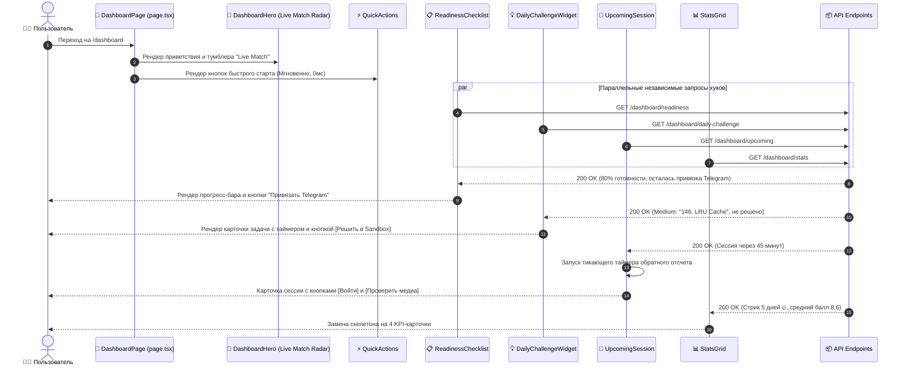

# Задачи: Фронтенд панели управления (Dashboard UI)

Данный документ содержит полную техническую спецификацию, архитектуру компонентов, интерфейсы, состояние и детальную декомпозицию задач для разработки клиентской части главной панели управления (**User Dashboard**) в приложении **`apps/web`** (Next.js App Router, архитектура **FSD**), с использованием дизайн-системы **`@packages/ui`**, иконок **`@packages/icons`** и модульных запросов **`@packages/api`** (TanStack Query).

---

## 1. Архитектурная концепция и UX-принципы

Главная страница `/dashboard` проектируется как высокопроизводительный, модульный хаб подготовки кандидата:
1. **Мгновенный отклик (Fast TTI):** Секция быстрого старта (`DashboardQuickActions`) рендерится статически без ожидания сети. Пользователь может начать сессию или открыть песочницу за 1 клик.
2. **Изолированный Suspense & Skeletons:** Каждый блок имеет независимый скелетон загрузки (`<Skeleton />` из `@packages/ui`). Быстрые блоки появляются мгновенно, тяжелые (статистика, AI-инсайты) догружаются асинхронно без сдвига верстки (Cumulative Layout Shift = 0).
3. **Геймификация и удержание (Retention):**
   * Виджет **«Задача дня» (Daily Challenge)** стимулирует ежедневное решение задач в песочнице с поддержанием стрика активности 🔥.
   * Тумблер **«Live Match Radar»** позволяет найти партнера для собеседования прямо сейчас без переписок.
4. **Онбординг новичков:** Прогресс-бар готовности профиля (`DashboardReadinessChecklist`) наглядно ведет кандидата от регистрации к первому интервью.
5. **Изолированная обработка ошибок (Error Boundary per Widget):** Падение или сетевой сбой одного блока не блокирует остальные части страницы.

---

## 2. Диаграмма жизненного цикла и рендеринга страницы



---

## 3. Структура файлов в монорепозитории (`apps/web` по FSD)

```text
apps/web/src/
├── app/
│   └── (protected)/
│       └── dashboard/
│           ├── page.tsx                           # Сборка страницы и двухколоночная сетка
│           ├── loading.tsx                        # Скелетон всей страницы при первом открытии
│           └── error.tsx                          # Глобальный Error Boundary страницы
│
├── entities/
│   └── dashboard/
│       ├── api/                                   # Гранулярные хуки TanStack Query
│       │   ├── useUpcomingSession.ts              # GET /api/v1/dashboard/upcoming
│       │   ├── useReadinessChecklist.ts           # GET /api/v1/dashboard/readiness
│       │   ├── useDailyChallenge.ts               # GET /api/v1/dashboard/daily-challenge
│       │   ├── useLiveMatchMutation.ts            # POST /api/v1/dashboard/live-match/toggle
│       │   ├── useMatchRequests.ts                # GET /api/v1/dashboard/match-requests
│       │   ├── useDashboardStats.ts               # GET /api/v1/dashboard/stats
│       │   ├── useRecentSessions.ts               # GET /api/v1/dashboard/recent-sessions
│       │   ├── useAiInsights.ts                   # GET /api/v1/dashboard/insights
│       │   ├── useShowcaseStatus.ts               # GET /api/v1/dashboard/showcase-status
│       │   ├── useMatchMutations.ts               # accept/reject заявки с точечной инвалидацией
│       │   ├── useShowcaseBumpMutation.ts         # мутация поднятия анкеты в топ
│       │   └── queryKeys.ts                       # Централизованные ключи кэша DASHBOARD_KEYS
│       ├── model/
│       │   ├── types.ts                           # Интерфейсы моделей представления
│       │   └── formatters.ts                      # Форматирование времени, дат, таймеров
│       └── ui/
│           ├── StatMetricCard.tsx                 # Карточка отдельной метрики (стрик, интервью и т.д.)
│           ├── SessionCountdownTimer.tsx          # Таймер обратного отсчета до старта
│           └── WidgetErrorFallback.tsx            # Компактный fallback при ошибке конкретного виджета
│
└── widgets/
    └── dashboard/
        ├── ui/
        │   ├── DashboardHero.tsx                  # Приветствие + тумблер Live Match Radar
        │   ├── DashboardQuickActions.tsx          # 3 карточки (AI-интервью, P2P, Песочница)
        │   ├── DashboardReadinessChecklist.tsx    # Прогресс онбординга (Telegram, медиа, анкета)
        │   ├── DashboardDailyChallenge.tsx        # Задача дня по алгоритмам с кнопкой в Sandbox
        │   ├── DashboardUpcomingSession.tsx       # Ближайшая сессия + таймер + кнопка входа
        │   ├── DashboardUpcomingSkeleton.tsx      # Локальный скелетон сессии
        │   ├── DashboardMatchRequests.tsx         # Входящие заявки на собеседование
        │   ├── DashboardMatchRequestsSkeleton.tsx # Локальный скелетон заявок
        │   ├── DashboardStatsGrid.tsx             # 4 KPI-метрики (интервью, стрик 🔥, балл, задачи)
        │   ├── DashboardStatsSkeleton.tsx         # Скелетон 4 метрик
        │   ├── DashboardAiInsights.tsx            # Рекомендации AI ("Зоны роста")
        │   ├── DashboardRecentSessions.tsx        # История последних моков и транскрипты
        │   ├── DashboardShowcaseBanner.tsx        # Статус анкеты на витрине и кнопка Bump
        │   └── QuickMediaCheckDialog.tsx          # Быстрая проверка камеры и микрофона
        └── index.ts
```

---

## 4. Спецификация компонентов и интерфейсов

### 4.1 Ключи кэша TanStack Query (`queryKeys.ts`)
```typescript
export const DASHBOARD_KEYS = {
  all: ['dashboard'] as const,
  upcoming: () => [...DASHBOARD_KEYS.all, 'upcoming'] as const,
  readiness: () => [...DASHBOARD_KEYS.all, 'readiness'] as const,
  dailyChallenge: () => [...DASHBOARD_KEYS.all, 'daily-challenge'] as const,
  liveMatch: () => [...DASHBOARD_KEYS.all, 'live-match'] as const,
  matches: () => [...DASHBOARD_KEYS.all, 'match-requests'] as const,
  stats: () => [...DASHBOARD_KEYS.all, 'stats'] as const,
  recent: () => [...DASHBOARD_KEYS.all, 'recent-sessions'] as const,
  insights: () => [...DASHBOARD_KEYS.all, 'insights'] as const,
  showcase: () => [...DASHBOARD_KEYS.all, 'showcase-status'] as const,
};
```

---

### 4.2 `DashboardHero` с Live Match Radar
* **Входные данные:** `user` из сессии, хук `useLiveMatchMutation`.
* **Функционал:**
  * Персонализированное приветствие с расчетом времени суток («Доброе утро/день/вечер, {displayName}!»).
  * Интерактивный тумблер **«Ищу собеседника сейчас (Live Match)»**:
    * В неактивном состоянии: серый свитч и подсказка «Включите для мгновенного подбора напарника».
    * В активном состоянии: зеленый свитч с пульсирующей анимацией радиоволн (`animate-ping`).
    * При нахождении пары: звуковой сигнал и модальное окно «Собеседник найден! Переход в лобби через 3 сек».

```tsx
export interface DashboardHeroProps {
  displayName?: string;
  targetSpecialization?: string;
  targetLevel?: string;
}
```

---

### 4.3 `DashboardQuickActions` (Быстрый старт)
* **Рендеринг:** 0 мс сетевой задержки (статический блок).
* **3 карточки:**
  1. **«AI-Интервью»**: иконка `SparklesIcon`, градиентный фон. Клик открывает модалку быстрого выбора темы и сложности.
  2. **«Найти партнера»**: иконка `UsersIcon`. Переход в `/dashboard/partners` с фильтрами по стеку.
  3. **«Песочница кода»**: иконка `CodeIcon`. Переход в `/dashboard/sandbox` для решения произвольных задач.

---

### 4.4 `DashboardReadinessChecklist` (Чек-лист готовности)
* **Входные данные:** `useReadinessChecklist()`.
* **Элементы UI:**
  * Заголовок: «Готовность профиля к интервью: {percentage}%».
  * Прогресс-бар `Progress value={percentage}` с плавным переходом.
  * Интерактивный список шагов с чекбоксами:
    * `EMAIL_PROVIDED`: если не указан — кнопка «Указать».
    * `MEDIA_CONFIGURED`: кнопка «Проверить камеру и звук» (открывает `QuickMediaCheckDialog`).
    * `TELEGRAM_LINKED`: кнопка «Привязать Telegram» (открывает модалку с QR-кодом и deep-link на бота).
    * `SHOWCASE_CREATED`: кнопка «Создать анкету на витрине».
    * `FIRST_MOCK_COMPLETED`: бейдж «Пройти первое пробное интервью».
  * При 100% готовности блок плавно сворачивается в компактный бейдж *«Профиль готов к интервью на 100% ✨»*.

---

### 4.5 `DashboardDailyChallenge` (Задача дня)
* **Входные данные:** `useDailyChallenge()`.
* **Элементы UI:**
  * Заголовок задачи и бейдж сложности: `EASY` (зеленый), `MEDIUM` (оранжевый), `HARD` (красный).
  * Теги тем (например: `Tree`, `Binary Search`, `Design`).
  * Таймер обратного отсчета: «До смены задачи: 07:12:44».
  * **Кнопка действия:**
    * Если задача не решена: «Решить в Sandbox (+50 XP, 🔥 к стрику)» — ссылка на `/dashboard/sandbox?problemId={problemId}`.
    * Если задача решена: зеленая плашка с галочкой «Решено сегодня! Стрик продлен 🔥».

---

### 4.6 `DashboardUpcomingSession` (Ближайшее интервью)
* **Входные данные:** `useUpcomingSession()`.
* **Элементы UI:**
  * Заголовок сессии, дата и время.
  * Аватар собеседника, его имя, стек и грейд.
  * Тикающий компонент `SessionCountdownTimer` (обратный отсчет в формате `ЧЧ:ММ:СС`).
  * **Кнопка «Войти в комнату»**:
    * Disabled («До начала: 45 минут»), если до старта > 10 минут.
    * Active (зеленый акцент «Войти в комнату»), если `isReadyToJoin: true`.
  * **Кнопка «Проверить связь»**: открывает быстрый тест микрофона и камеры (`QuickMediaCheckDialog`).
* **Empty State:** При отсутствии сессий — аккуратный блок с предложением создать встречу или выбрать напарника на витрине.

---

### 4.7 `DashboardMatchRequests` (Входящие заявки на собеседование)
* **Входные данные:** `useMatchRequests()`.
* **Элементы UI:**
  * Список входящих предложений: аватар отправителя, имя, специализация, желаемое время.
  * Кнопка **«Принять»** (зеленый акцент): вызывает `useAcceptMatchMutation`, создает сессию и мгновенно убирает заявку из списка.
  * Кнопка **«Отклонить»** (muted): переводит заявку в `REJECTED`.
  * Точечная инвалидация: перезапрашивает только `DASHBOARD_KEYS.matches()`.

---

### 4.8 `DashboardStatsGrid` (KPI Метрики)
* **Входные данные:** `useDashboardStats()`.
* **4 карточки в сетке (Grid 4 col):**
  1. **Интервью:** всего пройдено + бейдж завершенных.
  2. **Стрик активности:** количество непрерывных дней с анимированной иконкой огня 🔥.
  3. **Средний балл:** рейтинг готовности (например, 8.6 / 10).
  4. **Решено задач:** 42 задачи (с разбивкой: 20 Easy / 18 Med / 4 Hard).

---

### 4.9 `DashboardAiInsights` (Зоны роста от AI)
* **Входные данные:** `useAiInsights()`.
* **Элементы UI:**
  * Бейдж категории (например: *«Алгоритмы и структуры данных»*).
  * Текст инсайта: *«В последних сессиях вы теряли баллы на оценке Space Complexity в рекурсивных алгоритмах. Рекомендуем повторить DFS/BFS.»*
  * Кнопка **«Потренировать тему в Sandbox»**.

---

### 4.10 `DashboardRecentSessions` (История сессий)
* **Входные данные:** `useRecentSessions()`.
* **Элементы UI:**
  * Список 3–5 последних завершенных интервью: дата, тема, роль, полученная оценка.
  * Кнопка перехода к отчету «Смотреть транскрипт и фидбек».

---

### 4.11 `DashboardShowcaseBanner` (Статус анкеты на витрине)
* **Входные данные:** `useShowcaseStatus()`.
* **Элементы UI:**
  * Индикатор оставшихся дней действия анкеты (например, *«Анкета активна еще 9 дней»*).
  * Количество просмотров и полученных заявок.
  * Кнопка **«Поднять в топ»** (активна раз в 24 часа) с мутацией `useShowcaseBumpMutation` и визуальным подтверждением.

---

## 5. Макет страницы (Layout Grid)

```tsx
<div className="flex flex-col gap-6 p-6 max-w-7xl mx-auto w-full">
  {/* Хедер с приветствием и тумблером Live Match Radar */}
  <DashboardHero />
  
  {/* Блок быстрого старта (0 мс сетевой задержки) */}
  <DashboardQuickActions />
  
  <div className="grid grid-cols-1 lg:grid-cols-12 gap-6">
    {/* Левая основная колонка (col-span-8) */}
    <div className="lg:col-span-8 flex flex-col gap-6">
      {/* Чек-лист онбординга (сворачивается при 100%) */}
      <DashboardReadinessChecklist />
      
      {/* Ближайшее запланированное интервью с таймером */}
      <DashboardUpcomingSession />
      
      {/* Задача дня по алгоритмам */}
      <DashboardDailyChallenge />
      
      {/* Сетка KPI метрик */}
      <DashboardStatsGrid />
      
      {/* Зоны роста от AI */}
      <DashboardAiInsights />
      
      {/* История недавних интервью */}
      <DashboardRecentSessions />
    </div>

    {/* Правая вспомогательная колонка (col-span-4) */}
    <div className="lg:col-span-4 flex flex-col gap-6">
      {/* Входящие заявки на собеседование */}
      <DashboardMatchRequests />
      
      {/* Статус анкеты на витрине */}
      <DashboardShowcaseBanner />
      
      {/* Быстрый виджет проверки камеры и микрофона */}
      <Card className="p-4">
        <QuickMediaCheckWidget />
      </Card>
    </div>
  </div>
</div>
```

---

## 6. Пошаговые задачи реализации (Frontend)

### Этап 1: Слой `entities/dashboard` и хуки
- [ ] **TASK-FRONT-01**: Создать централизованные ключи кэша `queryKeys.ts` (`DASHBOARD_KEYS`).
- [ ] **TASK-FRONT-02**: Реализовать гранулярный хук `useUpcomingSession()`.
- [ ] **TASK-FRONT-03**: Реализовать гранулярный хук `useReadinessChecklist()`.
- [ ] **TASK-FRONT-04**: Реализовать гранулярный хук `useDailyChallenge()`.
- [ ] **TASK-FRONT-05**: Реализовать мутацию `useLiveMatchMutation()` (toggle поиска с оптимистичным состоянием).
- [ ] **TASK-FRONT-06**: Реализовать хуки `useMatchRequests()`, `useDashboardStats()`, `useRecentSessions()`, `useAiInsights()`, `useShowcaseStatus()`.
- [ ] **TASK-FRONT-07**: Реализовать мутации `useMatchMutations()` (принятие/отклонение инвайта с инвалидацией `DASHBOARD_KEYS.matches()`).
- [ ] **TASK-FRONT-08**: Реализовать мутацию `useShowcaseBumpMutation()`.
- [ ] **TASK-FRONT-09**: Создать утилиты форматирования `formatters.ts` (секунды в ЧЧ:ММ:СС, локализованные даты, расчет стрика).
- [ ] **TASK-FRONT-10**: Добавить ключи локализации в `packages/i18n/src/locales/ru/dashboard.json` и `en/dashboard.json`.

### Этап 2: Хедер, Live Match и Быстрые действия
- [ ] **TASK-FRONT-11**: Реализовать компонент `DashboardHero` с переключателем `LiveMatchSwitch` и пульсирующей анимацией поиска пары.
- [ ] **TASK-FRONT-12**: Реализовать компонент `DashboardQuickActions` с 3 интерактивными карточками (AI, P2P, Sandbox) и hover-эффектами.
- [ ] **TASK-FRONT-13**: Реализовать модальное окно быстрого запуска AI-интервью при клике на карточку.

### Этап 3: Чек-лист онбординга и Задача дня
- [ ] **TASK-FRONT-14**: Реализовать виджет `DashboardReadinessChecklist`:
  - Прогресс-бар с анимацией заполнения.
  - Интерактивные шаги с кликом для перехода к действию (привязка Telegram, тест медиа).
  - Сворачивание при достижении 100%.
- [ ] **TASK-FRONT-15**: Реализовать виджет `DashboardDailyChallenge`:
  - Бейдж сложности, теги, таймер до смены задачи.
  - Кнопка перехода в песочницу с предзагрузкой задачи.
  - Зеленый статус «Решено сегодня! Стрик продлен 🔥».

### Этап 4: Сессии, матчи и аналитика
- [ ] **TASK-FRONT-16**: Создать компонент `SessionCountdownTimer` с секундным интервалом и очисткой таймера при unmount.
- [ ] **TASK-FRONT-17**: Реализовать виджет `DashboardUpcomingSession` с кнопкой входа, скелетоном `DashboardUpcomingSkeleton` и Empty State.
- [ ] **TASK-FRONT-18**: Реализовать диалог быстрой проверки связи `QuickMediaCheckDialog`.
- [ ] **TASK-FRONT-19**: Реализовать виджет `DashboardMatchRequests` с кнопками подтверждения и скелетоном `DashboardMatchRequestsSkeleton`.
- [ ] **TASK-FRONT-20**: Реализовать виджет `DashboardStatsGrid` с 4 KPI карточками и скелетоном `DashboardStatsSkeleton`.
- [ ] **TASK-FRONT-21**: Реализовать виджет `DashboardAiInsights` («Зоны роста»).
- [ ] **TASK-FRONT-22**: Реализовать виджет `DashboardRecentSessions`.
- [ ] **TASK-FRONT-23**: Реализовать виджет `DashboardShowcaseBanner` с кнопкой bump.

### Этап 5: Сборка страницы, скелетоны и тестирование
- [ ] **TASK-FRONT-24**: Собрать страницу [apps/web/src/app/(protected)/dashboard/page.tsx](../../apps/web/src/app/%28protected%29/dashboard/page.tsx) с адаптивной сеткой (Grid).
- [ ] **TASK-FRONT-25**: Реализовать корневой `loading.tsx` со скелетонами всех блоков и `error.tsx` с кнопкой повтора.
- [ ] **TASK-FRONT-26**: Написать юнит-тесты на Vitest для:
  - `DashboardReadinessChecklist` (рендеринг шагов и расчет прогресса).
  - `DashboardDailyChallenge` (состояния решено / не решено).
  - `DashboardUpcomingSession` (смена состояния кнопки при наступлении времени).
- [ ] **TASK-FRONT-27**: Проверить адаптивную верстку (Mobile 375px, Tablet 768px, Desktop 1280px+) и работу Dark/Light тем.

---

## 7. Критерии приемки (Acceptance Criteria)

1. Страница `/dashboard` загружается без сдвигов верстки (CLS = 0).
2. Чек-лист готовности наглядно подсказывает следующие шаги и позволяет в 1 клик привязать Telegram или проверить медиа.
3. Клик по «Решить задачу дня» открывает Sandbox с шаблоном выбранной алгоритмической задачи.
4. Тумблер Live Match визуально отображает статус поиска и информирует о найденном собеседнике.
5. Принятие входящего матча обновляет только список матчей и мгновенно убирает карточку.
6. Кнопка «Войти в комнату» активируется за 10 минут до старта сессии и ведет в реальное лобби/песочницу.
7. Верстка полностью адаптивна от 375px до 1920px.
