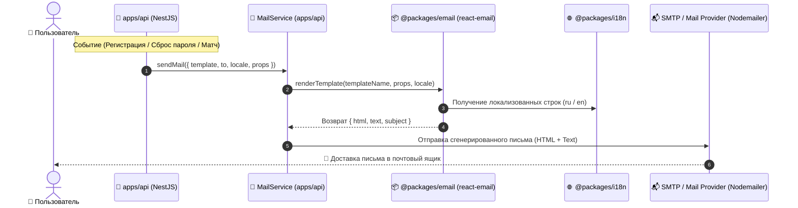

# Задачи: Сервис отправки почты и шаблонов писем (Email Service & @packages/email)

Данный документ содержит детальную декомпозицию задач для **Backend** (`apps/api`), нового shared-пакета **`packages/email`** (на базе `react-email`), системы **локализации писем** (`packages/i18n`), архитектурную диаграмму и структуру файлов.

---

## 1. Архитектурная диаграмма потока отправки писем



---

## 2. Структура файлов в монорепозитории

### 2.1. Новый shared-пакет (`packages/email`):
```text
packages/email/
├── package.json                           # @packages/email, зависимости react-email, @react-email/components
├── tsconfig.json
├── README.md
└── src/
    ├── components/                        # Базовые UI-блоки для писем
    │   ├── layout.tsx                     # Общий лейаут письма (хедер, футер, контейнер, стили)
    │   ├── header.tsx                     # Логотип MockInterviewAI, прехедер
    │   ├── footer.tsx                     # Копирайт, ссылки на профиль/отписку
    │   ├── button.tsx                     # Фирменная кнопка действия (CTA)
    │   └── otp-code.tsx                   # Блок отображения 4/6-значного OTP-кода
    │
    ├── templates/                         # Транзакционные шаблоны писем
    │   ├── verify-email.tsx               # Подтверждение email / код при регистрации
    │   ├── reset-password.tsx             # Восстановление пароля (ссылка + токен)
    │   ├── interview-scheduled.tsx        # Уведомление о запланированном интервью
    │   ├── interview-reminder.tsx         # Напоминание за 15 минут до начала
    │   ├── security-alert.tsx             # Оповещение о входе с нового устройства/смене пароля
    │   └── index.ts
    │
    ├── locales/                           # Локализация текстов шаблонов (или интеграция с @packages/i18n)
    │   ├── ru.ts                          # Тексты писем на русском
    │   ├── en.ts                          # Тексты писем на английском
    │   └── index.ts
    │
    ├── render.ts                          # Утилита рендера React Email в { html, text }
    └── index.ts                           # Экспорт шаблонов, компонентов и renderEmail
```

### 2.2. Локализация (`packages/i18n`):
```text
packages/i18n/src/locales/
├── ru/
│   └── email.json                         # Темы писем, заголовки, кнопки и футеры (RU)
└── en/
    └── email.json                         # Темы писем, заголовки, кнопки и футеры (EN)
```

### 2.3. Backend (`apps/api`):
```text
apps/api/src/
├── config/
│   └── mail.config.ts                     # Конфигурация SMTP (host, port, user, pass, from, secure)
│
└── modules/
    └── mail/
        ├── mail.module.ts                 # Регистрация модуля MailModule
        ├── mail.service.ts                # Сервис отправки писем через Nodemailer / Transport
        ├── mail.service.spec.ts           # Unit-тесты отправки писем
        ├── interfaces/
        │   ├── mail-options.interface.ts  # Интерфейсы отправки
        │   └── template-map.interface.ts  # Типобезопасная связь шаблона и его props
        └── transports/
            ├── nodemailer.transport.ts    # Транспорт SMTP / Nodemailer
            └── dev-logger.transport.ts    # Dev/Test транспорт (логирование в консоль/сохранение в HTML)
```

---

## 3. Чеклист реализации

### 📦 Часть 1: Создание пакета `@packages/email` (React Email)

- [ ] **Инициализация пакета `packages/email`:**
  - Настроить `package.json` (`name: "@packages/email"`, `react`, `@react-email/components`, `@react-email/render`).
  - Настроить `tsconfig.json` с поддержкой JSX (`react-jsx`).
  - Подключить скрипт `email:dev` (`email dev --dir src/templates`) для интерактивного локального предпросмотра шаблонов в браузере.
- [ ] **Базовые компоненты писем (`src/components/`):**
  - `EmailLayout`: адаптивный контейнер с корпоративной темой MockInterviewAI, безопасными шрифтами, фоном и отступами.
  - `EmailHeader`: логотип платформы и скрытый `Preview` прехедер для почтовых клиентов.
  - `EmailFooter`: копирайт, ссылки на настройки профиля и поддержка.
  - `EmailButton`: адаптивная CTA-кнопка в стилистике дизайн-системы.
  - `EmailOtpCode`: крупный блок с моноширинным кодом подтверждения.
- [ ] **Шаблоны писем (`src/templates/`):**
  - `VerifyEmailTemplate`: письмо подтверждения почты с OTP-кодом / ссылкой.
  - `ResetPasswordTemplate`: письмо для сброса пароля с кнопкой действия и сроком жизни ссылки (15 мин).
  - `InterviewScheduledTemplate`: подтверждение бронирования слота интервью с датой, временем и ссылкой на комнату.
  - `SecurityAlertTemplate`: уведомление о смене пароля / входе с нового IP.
- [ ] **Функция рендера (`src/render.ts`):**
  - Экспорт функции `renderEmail<T>(template: TemplateType, props: T, locale: "ru" | "en")`.
  - Генерация одновременно валидного `html` и plain-`text` версии для почтовых спам-фильтров.

---

### 🌐 Часть 2: Локализация писем (`packages/i18n`)

- [ ] **Словари переводов:**
  - Создать `packages/i18n/src/locales/ru/email.json` и `packages/i18n/src/locales/en/email.json`.
  - Описать переводы для тем писем (`subject`), заголовков, текстов, кнопок и футера.
- [ ] **Интеграция с генератором писем:**
  - Поддержка передачи `locale` (по умолчанию `ru`) в `renderEmail`.
  - Типизированные ключи тем писем для автоматической подстановки темы по типу шаблона.

---

### 🚀 Часть 3: Backend модуль в `apps/api` (`MailModule` & `MailService`)

- [ ] **Конфигурация окружения (`mail.config.ts`):**
  - Переменные: `SMTP_HOST`, `SMTP_PORT`, `SMTP_USER`, `SMTP_PASS`, `SMTP_FROM`, `SMTP_SECURE`.
  - Валидация переменных через Zod/Joi.
- [ ] **Реализация `MailService`:**
  - Метод `sendMail({ to, template, props, locale?, subject? })`.
  - Интеграция с `@packages/email` для рендера HTML и текстовой версии.
  - Интеграция с `Nodemailer` для отправки через SMTP.
  - Поддержка `DevLoggerTransport` в режиме разработки (печать ссылки на предпросмотр или локальный файл).
- [ ] **Обработка ошибок и надежность:**
  - Логирование успешных отправок и сбоев (NestJS `Logger`).
  - Graceful fallback: ошибка отправки не должна приводить к 500 ошибке, если почта является фоновым уведомлением.
- [ ] **Unit и интеграционные тесты:**
  - Тестирование `MailService` с моком транспорта.
  - Проверка корректности передачи props и выбора локали.

---

### 🔗 Часть 4: Интеграция в существующие модули `apps/api`

- [ ] **Модуль аутентификации (`AuthModule`):**
  - Отправка письма с кодом подтверждения при регистрации пользователя.
  - Отправка ссылки сброса пароля в `POST /auth/forgot-password`.
- [ ] **Модуль собеседований / матчинга (`SessionsModule` / `RealtimeModule`):**
  - Отправка письма при подтверждении участия в парном интервью.
- [ ] **Модуль безопасности пользователей (`UsersModule`):**
  - Отправка оповещения при смене пароля или email.
