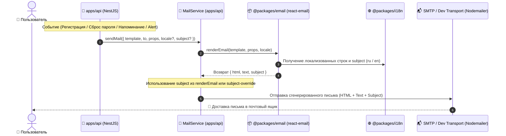

# Задачи: Сервис отправки почты и шаблонов писем (Email Service & @packages/email)

Данный документ содержит детальную декомпозицию задач для **Backend** (`apps/api`), shared-пакета **`packages/email`** (на базе `react-email`), системы **локализации писем** (`packages/i18n`), архитектурную диаграмму, структуру файлов, матрицу событий безопасности, конфигурацию и политики отказоустойчивости.

---

## 1. Архитектурная диаграмма потока отправки писем



---

## 2. Структура файлов в монорепозитории

### 2.1. Shared-пакет (`packages/email`):
> **Примечание по локализации:** Вся локализация вынесена в `@packages/i18n`. Пакет `packages/email` **не создает** локальную директорию `src/locales`, исключая дублирование источников переводов.

```text
packages/email/
├── package.json                           # @packages/email, зависимости react-email, @react-email/components
├── tsconfig.json
├── README.md
└── src/
    ├── components/                        # Базовые UI-блоки для писем
    │   ├── layout.tsx                     # Общий лейаут письма (хедер, футер, контейнер, стили)
    │   ├── header.tsx                     # Логотип MockInterviewAI, прехедер
    │   ├── footer.tsx                     # Копирайт, ссылки на профиль/поддержку
    │   ├── button.tsx                     # Фирменная CTA-кнопка
    │   └── otp-code.tsx                   # Блок отображения 4/6-значного OTP-кода
    │
    ├── templates/                         # Транзакционные шаблоны писем
    │   ├── verify-email.tsx               # Подтверждение email / код при регистрации
    │   ├── reset-password.tsx             # Восстановление пароля (ссылка + токен)
    │   ├── interview-scheduled.tsx        # Уведомление о запланированном интервью
    │   ├── interview-reminder.tsx         # Напоминание за 15 минут до начала
    │   ├── security-alert.tsx             # Оповещение о событиях безопасности
    │   └── index.ts
    │
    ├── render.ts                          # Публичная утилита renderEmail (HTML, text, subject)
    └── index.ts                           # Экспорт шаблонов, компонентов, типов и renderEmail
```

### 2.2. Локализация (`packages/i18n` — единственный источник переводов):
```text
packages/i18n/src/locales/
├── ru/
│   └── email.json                         # Темы писем (subjects), заголовки, кнопки и футеры (RU)
└── en/
    └── email.json                         # Темы писем (subjects), заголовки, кнопки и футеры (EN)
```

### 2.3. Backend (`apps/api`):
```text
apps/api/src/
├── config/
│   ├── configuration.ts                   # Расширение: секция mail (host, port, user, pass, from, secure)
│   └── env.validation.ts                  # Расширение: Zod-валидация переменных SMTP_*
│
└── modules/
    └── mail/
        ├── mail.module.ts                 # Регистрация модуля MailModule
        ├── mail.service.ts                # Сервис отправки писем через Nodemailer / Transport
        ├── mail.service.spec.ts           # Unit-тесты отправки писем
        ├── interfaces/
        │   ├── mail-options.interface.ts  # Интерфейсы вызова sendMail
        │   └── template-map.interface.ts  # Типобезопасная связь шаблона и его props
        └── transports/
            ├── mail-transport.interface.ts# Интерфейс почтового транспорта
            ├── nodemailer.transport.ts    # Транспорт SMTP (production/staging)
            └── dev-logger.transport.ts    # Dev/Test транспорт с санитизацией секретов
```

---

## 3. Матрица событий безопасности (SecurityAlertTemplate)

`SecurityAlertTemplate` обрабатывает единый аддитивный набор событий безопасности аккаунта. В таблице ниже зафиксированы типы событий, триггеры, модули-владельцы и обязательный payload:

| Event Type | Триггер / Условие срабатывания | Владелец триггера | Обязательный Payload |
| :--- | :--- | :--- | :--- |
| `PASSWORD_CHANGED` | Успешная смена или сброс пароля пользователя | `AuthModule` / `UsersModule` | `{ userId, email, timestamp, ipAddress, userAgent }` |
| `EMAIL_CHANGE_REQUESTED` | Запрос на изменение адреса электронной почты | `UsersModule` | `{ userId, email, newEmail, timestamp, ipAddress, userAgent, confirmationUrl }` |
| `EMAIL_CHANGED` | Успешное подтверждение и применение нового email (уведомление на старый email) | `UsersModule` | `{ userId, email (old), newEmail, timestamp, ipAddress }` |
| `NEW_DEVICE_LOGIN` | Успешный вход в аккаунт с нового устройства / ранее не встречавшегося `User-Agent` / IP | `AuthModule` | `{ userId, email, timestamp, ipAddress, userAgent, location? }` |

### Единый контракт `SecurityAlertProps`:
```typescript
export interface SecurityAlertProps {
  eventType: "PASSWORD_CHANGED" | "EMAIL_CHANGE_REQUESTED" | "EMAIL_CHANGED" | "NEW_DEVICE_LOGIN";
  email: string;
  timestamp: string; // ISO 8601
  ipAddress: string;
  userAgent?: string;
  location?: string;
  details?: {
    oldEmail?: string;
    newEmail?: string;
    confirmationUrl?: string;
  };
}
```

---

## 4. Публичный контракт рендера и владение темой (Subject)

1. **Единый идентификатор функции:** `renderEmail`.
2. **Сигнатура:**
   ```typescript
   export async function renderEmail<T extends TemplateType>(
     template: T,
     props: TemplatePropsMap[T],
     locale: "ru" | "en" = "ru"
   ): Promise<{ html: string; text: string; subject: string }>;
   ```
   - Параметр `locale` является необязательным со значением по умолчанию `"ru"`.
3. **Владение темой (`subject`):**
   - Основной источник `subject` — `@packages/i18n` через словарь `email.json` по ключу `[template].subject`.
   - `renderEmail` возвращает `{ html, text, subject }`.
   - В вызове `MailService.sendMail({ template, to, props, locale?, subject? })` поле `subject` является опциональным override-параметром. Если оно не передано явно, `MailService` использует `subject`, сформированный `renderEmail`.

---

## 5. Загрузка и валидация SMTP-конфигурации в `apps/api`

Конфигурация SMTP интегрируется в общую систему валидации конфигурации `apps/api`:

### 5.1. Расширение `apps/api/src/config/env.validation.ts`:
```typescript
// Добавление полей SMTP в envSchema
SMTP_HOST: z.string().default("localhost"),
SMTP_PORT: z.coerce.number().int().positive().default(1025),
SMTP_USER: z.string().default(""),
SMTP_PASS: z.string().default(""),
SMTP_FROM: z.string().min(1).default("noreply@mockinterview.ai"),
SMTP_SECURE: z.enum(["true", "false"]).default("false"),
```

### 5.2. Расширение `apps/api/src/config/configuration.ts`:
```typescript
// Секция mail в конфигурации приложения
mail: {
  host: process.env.SMTP_HOST ?? "localhost",
  port: Number(process.env.SMTP_PORT ?? 1025),
  user: process.env.SMTP_USER ?? "",
  pass: process.env.SMTP_PASS ?? "",
  from: process.env.SMTP_FROM ?? "noreply@mockinterview.ai",
  secure: process.env.SMTP_SECURE === "true",
},
```

### 5.3. Инициализация в `MailModule`:
- `MailModule` внедряет `ConfigService` и считывает секцию `mail` (`configService.get('mail')`).
- Вся валидация выполняется синхронно при старте приложения через `ConfigModule.forRoot({ validate, load: [configuration] })` в `app.module.ts`.

---

## 6. Безопасность и санитизация в `DevLoggerTransport`

В `DevLoggerTransport` (используемом в `development` и тестовых окружениях) категорически **запрещен открытый вывод чувствительных данных**:

1. **Маскирование OTP-кодов:** Значения кодов подтверждения заменяются на redacted-вид (например, `[REDACTED_OTP]` или `**34`).
2. **Маскирование Reset Tokens:** Токены сброса пароля и ссылки активации в логах и сохраняемых preview HTML-файлах маскируются (например, `?token=[REDACTED_TOKEN]`).
3. **Тестовые фикстуры:** В unit- и integration-тестах используются только redacted/mock значения токенов.

---

## 7. Политика обработки ошибок для писем аутентификации и уведомлений

| Тип операции / Письмо | Режим отправки | HTTP-ответ клиенту | Поведение при ошибке отправки | Компенсация / Retry |
| :--- | :--- | :--- | :--- | :--- |
| **Forgot Password** (`ResetPasswordTemplate`) | Background / Event | **Всегда 200 OK** | Логирование `Logger.error`, инкремент счетчика сбоев доставки. Ошибка не раскрывается наружу во избежание user enumeration. | Опциональный retry воркером очереди. Пользователь может повторить запрос через rate-limit окно. |
| **Registration / Email Verify** (`VerifyEmailTemplate`) — *Request-bound вариант* | Request-bound (синхронно в запросе) | `500 Internal Server Error` / `502 Bad Gateway` | Откат транзакции создания пользователя (компенсация), клиент информируется о сбое доставки почты. | Транзакционный откат записи пользователя в БД. |
| **Registration / Email Verify** (`VerifyEmailTemplate`) — *Background вариант (Рекомендуемый)* | Background (асинхронно) | `201 Created` (`emailVerified: false`) | Пользователь создается в БД, ошибка отправки логируется. Пользователь видит экран подтверждения. | Эндпоинт `POST /api/v1/auth/resend-verification` для повторной отправки кода. |
| **Интервью и Напоминания** (`InterviewScheduled`, `InterviewReminder`) | Background / Scheduled | N/A (фоновый процесс или webhook) | Best-effort fallback: логирование ошибки, запись в аудит-лог. Не прерывает процесс бронирования или сессию. | Фоновый retry (до 3 попыток с exponential backoff). |
| **Security Alerts** (`SecurityAlertTemplate`) | Background | N/A (фоновый event) | Best-effort fallback: логирование с высоким приоритетом (`Logger.warn`/`error`), метрика `security_alert_failed`. | Фоновый retry в очереди доставки. |

---

## 8. Чеклист реализации

### 📦 Часть 1: Создание пакета `@packages/email` (React Email)

- [ ] **Инициализация пакета `packages/email`:**
  - Настроить `package.json` (`name: "@packages/email"`, зависимости `react`, `react-dom`, `@react-email/components`, `@react-email/render`).
  - Настроить `tsconfig.json` с поддержкой JSX (`react-jsx`).
  - Подключить скрипт `email:dev` (`email dev --dir src/templates`) для локального интерактивного предпросмотра шаблонов.
- [ ] **Базовые компоненты писем (`src/components/`):**
  - `EmailLayout`: адаптивный контейнер с корпоративной темой MockInterviewAI, безопасными шрифтами, фоном и отступами.
  - `EmailHeader`: логотип платформы и скрытый `Preview` прехедер для почтовых клиентов.
  - `EmailFooter`: копирайт, ссылки на настройки профиля и поддержка.
  - `EmailButton`: адаптивная CTA-кнопка в стилистике дизайн-системы.
  - `EmailOtpCode`: крупный блок с моноширинным кодом подтверждения.
- [ ] **Шаблоны писем (`src/templates/`):**
  - `VerifyEmailTemplate`: письмо подтверждения почты с OTP-кодом / ссылкой.
  - `ResetPasswordTemplate`: письмо сброса пароля с кнопкой действия и сроком жизни ссылки (15 мин).
  - `InterviewScheduledTemplate`: подтверждение бронирования слота интервью с датой, временем и ссылкой на комнату.
  - `InterviewReminderTemplate`: напоминание за 15 минут до начала собеседования со ссылкой на подготовку и комнату.
  - `SecurityAlertTemplate`: уведомление о событиях безопасности по единой матрице (`PASSWORD_CHANGED`, `EMAIL_CHANGE_REQUESTED`, `EMAIL_CHANGED`, `NEW_DEVICE_LOGIN`).
- [ ] **Публичная функция рендера (`src/render.ts`):**
  - Экспорт функции `renderEmail<T>(template: T, props: TemplatePropsMap[T], locale: "ru" | "en" = "ru")`.
  - Генерация одновременно валидного `html`, plain-`text` версии и локализованного `subject` из `@packages/i18n`.

---

## 🌐 Часть 2: Локализация писем (`packages/i18n`)

- [ ] **Словари переводов (единственный источник):**
  - Создать `packages/i18n/src/locales/ru/email.json` и `packages/i18n/src/locales/en/email.json`.
  - Описать переводы для тем писем (`subject`), заголовков, текстов, кнопок и футеров для всех 5 шаблонов.
- [ ] **Интеграция с генератором писем:**
  - Поддержка передачи `locale` (по умолчанию `ru`) в `renderEmail`.
  - Типизированные ключи для выборки тем и локализованного контента.

---

## 🚀 Часть 3: Backend модуль в `apps/api` (`MailModule` & `MailService`)

- [ ] **Конфигурация окружения и валидация:**
  - Расширить `env.validation.ts` полями `SMTP_HOST`, `SMTP_PORT`, `SMTP_USER`, `SMTP_PASS`, `SMTP_FROM`, `SMTP_SECURE`.
  - Расширить `configuration.ts` секцией `mail`.
- [ ] **Реализация `MailService`:**
  - Метод `sendMail({ to, template, props, locale?, subject? })`.
  - Интеграция с `@packages/email` через вызов `renderEmail`.
  - Интеграция с `NodemailerTransport` для отправки через SMTP.
  - Реализация `DevLoggerTransport` с обязательным маскированием OTP и reset tokens в консоли и HTML-превью.
- [ ] **Unit и интеграционные тесты:**
  - Тестирование `MailService` с моком транспорта.
  - Проверка корректности передачи props, санитизации sensitive данных и выбора локали.
  - Тестирование обработки ошибок в соответствии с политикой отказоустойчивости.

---

## 🔗 Часть 4: Интеграция в модули `apps/api`

- [ ] **Модуль аутентификации (`AuthModule`):**
  - Отправка `VerifyEmailTemplate` при регистрации пользователя (с поддержкой `POST /auth/resend-verification`).
  - Отправка `ResetPasswordTemplate` в `POST /auth/forgot-password` (всегда 200 OK на клиенте, с безопасным логированием).
- [ ] **Модуль собеседований и расписания (`SessionsModule` / `ScheduleModule`):**
  - Отправка `InterviewScheduledTemplate` при подтверждении бронирования слота интервью.
  - Реализация cron/scheduler задачи (каждые 60 секунд) для поиска интервью, начинающихся через 15 минут, и отправка `InterviewReminderTemplate` обоим участникам с защитой от дублирования.
  - Unit/интеграционный тест 15-минутного триггера напоминания.
- [ ] **Модуль безопасности пользователей (`UsersModule` / `AuthModule`):**
  - Отправка `SecurityAlertTemplate` при смене пароля (`PASSWORD_CHANGED`).
  - Отправка `SecurityAlertTemplate` при запросе/подтверждении смены email (`EMAIL_CHANGE_REQUESTED`, `EMAIL_CHANGED`).
  - Отправка `SecurityAlertTemplate` при входе с нового устройства или IP (`NEW_DEVICE_LOGIN`).
