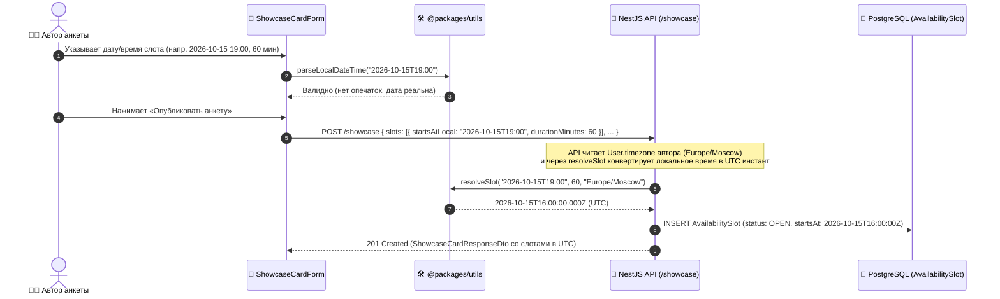
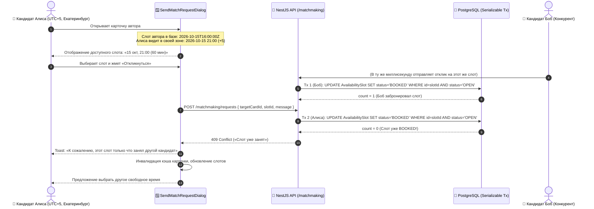

# Задачи: Фронтенд расписания слотов, бронирования интервью и безопасности (ADR-002…ADR-005)

Данный документ содержит полную техническую спецификацию, архитектурные обоснования, FSD-структуру компонентов, схемы данных и пошаговый чеклист задач для реализации на фронтенде (**`apps/web`**) функционала расписания собеседований, таймзон, атомарного бронирования слотов и безопасности аккаунта.

Документ подготовлен на основе изменений бэкенда и пакетов, влитых в ветку `dev` из **`feat/interview-scheduling-and-security-notifications`** (PR [#258](https://github.com/Riko4502/MockInterviewAI/pull/258)), и требований архитектурных решений **ADR-002, ADR-003, ADR-004, ADR-005, ADR-006**.

---

## 1. Архитектурный контекст и обоснование («Почему именно так»)

### 1.1. IANA-таймзоны вместо числовых смещений UTC (ADR-002)

- **Почему нельзя хранить числовое смещение (например, `+03:00` или `+180` минут):**
  Смещение жестко фиксирует разницу с UTC в один конкретный момент времени и **теряет информацию о правилах сезонного перевода часов (DST)**. Если пользователь сохранит смещение летом, то зимой оно станет неверным. Кроме того, числовое смещение не позволяет однозначно сопоставить город и страну.
- **Решение:**
  В модель `User` добавлено поле `timezone: string` (по умолчанию `'Europe/Moscow'`), хранящее исключительно канонический идентификатор таймзоны базы IANA (TZDB).
- **Двухшаговая валидация на клиенте и сервере:**
  Начиная с ES2024 `Intl.DateTimeFormat` принимает смещения вида `+04:00` как валидные таймзоны. Поэтому валидация обязана состоять из двух шагов:
  1. Проверка формата регулярным выражением (`isIanaTimeZoneFormat` из `@packages/utils`).
  2. Проверка резолвимости через движок ICU браузера (`isResolvableTimeZone`).
  Использование `Intl.supportedValuesOf("timeZone")` как белого списка **запрещено** (ADR-002:51), так как оно возвращает устаревшие алиасы и не покрывает ряд канонических зон.

### 1.2. Слоты: ввод в локальном времени автора, хранение и отдача в UTC (ADR-002)

- **Почему автор анкеты вводит локальное время без оффсета (`startsAtLocal: YYYY-MM-DDTHH:mm`):**
  Пользователь мыслит временем на своих настенных часах («Хочу провести мок во вторник в 19:00»). Он не должен вручную пересчитывать время в UTC. Смещение в запросе не принимается намеренно — сервер переводит время в UTC, используя `User.timezone` автора карточки.
- **Защита от несуществующего локального времени (DST-разрывы):**
  При переходе на летнее время стрелки часов переводятся вперед (например, с 02:00 сразу на 03:00). Интервал 02:00–02:59 в этот день **физически не существует**. Библиотеки дат при наивной конвертации молча сдвигают такой момент. Сервер проверяет round-trip (`resolveSlot` в `@packages/utils`) и при попытке создать слот в несуществующее время возвращает `422 Unprocessable Entity`. Фронтенд должен предупреждать пользователя и использовать утилиты `@packages/utils`.
- **Почему клиенту возвращается UTC-инстант (`startsAt: ISO 8601 UTC`):**
  Каталог витрины просматривают кандидаты из самых разных городов и часовых поясов. Если бы сервер отдавал локальное время автора, другой кандидат видел бы чужое время и запутался. Сервер отдает точный UTC-инстант, а фронтенд форматирует его **в часовом поясе смотрящего кандидата** с помощью функции `formatInstantInTimeZone(instant, viewerTimezone)`.
- **Единая библиотека дат:**
  Согласно ADR-002:128, прямой импорт сторонних библиотек дат (`date-fns`, `moment`, `dayjs`, `date-fns-tz`) в `apps/web` **запрещен**. Все операции со слотами и таймзонами выполняются исключительно через фасад `@packages/utils/datetime` (`@date-fns/tz@1.5.0` и `date-fns@4.4.0`).

### 1.3. Обязательность выбора слота при отклике и обработка 409 Conflict (ADR-002)

- **Критическое бизнес-правило:**
  В DTO отклика [`createMatchRequestSchema`](../packages/dto/src/matchmaking/matchmaking.dto.ts) добавлено поле `slotId?: string`.
  Если у целевой карточки в витрине есть хотя бы один открытый слот (`status === "OPEN"`), поле `slotId` **является строго обязательным** на бэкенде (`matchmaking.service.ts:524`). Попытка отправить отклик без слота приводит к `400 Bad Request` («Для карточки с расписанием необходимо выбрать слот»).
- **Атомарный claim и гонка двух кандидатов:**
  При создании отклика бэкенд в `Serializable`-транзакции выполняет атомарный `UPDATE` слота в статус `BOOKED`. Если два кандидата одновременно кликнут на один и тот же слот:
  - Первый кандидат получит `200 OK` (слот забронирован за ним, создана заявка `PENDING`);
  - Второй кандидат получит `409 Conflict` с текстом ошибки «Слот уже занят».
- **Требование к фронтенду:**
  Модалка отклика [`SendMatchRequestDialog`](../apps/web/src/features/send-match-request/ui/SendMatchRequestDialog.tsx) **обязана**:
  1. Отображать открытые слоты целевой карточки в часовом поясе кандидата.
  2. Блокировать отправку отклика, если слот не выбран (при наличии слотов у анкеты).
  3. Перехватывать ошибку `409 Conflict`, показывать понятный Toast и обновлять список слотов, предлагая выбрать другое свободное время.

### 1.4. Принятие заявки и автоматическое создание `InterviewSession` (ADR-002)

- Когда автор карточки нажимает **«Принять»** (`POST /matchmaking/requests/:id/accept`):
  1. Заявка переходит в статус `ACCEPTED`.
  2. Создается `InterviewSession` со статусом `WAITING`, где `scheduledAt` устанавливается равным `startsAt` забронированного слота.
  3. Отправителю заявки отправляется доменное уведомление `interview.slot_booked` по SSE (`notification.new`).
  4. Обе стороны видят в интерфейсе точное назначенное время встречи и кнопку перехода в интерактивную комнату.

### 1.5. Безопасность и подтверждение отвязки аккаунтов (ADR-005)

- **Проблема текущей реализации фронтенда:**
  В [`ConnectedAccountsSection.tsx`](../apps/web/src/features/update-profile/ui/ConnectedAccountsSection.tsx) кнопки отвязки Telegram и GitHub сейчас вызывают `updateProfileMutation.mutate({ data: { telegramUsername: null } })` и `{ data: { gitUrl: null } }`.
  Это не отзывает токены сессий в базе, не очищает `githubId` / `telegramId` и не генерирует аудит-события.
- **Требование ADR-005 к фронтенду:**
  Любое действие по отвязке стороннего сервиса должно сопровождаться предупреждающим диалогом о завершении других активных сессий (ревокация через `generation + 1`). Для Telegram в целевой архитектуре вводится подтверждение одноразовым кодом из бота.

---

## 2. Диаграммы взаимодействия (Sequence Diagrams)

### 2.1. Создание анкеты с локальными слотами доступности



### 2.2. Бронирование слота кандидатом и обработка конфликта (409 Conflict)



---

## 3. Архитектура и структура файлов (`apps/web` по FSD)

```text
apps/web/src/
├── entities/
│   ├── user/
│   │   ├── model/
│   │   │   └── types.ts                             # Добавление timezone: string в UserProfileDto
│   │   └── ui/
│   │       └── TimezoneSelect.tsx                   # UI-компонент выбора IANA-таймзоны с автодетектом
│   │
│   ├── showcase-card/
│   │   ├── ui/
│   │   │   ├── ShowcaseCard.tsx                     # Отображение бейджей открытых слотов
│   │   │   ├── ShowcaseSlotBadge.tsx                # Бейдж слота с форматированием в зоне зрителя
│   │   │   └── ShowcaseSlotsList.tsx                # Компактный список свободных слотов
│   │   └── lib/
│   │       └── format-card-slot.ts                  # Хелпер форматирования интервала слота
│   │
│   └── notification/
│       └── ui/
│           └── NotificationItem.tsx                 # Рендер времени интервью в таймзоне пользователя
│
├── features/
│   ├── update-profile/
│   │   ├── model/
│   │   │   └── profile-form-schema.ts               # Валидация IANA таймзоны через @packages/utils
│   │   └── ui/
│   │       ├── GeneralTab.tsx                       # Интеграция поля таймзоны в форму профиля
│   │       └── ConnectedAccountsSection.tsx         # Диалоги подтверждения с предупреждением о ревокации
│   │
│   ├── manage-showcase-card/
│   │   ├── model/
│   │   │   └── showcase-form-schema.ts              # Добавление массива slots в Zod-схему формы
│   │   └── ui/
│   │       ├── ShowcaseCardForm.tsx                 # Секция добавления и удаления слотов
│   │       ├── SlotPickerField.tsx                  # Компонент добавления слота (дата, время, длительность)
│   │       ├── ShowcaseCardLivePreview.tsx          # Отображение слотов в live preview
│   │       └── EditCardView.tsx                     # Инициализация и редактирование существующих слотов
│   │
│   └── send-match-request/
│       └── ui/
│           ├── SendMatchRequestDialog.tsx           # Выбор обязательного слота, отправка slotId
│           └── SlotSelectorRadioGroup.tsx           # Сетка доступных слотов карточки
│
└── widgets/
    ├── match-requests-hub/
    │   └── ui/
    │       ├── IncomingRequestCard.tsx              # Отображение назначенного слота req.slot
    │       └── OutgoingRequestCard.tsx              # Отображение слота исходящей заявки
    │
    ├── my-cards-list/
    │   └── ui/
    │       └── MyCardItem.tsx                       # Индикатор занятости слотов (OPEN vs BOOKED)
    │
    └── dashboard/
        └── ui/
            ├── upcoming-session/
            │   └── DashboardUpcomingSession.tsx     # Использование user.timezone вместо useState("UTC")
            └── analytics/
                └── DashboardRecentSessions.tsx      # Использование user.timezone вместо useState("UTC")
```

---

## 4. Детальная спецификация задач

### Задача 1 (P0): Выбор и бронирование слота при отправке отклика (`features/send-match-request`)

#### Описание проблемы
В настоящее время [`SendMatchRequestDialog.tsx`](../apps/web/src/features/send-match-request/ui/SendMatchRequestDialog.tsx) отправляет в мутацию только `{ targetCardId, senderCardId, preferredTopic, message }`. Поле `slotId` отсутствует.
Если автор анкеты добавил слоты доступности, бэкенд возвращает `400 Bad Request`. Откликнуться на такие карточки невозможно.

#### Что необходимо сделать
1. **Анализ слотов целевой карточки:**
   - Получить слоты из `card.slots`.
   - Отфильтровать активные слоты: `slot.status === 'OPEN'` и `new Date(slot.startsAt) > new Date()`.
   - Отсортировать по возрастанию времени старта.
2. **UI выбора слота ([`SlotSelectorRadioGroup.tsx`](../apps/web/src/features/send-match-request/ui/SlotSelectorRadioGroup.tsx)):**
   - Если у анкеты **есть доступные слоты**:
     - Отобразить блок: *«Выберите удобное время для интервью»*.
     - Вывести карточки слотов с датой, временем начала и длительностью в таймзоне текущего кандидата:
       `formatInstantInTimeZone(slot.startsAt, viewerTimezone, 'd MMMM, HH:mm')` + `(X мин)`.
     - Сделать выбор слота обязательным. Если ни один слот не выбран — кнопка «Отправить заявку» заблокирована (`disabled`).
   - Если у анкеты **нет слотов** (гибкое расписание):
     - Показать бейдж/подсказку: *«У автора гибкое расписание, точное время будет согласовано после подтверждения»*.
     - Поле `slotId` не передавать (остается `undefined`).
3. **Обработка ошибки `409 Conflict`:**
   - Если сервер вернул `409 Conflict`, перехватить ошибку в `onError`:
     - Вывести Toast с описанием: *«Выбранный слот уже был забронирован другим кандидатом. Пожалуйста, выберите другое время»*.
     - Запустить рефетч данных карточки через `queryClient.invalidateQueries`.
     - Сбросить выбранный `slotId`, чтобы пользователь сделал новый выбор.

---

### Задача 2 (P1): Конструктор слотов в форме создания и редактирования анкеты (`features/manage-showcase-card`)

#### Описание проблемы
Кандидаты не могут указать свои окна доступности: форма создания анкеты содержит только опциональное текстовое поле `scheduleInfo`.

#### Что необходимо сделать
1. **Обновление Zod-схемы ([`showcase-form-schema.ts`](../apps/web/src/features/manage-showcase-card/model/showcase-form-schema.ts)):**
   ```typescript
   export const slotItemSchema = z.object({
     id: z.string().optional(), // для существующих слотов
     startsAtLocal: z.string().regex(/^\d{4}-\d{2}-\d{2}T\d{2}:\d{2}$/, "Формат YYYY-MM-DDTHH:mm"),
     durationMinutes: z.number().int().min(15).max(240).default(60),
   });
   ```
   - Добавить в схему `slots: z.array(slotItemSchema).max(10, "Максимум 10 слотов").optional()`.
   - Валидировать, что дата слота не в прошлом (сравнивать с текущим моментом в локальной таймзоне пользователя).
   - В мапперах `toCreateShowcaseCardDto` и `toUpdateShowcaseCardDto` сериализовать слоты в контракт API:
     ```typescript
     slots: values.slots && values.slots.length > 0
       ? values.slots.map(s => ({ startsAtLocal: s.startsAtLocal, durationMinutes: s.durationMinutes }))
       : undefined
     ```
2. **Компонент управления слотами ([`SlotPickerField.tsx`](../apps/web/src/features/manage-showcase-card/ui/SlotPickerField.tsx)):**
   - Выбор даты (HTML `<input type="date">` или кастомный пикер из `@packages/ui`).
   - Выбор времени начала (`<input type="time">`).
   - Выбор длительности (`Select`: 30, 45, 60, 90, 120 минут).
   - Кнопка *«Добавить слот»*.
   - Список уже добавленных слотов в виде плашек с кнопкой удаления (крестик).
   - Информационная подсказка: *«Время указывается в вашей таймзоне ({user.timezone})»*.
3. **Редактирование карточки ([`EditCardView.tsx`](../apps/web/src/features/manage-showcase-card/ui/EditCardView.tsx)):**
   - При инициализации формы маппить пришедшие с бэкенда UTC-слоты (`startsAt`) в локальные строки `startsAtLocal` пользователя с помощью `formatInstantInTimeZone(slot.startsAt, userTimezone, "yyyy-MM-dd'T'HH:mm")`.
   - Если слот находится в статусе `BOOKED`, отображать на нем бейдж *«Забронирован»* и блокировать его удаление без подтверждения.

---

### Задача 3 (P1): Отображение слотов в каталоге витрины (`entities/showcase-card`, `widgets/my-cards-list`)

#### Описание проблемы
Кандидаты в общем каталоге не видят, на какое время автор открыт для интервью. В личных карточках автор не видит статус занятости своих слотов.

#### Что необходимо сделать
1. **Витрина каталога ([`ShowcaseCard.tsx`](../apps/web/src/entities/showcase-card/ui/ShowcaseCard.tsx)):**
   - Если у карточки есть `slots` со статусом `OPEN`:
     - Отобразить блок *«Ближайшие слоты:»*.
     - Отрендерить до 3 первых слотов в виде компактных бейджей с иконкой часов/календаря:
       `ShowcaseSlotBadge: {formatInstantInTimeZone(slot.startsAt, viewerTimezone, 'EEE, d MMM HH:mm')}`.
     - Если слотов больше трех, вывести счетчик `+N еще`.
2. **Мои анкеты ([`MyCardItem.tsx`](../apps/web/src/widgets/my-cards-list/ui/MyCardItem.tsx)):**
   - В блоке статистики автора отображать бейдж слотов:
     - `Свободно: X / Забронировано: Y`.
     - При клике — быстрый переход к управлению расписанием.

---

### Задача 4 (P1): Отображение назначенного времени в центре заявок (`widgets/match-requests-hub`)

#### Описание проблемы
Входящие и исходящие заявки в [`IncomingRequestCard.tsx`](../apps/web/src/widgets/match-requests-hub/ui/IncomingRequestCard.tsx) и [`OutgoingRequestCard.tsx`](../apps/web/src/widgets/match-requests-hub/ui/OutgoingRequestCard.tsx) игнорируют поле `req.slot`, из-за чего участники не знают, на какое время предложена встреча.

#### Что необходимо сделать
1. **Блок слота в заявке:**
   - Если `req.slot` присутствует:
     - Вывести акцентную плашку со временем интервью:
       - Иконка `CalendarIcon` / `ClockIcon`;
       - Дата и время старта в часовом поясе смотрящего пользователя;
       - Продолжительность (`${req.slot.durationMinutes} мин`);
       - Статус слота (`OPEN` — ожидает подтверждения заявки, `BOOKED` — забронирован под данную заявку).
2. **После принятия заявки (`req.status === 'ACCEPTED'`):**
   - В баннере перехода в интервью ([`MatchedSessionBanner.tsx`](../apps/web/src/widgets/match-requests-hub/ui/MatchedSessionBanner.tsx)) показывать: *«Интервью запланировано на {formattedDate}»*.

---

### Задача 5 (P2): Настройка IANA-таймзоны пользователя в профиле и синхронизация дашборда

#### Описание проблемы
1. Пользователь не может изменить свою таймзону (вкладка `GeneralTab` не имеет такого поля).
2. Виджеты дашборда [`DashboardUpcomingSession.tsx`](../apps/web/src/widgets/dashboard/ui/upcoming-session/DashboardUpcomingSession.tsx) и [`DashboardRecentSessions.tsx`](../apps/web/src/widgets/dashboard/ui/analytics/DashboardRecentSessions.tsx) содержат хардкод `useState("UTC")`.

#### Что необходимо сделать
1. **Селектор таймзоны ([`TimezoneSelect.tsx`](../apps/web/src/entities/user/ui/TimezoneSelect.tsx)):**
   - Выпадающий список популярных IANA-таймзон с группировкой по регионам (Европа, Азия, Америка и т.д.).
   - Поле поиска по названию города/зоны.
   - Кнопка *«Определить по браузеру»* (`Intl.DateTimeFormat().resolvedOptions().timeZone`).
2. **Интеграция в [`GeneralTab.tsx`](../apps/web/src/features/update-profile/ui/GeneralTab.tsx):**
   - Добавить поле `timezone` в форму профиля.
   - При сохранении отправлять в `useUpdateProfile`.
3. **Синхронизация дашборда:**
   - Заменить локальный `useState("UTC")` в дашборде на чтение таймзоны из профиля текущего пользователя:
     `const userTimezone = user?.timezone || Intl.DateTimeFormat().resolvedOptions().timeZone || "UTC";`.

---

### Задача 6 (P2): Локализованный рендеринг времени в колокольчике уведомлений (`NotificationItem`)

#### Описание проблемы
События `interview.match_proposed` и `interview.slot_booked` содержат UTC-инстанты слотов в `payload`. Если отображать их без учета зоны читателя, пользователь получит неверное время.

#### Что необходимо сделать
- В [`NotificationItem.tsx`](../apps/web/src/entities/notification/ui/NotificationItem.tsx) проверять тип события:
  - Если событие связано с интервью и в `payload` передан `slotStartsAt`:
    - Форматировать время в зоне пользователя: `formatInstantInTimeZone(payload.slotStartsAt, userTimezone)`.
  - При клике на уведомление осуществлять переход по `actionUrl` (в `/dashboard/partners/requests`).

---

### Задача 7 (P3): Предупреждающие диалоги безопасности при отвязке аккаунтов (`ConnectedAccountsSection`)

#### Описание проблемы
Отвязка аккаунтов сейчас происходит мгновенно через вызов `updateProfile`, без предупреждения пользователя о последствиях для безопасности (ADR-005).

#### Что необходимо сделать
- В [`ConnectedAccountsSection.tsx`](../apps/web/src/features/update-profile/ui/ConnectedAccountsSection.tsx):
  - При нажатии *«Отвязать Telegram»* или *«Отвязать GitHub»* открывать `ConfirmDialog`:
    - Предупреждение: *«Внимание: при отвязке аккаунта все остальные активные сессии на других устройствах будут принудительно завершены в целях безопасности»*.
    - Кнопки: «Отмена» и «Подтвердить отвязку».

---

### Задача 8 (P1): Локализация всех новых элементов интерфейса (`@packages/i18n`)

#### Что необходимо сделать
Добавить в файлы локализации [`packages/i18n/src/locales/ru/showcase.json`](../packages/i18n/src/locales/ru/showcase.json) и `en/showcase.json`:
- Блок `slots`:
  - `title`: «Слоты доступности» / «Availability Slots»
  - `addSlot`: «Добавить слот» / «Add Slot»
  - `selectSlotRequired`: «Пожалуйста, выберите удобный слот времени» / «Please select a time slot»
  - `slotConflict`: «Этот слот только что был занят другим кандидатом» / «This slot has just been booked by another candidate»
  - `durationMinutes`: «{{count}} мин» / «{{count}} min»
  - `noSlots`: «Гибкое расписание» / «Flexible schedule»
- Блок профиля `profile`:
  - `timezone`: «Часовой пояс» / «Timezone»
  - `detectTimezone`: «Определить автоматически» / «Detect automatically»

---

## 5. Чеклист приемки (Definition of Done)

- [ ] **TypeScript & Type Safety:**
  - `pnpm --filter web exec tsc --noEmit` проходит без ошибок.
  - Поля `slots` и `slotId` строго типизированы через сгенерированные типы `@packages/api` и `@packages/dto`.
  - Отсутствуют прямые импорты сторонних библиотек дат (проверено через `grep`).
- [ ] **Отклик на интервью (`SendMatchRequestDialog`):**
  - При наличии слотов у целевой карточки пользователь обязан выбрать слот.
  - При отправке заявки передается корректный UUID слота в поле `slotId`.
  - При гонке (ответ 409 от API) отображается понятный Toast и список слотов обновляется.
- [ ] **Управление слотами (`ShowcaseCardForm`):**
  - Автор может добавить от 1 до 10 слотов с указанием даты, времени и длительности.
  - Нельзя добавить слот в прошлом.
  - Слоты отображаются в live preview формы.
- [ ] **Отображение в каталоге и заявках:**
  - Карточки в каталоге отображают открытые слоты, отформатированные в часовом поясе смотрящего кандидата.
  - Входящие и исходящие заявки отображают выбранный слот с датой и длительностью.
- [ ] **Таймзона пользователя:**
  - В профиле можно выбрать и сохранить IANA-таймзону.
  - Кнопка автодетекта корректно подставляет зону браузера.
  - Виджеты дашборда форматируют даты встреч с учетом таймзоны профиля.
- [ ] **Тестирование:**
  - Написаны unit-тесты для `SendMatchRequestDialog.test.tsx` (включая сценарий выбора слота и обработку ошибки 409).
  - Написаны unit-тесты для `ShowcaseCardForm.test.tsx` (добавление и удаление слотов).
  - Написаны unit-тесты для `IncomingRequestCard.test.tsx` и `OutgoingRequestCard.test.tsx` (отображение слота).
  - `pnpm --filter web exec vitest run` успешен.
