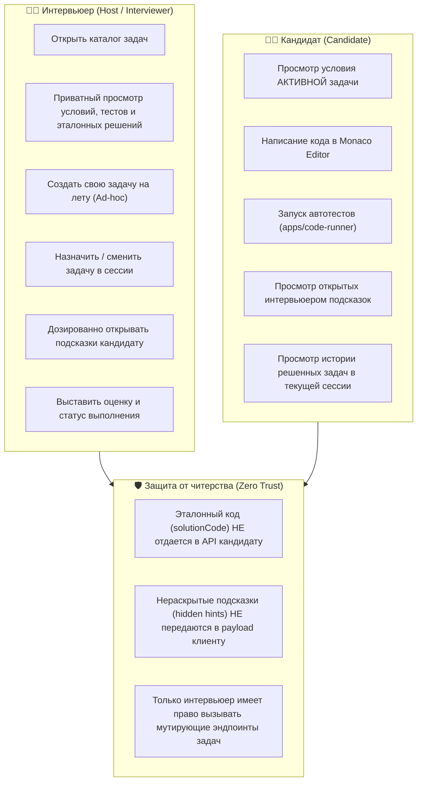
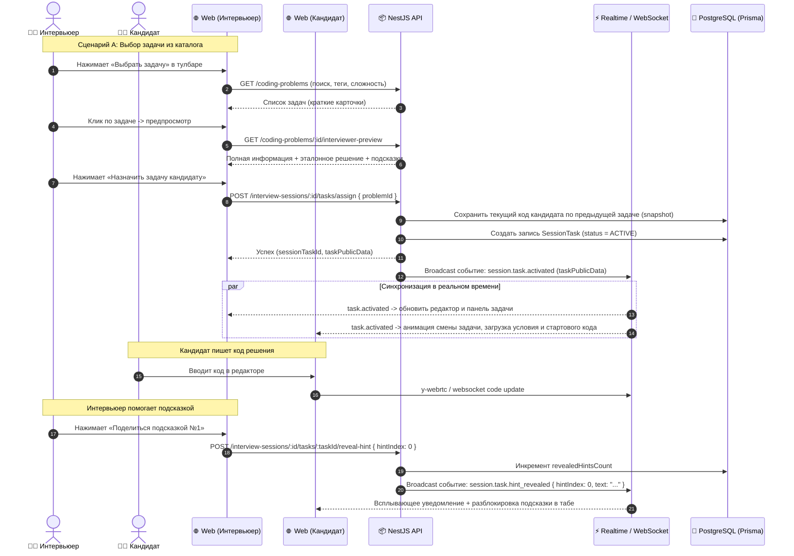
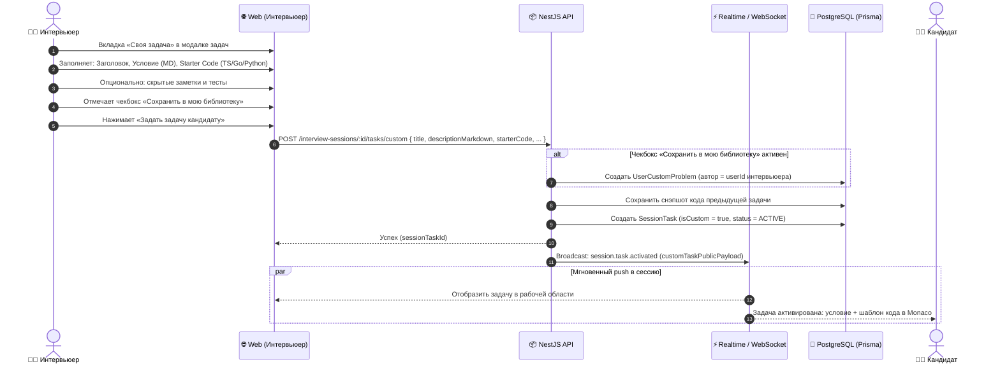

# Задачи: Выбор задачи из базы и добавление своей задачи прямо на созвоне (In-Call Task Management)

Данный документ описывает проектирование и реализацию функционала управления задачами во время активного интервью/созвона в реальном времени: выбор готовых задач из базы (`Coding Problems Bank` / `Question Bank`) с приватным предпросмотром, экспресс-создание авторской задачи «на лету» прямо в комнате встречи, мгновенная передача задачи кандидату через WebSockets, сохранение прогресса/снэпшотов кода по нескольким задачам и ролевой контроль доступа (RBAC).

---

## 1. Контекст и цели

### 1.1 Текущие ограничения платформы
1. **Хардкод задач на клиенте**: В текущей реализации `Sandbox` список задач зашит в константу [`MOCK_INTERVIEW_TASKS`](../apps/web/src/features/sandbox/model/tasks.ts).
2. **Отсутствие связи с каталогом**: База практических задач ([`coding-problems.md`](../docs/tasks/coding-problems.md)) и база вопросов ([`question-bank.md`](../docs/tasks/question-bank.md)) не интегрированы в интерфейс созвона.
3. **Невозможность дать свою задачу на лету**: Интервьюеры часто приходят со специфическими задачами своих компаний или хотят на ходу адаптировать условие под уровень кандидата. Сейчас для этого приходится отправлять условие в сторонние мессенджеры или писать комментарием в коде.
4. **Потеря кода при смене задачи**: При переключении задачи в текущем селекторе редактор перезаписывается стартовым кодом новой задачи без сохранения написанного кандидатом решения предыдущей задачи.
5. **Отсутствие изоляции роли интервьюера**: Селектор доступен обоим участникам, а эталонные подсказки либо открыты всем, либо кандидат может случайно переключить задачу.

### 1.2 Цели решения
1. **Умный выбор из каталога (Problem Catalog Picker)**:
   - Быстрый поиск по названию, тегам и компаниям (Яндекс, Т-Банк, Авито, Ozon, FAANG).
   - Фильтры по сложности (`Easy`, `Medium`, `Hard`), категориям (`Algorithms`, `Concurrency`, `Frontend`, `Backend`, `System Design`) и языку программирования.
   - **Приватный предпросмотр (Private Drawer)**: интервьюер видит полное условие, скрытые тест-кейсы, авторское эталонное решение и частые ошибки кандидатов. Кандидат до активации задачи ничего не видит.
2. **Экспресс-конструктор своей задачи прямо на созвоне (Ad-hoc Custom Task on the fly)**:
   - Создание задачи без выхода из звонка за 30 секунд.
   - Ввод названия, условия (Markdown с поддержкой блоков кода), стартового шаблона кода (Starter Code) под нужный язык.
   - Опциональные тесты (I/O test cases) или свободный режим проверки глазами интервьюера (Freeform).
   - Приватные заметки интервьюера и подсказки (Hints).
   - Чекбокс *«Сохранить в мою библиотеку задач»* для повторного использования в будущих интервью.
3. **Мгновенная активация и Realtime-синхронизация**:
   - Выдача задачи кандидату в 1 клик с моментальным обновлением UI без перезагрузки страницы.
   - Автоматическая подгрузка стартового шаблона кода на текущем выбранном языке.
4. **История задач сессии и сохранение кода кандидата (Multi-Task Session & Snapshots)**:
   - Возможность решить 2-3 задачи за одно интервью (например: разминка 15 мин + основная задача 35 мин).
   - Автоматическое сохранение снэпшота написанного кода при переключении между задачами.
   - Таймлайн сессии с фиксацией затраченного времени и итогового статуса решения (`PASSED`, `PARTIAL`, `FAILED`, `SKIPPED`).
5. **Управляемые подсказки (Guided Hints)**:
   - Подсказки скрыты от кандидата по умолчанию.
   - Интервьюер видит все подсказки сразу и открывает их кандидату по одной кнопкой «Открыть подсказку №N».

---

## 2. Архитектура и пользовательские сценарии

### 2.1 Ролевая модель (RBAC) в рамках сессии



---

### 2.2 Sequence-диаграмма: Выбор и активация задачи на созвоне



---

### 2.3 Sequence-диаграмма: Экспресс-создание своей задачи на лету



---

## 3. UI / UX дизайн интерфейса

### 3.1 Модальное окно управления задачами (In-Call Task Manager)

```
┌──────────────────────────────────────────────────────────────────────────────────────────────────┐
│ 🎯 Управление задачами интервью                                                      [✕ Закрыть] │
├──────────────────────────────────────┬───────────────────────────────────┬───────────────────────┤
│ 📚 База задач (Каталог)              │ ✍️ Своя задача (на лету)          │ ⏱️ Задачи сессии (1/2)│
├──────────────────────────────────────┴───────────────────────────────────┴───────────────────────┤
│ 🔍 Поиск: [ lru cache                                    ] [Сложность: Все ▼] [Категория: Все ▼]│
├───────────────────────────────────────────┬──────────────────────────────────────────────────────┤
│ Список задач:                             │ Предпросмотр для интервьюера (Private Preview)       │
│                                           │                                                      │
│ ┌───────────────────────────────────────┐ │ 🏷️ LRU Cache Implementation  [Medium] [Algorithms]   │
│ │ ⭐ LRU Cache               [Medium]   │ ├──────────────────────────────────────────────────────┤
│ │ Алгоритмы • Яндекс, Авито, Ozon       │ │ 📄 Условие │ 🧪 Тесты (3) │ 💡 Подсказки (2) │ 🏆 Решение│
│ ├───────────────────────────────────────┤ ├──────────────────────────────────────────────────────┤
│ │ Two Sum                    [Easy]     │ │ Спроектируйте структуру данных LRU Cache...          │
│ │ Массивы, Хэш-таблицы • Сбер, Т-Банк   │ │ Метод get(key) должен работать за O(1)...            │
│ ├───────────────────────────────────────┤ │ Метод put(key, value) должен вытеснять старый...     │
│ │ Concurrent Worker Pool     [Hard]     │ │                                                      │
│ │ Многопоточность Go • Ozon, Wildberries│ │ 💡 Подсказки для кандидата:                          │
│ ├───────────────────────────────────────┤ │ 1. Используйте комбинацию Hash Map и Doubly Linked   │
│ │ Кастомный EventEmitter     [Medium]   │ │    List для O(1) доступа и удаления.                 │
│ │ Асинхронность JS/TS • Авито, VK       │ │                                                      │
│ └───────────────────────────────────────┘ │ [ Назначить задачу кандидату (Запустить в сессию) ]  │
└───────────────────────────────────────────┴──────────────────────────────────────────────────────┘
```

### 3.2 Вкладка «Своя задача (на лету)»

```
┌──────────────────────────────────────────────────────────────────────────────────────────────────┐
│ Название задачи: [ Написать функцию deepEqual с циклическими ссылками                          ] │
│ Язык решения:    [ TypeScript ▼ ]   Сложность: [ Medium ▼ ]   Категория: [ JavaScript / Core  ▼] │
├──────────────────────────────────────────────────────────────────────────────────────────────────┤
│ 📝 Условие задачи (Markdown с поддержкой синтаксиса кода):                                       │
│ ┌──────────────────────────────────────────────────────────────────────────────────────────────┐ │
│ │ Реализуйте функцию `deepEqual(a, b)`, выполняющую глубокое сравнение двух объектов.          │ │
│ │ Функция должна корректно обрабатывать:                                                       │ │
│ │ - Примитивы, массивы и вложенные объекты                                                     │ │
│ │ - Циклические ссылки (circular references) без зацикливания                                  │ │
│ └──────────────────────────────────────────────────────────────────────────────────────────────┘ │
│ 💻 Стартовый шаблон кода (Starter Code для кандидата):                                            │
│ ┌──────────────────────────────────────────────────────────────────────────────────────────────┐ │
│ │ function deepEqual(objA: unknown, objB: unknown): boolean {                                  │ │
│ │   // Ваше решение здесь                                                                      │ │
│ │ }                                                                                            │ │
│ └──────────────────────────────────────────────────────────────────────────────────────────────┘ │
│ 🔒 Заметки интервьюера и критерии оценки (кандидат НЕ увидит):                                   │
│ ┌──────────────────────────────────────────────────────────────────────────────────────────────┐ │
│ │ Обратить внимание: использует ли кандидат WeakSet/WeakMap для отслеживания циклов.           │ │
│ └──────────────────────────────────────────────────────────────────────────────────────────────┘ │
│ [✓] Сохранить задачу в мою личную библиотеку для будущих собеседований                           │
│                                                                                                  │
│                                         [ Отмена ]  [ 🚀 Задать задачу кандидату прямо сейчас ]  │
└──────────────────────────────────────────────────────────────────────────────────────────────────┘
```

### 3.3 Вкладка «Задачи текущей сессии» (Task Timeline & Code Snapshots)

Интервьюер и кандидат могут видеть список решенных задач текущей встречи:
- **Задача 1: Two Sum** — `✅ Решена` (затрачено 14 мин). [Посмотреть код решения]
- **Задача 2: LRU Cache** — `⚡ В процессе` (идет решение, 22 мин).
- **Кнопка «Завершить задачу и перейти к следующей»**.

При нажатии на завершенную задачу открывается режим просмотра кода кандидата на момент фиксации (Read-only Snapshot).

---

## 4. Модель данных (Prisma Schema в PostgreSQL)

Для поддержки сессионных задач и кастомных задач расширяется `apps/api/prisma/schema.prisma`:

```prisma
// Статус задачи внутри конкретного интервью
enum SessionTaskStatus {
  PENDING    // Назначена в очередь, еще не начата
  ACTIVE     // Текущая активная задача в редакторе
  COMPLETED  // Успешно сдана/решена
  PARTIAL    // Решена частично / с подсказками
  SKIPPED    // Пропущена / не успели разобрать
}

// Сессионная задача (привязка задачи к конкретному созвону)
model SessionTask {
  id                   String            @id @default(uuid()) @db.Uuid
  sessionId            String            @map("session_id") @db.Uuid
  orderIndex           Int               @default(0) @map("order_index")
  status               SessionTaskStatus @default(ACTIVE)

  // Связь с каталогом задач (null, если задача была создана на лету ad-hoc)
  problemId            String?           @map("problem_id") @db.Uuid
  
  // Поля для авторской ad-hoc задачи (заполняются, если problemId == null)
  customTitle          String?           @map("custom_title") @db.VarChar(255)
  customDescription    String?           @map("custom_description") @db.Text
  customStarterCode    Json?             @map("custom_starter_code") // Record<LanguageId, string>
  customHints          String[]          @default([]) @map("custom_hints")
  interviewerNotes     String?           @map("interviewer_notes") @db.Text

  // Прогресс в сессии
  revealedHintsCount   Int               @default(0) @map("revealed_hints_count")
  startedAt            DateTime          @default(now()) @map("started_at")
  completedAt          DateTime?         @map("completed_at")
  durationSeconds      Int?              @map("duration_seconds")

  // Снэпшот решения кандидата (сохраняется при смене задачи или завершении)
  candidateCode        String?           @map("candidate_code") @db.Text
  candidateLanguage    String?           @map("candidate_language") @db.VarChar(30)
  
  // Оценка интервьюера по задаче (1-5) и комментарий
  interviewerScore     Int?              @map("interviewer_score")
  interviewerFeedback  String?           @map("interviewer_feedback") @db.Text

  createdAt            DateTime          @default(now()) @map("created_at")
  updatedAt            DateTime          @updatedAt @map("updated_at")

  session              InterviewSession  @relation(fields: [sessionId], references: [id], onDelete: Cascade)
  problem              CodingProblem?    @relation(fields: [problemId], references: [id], onDelete: SetNull)

  @@index([sessionId, status])
  @@index([problemId])
  @@map("session_tasks")
}

// Личная библиотека кастомных задач пользователя (интервьюера)
model UserCustomProblem {
  id                  String            @id @default(uuid()) @db.Uuid
  userId              String            @map("user_id") @db.Uuid
  title               String            @db.VarChar(255)
  descriptionMarkdown String            @map("description_markdown") @db.Text
  difficulty          ProblemDifficulty @default(MEDIUM)
  category            String            @default("General") @db.VarChar(50)
  tags                String[]          @default([])
  starterCode         Json              @map("starter_code") // Record<LanguageId, string>
  hints               String[]          @default([])
  interviewerNotes    String?           @map("interviewer_notes") @db.Text
  isArchived          Boolean           @default(false) @map("is_archived")
  createdAt           DateTime          @default(now()) @map("created_at")
  updatedAt           DateTime          @updatedAt @map("updated_at")

  user                User              @relation(fields: [userId], references: [id], onDelete: Cascade)

  @@index([userId, isArchived])
  @@map("user_custom_problems")
}
```

---

## 5. API Контракты (`apps/api`)

### 5.1 Эндпоинты назначения и управления задачами

| Метод | Путь | Роль | Описание |
|---|---|---|---|
| `GET` | `/interview-sessions/:id/tasks` | `PARTICIPANT` | Получение списка задач сессии (кандидат видит только публичные поля и открытые подсказки) |
| `POST` | `/interview-sessions/:id/tasks/catalog` | `INTERVIEWER` | Назначить задачу из каталога в сессию |
| `POST` | `/interview-sessions/:id/tasks/custom` | `INTERVIEWER` | Создать и мгновенно назначить свою задачу на лету |
| `PATCH` | `/interview-sessions/:id/tasks/:taskId/switch` | `INTERVIEWER` | Сделать указанную задачу активной (с сохранением снэпшота текущей) |
| `POST` | `/interview-sessions/:id/tasks/:taskId/reveal-hint` | `INTERVIEWER` | Открыть кандидату следующую подсказку |
| `PATCH` | `/interview-sessions/:id/tasks/:taskId/status` | `INTERVIEWER` | Изменить статус (`COMPLETED`, `PARTIAL`, `SKIPPED`) и оценку |
| `POST` | `/interview-sessions/:id/tasks/:taskId/snapshot` | `PARTICIPANT` | Сохранить промежуточный снэпшот кода кандидата |
| `GET` | `/user/custom-problems` | `USER` | Получить личные сохраненные задачи интервьюера |

### 5.2 Спецификация DTO

```typescript
// DTO создания своей задачи на лету
export class CreateInCallCustomTaskDto {
  @IsString()
  @MinLength(3)
  @MaxLength(200)
  title: string;

  @IsString()
  @MinLength(10)
  descriptionMarkdown: string;

  @IsEnum(ProblemDifficulty)
  difficulty: ProblemDifficulty;

  @IsString()
  category: string;

  @IsObject()
  starterCode: Record<string, string>; // { "typescript": "...", "go": "..." }

  @IsArray()
  @IsString({ each: true })
  @IsOptional()
  hints?: string[];

  @IsString()
  @IsOptional()
  interviewerNotes?: string;

  @IsBoolean()
  @IsOptional()
  saveToLibrary?: boolean; // Сохранить в UserCustomProblem для будущих интервью
}

// DTO выбора задачи из каталога
export class AssignCatalogTaskDto {
  @IsUUID()
  problemId: string;

  @IsOptional()
  @IsString()
  interviewerNotes?: string;
}

// Публичный объект задачи для кандидата (без спойлеров)
export interface PublicSessionTaskDto {
  id: string;
  orderIndex: number;
  status: SessionTaskStatus;
  title: string;
  descriptionMarkdown: string;
  difficulty: ProblemDifficulty;
  category: string;
  starterCode: Record<string, string>;
  revealedHints: string[]; // Только те подсказки, которые интервьюер РАСКРЫЛ!
  totalHintsCount: number;
}
```

---

## 6. Realtime-протокол синхронизации (WebSockets / Go Realtime)

При смене задачи или раскрытии подсказки сервер Realtime рассылает клиентам типизированные события:

### 6.1 Событие: `session.task.activated`
Отправляется всем участникам комнаты при назначении новой задачи или переключении между задачами:

```json
{
  "type": "session.task.activated",
  "sessionId": "4b68e980-6ea3-4e4a-95ec-31d77cb374cf",
  "task": {
    "sessionTaskId": "a1b2c3d4-0000-0000-0000-000000000001",
    "orderIndex": 1,
    "title": "LRU Cache Implementation",
    "difficulty": "Medium",
    "category": "Algorithms",
    "descriptionMarkdown": "## Условие\nСпроектируйте структуру данных...",
    "starterCode": {
      "typescript": "class LRUCache {\n  constructor(capacity: number) {}\n}\n",
      "go": "type LRUCache struct {}\n"
    },
    "revealedHints": [],
    "totalHintsCount": 3
  },
  "previousTaskSnapshotSaved": true
}
```

### 6.2 Событие: `session.task.hint_revealed`
Отправляется кандидату, когда интервьюер нажимает «Открыть подсказку»:

```json
{
  "type": "session.task.hint_revealed",
  "sessionId": "4b68e980-6ea3-4e4a-95ec-31d77cb374cf",
  "sessionTaskId": "a1b2c3d4-0000-0000-0000-000000000001",
  "hintIndex": 0,
  "hintText": "Используйте комбинацию Hash Map и Doubly Linked List для достижения времени доступа O(1)."
}
```

---

## 7. Frontend архитектура (`apps/web`)

### 7.1 Компоненты UI (внутри `apps/web/src/features/sandbox`)

```
apps/web/src/features/sandbox/
├── ui/
│   ├── in-call-tasks/
│   │   ├── InCallTaskManagerModal.tsx       # Главная модалка управления задачами созвона
│   │   ├── TaskCatalogTab.tsx               # Вкладка поиска и выбора из Question/Coding Bank
│   │   ├── CustomTaskCreatorTab.tsx         # Вкладка создания своей задачи на лету
│   │   ├── SessionTaskTimelineTab.tsx       # Вкладка таймлайна задач текущей сессии
│   │   ├── TaskInterviewerPreview.tsx       # Приватный предпросмотр для интервьюера
│   │   └── InCallTaskNotification.tsx       # Уведомление кандидату о смене задачи
│   ├── SandboxHeaderTaskSelector.tsx        # Обновленный селектор с кнопкой управления для интервьюера
│   └── SandboxTaskHints.tsx                 # Обновленный компонент подсказок с поддержкой серверного раскрытия
├── model/
│   ├── useInCallTasks.ts                    # Хук загрузки, выбора и публикации задач
│   └── useSandboxStore.ts                   # Сохранение активной сессионной задачи и снэпшотов
```

### 7.2 Логика переключения задачи без потери кода

```typescript
// Псевдокод переключения задачи в useSandboxStore
switchTask: (newSessionTask: SessionTask) => {
  const { currentTaskId, code, language, taskSnapshots } = get();
  
  // 1. Сохраняем текущий код кандидата по старой задаче в локальный снэпшот
  const updatedSnapshots = {
    ...taskSnapshots,
    [currentTaskId]: { code, language, savedAt: Date.now() },
  };

  // 2. Если по новой задаче уже был сохраненный код, восстанавливаем его, иначе берем starterCode
  const existingSnapshot = updatedSnapshots[newSessionTask.id];
  const newCode = existingSnapshot 
    ? existingSnapshot.code 
    : (newSessionTask.starterCode[language] ?? "");

  set({
    currentTaskId: newSessionTask.id,
    activeTask: newSessionTask,
    code: newCode,
    taskSnapshots: updatedSnapshots,
    revealedHints: newSessionTask.revealedHints.length,
  });
}
```

---

## 8. Пошаговый план реализации (Tasks Checklist)

- [ ] **1. База данных и Prisma (`apps/api/prisma/schema.prisma`)**
  - Добавить enum `SessionTaskStatus` (`PENDING`, `ACTIVE`, `COMPLETED`, `PARTIAL`, `SKIPPED`).
  - Добавить модель `SessionTask` с привязкой к `InterviewSession` и опциональной связью с `CodingProblem`.
  - Добавить модель `UserCustomProblem` для сохранения авторских задач интервьюера в личную библиотеку.
  - Сгенерировать миграцию Prisma (`pnpm --filter api prisma migrate dev`).

- [ ] **2. Backend эндпоинты и DTOs (`apps/api/src/modules/interview-sessions`)**
  - Создать `InCallTasksController` и `InCallTasksService`.
  - Реализовать `POST /interview-sessions/:id/tasks/catalog` (валидация прав интервьюера, автосохранение снэпшота предыдущей задачи).
  - Реализовать `POST /interview-sessions/:id/tasks/custom` (создание ad-hoc задачи, опциональный экспорт в `UserCustomProblem`).
  - Реализовать `POST /interview-sessions/:id/tasks/:taskId/reveal-hint` (безопасное раскрытие подсказки).
  - Реализовать `GET /interview-sessions/:id/tasks` с фильтрацией приватных данных в зависимости от роли участника (кандидат не должен получать нераскрытые подсказки и эталонный код).

- [ ] **3. Realtime события (`apps/realtime` / WebSockets)**
  - Добавить обработчики широковещательных сообщений:
    - `session.task.activated`
    - `session.task.hint_revealed`
    - `session.task.snapshot_saved`
  - Добавить реконсиляцию при повторном подключении (восстановление актуальной активной задачи и текста подсказок).

- [ ] **4. Frontend: Модалка и форма создания ad-hoc задачи (`apps/web`)**
  - Разработать компонент `InCallTaskManagerModal` со вкладками: Каталог, Своя задача, Таймлайн.
  - Разработать форму `CustomTaskCreatorTab` с живым превью Markdown и выбором стартового кода.
  - Разработать приватный предпросмотр `TaskInterviewerPreview` с эталонным решением для интервьюера.

- [ ] **5. Frontend: Защита от потери кода и UI кандидата (`apps/web`)**
  - Обновить `useSandboxStore`: поддержка коллекции `taskSnapshots` для сохранения кода каждой задачи.
  - Добавить всплывающее уведомление для кандидата при смене задачи: «Интервьюер активировал новую задачу. Код предыдущей сохранен».
  - В компоненте `SandboxHeaderTaskSelector` для интервьюера добавить кнопку «Управление задачами / Добавить задачу» с бейджем количества задач в сессии.
  - В `SandboxTaskHints` отображать статус подсказок: интервьюер видит кнопку «Открыть кандидату», кандидат видит только открытые подсказки или кнопку «Запросить подсказку у интервьюера».

- [ ] **6. Тестирование и верификация**
  - E2E-тест сценария: выбор задачи из каталога интервьюером -> мгновенная смена условий и стартового кода у кандидата.
  - Тест сценария создания своей задачи на созвоне -> проверка сохранения в базу и сохранения в личный профиль.
  - Тест сохранения кода кандидата при переключении туда-обратно между задачами.
  - Security audit: проверка, что кандидат через Network DevTools не может получить скрытый эталонный код и нераскрытые подсказки.
