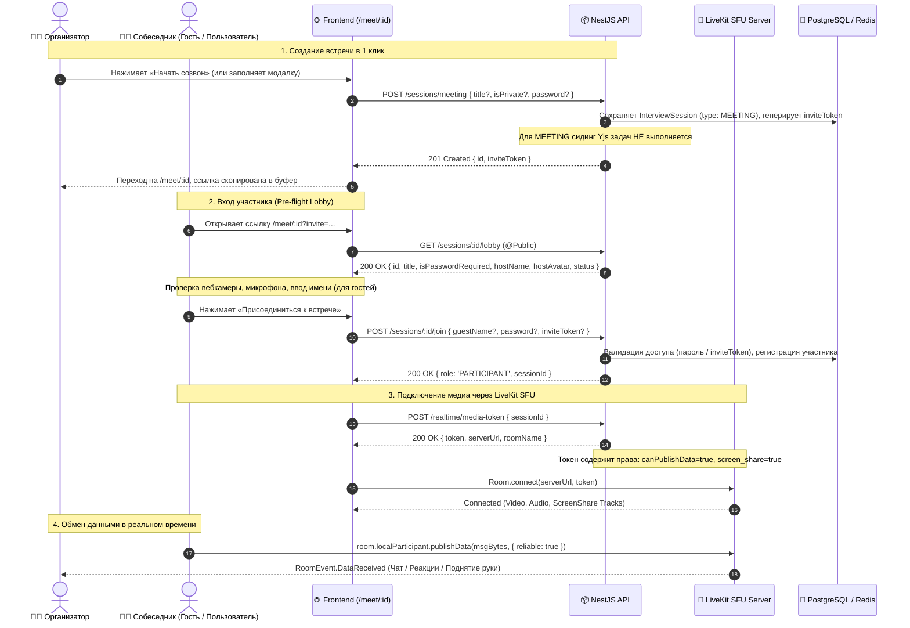

# Задачи: Универсальные видеокомнаты для созвонов и встреч (Instant Meeting Rooms)

Данный документ описывает функционал универсальных видеокомнат для прямого общения пользователей: мгновенные созвоны в один клик, аудио- и видеосвязь, демонстрация экрана со звуком, текстовый чат в реальном времени, гостевой доступ без обязательной регистрации и создание защищенных паролем приватных встреч.

---

## 1. Контекст и цели

### Проблема и обоснование
В текущей реализации `Sandbox` интерфейс жестко завязан на написание кода (редактор Monaco, файловое дерево, терминал execution runner), а видеосвязь вынесена в небольшое вспомогательное окно и исторически ограничена связью 1-на-1 с жестким разделением на роли (интервьюер и кандидат).

При этом пользователям необходим **универсальный инструмент для видеовстреч и созвонов (в стиле Google Meet / Zoom)** без привязки к задачам по программированию:
* **Быстрый созвон (Instant Call)**: возможность созвониться с любым человеком в один клик по короткой ссылке.
* **HR-скрининги и первичные знакомства**: софт-скиллы, обсуждение опыта и условий.
* **System Design & Архитектурные секции**: демонстрация схем, презентаций, диаграмм в Figma/Miro через шаринг экрана.
* **Поведенческие (Behavioral) интервью**.
* **Разбор резюме, консультации и менторские сессии / P2P-нетворкинг**.

### Цели фичи
1. **Универсальный экран видеоконференции**: чистый, фокусированный интерфейс звонка на отдельном маршруте `/meet/[id]`.
2. **Мгновенный старт в 1 клик**: создание встречи без лишних настроек с автоматическим копированием ссылки-приглашения в буфер обмена.
3. **Равноправие участников (Peers)**: все участники встречи имеют полный доступ к микрофону, вебкамере, демонстрации экрана (с системным звуком) и чату.
4. **Гостевой доступ (No-friction Guest Join)**: участник без аккаунта на платформе может зайти по ссылке, указав только свое имя в предстартовом лобби.
5. **Адаптивные раскладки**:
   * *Grid Mode* — отзывчивая галерея участников (от 1 до 6+ человек) с подсветкой активного спикера.
   * *Stage / Spotlight Mode* — автоматический фокус на демонстрации экрана с компактной полосой участников.
6. **Встроенный чат и реакции**: мгновенный обмен ссылками, текстовыми сообщениями, поднятие руки и эмодзи-реакции через DataChannel LiveKit.
7. **Безопасность и контроль**: опциональная защита комнаты паролем и возможность для организатора (Host) завершить встречу для всех.

---

## 2. Архитектура решения

### 2.1 Интерфейс и Layouts страницы `/meet/[id]`

```
┌─────────────────────────────────────────────────────────────┬─────────────────┐
│ 👥 System Design Mock (3 участника)  🔒 Защищено            │ 💬 Чат встречи  │
├─────────────────────────────────────────────────────────────┤                 │
│                                                             │ [Иван] 19:42    │
│  ┌──────────────────────┐  ┌──────────────────────────────┐ │ Привет! Слышно?  │
│  │                      │  │                              │ │                 │
│  │      Собеседник      │  │         Моя камера           │ │ [Анна] 19:43    │
│  │   (Active Speaker)   │  │                              │ │ Да, отлично!    │
│  │                      │  │                              │ │                 │
│  └──────────────────────┘  └──────────────────────────────┘ │ [Иван] 19:44    │
│                                                             │ Скинул схему:   │
│  ┌────────────────────────────────────────────────────────┐ │ https://...     │
│  │                                                        │ │                 │
│  │          [ Демонстрация экрана / Архитектура ]         │ │                 │
│  │                                                        │ │                 │
│  └────────────────────────────────────────────────────────┘ │                 │
│                                                             │┌───────────────┐│
│                                                             ││Сообщение...   ││
├─────────────────────────────────────────────────────────────┴┴───────────────┤
│ [🎤 Мик] [📷 Камера] [🖥️ Экран] [✋ Рука] [😀 Реакции] [💬 Чат] [⚙️ Настройки] [🔴 Выйти]│
└───────────────────────────────────────────────────────────────────────────────┘
```

#### Режимы лейаута:
1. **Grid Mode (Сетка)**: Все участники отображаются равновеликими плитками. Активный говорящий (`activeSpeakers`) подсвечивается акцентной рамкой.
2. **Stage / Spotlight Mode**: Включается автоматически при трансляции экрана кем-либо из участников. Демонстрация экрана занимает до 80% центральной области, видео участников выстраиваются в вертикальную или горизонтальную полосу.
3. **Sidebar Chat**: Выдвижная панель справа с поддержкой ссылок, копирования текста и счетчиком непрочитанных сообщений при скрытой панели.

---

### 2.2 Sequence-диаграмма: Создание, Вход и Realtime обмен



---

## 3. Модель данных и изменения схемы (Prisma)

В `apps/api/prisma/schema.prisma` расширяется модель `InterviewSession`:

```prisma
enum InterviewSessionType {
  CODE      // Классическая песочница с Monaco IDE, терминалом и code runner
  MEETING   // Универсальная видеокомната: созвоны, конференции, System Design
}

enum InterviewParticipantRole {
  CANDIDATE
  INTERVIEWER
  OBSERVER
  HOST        // Организатор встречи (полный доступ + администрирование комнаты)
  PARTICIPANT // Равноправный участник встречи
}

model InterviewSession {
  id              String                 @id @default(uuid()) @db.Uuid
  userId          String                 @db.Uuid // Организатор / создатель
  user            User                   @relation(fields: [userId], references: [id], onDelete: Cascade)
  
  title           String                 @default("Видеовстреча") @db.VarChar(120)
  description     String?                @db.VarChar(500)
  type            InterviewSessionType   @default(CODE)
  
  isPrivate       Boolean                @default(false)
  passwordHash    String?                @map("password_hash")
  inviteToken     String                 @unique @default(uuid()) @map("invite_token")
  
  status          InterviewSessionStatus @default(ACTIVE)
  startedAt       DateTime?
  endedAt         DateTime?
  createdAt       DateTime               @default(now())
  updatedAt       DateTime               @updatedAt

  participants    InterviewParticipant[]

  @@index([userId])
  @@index([type, status])
  @@index([inviteToken])
  @@map("interview_sessions")
}
```

> [!NOTE]
> Для сессий типа `MEETING` в `SessionsService.createMeetingSession` **полностью отключается сидинг Yjs задач** (`seedTaskDoc`), что устраняет ненужные вызовы к Redis и ускоряет инициализацию до единиц миллисекунд.

---

## 4. Архитектура Realtime и LiveKit SFU

### 4.1 Исправление и расширение LiveKit Grants (`apps/api`)
В [livekit.service.ts](../../apps/api/src/modules/realtime/livekit.service.ts) для сессий типа `MEETING` и ролей `HOST` / `PARTICIPANT`:
* **Обязательно включить `canPublishData: true`** — без этого LiveKit блокирует отправку сообщений чата, реакций и поднятия руки.
* **Разрешить `screen_share` и `screen_share_audio` всем участникам**:
  ```typescript
  const MEETING_PARTICIPANT_GRANT = {
    roomJoin: true,
    canPublish: true,
    canSubscribe: true,
    canPublishData: true,
    canPublishSources: ["camera", "microphone", "screen_share", "screen_share_audio"],
  };
  ```

### 4.2 Текстовый чат через LiveKit Data Messages
* **Отправка сообщения**:
  ```typescript
  const payload = JSON.stringify({
    type: "CHAT_MESSAGE",
    id: crypto.randomUUID(),
    senderId: currentUserId,
    senderName: displayName,
    senderAvatar: avatarUrl,
    text: messageText,
    timestamp: new Date().toISOString(),
  });

  const encoder = new TextEncoder();
  await room.localParticipant.publishData(encoder.encode(payload), {
    reliable: true, // Гарантированная доставка
  });
  ```
* **Прием сообщений**: Слушатель `RoomEvent.DataReceived` декодирует байты и добавляет сообщение в реактивное состояние.
* **Модель видимости сообщений (Late Joiners)**: Чат по умолчанию работает как в Google Meet (сообщения видны только тем, кто находится в звонке во время отправки). В UI чата выводится понятная подсказка: *«Сообщения чата видны только во время звонка»*.

### 4.3 Поднятие руки (Raise Hand) и Реакции
* `{ type: "RAISE_HAND", participantId: string, raised: boolean }` — отображение бейджа с ладонью на карточке участника и звуковой сигнал хосту.
* `{ type: "REACTION", emoji: "👍" | "❤️" | "👏" | "🔥" }` — всплывающие анимации эмодзи над плиткой участника.

### 4.4 Демонстрация экрана со звуком и разрешение конфликтов
* При шаринге экрана со звуком захватываются два трека: видео и `screen_share_audio`. Фронтенд подписывается на оба.
* Если другой участник пытается включить демонстрацию, когда кто-то уже показывает экран, в UI выводится диалог подтверждения: *«Иван сейчас демонстрирует экран. Прервать его демонстрацию?»*.

---

## 5. Frontend Архитектура (`apps/web`)

### Расположение модулей (FSD):
* **Страница созвона**: `apps/web/src/app/(workspace)/meet/[id]/page.tsx`
* **Фича `features/meeting-call`**:
  * `ui/MeetingRoomWorkspace.tsx` — главный лейаут встречи (Grid vs Stage).
  * `ui/MeetingPreFlightLobby.tsx` — экран перед входом: превью камеры/микрофона, индикатор уровня громкости речи (Audio Meter), поле ввода имени для гостей и поле ввода пароля (если встреча защищена).
  * `ui/VideoTile.tsx` — плитка участника (отдельный видеопоток, имя, заглушка аватара при выключенной камере, индикатор микрофона, статус поднятой руки, подсветка активного спикера).
  * `ui/VideoGrid.tsx` — адаптивная CSS-сетка (1 участник по центру, 2 участника 50/50, 3-6 участников в сетке 2x2 / 3x2).
  * `ui/ScreenShareStage.tsx` — центральная сцена демонстрации экрана с возможностью перехода в полноэкранный режим (Fullscreen).
  * `ui/CallControlsBar.tsx` — нижняя панель управления:
    * Микрофон (Вкл/Выкл + меню выбора устройства ввода).
    * Камера (Вкл/Выкл + меню выбора вебкамеры).
    * Демонстрация экрана (Вкл/Выкл трансляции).
    * Поднять руку (Raise Hand).
    * Быстрые реакции (эмодзи 👍, ❤️, 👏, 🔥).
    * Открытие/закрытие чата с бейджем непрочитанных.
    * Настройки аудио/видео.
    * Кнопка «Покинуть звонок» (для участников) / «Завершить для всех» (для хоста).
  * `ui/MeetingChatSidebar.tsx` — выдвижная панель чата со списком сообщений, автоскроллом и подсветкой кликабельных ссылок.
  * `model/useMeetingRoom.ts` — управление состоянием комнаты, списком участников и их треками через LiveKit SDK (`track.attach()`).
  * `model/useMeetingChat.ts` — хук отправки и получения DataChannel сообщений.

> [!IMPORTANT]
> **Управление жизненным циклом медиапотока в лобби**: При переходе из `MeetingPreFlightLobby` в сам созвон `MeetingRoomWorkspace` тестовый медиапоток лобби должен быть строго остановлен через `stream.getTracks().forEach(t => t.stop())`, чтобы освободить устройства захвата для LiveKit SDK и предотвратить ошибку `NotReadableError: Device in use`.

---

## 6. Пошаговый план реализации

### Этап 1: Бэкенд, Модель данных и Безопасность (`apps/api`, `packages/dto`, `packages/api`)
- [ ] **1. Миграция Prisma**:
  - Добавить enum `InterviewSessionType` (`CODE`, `MEETING`).
  - Добавить роли `HOST`, `PARTICIPANT` в `InterviewParticipantRole`.
  - Добавить поля `type`, `title`, `passwordHash`, `inviteToken` в модель `InterviewSession`.
  - Применить миграцию.
- [ ] **2. DTO и валидация (`packages/dto`)**:
  - `CreateMeetingDto` (`title?`, `isPrivate?`, `password?`).
  - `MeetingLobbyDto` (`id`, `title`, `isPasswordRequired`, `hostName`, `hostAvatar`, `status`).
  - `JoinMeetingDto` (`guestName?`, `password?`, `inviteToken?`).
- [ ] **3. Реализация сервиса `SessionsService`**:
  - Метод `createMeetingSession(userId, dto)` без сидинга задач Yjs.
  - Метод `getMeetingLobby(sessionId)` (безопасные публичные метаданные).
  - Поддержка проверки пароля с защитой от брутфорса (Redis rate limit 5 попыток).
  - Поддержка гостевого входа и входа по capability invite-ссылке без ввода пароля.
- [ ] **4. Эндпоинты в `SessionsController`**:
  - `POST /sessions/meeting` — создание встречи.
  - `GET /sessions/:id/lobby` — публичный эндпоинт (`@Public()`).
  - `POST /sessions/:id/join` — вход в комнату (`@Public()` с поддержкой авторизованных и гостей).
- [ ] **5. Доработка `LivekitService`**:
  - Включение `canPublishData: true` в токены участников созвона.
  - Разрешение `screen_share` и `screen_share_audio` для всех участников встреч.
- [ ] **6. Регенерация клиентов**:
  - `pnpm --filter api generate:openapi` и `pnpm --filter @packages/api generate`.

### Этап 2: Realtime и Медиа (`apps/web`)
- [ ] **7. Хук `useMeetingRoom` (Многопользовательское видео)**:
  - Подписка на подключение/отключение участников (`ParticipantConnected`, `ParticipantDisconnected`).
  - Индивидуальное связывание видеотреков с элементами `<video>` через `track.attach()` / `track.detach()`.
  - Отслеживание активных спикеров (`ActiveSpeakersChanged`).
  - Отслеживание демонстрации экрана (`TrackPublished` с источником `ScreenShare`).
- [ ] **8. Хук `useMeetingChat` (DataChannel)**:
  - Отправка и прием текстовых сообщений через `publishData({ reliable: true })`.
  - Отправка реакций и поднятия руки.
  - Счетчик непрочитанных сообщений при закрытом сайдбаре.

### Этап 3: UI Компоненты созвона (`apps/web`)
- [ ] **9. Предстартовое лобби (`MeetingPreFlightLobby`)**:
  - Интерактивное превью камеры и переключатели микрофона/вебкамеры.
  - Анимированный Audio Meter (индикатор уровня микрофона).
  - Поле ввода имени для гостей (если пользователь не залогинен).
  - Поле ввода пароля (если комната защищена и нет invite-токена).
  - Кнопка «Присоединиться к встрече».
- [ ] **10. Сетка участников и Spotlight экрана (`VideoGrid`, `VideoTile`, `ScreenShareStage`)**:
  - Адаптивная раскладка от 1 до 6+ участников.
  - Подсветка говорящего участника.
  - Полноэкранный режим для демонстрации экрана.
  - Заглушка с аватаром и именем при выключенной камере.
- [ ] **11. Панель управления звонком (`CallControlsBar`)**:
  - Кнопки микрофона, камеры, экрана, руки, реакций и чата.
  - Всплывающее меню выбора микрофона/динамиков/камеры.
  - Кнопка выхода / завершения звонка.
- [ ] **12. Сайдбар чата (`MeetingChatSidebar`)**:
  - Лента сообщений с таймштампами и именами участников.
  - Автоскролл к новым сообщениям и парсинг URL-ссылок.
  - Быстрый выбор эмодзи.

### Этап 4: Интеграция, Навигация и UX
- [ ] **13. Быстрый созвон в интерфейсе платформы**:
  - Кнопка «Начать созвон» в верхнем баре / сайдбаре рабочего пространства.
  - Модалка успешного создания с возможностью быстрого копирования ссылки.
- [ ] **14. Страница созвона `/meet/[id]`**:
  - Обработка состояний загрузки, неверного ID, закрытой комнаты.
  - Бесшовный переход из `PreFlightLobby` в `MeetingRoomWorkspace`.
