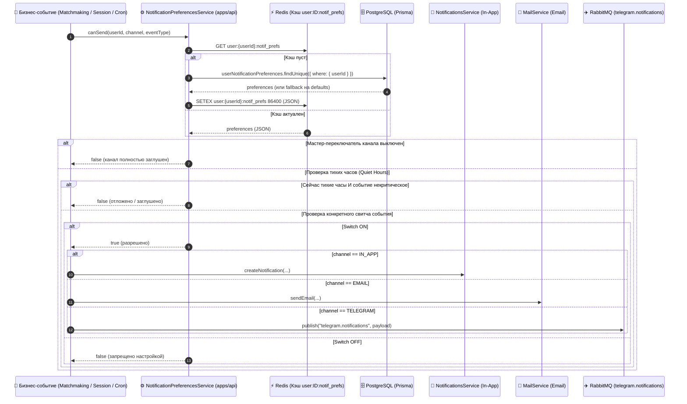

# Задачи: API настроек уведомлений профиля пользователя (Notification Preferences API)

Данный документ содержит детальную архитектурную спецификацию и пошаговую декомпозицию задач для разработки серверной части управления настройками уведомлений пользователя (**User Notification Preferences API**) в сервисе **`apps/api`** (NestJS, Prisma ORM, Redis, PostgreSQL), создания DTO и схем валидации в **`packages/dto`**, общих типов в **`packages/types`**, а также интеграции с механизмами доставки через **Email** (`MailService`), **Telegram** (`apps/telegram-bot` через RabbitMQ) и **In-App** пуши на сайте (`NotificationsService` + Redis Streams).

---

## 1. Концепция и матрица отключаемых уведомлений

Пользователь платформы должен иметь возможность гибко настраивать каналы получения уведомлений, время напоминаний, режим «тихих часов» и тестировать доставку.

### 1.1. Каналы доставки (Notification Channels):
1. **📧 Электронная почта (`EMAIL`)**: периодические сводки, напоминания о сессиях, фидбек и важные события платформы.
2. **✈️ Telegram (`TELEGRAM`)**: оперативные уведомления в боте, напоминания со ссылкой в комнату, отклики на заявки матчинга.
3. **🔔 Уведомления на сайте (`IN_APP`)**: всплывающие тосты и список оповещений в колокольчике шапки сайта в реальном времени.

---

### 1.2. Матрица событий платформы и возможность отключения

| Категория событий | Тип события | Описание события | Email | Telegram | In-App (Сайт) | Можно ли отключить? |
| :--- | :--- | :--- | :---: | :---: | :---: | :---: |
| **Собеседования** | `SESSION_INVITE` | Приглашение на интервью / подтверждение заявки матчинга | ✅ (def: ON) | ✅ (def: ON) | ✅ (def: ON) | **Да** |
| **Собеседования** | `INTERVIEW_REMINDER` | Напоминание о сессии (настраиваемое время за 15м / 30м / 1ч) | ✅ (def: ON) | ✅ (def: ON) | ✅ (def: ON) | **Да** |
| **Собеседования** | `SESSION_CANCELLED` | Отмена или перенос назначенной сессии партнером | ✅ (def: ON) | ✅ (def: ON) | ✅ (def: ON) | **Да** |
| **Собеседования** | `FEEDBACK_READY` | Интервьюер оставил оценку и отзыв / сформирован AI-отчет | ✅ (def: ON) | ✅ (def: ON) | ✅ (def: ON) | **Да** |
| **Обучение** | `NEW_PROBLEMS_DIGEST` | Еженедельный дайджест новых задач и вопросов в каталоге | ✅ (def: OFF) | ✅ (def: OFF) | ✅ (def: OFF) | **Да** |
| **Безопасность** | `SECURITY_NEW_LOGIN` | Вход в аккаунт с нового устройства / подозрительного IP | ✅ (def: ON) | ✅ (def: ON) | ✅ (def: ON) | **Да** |
| **Безопасность (Крит.)** | `SECURITY_CRITICAL` | Сброс пароля, смена email, код подтверждения входа | ✅ (def: ON) | — | — | ❌ **НЕТ (Всегда ON)** |

> [!IMPORTANT]
> **Принцип безопасности транзакционных писем (Bypass Policy):**
> Критические письма безопасности (`SECURITY_CRITICAL`: сброс пароля, верификация email, одноразовые OTP-коды) являются строго обязательными транзакционными сообщениями. Они **не имеют настроек отключения**, не фигурируют в пользовательских свитчах и отправляются всегда независимо от предпочтений пользователя.

---

## 2. Расширенные возможности системы

### 2.1. 🎚️ Мастер-переключатели каналов (Master Toggles)
- Возможность выключить или включить весь канал целиком (`emailMasterEnabled`, `telegramMasterEnabled`, `inAppMasterEnabled`) одним переключателем в шапке карточки.

### 2.2. 🌙 «Тихие часы» (Quiet Hours / Do Not Disturb)
- Пользователь указывает временной интервал (по умолчанию `23:00` — `08:00`) и свой часовой пояс (`quietHoursTimezone`, e.g. `Europe/Moscow`).
- Во время тихих часов Telegram-бот не присылает сообщения со звуком (или откладывает некритические сообщения до утра).
- Исключение: срочные напоминания за 15 минут до начала интервью, если сессия запланирована пользователем на ночное время.

### 2.3. ⏱️ Выбор времени напоминания о собеседовании (Lead Time)
- Поле `interviewReminderLeadTime` (значения в минутах: `15`, `30`, `60`, `1440`).
- Фоновый крон планировщика проверяет именно персональный интервал каждого участника сессии.

### 2.4. 🧪 Тестовая доставка (Test Delivery Endpoint)
- Эндпоинт `POST /api/v1/profile/notification-preferences/test-delivery`.
- Позволяет пользователю в 1 клик убедиться, что канал настроен и сообщения успешно доходят.

---

## 3. Архитектурная диаграмма потока проверки настроек (Gatekeeper Flow)



---

## 4. Модель данных в Prisma (`schema.prisma`)

Создается отдельная таблица `user_notification_preferences` со связью `1:1` к модели `User`:

```prisma
model UserNotificationPreferences {
  id     String @id @default(uuid()) @db.Uuid
  userId String @unique @map("user_id") @db.Uuid
  user   User   @relation(fields: [userId], references: [id], onDelete: Cascade)

  // --- 1. Мастер-переключатели каналов ---
  emailMasterEnabled    Boolean @default(true) @map("email_master_enabled")
  telegramMasterEnabled Boolean @default(true) @map("telegram_master_enabled")
  inAppMasterEnabled    Boolean @default(true) @map("in_app_master_enabled")

  // --- 2. Электронная почта (Email) ---
  emailSessionInvites     Boolean @default(true)  @map("email_session_invites")
  emailInterviewReminders Boolean @default(true)  @map("email_interview_reminders")
  emailSessionCancelled   Boolean @default(true)  @map("email_session_cancelled")
  emailFeedbackReady      Boolean @default(true)  @map("email_feedback_ready")
  emailNewProblemsDigest  Boolean @default(false) @map("email_new_problems_digest")
  emailSecurityNewLogin   Boolean @default(true)  @map("email_security_new_login")

  // --- 3. Telegram-бот ---
  telegramSessionInvites     Boolean @default(true)  @map("telegram_session_invites")
  telegramInterviewReminders Boolean @default(true)  @map("telegram_interview_reminders")
  telegramSessionCancelled   Boolean @default(true)  @map("telegram_session_cancelled")
  telegramFeedbackReady      Boolean @default(true)  @map("telegram_feedback_ready")
  telegramNewProblemsDigest  Boolean @default(false) @map("telegram_new_problems_digest")
  telegramSecurityNewLogin   Boolean @default(true)  @map("telegram_security_new_login")

  // --- 4. Уведомления на сайте (In-App) ---
  inAppSessionInvites     Boolean @default(true)  @map("in_app_session_invites")
  inAppInterviewReminders Boolean @default(true)  @map("in_app_interview_reminders")
  inAppSessionCancelled   Boolean @default(true)  @map("in_app_session_cancelled")
  inAppFeedbackReady      Boolean @default(true)  @map("in_app_feedback_ready")
  inAppNewProblemsDigest  Boolean @default(false) @map("in_app_new_problems_digest")
  inAppSecurityNewLogin   Boolean @default(true)  @map("in_app_security_new_login")
  inAppSoundEnabled       Boolean @default(true)  @map("in_app_sound_enabled")

  // --- 5. Параметры времени и тихих часов ---
  interviewReminderLeadTime Int     @default(15)    @map("interview_reminder_lead_time") // 15, 30, 60, 1440 минут
  quietHoursEnabled         Boolean @default(false) @map("quiet_hours_enabled")
  quietHoursStart           String? @default("23:00") @map("quiet_hours_start")
  quietHoursEnd             String? @default("08:00") @map("quiet_hours_end")
  quietHoursTimezone        String  @default("UTC")   @map("quiet_hours_timezone")

  createdAt DateTime @default(now()) @map("created_at")
  updatedAt DateTime @updatedAt      @map("updated_at")

  @@map("user_notification_preferences")
}
```

В модели `User`:
```prisma
model User {
  // ...
  notificationPreferences UserNotificationPreferences?
  // ...
}
```

---

## 5. DTO и Zod-схемы (`packages/dto` и `packages/types`)

### 5.1. Типы каналов и событий в `@packages/types`:
```typescript
export type NotificationChannel = 'EMAIL' | 'TELEGRAM' | 'IN_APP';

export type ToggleableNotificationEvent =
  | 'SESSION_INVITE'
  | 'INTERVIEW_REMINDER'
  | 'SESSION_CANCELLED'
  | 'FEEDBACK_READY'
  | 'NEW_PROBLEMS_DIGEST'
  | 'SECURITY_NEW_LOGIN';
```

### 5.2. DTO обновления в `@packages/dto`:
Все поля в `UpdateNotificationPreferencesDto` опциональны (`Partial`), поддерживая точечные обновления:

```typescript
export class UpdateNotificationPreferencesDto {
  // Master
  @IsOptional() @IsBoolean() emailMasterEnabled?: boolean;
  @IsOptional() @IsBoolean() telegramMasterEnabled?: boolean;
  @IsOptional() @IsBoolean() inAppMasterEnabled?: boolean;

  // Email
  @IsOptional() @IsBoolean() emailSessionInvites?: boolean;
  @IsOptional() @IsBoolean() emailInterviewReminders?: boolean;
  @IsOptional() @IsBoolean() emailSessionCancelled?: boolean;
  @IsOptional() @IsBoolean() emailFeedbackReady?: boolean;
  @IsOptional() @IsBoolean() emailNewProblemsDigest?: boolean;
  @IsOptional() @IsBoolean() emailSecurityNewLogin?: boolean;

  // Telegram
  @IsOptional() @IsBoolean() telegramSessionInvites?: boolean;
  @IsOptional() @IsBoolean() telegramInterviewReminders?: boolean;
  @IsOptional() @IsBoolean() telegramSessionCancelled?: boolean;
  @IsOptional() @IsBoolean() telegramFeedbackReady?: boolean;
  @IsOptional() @IsBoolean() telegramNewProblemsDigest?: boolean;
  @IsOptional() @IsBoolean() telegramSecurityNewLogin?: boolean;

  // In-App
  @IsOptional() @IsBoolean() inAppSessionInvites?: boolean;
  @IsOptional() @IsBoolean() inAppInterviewReminders?: boolean;
  @IsOptional() @IsBoolean() inAppSessionCancelled?: boolean;
  @IsOptional() @IsBoolean() inAppFeedbackReady?: boolean;
  @IsOptional() @IsBoolean() inAppNewProblemsDigest?: boolean;
  @IsOptional() @IsBoolean() inAppSecurityNewLogin?: boolean;
  @IsOptional() @IsBoolean() inAppSoundEnabled?: boolean;

  // Расширенные настройки
  @IsOptional() @IsIn([15, 30, 60, 1440]) interviewReminderLeadTime?: number;
  @IsOptional() @IsBoolean() quietHoursEnabled?: boolean;
  @IsOptional() @Matches(/^([0-1]?[0-9]|2[0-3]):[0-5][0-9]$/) quietHoursStart?: string;
  @IsOptional() @Matches(/^([0-1]?[0-9]|2[0-3]):[0-5][0-9]$/) quietHoursEnd?: string;
  @IsOptional() @IsString() quietHoursTimezone?: string;
}

export class SendTestNotificationDto {
  @IsIn(['EMAIL', 'TELEGRAM', 'IN_APP'])
  channel!: NotificationChannel;
}
```

---

## 6. API Контроллер (`apps/api`)

Маршруты добавляются в модуль управления профилем: `/api/v1/profile/notification-preferences`:

### 6.1. `GET /api/v1/profile/notification-preferences`
- **Авторизация**: `AccessTokenGuard`
- **Возвращает**:
  - `isTelegramLinked: boolean` — флаг привязки Telegram-аккаунта (фронтенд использует его для скрытия/показа колонки TG).
  - Сгруппированные настройки по каналам (`email`, `telegram`, `inApp`).
  - Параметры тихих часов и времени напоминания.

### 6.2. `PATCH /api/v1/profile/notification-preferences`
- **Авторизация**: `AccessTokenGuard`
- **Тело запроса**: `UpdateNotificationPreferencesDto`
- **Логика**:
  - `prisma.userNotificationPreferences.upsert(...)` по `userId`.
  - Инвалидация ключа в Redis: `redis.del("user:" + userId + ":notif_prefs")`.
  - Возврат актуализированного состояния.

### 6.3. `POST /api/v1/profile/notification-preferences/test-delivery`
- **Авторизация**: `AccessTokenGuard`
- **Тело запроса**: `{ channel: "EMAIL" | "TELEGRAM" | "IN_APP" }`
- **Логика**:
  - `EMAIL`: отправка тестового письма через `MailService` с темой «Тестовое уведомление MockInterviewAI».
  - `TELEGRAM`: отправка мгновенного тестового сообщения в очередь `telegram.notifications` (если Telegram привязан; иначе `BadRequestException("Telegram is not linked")`).
  - `IN_APP`: генерация события в Redis Streams и SSE для отображения тестового тоста.
- **Ответ (200 OK)**: `{ success: true, message: "Test notification sent successfully" }`.

---

## 7. Интеграция с Telegram-ботом (`apps/telegram-bot`)

В сервисе `apps/telegram-bot`:
1. Добавить команду `/settings`.
2. По команде `/settings` бот отправляет сообщение с кнопкой `WebApp` (переход на страницу `/profile?tab=notifications`) либо выводит Inline Keyboard для быстрого переключения основных флагов (`Собеседования`, `Дайджест`, `Тихие часы`) через вызовы `PATCH /api/v1/telegram/preferences`.

---

## 8. Декомпозиция задач для Backend

- [ ] **Task 1: Миграция схемы Prisma**
  - Добавить модель `UserNotificationPreferences` с полями мастер-тумблеров, каналов, тихих часов и `leadTime`.
  - Сгенерировать и применить миграцию.

- [ ] **Task 2: DTO и валидация (`packages/dto`)**
  - Создать `UpdateNotificationPreferencesDto`, `NotificationPreferencesResponseDto`, `SendTestNotificationDto`.
  - Добавить Zod-схемы и экспортировать типы.

- [ ] **Task 3: Сервис `NotificationPreferencesService`**
  - Реализовать `getPreferences(userId)`.
  - Реализовать `updatePreferences(userId, dto)`.
  - Реализовать `sendTestNotification(userId, channel)`.
  - Реализовать логику `canSend(userId, channel, eventType)` с проверкой тихих часов и мастер-тумблеров.
  - Настроить кэширование в Redis (TTL 24h) с автоматической инвалидацией.

- [ ] **Task 4: Контроллер `NotificationPreferencesController`**
  - Реализовать `GET`, `PATCH`, `POST /test-delivery`.
  - Описать аннотации Swagger/OpenAPI.

- [ ] **Task 5: Интеграция в отправку уведомлений**
  - Подключить `canSend` в `NotificationsService` (In-App), `MailService` (Email) и Telegram RabbitMQ Publisher.
  - Настроить крон напоминаний для учета `interviewReminderLeadTime` каждого пользователя.

- [ ] **Task 6: Тестирование**
  - Unit-тесты `notification-preferences.service.spec.ts`.
  - E2E-тесты `notification-preferences.e2e-spec.ts`.
