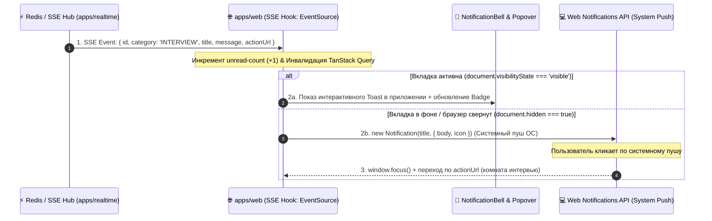

# Задачи: Центр уведомлений в реальном времени (SSE, CRUD и Web Notifications API)

Данный документ содержит описание задач по реализации клиентского центра уведомлений с real-time доставкой через SSE и нативными браузерными пушами, архитектурную диаграмму и структуру файлов.

---

## 1. Архитектурная диаграмма потока событий (SSE + Web Notifications)



---

## 2. Структура файлов в монорепозитории (FSD)

```text
apps/web/src/
├── app/
│   └── (main)/
│       └── notifications/
│           └── page.tsx                       # Страница всех уведомлений с фильтрами
│
├── widgets/
│   ├── notification-bell/                     # Виджет колокольчика в Header
│   │   ├── ui/
│   │   │   ├── NotificationBell.tsx           # Кнопка с динамическим бейджем и Popover
│   │   │   ├── NotificationDropdownList.tsx   # Список последних 5-10 уведомлений
│   │   │   └── NotificationDropdownItem.tsx   # Элемент выпадающего списка
│   │   └── index.ts
│   └── notifications-feed/                    # Лента уведомлений на странице /notifications
│       ├── ui/
│       │   ├── NotificationsFeed.tsx
│       │   └── NotificationsCategoryTabs.tsx
│       └── index.ts
│
├── features/
│   ├── manage-notifications/                  # Мутации действий над уведомлениями
│   │   ├── model/
│   │   │   ├── useMarkAsRead.ts               # PATCH /api/v1/notifications/:id/read
│   │   │   ├── useMarkAllAsRead.ts            # POST /api/v1/notifications/read-all
│   │   │   └── useDeleteNotification.ts       # DELETE /api/v1/notifications/:id
│   │   └── index.ts
│   │
│   └── browser-notifications/                 # Управление нативными пушами ОС
│       ├── model/
│       │   ├── useBrowserNotifications.ts     # Запрос прав и отправка системных пушей
│       │   └── permissionStorage.ts
│       └── ui/
│           └── EnableBrowserNotificationsPrompt.tsx # Баннер запроса разрешения
│
└── entities/
    └── notification/                          # Модель уведомления, SSE-стрим, UI-карточка
        ├── model/
        │   ├── types.ts                       # Интерфейсы уведомлений и категорий
        │   ├── useNotificationsStream.ts     # SSE-клиент (EventSource) с авто-реконнектом
        │   └── useNotificationsQuery.ts      # TanStack Query хуки
        └── ui/
            ├── NotificationCard.tsx           # Карточка уведомления
            └── NotificationCategoryIcon.tsx   # Иконка категории (SYSTEM, INTERVIEW, MESSAGE)
```

---

# 🎨 Frontend Task (`apps/web`, `@packages/ui`, `@packages/i18n`, `@packages/api`)

### Заголовок задачи:
`feat(web): центр уведомлений в реальном времени (SSE, CRUD, Popover и Web Notifications API)`

### Чеклист задач:
- [ ] **CRUD и интеграция API:**
  - Подключение `GET /api/v1/notifications`, `GET /unread-count`, `PATCH /:id/read`, `POST /read-all`, `DELETE /:id`.
- [ ] **SSE поток реального времени (`useNotificationsStream`):**
  - Подключение к Server-Sent Events с авто-реконнектом.
  - Инвалидация кэша TanStack Query, инкремент счетчика и показ `Toast`.
- [ ] **Нативные уведомления ОС (`Web Notifications API`):**
  - Запрос разрешения `Notification.requestPermission()`.
  - Отправка системного уведомления при `document.hidden === true`.
  - Фокус на вкладку и переход по `actionUrl` при клике на системный пуш.
- [ ] **UI-компоненты:**
  - Виджет `NotificationBell` в шапке (с бейджем и выпадающим списком).
  - Полноэкранный центр уведомлений на `/notifications` с табами категорий и пустым состоянием (`Empty`).
- [ ] **Локализация (`@packages/i18n`):**
  - Переводы категорий, кнопок и баннеров в `ru/` и `en/`.
