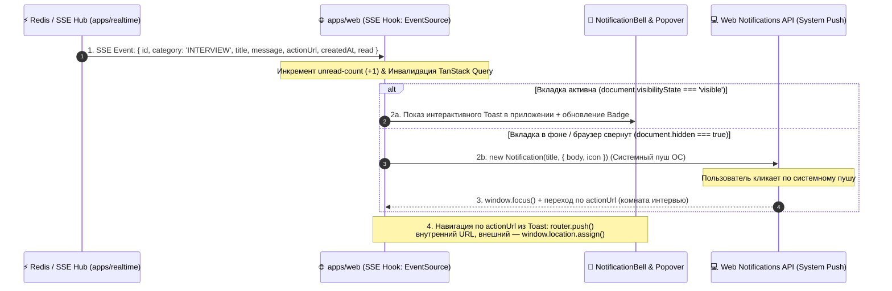

# Задачи: Центр уведомлений в реальном времени (SSE, CRUD и Web Notifications API)

Данный документ содержит описание задач по реализации клиентского центра уведомлений с real-time доставкой через SSE и нативными браузерными пушами, архитектурную диаграмму и структуру файлов.

---

## 1. Архитектурная диаграмма потока событий (SSE + Web Notifications)


```mermaid
sequenceDiagram
    autonumber
    participant Broker as ⚡ Redis / SSE Hub (apps/realtime)
    participant Client as 🌐 apps/web (SSE Hook: EventSource)
    participant UI as 🔔 NotificationBell & Popover
    participant OS as 💻 Web Notifications API (System Push)

    Broker->>Client: 1. SSE Event: { id, category: 'INTERVIEW', title, message, actionUrl, createdAt, read }
    Note over Client: Инкремент unread-count (+1) & Инвалидация TanStack Query
    
    alt Вкладка активна (document.visibilityState === 'visible')
        Client->>UI: 2a. Показ интерактивного Toast в приложении + обновление Badge
    else Вкладка в фоне / браузер свернут (document.hidden === true)
        Client->>OS: 2b. new Notification(title, { body, icon }) (Системный пуш ОС)
        Note over OS: Пользователь кликает по системному пушу
        OS-->>Client: 3. window.focus() + переход по actionUrl (комната интервью)
    end

    Note over Client,UI: 4. Навигация по actionUrl из Toast: router.push()<br/>внутренний URL, внешний — window.location.assign()
```

`actionUrl` обслуживается в двух местах, и это разные пути:

- системный пуш ОС — `shared/lib/notifications/browser-notifications.ts`, вызывает `window.focus()` и переход по `actionUrl`;
- интерактивный Toast — `features/notification-realtime/ui/NotificationRealtime.tsx`, вызывает `router.push()`.

Оба ограничивают переход внутренним origin: внешний `actionUrl` открывается
через `window.location.assign()`, `router.push()` используется только для
своего origin. Значение `actionUrl` проходит через `new URL(...)` с
проверкой протокола, поэтому `javascript:`-схема отбрасывается.

---

## 2. Структура файлов в монорепозитории (FSD)

```text
apps/web/src/
├── app/
│   └── (protected)/
│       └── dashboard/
│           └── notifications/
│               └── page.tsx                     # Страница всех уведомлений с фильтрами
│
├── widgets/
│   └── notifications/                            # Колокольчик в шапке и центр уведомлений
│       ├── ui/
│       │   ├── NotificationBell.tsx             # Кнопка с динамическим бейджем и Popover
│       │   └── NotificationsList.tsx            # Табы категорий, список, пагинация, Empty
│       └── index.ts
│
├── features/
│   ├── notification-realtime/                   # SSE-клиент и нативные пуши ОС
│   │   ├── model/
│   │   │   └── schemas.ts                       # Zod-схемы SSE-событий
│   │   └── ui/
│   │       ├── NotificationRealtime.tsx         # EventSource, Toast, инкремент, инвалидация
│   │       └── BrowserNotificationControl.tsx   # Баннер запроса разрешения ОС
│   │
│   └── notification-actions/                    # Действия над строкой уведомления
│       └── ui/
│           └── NotificationActions.tsx          # Mark-as-read перед переходом, удаление
│
├── entities/
│   └── notification/                            # Модель уведомления и UI-карточка
│       ├── model/
│       │   ├── useNotificationsQuery.ts         # TanStack Query список
│       │   ├── useUnreadCountQuery.ts           # TanStack Query счётчик
│       │   └── useMarkAllAsReadMutation.ts      # POST /notifications/read-all
│       └── ui/
│           ├── NotificationItem.tsx             # Строка уведомления
│           └── NotificationCategoryIcon.tsx     # Иконка категории (SYSTEM, INTERVIEW, MESSAGE)
│
└── shared/
    ├── api/
    │   └── realtime/
    │       └── notification-stream.ts            # EventSource c авто-реконнектом
    └── lib/
        └── notifications/
            └── browser-notifications.ts         # Web Notifications API
```

Тесты лежат рядом с реализацией: `NotificationBell.test.tsx`,
`NotificationsList.test.tsx`, `NotificationRealtime.test.tsx`,
`BrowserNotificationControl.test.tsx`, `notification-stream.test.ts`,
`browser-notifications.test.ts`.

---

# 🎨 Frontend Task (`apps/web`, `@packages/ui`, `@packages/i18n`, `@packages/api`)

### Заголовок задачи:
`feat(web): центр уведомлений в реальном времени (SSE, CRUD, Popover и Web Notifications API)`

### Чеклист задач:
- [x] **CRUD и интеграция API:**
  - Подключение `GET /api/v1/notifications`, `GET /unread-count`, `PATCH /:id/read`, `POST /read-all`, `DELETE /:id`.
- [x] **SSE поток реального времени (`shared/api/realtime/notification-stream.ts`):**
  - Подключение к Server-Sent Events с авто-реконнектом.
  - Инвалидация кэша TanStack Query, инкремент счетчика и показ `Toast`.
- [x] **Нативные уведомления ОС (`Web Notifications API`):**
  - Запрос разрешения `Notification.requestPermission()`.
  - Отправка системного уведомления при `document.hidden === true`.
  - Фокус на вкладку и переход по `actionUrl` при клике на системный пуш.
- [x] **UI-компоненты:**
  - Виджет `NotificationBell` в шапке (с бейджем и выпадающим списком).
  - Полноэкранный центр уведомлений на `/dashboard/notifications` с табами категорий и пустым состоянием (`Empty`).
  - Иконка категории в строке уведомления (`NotificationCategoryIcon`).
- [x] **Локализация (`@packages/i18n`):**
  - Переводы категорий, кнопок и баннеров в `ru/` и `en/`.

---

## 4. Техдолг

Чеклист закрыт, но расхождения с ADR остаются. Разбор с ссылками на строки —
в `docs/tasks/notifications-realtime-reconciliation.md`.

### 4.1. `title`/`message` вместо `type`/`payload` (ADR-003)

`Notification` хранит готовые строки в БД
(`apps/api/prisma/schema.prisma:145-146`), и фронт рендерит их напрямую,
а не через `@packages/i18n`. Рендер текста не вынесен в i18n, бот не может
рендерить сам, и при смене локали старые уведомления остаются на старом
языке. Требует `renderedTitle`/`renderedMessage` по ADR-003:51-55.

### 4.2. Нет доменных producer'ов и outbox (ADR-003)

`createNotification` вызывается только из спецификаций. Ни `AuthService`,
ни `UsersService`, ни `MatchmakingService`, ни `ShowcaseService` уведомление
не создают — пользователь получает уведомления только вручную, через
`pnpm sse:send`. Клиентский контур при этом рабочий и проверяется
end-to-end; мёртвая часть — автоматика. Требует outbox по ADR-003:11, 59-68.

### 4.3. Коллизия словарей `category` (ADR-004)

Словарей не два, а три, и CLI допускает выход за оба:

| Слой | Словарь | Источник |
| --- | --- | --- |
| Go, визуальная severity | `info` \| `success` \| `warning` \| `error` | `apps/realtime/internal/sse/event.go:47-61` |
| БД, доменная категория | `SYSTEM` \| `INTERVIEW` \| `MESSAGE` | `apps/api/prisma/schema.prisma:135-139` |
| CLI, оба сразу | `SYSTEM`, `INTERVIEW`, `MESSAGE`, `INFO`, `WARNING`, `ERROR`, `SUCCESS` | `scripts/send-sse.mjs:176` |

Объявление типа во фронтовой спецификации уже исправлено по ADR-004:80:
`docs/frontend/data/realtime.md` закрепляет доменный словарь в `category` и
визуальную severity в необязательном `severity`. Не исправлены Go-типы в
`apps/realtime` — там `NotificationCategory` всё ещё означает severity.
Расхождение не диагностируется и не ломает рантайм: `apps/realtime`
передаёт payload как `json.RawMessage`, не декодируя его
(`apps/realtime/internal/storage/notifications.go:52`).

### 4.4. CLI не валидирует `--category`

`scripts/send-sse.mjs:176` приводит значение к верхнему регистру
безусловно и никак не проверяет его, поэтому документированные в
`docs/backend/development/sse-notifications-cli.md:72` значения `info`,
`warning`, `error`, `success` в стрим не попадают — туда уходят `INFO`,
`WARNING`, `ERROR`, `SUCCESS`, которых нет ни в одном словаре.

Сегодня безвредно: `category` не декодируется ни в `apps/realtime`, ни в
Zod-схеме фронта. Но после закрепления доменного словаря в источнике
правды это остаётся непроверенным входом. Валидация в `scripts/` в объём
плана не входила.

### 4.5. Security-события (ADR-005)

Модели `SecurityEvent` в `apps/api/prisma/schema.prisma` нет, а
`showBrowserNotification` вызывается на каждый `notification.new` без
проверки типа уведомления. Когда появится security-модель, in-app запись
о security-событии уйдёт в ОС мгновенно, что нарушит ADR-005:141 (при
недоступности Telegram и email — доставка только при следующем входе).

### 4.6. `timestamptz(3)` (ADR-002)

ADR-002:54, :125 требует хранить все `DateTime` как `timestamptz(3)`, но в
`schema.prisma` ноль аннотаций `@db.Timestamptz`. Вне объёма этого плана.

