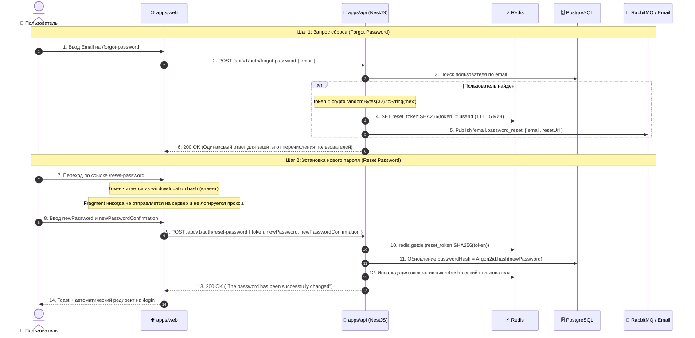

# Задачи: Сброс и восстановление пароля (Forgot & Reset Password)

Данный документ содержит декомпозицию задач для **Backend** и **Frontend** по сбросу пароля для неавторизованного пользователя через Email, архитектурную диаграмму и структуру файлов.

---

## 1. Архитектурная диаграмма потока восстановления пароля



---

## 2. Структура файлов в монорепозитории

### 2.1. Packages (`packages/dto`):
```text
packages/dto/src/
└── auth/
    ├── forgot-password.dto.ts             # forgotPasswordSchema (email)
    ├── reset-password.dto.ts              # resetPasswordSchema (token, newPassword, newPasswordConfirmation)
    └── index.ts
```

### 2.2. Backend (`apps/api`):
```text
apps/api/src/modules/
└── auth/
    ├── auth.controller.ts                 # POST /auth/forgot-password, POST /auth/reset-password
    ├── auth.controller.spec.ts
    ├── auth.service.ts                    # Генерация токенов, валидация Redis, смена пароля
    ├── auth.service.spec.ts
    └── auth.module.ts
```

### 2.3. Frontend (`apps/web` по FSD):
```text
apps/web/src/
├── app/
│   └── (auth)/
│       ├── forgot-password/
│       │   └── page.tsx                   # Страница ввода Email для сброса
│       └── reset-password/
│           └── page.tsx                   # Страница ввода нового пароля по токену
│
└── features/
    └── auth/
        ├── forgot-password/               # Фича запроса сброса
        │   ├── ui/
        │   │   ├── ForgotPasswordForm.tsx
        │   │   └── ForgotPasswordSuccess.tsx
        │   ├── model/
        │   │   └── useForgotPassword.ts
        │   └── index.ts
        │
        └── reset-password/                # Фича установки нового пароля
            ├── ui/
            │   ├── ResetPasswordForm.tsx
            │   └── InvalidTokenAlert.tsx
            ├── model/
            │   └── useResetPassword.ts
            └── index.ts
```

---

# 🚀 Часть 1: Backend (`apps/api`, `packages/dto`, Redis)

### Заголовок задачи:
`feat(api): реализация сброса и восстановления пароля через Email (Forgot / Reset Password)`

### Чеклист задач:
- [ ] **DTO и валидация (`packages/dto`):**
  - Схема `forgotPasswordSchema` (`email`).
  - Схема `resetPasswordSchema` (`token`, `newPassword`, `newPasswordConfirmation`).
- [ ] **Сервис и контроллеры (`apps/api`):**
  - `POST /api/v1/auth/forgot-password`: генерация токена, сохранение `SHA256(token)` в Redis (TTL 15 мин), публикация события отправки письма. Ответ всегда `200 OK`.
  - `POST /api/v1/auth/reset-password`: атомарная проверка и удаление токена (`redis.getdel`), хэширование через Argon2id, обновление `User.passwordHash`, инвалидация всех refresh-токенов пользователя.
  - Настройка Throttler (макс. 3 запроса в минуту).
- [ ] **Тестирование:**
  - Unit и E2E тесты для успешного сброса, невалидного/просроченного токена и защиты от перечисления.

---

# 🎨 Часть 2: Frontend (`apps/web`, `@packages/ui`, `@packages/i18n`)

### Заголовок задачи:
`feat(web): страницы и формы восстановления пароля (Forgot Password и Reset Password)`

### Чеклист задач:
- [ ] **Страница `/forgot-password`:**
  - Форма ввода email с валидацией (`react-hook-form` + Zod).
  - Мутация `POST /api/v1/auth/forgot-password`.
  - Экран подтверждения отправки письма с таймером повторной отправки (60 сек).
- [ ] **Страница `/reset-password`:**
  - Считывание `token` из URL-фрагмента (`#token=...`) на клиенте (`window.location.hash`).
    Fragment не передаётся на сервер, не логируется прокси — защита от CWE-598.
  - Форма ввода нового пароля и подтверждения с иконкой `Eye`/`EyeOff`.
  - Мутация `POST /api/v1/auth/reset-password`.
  - Обработка истекшего токена и успешного сброса с редиректом на `/login`.
- [ ] **Ссылка на странице входа:**
  - Добавить ссылку «Забыли пароль?» на странице `/login`.
- [ ] **Локализация (`@packages/i18n`):**
  - Переводы всех форм и сообщений в `ru/auth.json` и `en/auth.json`.
