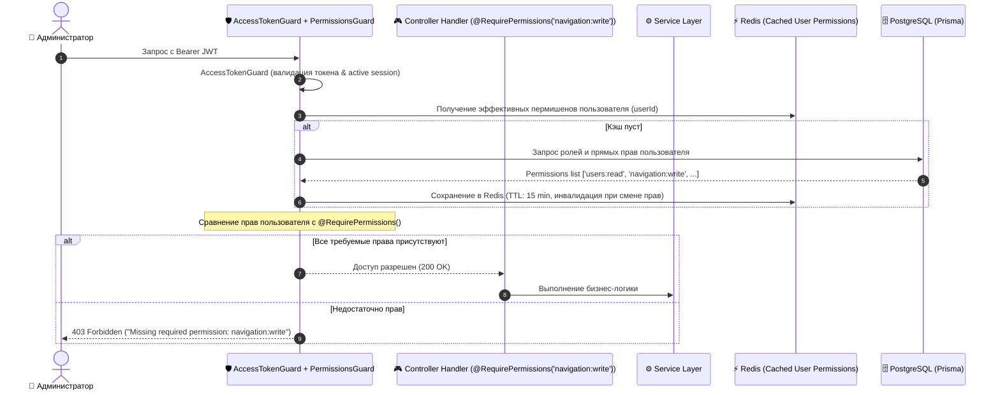

# Задачи: API гранулярных прав доступа и пермишенов (Permissions & RBAC API)

Данный документ содержит детальную декомпозицию задач для реализации серверной части гранулярной системы прав доступа (**Granular Permissions & Role-Permission Matrix API**) в **`apps/api`** (NestJS, Prisma, PostgreSQL), валидации в **`packages/dto`**, общих типов и констант прав в **`packages/types`**, а также системы проверок через **`PermissionsGuard`** и декоратор **`@RequirePermissions()`**.

---

## 1. Архитектурная диаграмма (Permission Verification Flow)



---

## 2. Структура файлов в монорепозитории

```text
MockInterviewAI/
├── packages/
│   ├── types/
│   │   └── src/
│   │       ├── permissions.ts                 # Константы и enum всех системных прав (PermissionKey, PermissionGroup)
│   │       └── index.ts
│   │
│   └── dto/
│       └── src/
│           ├── permissions/
│           │   ├── permission-response.dto.ts      # DTO возврата пермишена (id, key, nameRu, nameEn, group)
│           │   ├── role-permissions.dto.ts         # DTO обновления прав для роли
│           │   ├── user-permissions-override.dto.ts# DTO персонального переопределения прав пользователя
│           │   └── index.ts
│           └── index.ts
│
└── apps/api/
    ├── prisma/
    │   ├── schema.prisma                      # Модели Permission, RolePermission, UserPermissionOverride
    │   └── seed.ts                            # Сид каталога системных прав
    │
    ├── src/
    │   ├── common/
    │   │   ├── decorators/
    │   │   │   └── permissions.decorator.ts   # Декоратор @RequirePermissions(PermissionKey.NAVIGATION_WRITE)
    │   │   └── guards/
    │   │       └── permissions.guard.ts       # NestJS PermissionsGuard (проверка прав из Redis/DB)
    │   │
    │   └── modules/
    │       └── permissions/
    │           ├── permissions.module.ts      # Регистрация модуля пермишенов
    │           ├── controllers/
    │           │   ├── permissions.controller.ts          # GET /api/v1/permissions (каталог прав)
    │           │   ├── admin-roles-permissions.controller.ts # Управление матрицей Роль-Пермишены
    │           │   └── admin-user-permissions.controller.ts  # Персональные переопределения
    │           ├── services/
    │           │   ├── permissions.service.ts             # Бизнес-логика, синк с Redis, инвалидация кэша
    │           │   └── permissions.service.spec.ts        # Unit-тесты
    │           └── repositories/
    │               └── permissions.repository.ts
    │
    └── test/
        └── permissions.e2e-spec.ts            # E2E тесты проверки Guard'ов и CRUD прав
```

---

## 3. Детали технического дизайна

### 3.1. Модель данных Prisma (`schema.prisma`)

```prisma
enum PermissionGroup {
  USERS
  NAVIGATION
  INTERVIEWS
  ANALYTICS
  SETTINGS
  SYSTEM
}

model Permission {
  id          String          @id @default(uuid()) @db.Uuid
  key         String          @unique // e.g. "users:read", "navigation:write"
  group       PermissionGroup
  nameRu      String          // "Управление навигацией"
  nameEn      String          // "Manage Navigation"
  description String?
  createdAt   DateTime        @default(now())

  rolePermissions RolePermission[]
  userOverrides   UserPermissionOverride[]

  @@map("permissions")
  @@index([group])
}

model RolePermission {
  role         UserRole   // ADMIN, USER, MODERATOR
  permissionId String     @db.Uuid
  permission   Permission @relation(fields: [permissionId], references: [id], onDelete: Cascade)

  @@id([role, permissionId])
  @@map("role_permissions")
}

model UserPermissionOverride {
  userId       String     @db.Uuid
  permissionId String     @db.Uuid
  isGranted    Boolean    // true = явно дано, false = явно запрещено (deny override)
  user         User       @relation(fields: [userId], references: [id], onDelete: Cascade)
  permission   Permission @relation(fields: [permissionId], references: [id], onDelete: Cascade)

  @@id([userId, permissionId])
  @@map("user_permission_overrides")
}
```

---

### 3.2. Каталог базовых системных пермишенов (`seed.ts` & `PermissionKey`)

| Ключ пермишена | Группа | Описание (RU) |
| :--- | :--- | :--- |
| `users:read` | `USERS` | Просмотр списка пользователей и деталей |
| `users:write` | `USERS` | Создание и редактирование профилей |
| `users:status` | `USERS` | Активация и деактивация пользователей |
| `navigation:read` | `NAVIGATION` | Просмотр структуры меню |
| `navigation:write` | `NAVIGATION` | Создание, редактирование и сортировка пунктов сайдбара |
| `interviews:read` | `INTERVIEWS` | Просмотр сессий интервью |
| `interviews:manage` | `INTERVIEWS` | Управление комнатами и модерация |
| `analytics:view` | `ANALYTICS` | Доступ к метрикам и отчетам платформы |
| `roles:manage` | `SYSTEM` | Настройка ролей и матрицы пермишенов |

---

### 3.3. Спецификация REST API

1. **`GET /api/v1/permissions`**
   - Получение полного каталога всех существующих прав, сгруппированных по `group`.
2. **`GET /api/v1/admin/roles/:role/permissions`**
   - Получение списка ключей пермишенов, назначенных конкретной роли (`ADMIN`, `USER`).
3. **`PATCH /api/v1/admin/roles/:role/permissions`**
   - Пакетное обновление прав для роли:
   ```json
   {
     "permissionKeys": ["users:read", "navigation:read", "navigation:write"]
   }
   ```
   - **Инвалидация кэша:** Сбрасывает закэшированные права в Redis для всех пользователей данной роли.
4. **`GET /api/v1/users/me/permissions`**
   - Возвращает эффективный массив прав текущего пользователя (с учетом роли и персональных overrides) для клиентского интерфейса.
5. **`PATCH /api/v1/admin/users/:id/permissions`**
   - Персональное переопределение прав пользователя (`grant` / `deny`).

---

## 4. Чеклист реализации (Backend)

- [ ] **Типы и DTO (`packages/types`, `packages/dto`):**
  - Enum `PermissionGroup`, константы `PermissionKey`.
  - DTO `RolePermissionsUpdateDto`, `UserPermissionsResponseDto`.
- [ ] **Prisma Миграция & Seed (`apps/api/prisma`):**
  - Создание моделей `Permission`, `RolePermission`, `UserPermissionOverride`.
  - Написание сида со всеми системными пермишенами и дефолтными связями для ролей `ADMIN` и `USER`.
- [ ] **Guard и Декоратор (`apps/api/src/common`):**
  - Декоратор `@RequirePermissions(...permissions: PermissionKey[])`.
  - `PermissionsGuard` с извлечением прав и fallback-проверкой в БД / Redis.
- [ ] **Модуль `PermissionsModule` (`apps/api/src/modules/permissions`):**
  - Сервис расчета эффективных прав (`getEffectiveUserPermissions`).
  - Методы управления матрицей прав ролей с транзакционной записью.
  - Инвалидация Redis-кэша пермишенов при любых изменениях матрицы.
- [ ] **Интеграция с существующими контроллерами:**
  - Добавление `@RequirePermissions(PermissionKey.NAVIGATION_WRITE)` на `AdminNavigationController`.
  - Добавление `@RequirePermissions(PermissionKey.USERS_WRITE)` на `AdminUsersController`.
- [ ] **Тестирование:**
  - Unit-тесты `permissions.guard.spec.ts` (положительные и отрицательные сценарии, deny overrides).
  - E2E-тесты эндпоинтов `/api/v1/admin/roles/:role/permissions`.
