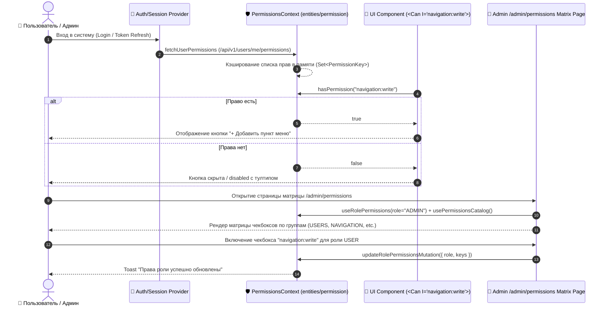

# Задачи: Фронтенд управления правами доступа и пермишенами (Permissions & Access Control UI)

Данный документ содержит детальную декомпозицию задач для реализации клиентской части гранулярной системы прав доступа (**Permissions & RBAC UI**) в приложении **`apps/web`** (Next.js App Router, архитектура **FSD**), системы условного рендера компонентов (`<Can>`, `<PermissionBoundary>`), хуков проверки прав (`usePermissions`), а также интерфейса матрицы управления правами ролей (**Permissions Matrix UI**) в панели администратора.

---

## 1. Архитектурная диаграмма (Client-Side Permissions Flow)



---

## 2. Структура файлов в монорепозитории (`apps/web`)

```text
apps/web/src/
├── app/
│   └── (protected)/
│       └── admin/
│           └── permissions/
│               ├── page.tsx                               # Страница матрицы прав ролей /admin/permissions
│               └── layout.tsx
│
├── entities/
│   └── permission/
│       ├── api/
│       │   ├── permissions.api.ts                         # getCatalog, getRolePermissions, updateRolePermissions, getMyPermissions
│       │   └── permissions.queries.ts                     # TanStack Query хуки (usePermissionsCatalog, useMyPermissions, useRolePermissions)
│       ├── model/
│       │   ├── types.ts                                   # PermissionItem, PermissionGroup, RolePermissionsMap
│       │   └── permissions.store.ts                       # Быстрый lookup (Set<string>) эффективных прав в памяти
│       ├── ui/
│       │   ├── PermissionGroupBadge.tsx                   # Бейдж группы пермишена (Users, Navigation, System)
│       │   └── PermissionKeyBadge.tsx                     # Моноширинный бейдж ключа "users:write"
│       └── index.ts
│
├── features/
│   ├── permissions-guard/
│   │   ├── ui/
│   │   │   ├── Can.tsx                                    # Условный рендер: <Can I="users:write">...</Can>
│   │   │   └── PermissionBoundary.tsx                     # Защита роутов / секций: fallback={<AccessDenied />}
│   │   ├── model/
│   │   │   └── usePermissions.ts                          # Хук: { hasPermission, hasAny, hasAll, permissions }
│   │   └── index.ts
│   │
│   └── admin-role-permissions-matrix/
│       ├── ui/
│       │   ├── PermissionsMatrixTable.tsx                 # Интерактивная таблица с чекбоксами по группам
│       │   ├── PermissionGroupSection.tsx                 # Аккордеон / секция группы прав
│       │   └── PermissionsSaveBar.tsx                     # Плавающая панель сохранения несохраненных изменений
│       ├── model/
│       │   ├── usePermissionsMatrixForm.ts                # Локальный стейт матрицы перед сохранением
│       │   └── useUpdateRolePermissionsMutation.ts
│       └── index.ts
│
└── widgets/
    └── admin-sidebar/
        └── ui/
            └── AdminSidebarNav.tsx                        # Добавление пункта "Права доступа" (/admin/permissions)
```

---

## 3. Детали технического дизайна UI компонентов

### 3.1. Условный рендеринг и хуки (`features/permissions-guard`)

#### 1. Хук `usePermissions()`:
```tsx
const { hasPermission, hasAny, hasAll, isLoading } = usePermissions();

// Примеры использования:
if (hasPermission('navigation:write')) { ... }
if (hasAny(['users:write', 'users:status'])) { ... }
```

#### 2. Компонент `<Can />`:
```tsx
<Can I="navigation:write" fallback={<p>Недостаточно прав</p>}>
  <Button onClick={openCreateDialog}>+ Создать пункт меню</Button>
</Can>
```

#### 3. Компонент `<PermissionBoundary />`:
```tsx
<PermissionBoundary 
  requiredPermissions={['roles:manage']} 
  fallback={<ForbiddenState message="У вас нет прав для управления ролями" />}
>
  <PermissionsMatrixPage />
</PermissionBoundary>
```

---

### 3.2. Матрица прав доступа (`/admin/permissions`)

1. **Вкладки по Ролям (Tabs):**
   - Переключение между ролями: `ADMIN`, `MODERATOR`, `USER`.
2. **Группировка прав (Accordions / Sections):**
   - Группы: `Пользователи (USERS)`, `Навигация (NAVIGATION)`, `Интервью (INTERVIEWS)`, `Аналитика (ANALYTICS)`, `Система (SYSTEM)`.
   - В каждой группе:
     - Кнопка *"Выбрать все"* / *"Снять все"* для группы;
     - Чекбоксы с понятным названием на русском/английском и техническим ключом (например, `navigation:write`).
3. **Плавающая панель сохранения (`Sticky Save Bar`):**
   - Появляется снизу при наличии несохраненных изменений ("Изменено 3 пермишена: [Сохранить] [Сбросить]").
4. **Защита роли ADMIN (Self-Lockout Protection):**
   - Блокировка отключения критических прав (например, `roles:manage`, `users:status`) у роли `ADMIN`, чтобы администратор не заблокировал сам себя.

---

## 4. Чеклист реализации (Frontend)

- [ ] **Слой данных сущности (`entities/permission`):**
  - Методы вызова API (`permissions.api.ts`).
  - TanStack Query хуки `useMyPermissions` и `useRolePermissions`.
- [ ] **Система guard-компонентов (`features/permissions-guard`):**
  - Реализация хука `usePermissions`.
  - Компоненты `<Can>` и `<PermissionBoundary>`.
  - Unit-тесты для условного рендера и проверки комбинаций прав.
- [ ] **Виджет матрицы прав (`features/admin-role-permissions-matrix`):**
  - Интерактивная таблица групп и чекбоксов.
  - Оптимистичные апдейты / стейт изменений с подтверждением.
  - Мутация сохранения прав с Toast-оповещением и инвалидацией кэша.
- [ ] **Страница `/admin/permissions`:**
  - Размещение матрицы в админском лейауте.
  - Интеграция ссылки в сайдбар админки.
- [ ] **Интеграция с существующим UI:**
  - Обернуть кнопки создания/редактирования пользователей в `<Can I="users:write">`.
  - Обернуть кнопки управления сайдбаром в `<Can I="navigation:write">`.
- [ ] **Тестирование (Vitest & Playwright):**
  - Unit-тесты хука `usePermissions` и компонента `<Can>`.
  - E2E-тест изменения прав роли $\to$ проверка скрытия/появления кнопок в интерфейсе.

---

## 5. Критерии приемки (Definition of Done)

1. Права текущего пользователя загружаются один раз при старте сессии и кэшируются в памяти.
2. Компонент `<Can>` и хук `usePermissions` мгновенно скрывают/показывают элементы интерфейса без задержек и мерцания.
3. Страница `/admin/permissions` доступна только пользователям с правом `roles:manage`.
4. Администратор может гибко настраивать чекбоксы прав для любой роли с понятной группировкой.
5. Изменение прав роли мгновенно обновляет доступность функций без необходимости перезагружать всю страницу.
6. Все unit- и e2e-тесты проходят успешно (`pnpm --filter @apps/web test`).
