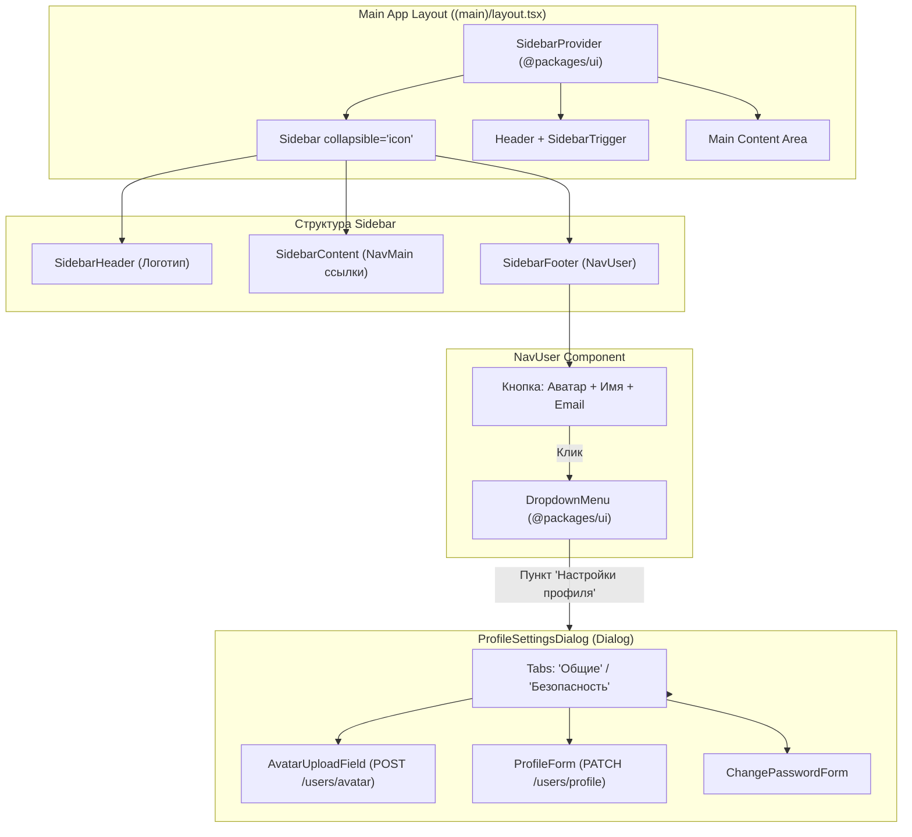

# Задачи: Интеграция Sidebar, блок NavUser и модальное окно профиля

Данный документ содержит описание задач по внедрению компонента `Sidebar` из `@packages/ui`, блока пользователя `NavUser` и модального окна настроек профиля `Dialog`.

---

## 1. Архитектурная диаграмма UI и потока данных



---

## 2. Структура файлов в монорепозитории (FSD)

```text
apps/web/src/
├── app/
│   └── (main)/
│       └── layout.tsx                         # Подключение SidebarProvider, AppSidebar и Header
│
├── widgets/
│   └── app-sidebar/                           # Виджет основного сайдбара
│       ├── ui/
│       │   ├── AppSidebar.tsx                 # Сборка Header, Content, Footer
│       │   ├── NavMain.tsx                    # Навигационные ссылки (Витрина, Интервью, Заявки)
│       │   └── NavUser.tsx                    # Блок пользователя с DropdownMenu
│       └── index.ts
│
├── features/
│   ├── update-profile/                        # Фича редактирования профиля
│   │   ├── ui/
│   │   │   ├── ProfileSettingsDialog.tsx     # Модальное окно Dialog со вкладками
│   │   │   ├── ProfileGeneralForm.tsx        # Форма: displayName, username, bio, socials
│   │   │   └── AvatarUploadField.tsx         # Drag-and-drop загрузка аватара с превью
│   │   ├── model/
│   │   │   ├── useUpdateProfile.ts           # Мутация PATCH /api/v1/users/profile
│   │   │   ├── useUploadAvatar.ts            # Мутация POST /api/v1/users/avatar
│   │   │   └── profileFormSchema.ts          # Zod валидация полей
│   │   └── index.ts
│   │
│   └── auth/
│       └── logout/                            # Выход из системы с очисткой кук и кэша
│
└── entities/
    └── user/                                  # Модель текущего пользователя (useCurrentUser)
        ├── model/
        │   ├── types.ts
        │   └── useCurrentUser.ts
        └── ui/
            └── UserAvatar.tsx
```

---

# 🎨 Frontend Task (`apps/web`, `@packages/ui`, `@packages/i18n`)

### Заголовок задачи:
`feat(web): интеграция Sidebar из @packages/ui, меню пользователя NavUser и редактирование профиля в Dialog`

### Чеклист задач:
- [ ] **Интеграция Sidebar (`widgets/app-sidebar`):**
  - Подключение `<SidebarProvider>` и `<Sidebar collapsible="icon">`.
  - Сборка `AppSidebar`: `SidebarHeader` (логотип), `SidebarContent` (навигация), `SidebarFooter` (`NavUser`).
  - Добавление `<SidebarTrigger />` в шапку страницы.
- [ ] **Блок пользователя `NavUser`:**
  - Отображение аватара, имени (`displayName`) и почты (`email`).
  - Выпадающее меню (`DropdownMenu`): Настройки профиля, Уведомления, Язык, Выход из системы.
- [ ] **Модальное окно редактирования профиля (`ProfileSettingsDialog`):**
  - Создание компонента на базе `Dialog` из `@packages/ui`.
  - Форма редактирования: `displayName`, `username`, `gitUrl`, `telegramUsername`, `bio`.
  - Загрузка аватара (`AvatarUploadField`) с предпросмотром и отправкой на `POST /api/v1/users/avatar`.
  - Мутация `PATCH /api/v1/users/profile` с инвалидацией TanStack Query кэша.
- [ ] **Локализация (`@packages/i18n`):**
  - Добавить переводы пунктов меню и полей профиля в `ru/` и `en/`.
