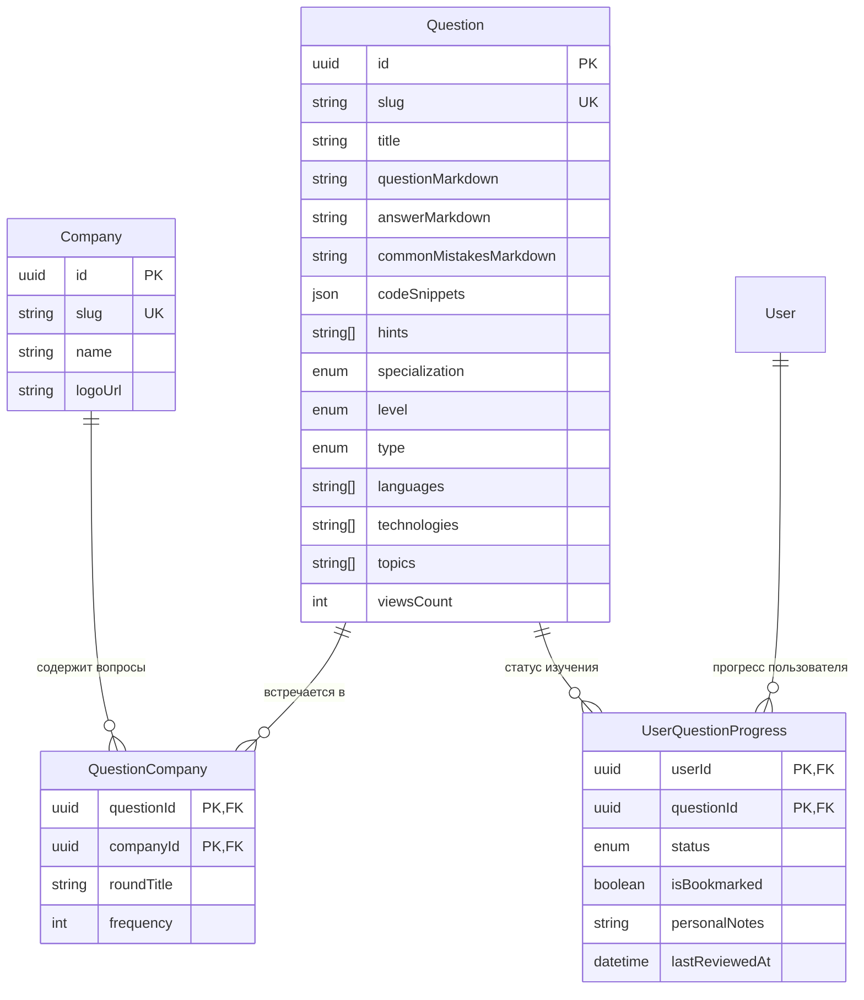

# Задачи: База вопросов для подготовки к собеседованиям (Question Bank)

Данный документ описывает проектирование и реализацию библиотеки вопросов для подготовки к техническим собеседованиям в **MockInterviewAI**: структурирование по компаниям, грейдам, стеку технологий, режим самопроверки (скрытые ответы/флэшкарты) и трекинг личного прогресса кандидата.

---

## 1. Контекст и цели

### 1.1 Назначение фичи
Предоставить кандидатам удобный инструмент для самостоятельной подготовки к интервью в целевые компании на определенный грейд и стек.

### 1.2 Ключевые пользовательские сценарии
1. **Таргетированная подготовка под компанию**:
   - Кандидат выбирает: *«Яндекс → Middle → Backend Go»* или *«Т-Банк → Senior → Frontend TypeScript»*.
   - Получает список реальных вопросов, которые часто встречаются на собеседованиях в этой компании.
2. **Режим самопроверки (Self-Study / Flashcards)**:
   - Кандидат видит формулировку вопроса или фрагмент кода.
   - Сначала думает сам / формулирует ответ вслух.
   - Нажимает **«Показать эталонный ответ»** и сверяется с разбором:
     - подробное объяснение концепции «под капотом»;
     - примеры правильного кода;
     - блок **«Частые ошибки кандидатов»** (что обычно отвечают не так).
3. **Трекинг личного прогресса**:
   - Возможность выставить статус по вопросу: `НЕ ЗНАЮ` 🔴 / `ПОВТОРИТЬ` 🟡 / `ЗНАЮ` 🟢.
   - Сохранение в «Избранное» (быстрый доступ перед днем собеседования).
   - Персональные заметки к вопросу (например: *«Повторить разницу между sync.Mutex и sync.RWMutex в Go»*).
   - Прогресс-бар на странице: *«Изучено 24 из 40 вопросов по Яндекс Middle Go»*.

---

## 2. Классификатор вопросов (Таксономия)

Каждый вопрос размечается следующими параметрами:

| Параметр | Возможные значения | Примеры |
|---|---|---|
| **Направление** (`Specialization`) | `FRONTEND`, `BACKEND`, `FULLSTACK`, `DEVOPS`, `QA`, `MOBILE`, `DATA_ML`, `SYSTEM_DESIGN`, `BEHAVIORAL` | Backend, Frontend |
| **Компании** (`Company`) | Каталог компаний с частотой встречаемости | Яндекс, Т-Банк, Авито, Сбер, Ozon, VK, Google, Meta |
| **Грейд** (`ExperienceLevel`) | `JUNIOR`, `MIDDLE`, `SENIOR`, `LEAD` | Middle, Senior |
| **Языки** (`languages`) | Массив названий языков | `typescript`, `javascript`, `go`, `python`, `java`, `sql` |
| **Технологии / Фреймворки** (`technologies`) | Массив ключевых технологий | `react`, `nextjs`, `postgresql`, `redis`, `kafka`, `docker` |
| **Тема / Топик** (`topics`) | Конкретная тема внутри стека | `event-loop`, `goroutines`, `indexes`, `closures`, `garbage-collector` |
| **Тип вопроса** (`QuestionType`) | `THEORY` (теория), `CODE_SNIPPET` (найти баг/вывод), `SYSTEM_DESIGN` (архитектура), `BEHAVIORAL` (софт-скиллы) | `THEORY`, `CODE_SNIPPET` |

---

## 3. Модель данных (Prisma Schema в PostgreSQL)

Архитектура максимально легковесна и строится всего на **3 таблицах** в существующей базе данных PostgreSQL без оверинжиниринга.



### Схема для `apps/api/prisma/schema.prisma`

```prisma
enum QuestionType {
  THEORY
  CODE_SNIPPET
  SYSTEM_DESIGN
  BEHAVIORAL
}

enum KnowledgeStatus {
  NOT_STARTED // Еще не изучал
  LEARNING    // В процессе / нужно повторить
  MASTERED    // Знаю уверенно
}

// Каталог IT-компаний
model Company {
  id        String   @id @default(uuid()) @db.Uuid
  slug      String   @unique @db.VarChar(80)
  name      String   @db.VarChar(100)
  logoUrl   String?  @map("logo_url")
  createdAt DateTime @default(now()) @map("created_at")
  updatedAt DateTime @updatedAt @map("updated_at")

  questions QuestionCompany[]

  @@map("companies")
}

// Вопрос из базы
model Question {
  id                     String             @id @default(uuid()) @db.Uuid
  slug                   String             @unique @db.VarChar(160)
  title                  String             @db.VarChar(250) // Заголовок: например, "Как устроен Garbage Collection в Go?"
  
  // Контент вопроса
  questionMarkdown       String             @map("question_markdown") @db.Text // Формулировка / условие
  answerMarkdown         String             @map("answer_markdown") @db.Text // Эталонный развернутый ответ
  commonMistakesMarkdown String?            @map("common_mistakes_markdown") @db.Text // Частые ошибки кандидатов
  codeSnippets           Json?              @map("code_snippets") // { "typescript": "...", "go": "..." }
  hints                  String[]           @default([]) // 1-2 подсказки до открытия ответа
  sources                String[]           @default([]) // Ссылки на официальную доку / статьи

  // Классификаторы
  specialization         Specialization
  level                  ExperienceLevel    @default(MIDDLE)
  type                   QuestionType       @default(THEORY)
  languages              String[]           @default([]) // ["go"]
  technologies           String[]           @default([]) // ["docker", "postgres"]
  topics                 String[]           @default([]) // ["concurrency", "gc"]

  viewsCount             Int                @default(0) @map("views_count")
  isPublished            Boolean            @default(true) @map("is_published")

  createdAt              DateTime           @default(now()) @map("created_at")
  updatedAt              DateTime           @updatedAt @map("updated_at")

  companies              QuestionCompany[]
  userProgresses         UserQuestionProgress[]

  @@index([specialization, level])
  @@index([type])
  @@index([languages], type: Gin)
  @@index([technologies], type: Gin)
  @@index([topics], type: Gin)
  @@map("questions")
}

// Связь вопроса с компанией
model QuestionCompany {
  questionId String   @map("question_id") @db.Uuid
  companyId  String   @map("company_id") @db.Uuid
  roundTitle String?  @map("round_title") @db.VarChar(100) // Например: "Технический скрининг", "Секция платформы"
  frequency  Int      @default(3) // 1-5 (насколько часто задают)

  question   Question @relation(fields: [questionId], references: [id], onDelete: Cascade)
  company    Company  @relation(fields: [companyId], references: [id], onDelete: Cascade)

  @@id([questionId, companyId])
  @@index([companyId])
  @@map("question_companies")
}

// Личный прогресс кандидата
model UserQuestionProgress {
  userId         String          @map("user_id") @db.Uuid
  questionId     String          @map("question_id") @db.Uuid
  
  status         KnowledgeStatus @default(NOT_STARTED)
  isBookmarked   Boolean         @default(false) @map("is_bookmarked")
  personalNotes  String?         @map("personal_notes") @db.VarChar(1000)
  lastReviewedAt DateTime?       @map("last_reviewed_at")

  user           User            @relation(fields: [userId], references: [id], onDelete: Cascade)
  question       Question        @relation(fields: [questionId], references: [id], onDelete: Cascade)

  @@id([userId, questionId])
  @@index([userId, status])
  @@index([userId, isBookmarked])
  @@map("user_question_progress")
}
```

---

## 4. Архитектура экранов и UX (`apps/web`)

### 4.1 Каталог вопросов (`/questions`)
```text
┌────────────────────────────────────────────────────────────────────────────────────────┐
│ 🔍 Поиск по вопросам... (например: race condition, indexes, closure)                   │
├─────────────────────┬──────────────────────────────────────────────────────────────────┤
│ 🏷️ ФИЛЬТРЫ          │ 📊 Найдено 42 вопроса • Изучено: 12/42 (28%) [████░░░░░░░░]     │
│                     ├──────────────────────────────────────────────────────────────────┤
│ Направление:        │ 🟡 [MIDDLE] [GO] [YANDEX ★★★★★]                                  │
│ [X] Backend         │ Как работает вытеснение горутин в Go (preemption)?              │
│ [ ] Frontend        │ Темы: concurrency, runtime, scheduler                            │
│                     │ [Статус: Повторить 🟡] [В избранном ⭐]                          │
│ Компания:           ├──────────────────────────────────────────────────────────────────┤
│ [X] Яндекс (28)     │ 🟢 [MIDDLE] [POSTGRESQL] [AVITO ★★★★☆]                           │
│ [ ] Т-Банк (19)     │ В чем разница между Index Scan и Bitmap Index Scan?              │
│ [ ] Авито (15)      │ Темы: database, indexes, performance                             │
│                     │ [Статус: Знаю 🟢]                                                │
│ Грейд:              ├──────────────────────────────────────────────────────────────────┤
│ (•) Все  ( ) Junior │ ⚪ [SENIOR] [SYSTEM DESIGN] [OZON ★★★★★]                          │
│ ( ) Middle ( ) Snr  │ Как спроектировать идемпотентную обработку платежей в Kafka?     │
│                     │ [Статус: Не изучал ⚪]                                           │
└─────────────────────┴──────────────────────────────────────────────────────────────────┘
```

### 4.2 Страница вопроса / Тренажер (`/questions/[slug]`)
```text
┌────────────────────────────────────────────────────────────────────────────────────────┐
│ ← Назад в каталог                 [⭐ В закладки]  [Случайный следующий вопрос 🎲]     │
├────────────────────────────────────────────────────────────────────────────────────────┤
│ Яндекс • Middle • Backend Go • Секция платформы                                        │
│ # Как устроен внутренний планировщик Go (GMP модель)?                                  │
│                                                                                        │
│ [Формулировка вопроса]:                                                                │
│ Объясните, за что отвечают сущности G, M и P в рантайме Go. Как происходит распределение  │
│ задач, если горутина блокируется на системном вызове (syscall)?                        │
│                                                                                        │
│ 💡 Подсказка 1: Вспомните про work-stealing и локальные/глобальные очереди.            │
├────────────────────────────────────────────────────────────────────────────────────────┤
│ 👁️ [ НАЖМИТЕ, ЧТОБЫ ПОКАЗАТЬ ЭТАЛОННЫЙ ОТВЕТ ]                                         │
│                                                                                        │
│ Развернутый ответ:                                                                     │
│ • G (Goroutine) — представление горутины (стек, PC, состояние).                       │
│ • M (OS Thread) — поток операционной системы.                                          │
│ • P (Processor) — логический контекст исполнения (GOMAXPROCS).                         │
│ ... (детальный текст со сниппетами и схемой)                                           │
│                                                                                        │
│ ⚠️ Частые ошибки кандидатов:                                                           │
│ 1. Путают количество P с физическими ядрами CPU без учета GOMAXPROCS.                  │
│ 2. Думают, что горутина при сетевом I/O блокирует OS thread M (забывают про netpoller).│
├────────────────────────────────────────────────────────────────────────────────────────┤
│ Оцените свои знания:                                                                   │
│ [ 🔴 Не знаю / Разобрать ]    [ 🟡 Нужно повторить ]    [ 🟢 Знаю уверенно ]           │
│                                                                                        │
│ Мои личные заметки:                                                                    │
│ [Прочитать подробнее статью Дмитрия Вьюкова про sysmon...                            ] │
└────────────────────────────────────────────────────────────────────────────────────────┘
```

---

## 5. Структура файлов в монорепозитории

### 5.1 Packages (`packages/dto`)
```text
packages/dto/src/questions/
├── question.enums.ts             # QuestionType, KnowledgeStatus
├── question-query.dto.ts         # Query параметры каталога (поиск, фильтры по компании, грейду, стеку)
├── question-response.dto.ts      # QuestionListItemDto, QuestionDetailDto, QuestionStatsDto
└── user-progress.dto.ts          # UpdateKnowledgeStatusDto, ToggleBookmarkDto, UpdateNotesDto
```

### 5.2 Backend (`apps/api`)
```text
apps/api/src/modules/
├── questions/
│   ├── questions.controller.ts   # GET /api/v1/questions, GET /api/v1/questions/:slug
│   ├── questions.service.ts      # Поиск, фильтрация по массивам тегов, фасетные счетчики
│   ├── questions.service.spec.ts
│   └── questions.module.ts
│
├── question-progress/
│   ├── progress.controller.ts    # PATCH /api/v1/questions/:id/status, POST /bookmark, PATCH /notes
│   ├── progress.service.ts       # Сохранение прогресса авторизованного пользователя
│   └── progress.module.ts
│
└── companies/
    ├── companies.controller.ts   # GET /api/v1/companies
    ├── companies.service.ts
    └── companies.module.ts
```

### 5.3 Frontend (`apps/web` по FSD)
```text
apps/web/src/
├── app/
│   └── (main)/
│       └── questions/
│           ├── page.tsx          # Главная страница каталога с фильтрами и прогресс-баром
│           ├── bookmarks/
│           │   └── page.tsx      # Мои закладки («Повторить перед собеседованием»)
│           └── [slug]/
│               └── page.tsx      # Страница вопроса со скрытым ответом и кнопками оценки
│
├── widgets/
│   ├── questions-catalog/        # Список карточек вопросов + пагинация + счетчик изученного
│   ├── questions-filter-panel/   # Панель фильтров: компании с логотипами, грейд, стек, топики
│   └── question-card-view/       # Карточка вопроса: условие, раскрывающийся ответ, частые ошибки
│
├── features/
│   ├── update-question-status/   # Кнопки: «Не знаю» / «Повторить» / «Знаю»
│   ├── toggle-question-bookmark/ # Кнопка-звездочка для добавления в избранное
│   ├── filter-questions/         # Синхронизация фильтров с URL параметрами (?company=yandex&level=MIDDLE)
│   └── save-question-notes/      # Блок личных заметок с автосохранением (debounce)
│
└── entities/
    ├── question/                 # API клиент, типы, компоненты бейджей грейда и компании
    └── company/                  # Карточка и логотип компании
```

---

## 6. План задач для реализации

### Этап 1: База данных и DTO (`apps/api`, `packages/dto`)
- [ ] **1. Миграция базы данных (Prisma)**:
  - Создать модели `Company`, `Question`, `QuestionCompany`, `UserQuestionProgress`.
  - Добавить энумы `QuestionType`, `KnowledgeStatus`.
  - Настроить GIN-индексы на массивы `languages`, `technologies`, `topics`.
  - Запустить `pnpm --filter api prisma:migrate`.
- [ ] **2. DTO и валидация (`packages/dto`)**:
  - Создать схемы валидации запросов каталога (`QuestionQueryDto`) и обновления статуса.
  - Экспортировать типы в `@packages/dto`.
- [ ] **3. Seeding базы данных (Первичный контент)**:
  - Написать seed-скрипт с 8 популярными компаниями (Яндекс, Т-Банк, Авито, Сбер, Ozon, VK, Google, Meta).
  - Наполнить качественными 40-50 вопросами с реальных собеседований:
    - **Go**: Goroutine scheduling (GMP), Channels & Select, Garbage Collector, Race condition, Memory leak.
    - **Frontend**: Event Loop, Microtasks/Macrotasks, React Fiber & Reconciliation, Closures, Browser Rendering Critical Path.
    - **PostgreSQL**: Индексы (B-Tree, GIN, GiST), MVCC, VACUUM, Транзакции и уровни изоляции.
    - **System Design**: Проектирование Rate Limiter, Идемпотентность в микросервисах, Кэширование (Cache-Aside, Write-Through).

### Этап 2: Backend API (`apps/api`)
- [ ] **4. Эндпоинты каталога (`QuestionsController`)**:
  - `GET /api/v1/questions`:
    - Фильтрация по `company`, `specialization`, `level`, `languages`, `technologies`, `type`.
    - Текстовый поиск по заголовку и топикам.
    - Подсчет общего количества и количества изученных текущим пользователем.
  - `GET /api/v1/questions/:slug`:
    - Получение вопроса с эталонным ответом, частыми ошибками и личным статусом пользователя.
  - `GET /api/v1/questions/random`:
    - Получение случайного вопроса по заданным фильтрам для режима тренировки.
- [ ] **5. Эндпоинты прогресса (`QuestionProgressController`)**:
  - `PATCH /api/v1/questions/:id/status` — обновление статуса (`NOT_STARTED`, `LEARNING`, `MASTERED`).
  - `POST /api/v1/questions/:id/bookmark` — переключение закладки.
  - `PATCH /api/v1/questions/:id/notes` — сохранение личной заметки.
- [ ] **6. Эндпоинты компаний (`CompaniesController`)**:
  - `GET /api/v1/companies` — список компаний со счетчиками активных вопросов.
- [ ] **7. Генерация API-клиента**:
  - `pnpm --filter api generate:openapi && pnpm --filter @packages/api generate`.

### Этап 3: Frontend (`apps/web`)
- [ ] **8. Страница каталога (`/questions`)**:
  - Панель фильтров: мультивыбор компаний, переключатель грейда, чипы технологий.
  - Строка поиска с дебаунсом.
  - Список вопросов с бейджами компаний, уровня сложности и текущего статуса изучения.
  - Прогресс-бар в шапке: «Изучено X из Y вопросов».
- [ ] **9. Страница вопроса и режим самопроверки (`/questions/[slug]`)**:
  - Условие и подсказки.
  - Интерактивная кнопка **«Показать эталонный ответ»** с плавной анимацией раскрытия.
  - Блок **«Частые ошибки кандидатов»** в акцентном стиле (Alert Warning).
  - Панель быстрой оценки: три кнопки `Не знаю`, `Повторить`, `Знаю`.
  - Поле личных заметок с автосохранением.
  - Кнопка «Следующий вопрос».
- [ ] **10. Раздел закладок (`/questions/bookmarks`)**:
  - Быстрый просмотр всех сохраненных вопросов для повторения перед собеседованием.
