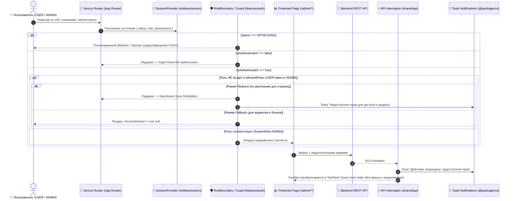

# [TASK]: Клиентская ролевая модель, битовая маска прав и обработка 403 Forbidden на Frontend (RBAC, Permissions & 403 Handling в Next.js & FSD)

Данный документ содержит детальную декомпозицию задач для реализации клиентской модели разграничения доступа (**Role-Based Access Control** и **Bitmask Permissions**), компонентов защиты интерфейса и централизованной обработки ошибки **`403 Forbidden`** в приложении **`apps/web`** (Next.js App Router, архитектура **FSD**).

---

## 1. Архитектурный дизайн и поток проверки прав (RBAC & 403 Flow)



---

## 2. Структура файлов в `apps/web` (FSD методология)

```text
apps/web/src/
├── app/
│   ├── (protected)/
│   │   ├── admin/
│   │   │   ├── layout.tsx                     # Лейаут админки с оберткой <RoleBoundary allowedRoles={[SystemRole.ADMIN]}>
│   │   │   └── users/
│   │   │       └── page.tsx                   # Страница управления пользователями
│   │   ├── forbidden/
│   │   │   └── page.tsx                       # Страница 403 "Доступ запрещен" (внутри защищенного шелла)
│   │   └── dashboard/
│   │       └── page.tsx
│   │
│   ├── forbidden.tsx                          # Глобальный App Router 403 fallback
│   └── layout.tsx
│
├── entities/
│   ├── session/
│   │   ├── lib/
│   │   │   ├── jwt.ts                         # Безопасное декодирование JWT claims (sub, permissions)
│   │   │   └── jwt.test.ts
│   │   ├── model/
│   │   │   ├── SessionProvider.tsx            # Хранение role, permissions, userId в SessionContext
│   │   │   ├── context.ts                     # SessionContextValue с полями { role, permissions, userId }
│   │   │   ├── useSession.ts                  # Хук сессии
│   │   │   ├── useRole.ts                     # Хуки: useRole, useIsAdmin, useHasRole, useHasPermission
│   │   │   └── useRole.test.ts                # Unit-тесты для хуков ролей и битовых масок
│   │   └── index.ts
│   │
│   └── user/
│       ├── model/
│       │   └── useCurrentUser.ts              # TanStack Query хук профиля (UserProfileDto с role и permissions)
│       └── index.ts
│
├── features/
│   └── auth/
│       ├── ui/
│       │   ├── RoleBoundary.tsx               # Защита страниц и разделов по ролям и правам
│       │   ├── RoleBoundary.test.tsx          # Unit-тесты для RoleBoundary
│       │   ├── RequireRole.tsx                # Компонент-гейт для условного рендеринга кнопок/блоков по роли
│       │   ├── RequireRole.test.tsx           # Unit-тесты для RequireRole
│       │   ├── RequirePermission.tsx          # Компонент-гейт для условного рендеринга по битовой маске SystemPermission
│       │   ├── RequirePermission.test.tsx     # Unit-тесты для RequirePermission
│       │   ├── AccessDenied.tsx               # UI-компонент заглушки "Доступ ограничен"
│       │   └── AccessDenied.test.tsx
│       └── index.ts
│
├── widgets/
│   ├── sidebar/
│   │   └── ui/
│   │       ├── Sidebar.tsx                    # Условный рендеринг админских ссылок через useIsAdmin()
│   │       └── Sidebar.test.tsx
│   └── header/
│       └── ui/
│           ├── UserMenu.tsx                   # Бейдж SystemRole.ADMIN в меню пользователя
│           └── UserMenu.test.tsx
│
└── shared/
    ├── api/
    │   ├── base.ts                            # Централизованный перехват 403 Forbidden с выводом Toast
    │   └── base.test.ts                       # Тесты интерцепторов API
    └── config/
        └── paths.ts                           # Расширение путей: paths.adminUsers, paths.forbidden
```

---

## 3. Детали технической реализации

### 3.1. Декодирование Access Token и извлечение Claims (`entities/session/lib/jwt.ts`)
JWT Access Token содержит claims: `sub` (userId), `sid` (sessionId), `permissions` (числовая битовая маска):
```typescript
import { jwtDecode } from "jwt-decode";

export interface DecodedAccessToken {
  sub: string;
  sid: string;
  permissions?: number | string;
  exp?: number;
  iat?: number;
}

/**
 * Безопасно декодирует JWT payload с помощью `jwt-decode`.
 */
export function decodeJwtPayload(token: string): DecodedAccessToken | null {
  try {
    return jwtDecode<DecodedAccessToken>(token);
  } catch {
    return null;
  }
}
```

---

### 3.2. Расширение `SessionContext` (`entities/session/model/context.ts`)
```typescript
import { createContext } from "react";
import type { SystemRole } from "@packages/types";
import type { SessionStatus } from "./constants";

export interface SessionContextValue {
  status: SessionStatus;
  isAuthenticated: boolean;
  userId: string | null;
  role: SystemRole | string | null;
  permissions: bigint;
  startSession: (accessToken: string, initialRole?: string) => void;
  setRole: (role: SystemRole | string | null) => void;
  clearSession: () => void;
}

export const SessionContext = createContext<SessionContextValue | null>(null);
```

---

### 3.3. Хуки проверки ролей и прав доступа (`entities/session/model/useRole.ts`)
> [!IMPORTANT]
> Роли импортируются строго из **`@packages/types`** (`SystemRole.ADMIN`, `SystemRole.USER`).
> Проверка прав выполняется через битовые операции над **`SystemPermission`** (`SystemPermission.ADMINISTRATOR`, `SystemPermission.USERS_READ`, `SystemPermission.USERS_MANAGE` и т.д.).

```typescript
import { SystemPermission, SystemRole } from "@packages/types";
import { useSession } from "./useSession";

export function useRole(): SystemRole | string | null {
  const { role } = useSession();
  return role;
}

export function useIsAdmin(): boolean {
  const { role, permissions } = useSession();
  if (role === SystemRole.ADMIN) return true;
  return (permissions & SystemPermission.ADMINISTRATOR) === SystemPermission.ADMINISTRATOR;
}

export function useHasRole(allowedRoles: (SystemRole | string)[]): boolean {
  const { role } = useSession();
  if (!role) return false;
  return allowedRoles.includes(role);
}

export function useHasPermission(requiredPermission: bigint): boolean {
  const { permissions, role } = useSession();
  if (role === SystemRole.ADMIN) return true;
  if ((permissions & SystemPermission.ADMINISTRATOR) === SystemPermission.ADMINISTRATOR) return true;
  return (permissions & requiredPermission) === requiredPermission;
}
```

---

### 3.4. Компонент защиты разделов и маршрутов (`RoleBoundary.tsx`)
```typescript
"use client";

import { usePathname, useRouter } from "next/navigation";
import { useEffect, type PropsWithChildren, type ReactNode } from "react";
import { SESSION_STATUS } from "@/entities/session/model/constants";
import { useRole, useSession } from "@/entities/session";
import { paths } from "@/shared/config";
import type { SystemRole } from "@packages/types";

export interface RoleBoundaryProps {
  allowedRoles: (SystemRole | string)[];
  fallback?: ReactNode;
  redirectTo?: string;
  loginPath?: string;
}

export function RoleBoundary({
  allowedRoles,
  children,
  fallback = null,
  redirectTo = paths.dashboard,
  loginPath = paths.login,
}: PropsWithChildren<RoleBoundaryProps>) {
  const { status, isAuthenticated } = useSession();
  const currentRole = useRole();
  const router = useRouter();
  const pathname = usePathname();

  const hasAccess = isAuthenticated && currentRole !== null && allowedRoles.includes(currentRole);

  useEffect(() => {
    // В режиме fallback компонент рендерит fallback UI без выполнения редиректов
    if (status === SESSION_STATUS.INITIALIZING || fallback) {
      return;
    }

    // 1. Неаутентифицированный пользователь -> редирект на /login с returnTo
    if (!isAuthenticated) {
      const returnTo = pathname ? `?returnTo=${encodeURIComponent(pathname)}` : "";
      router.replace(`${loginPath}${returnTo}`);
      return;
    }

    // 2. Аутентифицированный пользователь с недостаточными правами -> редирект на redirectTo
    if (!hasAccess) {
      router.replace(redirectTo);
    }
  }, [status, isAuthenticated, hasAccess, fallback, redirectTo, loginPath, pathname, router]);

  if (status === SESSION_STATUS.INITIALIZING) {
    return (
      <div
        data-testid="role-boundary-loading"
        className="flex min-h-screen w-full items-center justify-center bg-background"
      >
        <div className="h-8 w-8 animate-spin rounded-full border-4 border-primary border-t-transparent" />
      </div>
    );
  }

  if (!isAuthenticated || !hasAccess) {
    return fallback ? <>{fallback}</> : null;
  }

  return <>{children}</>;
}
```

---

### 3.5. Компоненты условного рендеринга (`RequireRole` и `RequirePermission`)
```typescript
// features/auth/ui/RequireRole.tsx
"use client";

import type { PropsWithChildren, ReactNode } from "react";
import { useHasRole } from "@/entities/session";
import type { SystemRole } from "@packages/types";

export interface RequireRoleProps {
  roles: (SystemRole | string)[];
  fallback?: ReactNode;
}

export function RequireRole({
  roles,
  children,
  fallback = null,
}: PropsWithChildren<RequireRoleProps>) {
  const hasAccess = useHasRole(roles);
  return hasAccess ? <>{children}</> : <>{fallback}</>;
}
```

```typescript
// features/auth/ui/RequirePermission.tsx
"use client";

import type { PropsWithChildren, ReactNode } from "react";
import { useHasPermission } from "@/entities/session";

export interface RequirePermissionProps {
  permission: bigint;
  fallback?: ReactNode;
}

export function RequirePermission({
  permission,
  children,
  fallback = null,
}: PropsWithChildren<RequirePermissionProps>) {
  const hasPermission = useHasPermission(permission);
  return hasPermission ? <>{children}</> : <>{fallback}</>;
}
```

---

### 3.6. Централизованная обработка HTTP 403 Forbidden (`shared/api/base.ts`)
```typescript
// В интерцепторе / обработчике ответов API:
if (response.status === 403) {
  // Вызов Toast уведомления о запрете действия
  toast.error("Недостаточно прав для выполнения данной операции");
}
```

---

## 4. Чеклист реализации

### 📦 Часть 1: Модель сессии и права (`entities/session`)

- [ ] **Установка библиотеки `jwt-decode`:**
  - Установить зависимость в приложение: `pnpm --filter web add jwt-decode`.
- [ ] **Декодер токена (`entities/session/lib/jwt.ts`):**
  - Реализация функции `decodeJwtPayload(token)` с использованием `jwtDecode<DecodedAccessToken>(token)`.
  - Безопасная обработка невалидных токенов (`try-catch`).
  - Unit-тесты `jwt.test.ts` на корректные токены, некорректные строки и извлечение `sub`, `permissions`.
- [ ] **Расширение `SessionProvider` (`entities/session/model/SessionProvider.tsx`):**
  - Инициализация `userId`, `role`, `permissions` (битовая маска `bigint`) при старте сессии.
  - Синхронизация роли с профилем пользователя (`GET /api/v1/profile/me`).
  - Сброс состояния при логауте (`clearSession`).
- [ ] **Хуки ролей и прав (`entities/session/model/useRole.ts`):**
  - Реализация `useRole()`, `useIsAdmin()`, `useHasRole(roles)`, `useHasPermission(permission)`.
  - Unit-тесты `useRole.test.ts`.

---

### 🛡️ Часть 2: Защитные компоненты (`features/auth`)

- [ ] **Компонент `RoleBoundary` (`features/auth/ui/RoleBoundary.tsx`):**
  - Защита страниц и разделов по списку ролей с поддержкой `redirectTo` и `fallback`.
  - Состояние загрузки `status === INITIALIZING` без утечки контента.
  - Unit-тесты `RoleBoundary.test.tsx`.
- [ ] **Компонент `RequireRole` (`features/auth/ui/RequireRole.tsx`):**
  - Условный рендеринг кнопок и панелей по роли.
  - Unit-тесты `RequireRole.test.tsx`.
- [ ] **Компонент `RequirePermission` (`features/auth/ui/RequirePermission.tsx`):**
  - Условный рендеринг по битовой маске `SystemPermission`.
  - Unit-тесты `RequirePermission.test.tsx`.
- [ ] **Компонент `AccessDenied` (`features/auth/ui/AccessDenied.tsx`):**
  - UI-заглушка с иконкой замка, сообщением и кнопкой возврата.
  - Unit-тесты `AccessDenied.test.tsx`.

---

### 🧭 Часть 3: Маршрутизация и лейауты (`app/(protected)`)

- [ ] **Обновление путей (`shared/config/paths.ts`):**
  - Добавить `adminUsers: "/admin/users"` и `forbidden: "/forbidden"`.
- [ ] **Админский лейаут (`app/(protected)/admin/layout.tsx`):**
  - Обернуть в `<RoleBoundary allowedRoles={[SystemRole.ADMIN]}>`.
- [ ] **Страница 403 Forbidden:**
  - Реализовать `app/(protected)/forbidden/page.tsx` и `app/forbidden.tsx`.

---

### 🎨 Часть 4: Интеграция в навигацию (`widgets/sidebar`, `widgets/header`)

- [ ] **Боковое меню (`widgets/sidebar/ui/Sidebar.tsx`):**
  - Отображение пункта "Администрирование" только при `useIsAdmin() === true`.
  - Unit-тесты `Sidebar.test.tsx`.
- [ ] **Меню пользователя (`widgets/header/ui/UserMenu.tsx`):**
  - Бейдж роли `Администратор` для пользователей с `SystemRole.ADMIN`.

---

### ⚡ Часть 5: Обработка HTTP 403 в API транспорте (`shared/api`)

- [ ] **Интерцептор 403:**
  - Перехват ответов `403 Forbidden` в `shared/api/base.ts` с вызовом `toast.error()`.
  - Предотвращение циклических редиректов и зависания UI при фоновых запросах.

---

### 🧪 Часть 6: Тестирование (Vitest & Playwright)

- [ ] **Unit & Component тесты (Vitest):**
  - `SessionProvider.test.tsx`, `RoleBoundary.test.tsx`, `RequireRole.test.tsx`, `RequirePermission.test.tsx`, `Sidebar.test.tsx`.
- [ ] **E2E тесты (Playwright):**
  - Переход `USER` на `/admin/users` $\to$ редирект на `/dashboard` с Toast.
  - Переход `ADMIN` на `/admin/users` $\to$ успешный вход.
  - Отсутствие админских ссылок у `USER` в сайдбаре.
  - Получение 403 от API $\to$ отображение Toast без краша страницы.

---

## 5. Критерии приемки (Definition of Done)

1. Роль (`SystemRole`) и битовая маска прав (`SystemPermission`) доступны в контексте сессии через типизированные хуки.
2. Маршруты `/admin/*` защищены через `<RoleBoundary allowedRoles={[SystemRole.ADMIN]}>` без FOUC-эффекта.
3. Неаутентифицированный пользователь перенаправляется на `/login?returnTo=<path>` (с сохранением целевого пути). Аутентифицированный пользователь без необходимой роли перенаправляется на `/dashboard` (или `/forbidden`).
4. Элементы интерфейса с повышенными привилегиями скрыты от обычных пользователей через `RequireRole` / `RequirePermission`.
5. Ответы `403 Forbidden` от API перехватываются с показом Toast-уведомления.
6. Все unit-тесты (`pnpm test`) и e2e-тесты проходят успешно.
