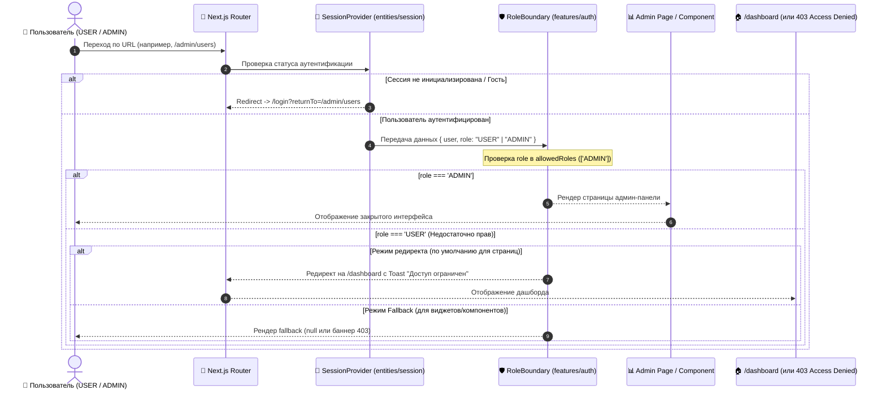

# Задачи: Ролевая модель доступа на Frontend (RBAC: ADMIN | USER в Next.js & FSD)

Данный документ содержит детальную декомпозицию задач для реализации клиентской ролевой модели (**Role-Based Access Control**) в приложении **`apps/web`** (Next.js App Router, архитектура **FSD**), интеграции с сессией пользователя, защиты страниц и условного отображения компонентов интерфейса.

---

## 1. Архитектурная диаграмма потока проверки ролей на Frontend



---

## 2. Структура файлов в `apps/web` (по методологии FSD)

```text
apps/web/src/
├── app/
│   ├── (protected)/
│   │   ├── admin/
│   │   │   ├── layout.tsx                     # Лейаут админки с оберткой <RoleBoundary allowedRoles={["ADMIN"]}>
│   │   │   └── users/
│   │   │       └── page.tsx                   # Страница управления пользователями (Admin Users Management)
│   │   └── dashboard/
│   │       └── page.tsx
│   │
│   ├── forbidden.tsx                          # Глобальная Next.js страница 403 Access Denied
│   └── layout.tsx
│
├── entities/
│   ├── session/
│   │   ├── model/
│   │   │   ├── SessionProvider.tsx            # Хранение role в SessionContext (из JWT / профиля)
│   │   │   ├── context.ts                     # SessionContext с полями { role, user, isAuthenticated }
│   │   │   ├── useSession.ts                  # Хук получения сессии и роли
│   │   │   └── useRole.ts                     # Вспомогательные хуки: useRole, useIsAdmin, useHasRole
│   │   └── index.ts
│   │
│   └── user/
│       ├── model/
│       │   ├── types.ts                       # Типы пользователя с полем role: UserRole
│       │   └── useCurrentUser.ts              # TanStack Query хук профиля текущего пользователя
│       └── index.ts
│
├── features/
│   └── auth/
│       ├── ui/
│       │   ├── RoleBoundary.tsx               # Защита страниц и разделов по ролям с редиректом
│       │   ├── RoleBoundary.test.tsx          # Unit-тесты для RoleBoundary
│       │   ├── RequireRole.tsx                # Компонент-гейт для условного рендеринга кнопок/блоков
│       │   ├── RequireRole.test.tsx           # Unit-тесты для RequireRole
│       │   └── AccessDenied.tsx               # UI-компонент заглушки "Недостаточно прав"
│       └── index.ts
│
├── widgets/
│   ├── sidebar/
│   │   └── ui/
│   │       ├── SidebarNav.tsx                 # Условный рендеринг ссылки "Админ-панель" через useIsAdmin()
│   │       └── SidebarNav.test.tsx
│   └── header/
│       └── ui/
│           └── UserMenu.tsx                   # Отображение бейджа роли ("Admin" / "User") в профиле
│
└── shared/
    ├── api/
    │   └── interceptors.ts                    # Обработка 403 Forbidden от API (уведомление через Toast)
    └── config/
        └── paths.ts                           # Расширение путей paths.admin.users, paths.forbidden
```

---

## 3. Детали технического дизайна

### 3.1. Расширение `SessionContext` и хуков сессии
При аутентификации роль пользователя извлекается из декодированного JWT Access Token или из запроса `GET /api/v1/profile/me`:
```typescript
// entities/session/model/types.ts
import type { UserRole } from "@packages/types";

export interface SessionContextValue {
  status: SessionStatus;
  isAuthenticated: boolean;
  role: UserRole | null;
  userId: string | null;
  startSession: (accessToken: string) => void;
  clearSession: () => void;
}
```

### 3.2. Хуки проверки ролей (`useRole`, `useIsAdmin`, `useHasRole`)
```typescript
// entities/session/model/useRole.ts
import { useSession } from "./useSession";
import { UserRole } from "@packages/types";

export function useRole(): UserRole | null {
  const { role } = useSession();
  return role;
}

export function useIsAdmin(): boolean {
  const { role } = useSession();
  return role === UserRole.ADMIN;
}

export function useHasRole(allowedRoles: UserRole[]): boolean {
  const { role } = useSession();
  if (!role) return false;
  return allowedRoles.includes(role);
}
```

### 3.3. Компонент защиты разделов (`RoleBoundary`)
Используется в `layout.tsx` защищенных разделов (например, `/admin/layout.tsx`):
```typescript
// features/auth/ui/RoleBoundary.tsx
"use client";

import { usePathname, useRouter } from "next/navigation";
import { useEffect, type PropsWithChildren, type ReactNode } from "react";
import { useSession } from "@/entities/session";
import { useHasRole } from "@/entities/session/model/useRole";
import { paths } from "@/shared/config";
import type { UserRole } from "@packages/types";

export interface RoleBoundaryProps {
  allowedRoles: UserRole[];
  fallback?: ReactNode;
  redirectTo?: string;
}

export function RoleBoundary({
  allowedRoles,
  children,
  fallback,
  redirectTo = paths.dashboard,
}: PropsWithChildren<RoleBoundaryProps>) {
  const { isAuthenticated, status } = useSession();
  const hasAccess = useHasRole(allowedRoles);
  const router = useRouter();

  useEffect(() => {
    if (status === "AUTHENTICATED" && !hasAccess) {
      router.replace(redirectTo);
    }
  }, [status, hasAccess, redirectTo, router]);

  if (status === "INITIALIZING") {
    return <LoadingSpinner />;
  }

  if (!isAuthenticated || !hasAccess) {
    return fallback ? <>{fallback}</> : null;
  }

  return <>{children}</>;
}
```

### 3.4. Компонент условного отображения в UI (`RequireRole`)
Используется для скрытия действий, кнопок, вкладок и тулбаров:
```typescript
// features/auth/ui/RequireRole.tsx
"use client";

import type { PropsWithChildren, ReactNode } from "react";
import { useHasRole } from "@/entities/session/model/useRole";
import type { UserRole } from "@packages/types";

export interface RequireRoleProps {
  roles: UserRole[];
  fallback?: ReactNode;
}

export function RequireRole({
  roles,
  children,
  fallback = null,
}: PropsWithChildren<RequireRoleProps>) {
  const hasAccess = useHasRole(roles);
  return hasAccess ? <>{children}</> : <>{fallback}</>;
}
```

---

## 4. Чеклист реализации

### 📦 Часть 1: Интеграция роли в состояние сессии (`entities/session`)

- [ ] **Обновление декодирования JWT токена:**
  - Добавить парсинг payload JWT токена (`jwt-decode` или безопасный `JSON.parse(atob(...))`) для извлечения `role` при `startSession(token)` и `restoreSession()`.
  - Сохранять `role: UserRole | null` в стейт `SessionProvider`.
- [ ] **Реализация хуков ролей:**
  - Создать `apps/web/src/entities/session/model/useRole.ts`.
  - Экспортировать хуки: `useRole()`, `useIsAdmin()`, `useHasRole(roles)`.
  - Написать unit-тесты для хуков с моками состояний `ADMIN`, `USER` и гостя.

---

### 🛡️ Часть 2: Компоненты гвардинга (`features/auth`)

- [ ] **Создание `RoleBoundary`:**
  - Реализовать компонент `RoleBoundary.tsx` с поддержкой пропсов `allowedRoles`, `fallback`, `redirectTo`.
  - Корректная обработка состояния загрузки (`INITIALIZING`) — предотвращение мерцания интерфейса (flash of unauthorized content).
  - Написать unit-тесты `RoleBoundary.test.tsx` (проверка рендера для ADMIN, редиректа для USER, состояния загрузки).
- [ ] **Создание `RequireRole` (RoleGate):**
  - Реализовать легковесный компонент `RequireRole.tsx`.
  - Написать unit-тесты `RequireRole.test.tsx`.
- [ ] **UI-компонент `AccessDenied`:**
  - Создать компонент с иллюстрацией/иконкой замка, сообщением "Доступ ограничен" и кнопкой "Перейти в личный кабинет".

---

### 🧭 Часть 3: Маршрутизация и Layout админ-панели (`app/(protected)/admin`)

- [ ] **Обновление конфигурации путей (`shared/config/paths.ts`):**
  - Добавить `admin: { root: '/admin', users: '/admin/users' }` и `forbidden: '/403'`.
- [ ] **Создание `admin/layout.tsx`:**
  - Обернуть все вложенные админские страницы в `<RoleBoundary allowedRoles={[UserRole.ADMIN]}>`.
  - Создать каркас страницы `/admin/users/page.tsx` с заголовком "Управление пользователями".
- [ ] **Создание страницы 403 Forbidden (`app/forbidden.tsx` / `app/403/page.tsx`):**
  - Оформить страницу в фирменном стиле дизайн-системы платформы.

---

### 🎨 Часть 4: Интеграция в навигацию и UI (`widgets/sidebar`, `widgets/header`)

- [ ] **Сайдбар (`widgets/sidebar`):**
  - Добавить секцию меню "Администрирование" с пунктом "Пользователи" (`/admin/users`).
  - Обернуть админские пункты меню в `<RequireRole roles={[UserRole.ADMIN]}>` или отображать по условию `useIsAdmin()`.
  - Проверить, что обычные пользователи (`USER`) не видят админских ссылок.
- [ ] **Хедер и меню пользователя (`widgets/header`):**
  - Отображать бейдж `Администратор` рядом с именем/аватаром, если пользователь имеет роль `ADMIN`.

---

### ⚡ Часть 5: Обработка ошибок 403 от API (`shared/api`)

- [ ] **Глобальный интерцептор API клиента:**
  - При получении ответа `403 Forbidden` вызывать всплывающее toast-уведомление: *"Недостаточно прав для выполнения действия"*.
  - Не производить бесконечные циклические редиректы при фоновых 403 ошибках.

---

### 🧪 Часть 6: Тестирование (Vitest, RTL & Playwright E2E)

- [ ] **Unit & Component тесты (Vitest):**
  - Тест `SessionProvider`: корректно передает `role: 'ADMIN'` в контекст.
  - Тест `RoleBoundary`: не пускает пользователя с ролью `USER` на защищенный роут и вызывает `router.replace`.
  - Тест `RequireRole`: скрывает кнопку "Удалить" / "Заблокировать" для роли `USER`.
  - Тест `Sidebar`: админские пункты рендерятся только для администраторов.
- [ ] **E2E тесты (Playwright):**
  - Вход под аккаунтом `USER` $\to$ прямой переход по адресу `/admin/users` $\to$ автоматический редирект на `/dashboard`.
  - Вход под аккаунтом `ADMIN` $\to$ переход на `/admin/users` $\to$ успешный доступ к странице.

---

## 5. Критерии приемки (Definition of Done)

1. Роль пользователя доступна во всем приложении через хуки `useRole()`, `useIsAdmin()`, `useHasRole()`.
2. Админский лейаут `app/(protected)/admin/layout.tsx` надежно защищен с помощью `RoleBoundary`.
3. Обычный пользователь (`USER`) при попытке перейти на любой адрес `/admin/*` перенаправляется на `/dashboard` без отображения закрытого контента.
4. Админские пункты меню в сайдбаре видны только пользователям с ролью `ADMIN`.
5. Кнопки и блоки с повышенными привилегиями скрываются от обычных пользователей через `<RequireRole>`.
6. Отсутствует эффект мерцания (FOUC) при начальной загрузке и проверке сессии.
7. Все unit-, компонентные и E2E-тесты успешно проходят (`pnpm test`, `pnpm test:e2e`).
