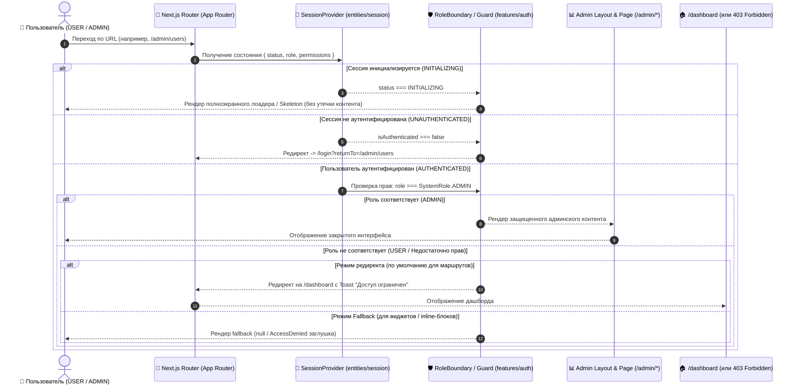

# [TASK]: Клиентская ролевая модель и разграничение прав доступа на Frontend (RBAC & Permissions в Next.js & FSD)

## Описание задачи
Реализовать комплексную клиентскую модель разграничения прав доступа (**Role-Based Access Control** и **Bitmask Permissions**) в приложении **`apps/web`** (Next.js App Router, архитектура **FSD**).

Система должна обеспечивать:
- Извлечение, валидацию и хранение роли (`SystemRole`: `ADMIN` | `USER`) и прав пользователя (`permissions bitmask`) в контексте сессии (`entities/session`);
- Защиту админских маршрутов (`/admin/*`) на уровне App Router Layout с предотвращением мерцания контента (FOUC);
- Декларативные компоненты-гварды (`RoleBoundary`, `RequireRole`, `RequirePermission`) для условного рендеринга виджетов, кнопок и страниц;
- Интеграцию в навигацию (`widgets/sidebar`, `widgets/header`);
- Централизованный перехват и обработку ошибок `403 Forbidden` в API клиенте (`shared/api`).

---

## 1. Архитектурный дизайн и поток проверки доступа



---

## 2. Структура файлов в `apps/web` (по методологии FSD)

```text
apps/web/src/
├── app/
│   ├── (protected)/
│   │   ├── admin/
│   │   │   ├── layout.tsx                     # Лейаут админки с оберткой <RoleBoundary allowedRoles={[SystemRole.ADMIN]}>
│   │   │   └── users/
│   │   │       └── page.tsx                   # Страница управления пользователями (Admin Users Management)
│   │   ├── forbidden/
│   │   │   └── page.tsx                       # Защищенная страница 403 Доступ запрещен
│   │   └── dashboard/
│   │       └── page.tsx
│   │
│   ├── forbidden.tsx                          # Глобальный fallback 403 для Next.js App Router
│   └── layout.tsx
│
├── entities/
│   ├── session/
│   │   ├── lib/
│   │   │   ├── jwt.ts                         # Безопасное декодирование JWT payload (sub, permissions)
│   │   │   └── jwt.test.ts                    # Unit-тесты для декодера токенов
│   │   ├── model/
│   │   │   ├── SessionProvider.tsx            # Хранение role, permissions, userId в SessionContext
│   │   │   ├── context.ts                     # SessionContextValue с полями { role, permissions, userId, ... }
│   │   │   ├── useSession.ts                  # Хук получения сессии
│   │   │   ├── useRole.ts                     # Хуки: useRole, useIsAdmin, useHasRole, useHasPermission
│   │   │   └── useRole.test.ts                # Unit-тесты для хуков ролей и прав
│   │   └── index.ts
│   │
│   └── user/
│       ├── model/
│       │   └── useCurrentUser.ts              # TanStack Query хук профиля (UserProfileDto с role и permissions)
│       └── index.ts
│
├── features/
│   └── auth/
│       ├── ui/
│       │   ├── RoleBoundary.tsx               # Защита страниц и разделов по ролям и правам
│       │   ├── RoleBoundary.test.tsx          # Unit-тесты для RoleBoundary
│       │   ├── RequireRole.tsx                # Компонент-гейт для условного рендеринга кнопок/блоков по роли
│       │   ├── RequireRole.test.tsx           # Unit-тесты для RequireRole
│       │   ├── RequirePermission.tsx          # Компонент-гейт для условного рендеринга по битовой маске прав
│       │   ├── RequirePermission.test.tsx     # Unit-тесты для RequirePermission
│       │   ├── AccessDenied.tsx               # UI-компонент заглушки "Недостаточно прав"
│       │   └── AccessDenied.test.tsx
│       └── index.ts
│
├── widgets/
│   ├── sidebar/
│   │   └── ui/
│   │       ├── Sidebar.tsx                    # Условный рендеринг секции "Администрирование" через useIsAdmin()
│   │       └── Sidebar.test.tsx
│   └── header/
│       └── ui/
│           ├── UserMenu.tsx                   # Бейдж "Администратор" / "Пользователь" в дропдауне профиля
│           └── UserMenu.test.tsx
│
└── shared/
    ├── api/
    │   ├── base.ts                            # Централизованный перехватчик 403 Forbidden с вызовом Toast
    │   └── base.test.ts                       # Тесты интерцепторов API
    └── config/
        └── paths.ts                           # Расширение путей: paths.admin.root, paths.admin.users, paths.forbidden
```

---

## 3. Детали технической реализации

### 3.1. Декодирование токена через библиотеку `jwt-decode` (`entities/session/lib/jwt.ts`)
JWT Access Token содержит claims: `sub` (userId), `sid` (sessionId), `permissions` (числовая или строковая битовая маска):
```typescript
import { jwtDecode } from "jwt-decode";

export interface DecodedAccessToken {
  sub: string;
  sid: string;
  permissions?: number | string;
  exp?: number;
  iat?: number;
}

/**
 * Безопасно декодирует JWT payload с помощью `jwt-decode`.
 */
export function decodeJwtPayload(token: string): DecodedAccessToken | null {
  try {
    return jwtDecode<DecodedAccessToken>(token);
  } catch {
    return null;
  }
}
```

### 3.2. Расширение `SessionContext` (`entities/session/model/context.ts`)
```typescript
import { createContext } from "react";
import type { SystemRole, UserRole } from "@packages/types";
import type { SessionStatus } from "./constants";

export interface SessionContextValue {
  status: SessionStatus;
  isAuthenticated: boolean;
  userId: string | null;
  role: SystemRole | UserRole | null;
  permissions: bigint;
  startSession: (accessToken: string, initialRole?: string) => void;
  setRole: (role: SystemRole | UserRole | null) => void;
  clearSession: () => void;
}

export const SessionContext = createContext<SessionContextValue | null>(null);
```

### 3.3. Хуки проверки ролей и прав доступа (`entities/session/model/useRole.ts`)
> [!IMPORTANT]
> В `@packages/types` константы ролей определены в объекте `SystemRole` (`SystemRole.ADMIN = "ADMIN"`, `SystemRole.USER = "USER"`).
> Для проверки битовых масок прав используются константы `SystemPermission` (`ADMINISTRATOR = 1n << 0n`, `USERS_MANAGE = 1n << 2n` и т.д.).

```typescript
import { useMemo } from "react";
import { SystemPermission, SystemRole, type UserRole } from "@packages/types";
import { useSession } from "./useSession";

export function useRole(): UserRole | null {
  const { role } = useSession();
  return role;
}

export function useIsAdmin(): boolean {
  const { role, permissions } = useSession();
  if (role === SystemRole.ADMIN) return true;
  // Проверка флага суперадминистратора через bitmask
  return (permissions & SystemPermission.ADMINISTRATOR) === SystemPermission.ADMINISTRATOR;
}

export function useHasRole(allowedRoles: (SystemRole | string)[]): boolean {
  const { role } = useSession();
  if (!role) return false;
  return allowedRoles.includes(role);
}

export function useHasPermission(requiredPermission: bigint): boolean {
  const { permissions, role } = useSession();
  if (role === SystemRole.ADMIN) return true;
  if ((permissions & SystemPermission.ADMINISTRATOR) === SystemPermission.ADMINISTRATOR) return true;
  return (permissions & requiredPermission) === requiredPermission;
}
```

### 3.4. Компонент защиты разделов и маршрутов (`RoleBoundary.tsx`)
```typescript
// features/auth/ui/RoleBoundary.tsx
"use client";

import { useRouter } from "next/navigation";
import { useEffect, type PropsWithChildren, type ReactNode } from "react";
import { SESSION_STATUS } from "@/entities/session/model/constants";
import { useRole, useSession } from "@/entities/session";
import { paths } from "@/shared/config";
import type { SystemRole } from "@packages/types";

export interface RoleBoundaryProps {
  allowedRoles: (SystemRole | string)[];
  fallback?: ReactNode;
  redirectTo?: string;
}

export function RoleBoundary({
  allowedRoles,
  children,
  fallback = null,
  redirectTo = paths.dashboard,
}: PropsWithChildren<RoleBoundaryProps>) {
  const { status, isAuthenticated } = useSession();
  const currentRole = useRole();
  const router = useRouter();

  const hasAccess = isAuthenticated && currentRole !== null && allowedRoles.includes(currentRole);

  useEffect(() => {
    if (status === SESSION_STATUS.AUTHENTICATED && !hasAccess && !fallback) {
      router.replace(redirectTo);
    }
  }, [status, hasAccess, fallback, redirectTo, router]);

  if (status === SESSION_STATUS.INITIALIZING) {
    return (
      <div
        data-testid="role-boundary-loading"
        className="flex min-h-screen w-full items-center justify-center bg-background"
      >
        <div className="h-8 w-8 animate-spin rounded-full border-4 border-primary border-t-transparent" />
      </div>
    );
  }

  if (!isAuthenticated || !hasAccess) {
    return fallback ? <>{fallback}</> : null;
  }

  return <>{children}</>;
}
```

### 3.5. Компоненты условного отображения в UI (`RequireRole` и `RequirePermission`)
```typescript
// features/auth/ui/RequireRole.tsx
"use client";

import type { PropsWithChildren, ReactNode } from "react";
import { useHasRole } from "@/entities/session";
import type { SystemRole } from "@packages/types";

export interface RequireRoleProps {
  roles: (SystemRole | string)[];
  fallback?: ReactNode;
}

export function RequireRole({
  roles,
  children,
  fallback = null,
}: PropsWithChildren<RequireRoleProps>) {
  const hasAccess = useHasRole(roles);
  return hasAccess ? <>{children}</> : <>{fallback}</>;
}
```

```typescript
// features/auth/ui/RequirePermission.tsx
"use client";

import type { PropsWithChildren, ReactNode } from "react";
import { useHasPermission } from "@/entities/session";

export interface RequirePermissionProps {
  permission: bigint;
  fallback?: ReactNode;
}

export function RequirePermission({
  permission,
  children,
  fallback = null,
}: PropsWithChildren<RequirePermissionProps>) {
  const hasPermission = useHasPermission(permission);
  return hasPermission ? <>{children}</> : <>{fallback}</>;
}
```

### 3.6. Обновление конфигурации путей (`shared/config/paths.ts`)
```typescript
export const paths = {
  login: "/login",
  register: "/register",
  dashboard: "/dashboard",
  interviews: "/dashboard/interviews",
  partners: "/dashboard/partners",
  statistics: "/dashboard/statistics",
  resources: "/dashboard/resources",
  forbidden: "/forbidden",
  admin: {
    root: "/admin",
    users: "/admin/users",
  },
} as const;
```

---

## 4. Чеклист реализации

### 📦 Часть 1: Интеграция роли и прав в сессию (`entities/session`)

- [ ] **Установка зависимости `jwt-decode`:**
  - Установить пакет в workspace: `pnpm --filter @apps/web add jwt-decode`.
- [ ] **Декодер JWT Payload (`entities/session/lib/jwt.ts`):**
  - Реализовать функцию `decodeJwtPayload(token)` с использованием `jwtDecode<DecodedAccessToken>(token)`.
  - Предусмотреть безопасный перехват ошибок (`try-catch`) при передаче некорректного токена.
  - Написать unit-тесты (`jwt.test.ts`) на валидные токены, битые строки и извлечение `sub`, `permissions`.
- [ ] **Расширение `SessionProvider` и `SessionContext`:**
  - Добавить поля `userId: string | null`, `role: SystemRole | string | null`, `permissions: bigint` в `SessionContextValue`.
  - При `startSession(token)` парсить claims и устанавливать `userId`, `permissions`.
  - Синхронизировать роль с запросом профиля `GET /api/v1/profile/me` (`UserProfileDto`).
  - При `clearSession()` сбрасывать `role = null`, `permissions = 0n`, `userId = null`.
- [ ] **Реализация хуков (`entities/session/model/useRole.ts`):**
  - Реализовать хуки `useRole()`, `useIsAdmin()`, `useHasRole(roles)`, `useHasPermission(permission)`.
  - Покрыть хуки unit-тестами с помощью `@testing-library/react` (`renderHook`).

---

### 🛡️ Часть 2: Компоненты гвардинга (`features/auth`)

- [ ] **Компонент `RoleBoundary` (`features/auth/ui/RoleBoundary.tsx`):**
  - Реализовать компонент с пропсами `allowedRoles`, `fallback`, `redirectTo`.
  - Обеспечить отображение спиннера/лоадера при `status === INITIALIZING` (предотвращение FOUC).
  - Покрыть тестами `RoleBoundary.test.tsx` (доступ для ADMIN, редирект для USER, состояние загрузки, fallback-режим).
- [ ] **Компонент `RequireRole` (`features/auth/ui/RequireRole.tsx`):**
  - Реализовать RoleGate для кнопок и блоков интерфейса.
  - Написать unit-тесты `RequireRole.test.tsx`.
- [ ] **Компонент `RequirePermission` (`features/auth/ui/RequirePermission.tsx`):**
  - Реализовать PermissionGate по битовой маске `SystemPermission`.
  - Написать unit-тесты `RequirePermission.test.tsx`.
- [ ] **UI-компонент `AccessDenied` (`features/auth/ui/AccessDenied.tsx`):**
  - Создать компонент с иконкой замка, сообщением "Доступ ограничен" и кнопкой возврата на главный дашборд.

---

### 🧭 Часть 3: Маршрутизация и Админский Layout (`app/(protected)/admin`)

- [ ] **Конфигурация роутинга (`shared/config/paths.ts`):**
  - Добавить пути `admin: { root: "/admin", users: "/admin/users" }` и `forbidden: "/forbidden"`.
- [ ] **Админский лейаут (`app/(protected)/admin/layout.tsx`):**
  - Обернуть маршруты админки в `<RoleBoundary allowedRoles={[SystemRole.ADMIN]}>`.
  - Создать заглушку страницы `/admin/users/page.tsx` с валидной версткой и хлебными крошками.
- [ ] **Страница 403 Forbidden (`app/forbidden.tsx` и `app/(protected)/forbidden/page.tsx`):**
  - Сверстать доступную страницу ошибки 403 с использованием дизайн-токенов проекта.

---

### 🎨 Часть 4: Интеграция в навигацию (`widgets/sidebar`, `widgets/header`)

- [ ] **Боковая панель (`widgets/sidebar/ui/Sidebar.tsx`):**
  - Добавить блок навигации "Администрирование" с пунктом "Пользователи" (`/admin/users`).
  - Скрывать блок для пользователей без роли `ADMIN` (через `useIsAdmin()` или `<RequireRole>`).
  - Добавить unit-тесты `Sidebar.test.tsx` на отображение ссылок для ADMIN и их отсутствие для USER.
- [ ] **Хедер пользователя (`widgets/header` / меню профиля):**
  - Отображать бейдж `Администратор` рядом с именем/аватаром, если `useIsAdmin() === true`.

---

### ⚡ Часть 5: Обработка HTTP 403 от API (`shared/api`)

- [ ] **Централизованный интерцептор API:**
  - В `shared/api/http/base.ts` при статусе ответа `403 Forbidden` вызывать всплывающее уведомление (Toast / Notification): *"Недостаточно прав для выполнения действия"*.
  - Избегать циклических бесконечных редиректов при получении 403 от фоновых polling/query запросов.

---

### 🧪 Часть 6: Комплексное тестирование (Vitest & Playwright E2E)

- [ ] **Unit & Component тесты (Vitest + React Testing Library):**
  - `SessionProvider.test.tsx`: корректное извлечение и установка роли и permissions.
  - `RoleBoundary.test.tsx`: защита роутов, вызов `router.replace` для пользователей без прав.
  - `RequireRole.test.tsx` / `RequirePermission.test.tsx`: условный рендеринг кнопок и действий.
  - `Sidebar.test.tsx`: видимость админских пунктов строго по ролям.
- [ ] **E2E тесты (Playwright в `apps/web/e2e`):**
  - Сценарий 1: Пользователь с ролью `USER` пытается открыть `/admin/users` $\to$ редирект на `/dashboard`.
  - Сценарий 2: Пользователь с ролью `ADMIN` открывает `/admin/users` $\to$ успешный рендер страницы.
  - Сценарий 3: Пользователь `USER` не видит раздел "Администрирование" в сайдбаре.
  - Сценарий 4: Пользователь `ADMIN` видит бейдж администратора и админские пункты навигации.

---

## 5. Критерии приемки (Definition of Done)

1. ✅ Роль пользователя (`SystemRole`) и битовая маска прав (`permissions`) доступны через контекст сессии и хуки `useRole()`, `useIsAdmin()`, `useHasRole()`, `useHasPermission()`.
2. ✅ Layout админки `app/(protected)/admin/layout.tsx` надежно защищен от несанкционированного доступа.
3. ✅ При попытке прямого перехода обычного пользователя (`USER`) на `/admin/*` происходит мгновенный редирект на `/dashboard` без мерцания закрытого контента (FOUC).
4. ✅ Пункты меню администрирования и элементы управления с повышенными привилегиями скрыты от обычных пользователей в сайдбаре и интерфейсе.
5. ✅ При получении `403 Forbidden` от API всплывает информативный Toast без падения приложения и зацикливания роутинга.
6. ✅ Строго соблюдены правила FSD и границы слоев (отсутствуют кросс-импорты и циклические зависимости).
7. ✅ Все Unit-тесты (`pnpm --filter @apps/web test`) и E2E-тесты (`pnpm --filter @apps/web test:e2e`) успешно проходят.
