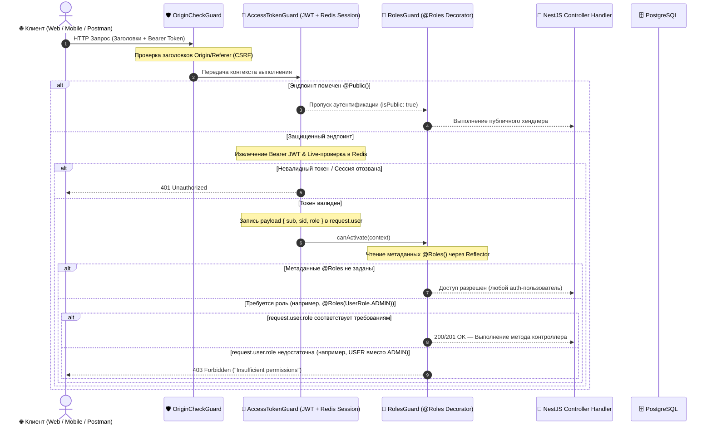

# Задачи: Ролевая модель доступа (RBAC: ADMIN | USER) на Backend

Данный документ содержит детальную декомпозицию задач для внедрения базовой ролевой модели (**Role-Based Access Control**) на **Backend** (`apps/api`), схемы базы данных (**Prisma / PostgreSQL**), общих типов (**`packages/types`**, **`packages/dto`**) и системы защиты эндпоинтов на базе **NestJS Guards & Decorators**.

На текущем этапе реализуется двухуровневая модель ролей:
- `USER` — стандартный авторизованный пользователь платформы (по умолчанию);
- `ADMIN` — системный администратор с доступом к служебным эндпоинтам и управлению.

---

## 1. Архитектурная диаграмма потока авторизации (RBAC Guard Flow)



---

## 2. Структура файлов в монорепозитории

```text
MockInterviewAI/
├── packages/
│   ├── types/
│   │   └── src/
│   │       ├── role.ts                        # Enum UserRole: "ADMIN" | "USER" и типы
│   │       └── index.ts                       # Реэкспорт UserRole
│   │
│   └── dto/
│       └── src/
│           ├── auth/                          # Обновление payload и DTO ответа профиля с полем role
│           └── index.ts
│
├── apps/api/
│   ├── prisma/
│   │   ├── schema.prisma                      # Добавление enum UserRole и поля User.role
│   │   └── migrations/
│   │       └── YYYYMMDDHHMMSS_add_user_roles/ # Миграция добавления ролевой модели
│   │
│   ├── src/
│   │   ├── app.module.ts                      # Регистрация RolesGuard в APP_GUARD провайдерах
│   │   │
│   │   ├── common/
│   │   │   ├── decorators/
│   │   │   │   ├── roles.decorator.ts         # Декоратор @Roles(UserRole.ADMIN, ...) и ROLES_KEY
│   │   │   │   ├── roles.decorator.spec.ts    # Unit-тесты декоратора
│   │   │   │   └── current-user.decorator.ts  # Актуализация типов с полем role
│   │   │   │
│   │   │   └── guards/
│   │   │       ├── roles.guard.ts             # RolesGuard для проверки ролей через Reflector
│   │   │       ├── roles.guard.spec.ts        # Unit-тесты с различными комбинациями ролей и @Public
│   │   │       └── access-token.guard.ts      # Поддержка сохранения claim `role` в request.user
│   │   │
│   │   ├── modules/
│   │   │   └── auth/
│   │   │       ├── services/
│   │   │       │   ├── token.service.ts       # Добавление role в TokenPayload и Access Token JWT
│   │   │       │   └── token.service.spec.ts  # Тесты генерации и верификации токенов с ролью
│   │   │       ├── auth.service.ts            # Передача user.role при логине, регистрации и refresh
│   │   │       └── auth.controller.ts         # Документирование ролей в Swagger / OpenAPI
│   │   │
│   │   └── scripts/
│   │       └── seed-admin.ts                  # CLI-скрипт назначения/создания администратора
│   │
│   └── test/
│       └── rbac.e2e-spec.ts                   # E2E-тесты разграничения доступа (401 vs 403 vs 200)
```

---

## 3. Детали технического дизайна

### 3.1. Изменения в Prisma Schema
```prisma
enum UserRole {
  USER
  ADMIN
}

model User {
  id               String    @id @default(uuid()) @db.Uuid
  email            String    @unique
  passwordHash     String
  role             UserRole  @default(USER)
  displayName      String?
  username         String?   @unique
  avatarUrl        String?
  telegramUsername String?
  gitUrl           String?
  deletedAt        DateTime?
  createdAt        DateTime  @default(now())
  updatedAt        DateTime  @updatedAt

  notifications    Notification[]
  sessions         InterviewSession[]
  participations   InterviewParticipant[]

  @@map("users")
  @@index([username])
  @@index([role])
  @@index([deletedAt])
}
```

### 3.2. Расширение TokenPayload (JWT Access Token)
Роль пользователя помещается непосредственно в payload JWT access token, чтобы `RolesGuard` мог выполнять валидацию без дополнительных SQL-запросов к БД на каждый HTTP-запрос:
```typescript
export interface TokenPayload {
  sub: string;
  sid: string;
  role: UserRole;
  typ: string;
  iss: string;
  aud: string;
  iat: number;
  exp: number;
  jti: string;
  sessionId?: string;
}
```

### 3.3. Декоратор `@Roles` и Guard `RolesGuard`
```typescript
// roles.decorator.ts
export const ROLES_KEY = 'roles';
export const Roles = (...roles: UserRole[]) => SetMetadata(ROLES_KEY, roles);

// roles.guard.ts
@Injectable()
export class RolesGuard implements CanActivate {
  constructor(private readonly reflector: Reflector) {}

  canActivate(context: ExecutionContext): boolean {
    const requiredRoles = this.reflector.getAllAndOverride<UserRole[]>(ROLES_KEY, [
      context.getHandler(),
      context.getClass(),
    ]);

    // Если для хендлера/контроллера не указаны специфические роли — пропускаем
    if (!requiredRoles || requiredRoles.length === 0) {
      return true;
    }

    const request = context.switchToHttp().getRequest();
    const user = request.user as TokenPayload | undefined;

    if (!user || !user.role) {
      throw new ForbiddenException('Access denied: User role is not defined');
    }

    const hasRole = requiredRoles.includes(user.role);
    if (!hasRole) {
      throw new ForbiddenException('Access denied: Insufficient permissions');
    }

    return true;
  }
}
```

### 3.4. Порядок применения Guards в `app.module.ts`
Глобальные гарды выполняются строго по порядку регистрации в DI:
1. `AccessTokenGuard` — проверяет JWT и сессию в Redis, парсит claims и кладет `request.user`. Пропускает эндпоинты с `@Public()`.
2. `RolesGuard` — читает `@Roles()` метаданные и сравнивает с `request.user.role`.
3. `OriginCheckGuard` — защита от CSRF для мутирующих запросов.

---

## 4. Чеклист реализации

### 📦 Часть 1: Shared-типы и контракты (`packages/types`, `packages/dto`)

- [ ] **Экспорт `UserRole` в `@packages/types`:**
  - Создать `packages/types/src/role.ts` с объявлением `export enum UserRole { USER = 'USER', ADMIN = 'ADMIN' }` (или `const` enum / union type `type UserRole = 'USER' | 'ADMIN'`).
  - Экспортировать `UserRole` из `packages/types/src/index.ts`.
- [ ] **Обновление DTO в `@packages/dto`:**
  - Добавить поле `role: UserRole` в схему ответа профиля пользователя / текущего пользователя (`UserResponseDto` / `AuthResponseDto`).
  - Добавить поле `role` в swagger-декораторы DTO.

---

### 🗄️ Часть 2: Схема базы данных и миграции (`apps/api/prisma`)

- [ ] **Обновление `schema.prisma`:**
  - Добавить `enum UserRole { USER, ADMIN }`.
  - Добавить поле `role UserRole @default(USER)` в модель `User`.
  - Добавить индекс `@@index([role])` для ускорения фильтрации и выборок по ролям.
- [ ] **Генерация и накат миграции:**
  - Создать миграцию `prisma migrate dev --name add_user_roles`.
  - Сгенерировать обновленный Prisma Client (`pnpm prisma generate`).
  - Проверить обратную совместимость: для существующих записей проставляется дефолтное значение `USER`.

---

### 🔑 Часть 3: JWT и модуль аутентификации (`apps/api/src/modules/auth`)

- [ ] **Обновление `TokenService`:**
  - Добавить `role: UserRole` в интерфейс `TokenPayload`.
  - Обновить метод `generateAccessToken(userId: string, sessionId: string, role: UserRole)`.
  - Проверить валидацию и извлечение claims в `verifyAccessToken`.
  - Обновить unit-тесты `token.service.spec.ts` с проверкой нового поля `role`.
- [ ] **Обновление `AuthService`:**
  - При регистрации пользователя сохранять и прокидывать `role: UserRole.USER`.
  - При входе (Login via Password, OAuth) извлекать `user.role` из БД и передавать в `TokenService.generateAccessToken`.
  - При обновлении токенов (`refreshSession`) извлекать актуальную роль пользователя или читать из контекста сессии.
  - Актуализировать unit-тесты `auth.service.spec.ts`.

---

### 🛡️ Часть 4: Декораторы и Guard ролей (`apps/api/src/common`)

- [ ] **Создание `@Roles()` декоратора:**
  - Создать `apps/api/src/common/decorators/roles.decorator.ts`.
  - Реализовать `SetMetadata(ROLES_KEY, roles)` с поддержкой передачи одной или нескольких ролей.
  - Написать unit-тесты `roles.decorator.spec.ts`.
- [ ] **Создание `RolesGuard`:**
  - Создать `apps/api/src/common/guards/roles.guard.ts`.
  - Реализовать чтение метаданных с уровня метода (handler) и с уровня класса (controller).
  - Обработать кейсы:
    - Нет метаданных `@Roles` → `return true` (доступ разрешен всем авторизованным).
    - Пользователь не аутентифицирован (`!request.user`) → `ForbiddenException` / `UnauthorizedException`.
    - Роль пользователя есть в списке разрешенных → `return true`.
    - Роли пользователя нет в списке → `ForbiddenException('Insufficient permissions')` (HTTP 403).
  - Написать unit-тесты `roles.guard.spec.ts` со 100% покрытием всех граничных случаев.
- [ ] **Регистрация в `AppModule`:**
  - Зарегистрировать `RolesGuard` в качестве глобального провайдера `APP_GUARD` в `apps/api/src/app.module.ts`.
  - Убедиться в корректном порядке: `AccessTokenGuard` -> `RolesGuard` -> `OriginCheckGuard`.

---

### 📜 Часть 5: OpenAPI / Swagger документация

- [ ] **Swagger аннотации:**
  - Создать вспомогательный составной декоратор или настроить аннотации `@ApiResponse({ status: 403, description: 'Forbidden: Insufficient permissions' })`.
  - Добавить описание ролевых ограничений в Swagger схему для будущих админских эндпоинтов.

---

### ⚙️ Часть 6: Утилита / Скрипт инициализации Администратора (Seed & CLI)

- [ ] **Скрипт назначения роли администратора:**
  - Создать CLI-скрипт `apps/api/src/scripts/seed-admin.ts` (или добавить команду в `package.json` `seed:admin`).
  - Возможность создать администратора по email / паролю или повысить существующего пользователя:
    ```bash
    pnpm --filter api seed:admin -- --email admin@mockinterview.tech
    ```
  - Логирование успешного изменения роли в консоль.

---

### 🧪 Часть 7: Интеграционное и E2E тестирование

- [ ] **E2E тесты контроля доступа (`apps/api/test/rbac.e2e-spec.ts`):**
  - Тестовый контроллер с эндпоинтами:
    - `@Public()` эндпоинт (доступен без токена).
    - Обычный защищенный эндпоинт без `@Roles()` (доступен и `USER`, и `ADMIN`, 401 для анонимов).
    - Админский эндпоинт `@Roles(UserRole.ADMIN)`:
      - 401 при отсутствии токена;
      - 403 при запросе с токеном роли `USER`;
      - 200 при запросе с токеном роли `ADMIN`.
  - Тест изменения роли пользователя: проверка инвалидации/обновления токена при смене роли.

---

## 5. Критерии приемки (Definition of Done)

1. Поле `role` добавлено в Prisma-схему, сгенерирована и успешно применяется миграция.
2. Все существующие и новые пользователи по умолчанию получают роль `USER`.
3. JWT Access Token содержит claim `role: "USER" | "ADMIN"`.
4. Глобальный `RolesGuard` корректно блокирует запросы с кодом `403 Forbidden`, если роль пользователя не удовлетворяет `@Roles(...)`.
5. Эндпоинты без `@Roles(...)` остаются доступными всем аутентифицированным пользователям.
6. Публичные эндпоинты с `@Public()` доступны без токена.
7. Unit-тесты для `TokenService`, `RolesGuard`, `RolesDecorator` и E2E-тесты проходят без ошибок (`pnpm test`).
