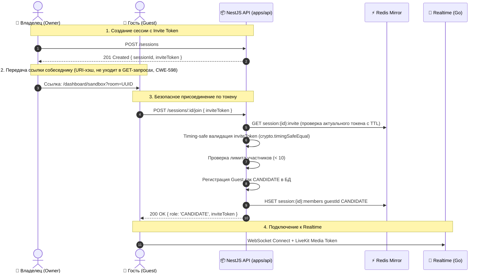

# Задачи: Безопасность Join Flow в Sandbox, WebRTC Cleanup и Синхронизация Realtime

Документ описывает устранение проблем и рисков, выявленных в ходе Senior Code Review: безопасная авторизация участников при присоединении по инвайт-ссылке в Sandbox, защита от Timing Attacks, сохранение токена инвайта владельцем, ограничение вместимости комнаты, предотвращение утечки Web Audio API контекстов и устранение риска рассинхронизации состояния редактора.

---

## 1. Описание проблем и архитектурных требований

### 1.1. Блокировка присоединения по ссылке в Sandbox, защита от Timing Attacks (CWE-862, CWE-208) и управление жизненным циклом токенов (CWE-613)
- **Проблема:** После ужесточения `POST /sessions/:id/join` метод требует обязательного наличия пользователя в таблице `interview_participants`. Однако в Sandbox совместный режим реализован через шеринг ссылки (`/dashboard/sandbox?room=<sessionId>`). При переходе по ссылке второй пользователь получает `403 Forbidden` и не может войти в сессию, так как владелец не добавлял его `userId` вручную. При этом статический детерминированный HMAC-токен не подлежит отзыву или ротации, создавая уязвимость CWE-613.
- **Решение:** Внедрить криптографически стойкий недетерминированный механизм инвайт-токенов с хранением в Redis, поддержкой отзыва и ротации (CWE-613):
  - `inviteToken` генерируется как 256-битный случайный CSPRNG-токен (`crypto.randomBytes(32).toString('hex')`) с высокой энтропией, защищённый от прогнозирования и подбора.
  - Токен сохраняется в Redis под отдельным ключом `session:${id}:invite` с TTL зеркала сессии (`mirrorTtlSeconds`).
  - **Отзыв и ротация (CWE-613):** При удалении участника владельцем сессии (`removeParticipant`) токен автоматически ротируется, а в realtime публикуется room-scoped ревокация (1008), что блокирует повторный вход исключённого пользователя со старым токеном. Добавлен эндпоинт ручной ротации `POST /sessions/:id/rotate-invite` для владельца сессии.
  - При `POST /sessions` и при успешном `POST /sessions/:id/join` для участников бэкенд возвращает `{ sessionId, inviteToken }` / `{ role, inviteToken }`. Это гарантирует, что участники сессии всегда имеют актуальный токен.
  - **Защита от Timing Attacks ([CWE-208](https://cwe.mitre.org/data/definitions/208.html)):** Валидация токена выполняется через `crypto.timingSafeEqual(Buffer.from(expectedHex, 'hex'), Buffer.from(receivedHex, 'hex'))` с обязательной предварительной проверкой равенства длин буферов (64 hex-символа).
  - **Лимит участников (Mesh Overload / DoS Protection):** Перед регистрацией нового участника проверяется лимит комнаты (`MAX_SESSION_PARTICIPANTS = 10`). При превышении выбрасывается `403 Forbidden ("Interview session is full")`.
  - Если пользователь уже является участником — он входит напрямую. Если пользователь новый, но предоставил валидный актуальный `inviteToken` из Redis (и лимит не превышен) — он безопасно регистрируется как `CANDIDATE`. Прямой подбор UUID без токена или с устаревшим/отозванным токеном отклоняется с `403 Forbidden`.

### 1.2. Обратная совместимость и опциональность DTO в `POST /sessions/:id/join`
- **Проблема:** Если схема запроса `POST /sessions/:id/join` потребует обязательного тела, существующие вызовы без параметров (например, повторный вход владельца или вызовы из тестов) завершатся ошибкой `400 Bad Request`.
- **Решение:** Схема `joinSessionSchema` объявляется с поддержкой опционального тела по умолчанию:
  ```typescript
  export const joinSessionSchema = z
    .object({
      inviteToken: z.string().optional(),
    })
    .optional()
    .default({});
  ```
  Это гарантирует, что запросы без `body` или с `{}` проходят валидацию штатно, а генератор клиентов Orval формирует опциональный параметр `joinSessionDto?: JoinSessionDto`.

### 1.3. Утечка ресурсов Web Audio API (`syntheticAudioCtxRef`) и дескрипторов треков в `useWebRTC.ts`
- **Проблема:** При создании синтетического аудиопотока создается `AudioContext` (`syntheticAudioCtxRef.current = audioCtx`), который не освобождается при размонтировании компонента или завершении работы хука. Браузер имеет лимит на количество активных аудиоконтекстов (6–8 на вкладку), превышение которого вызывает сбой WebRTC. Кроме того, закрытие контекста без предварительного `.stop()` на `MediaStreamTrack` оставляет зависшие дескрипторы в браузере.
- **Решение:** В cleanup-функцию `useEffect` хука `useWebRTC` добавить остановку всех треков (`localStreamRef.current?.getTracks().forEach(t => t.stop())`, `screenTrackRef.current?.stop()`), закрытие `pcRef.current` и гарантированный вызов `audioCtx.close()`:
  ```typescript
  if (syntheticAudioCtxRef.current && syntheticAudioCtxRef.current.state !== "closed") {
    void syntheticAudioCtxRef.current.close();
    syntheticAudioCtxRef.current = null;
  }
  ```

### 1.4. Реконсиляция кода и устранение устаревшего буфера (`pendingCodeRef`) в `useSandboxRealtime.ts`
- **Проблема:** Если `requestId` в сообщении `code.update` сгенерирован сервером заново и не совпадает с клиентским, `pendingCodeRef` может не очиститься и при последующем реконнекте повторно отправить устаревший локальный код, затерев актуальные правки. Если при реконнекте сервер уже содержит актуальный код клиента, повторная отправка создает лишний трафик и риск коллизий.
- **Решение:** При получении `room.sync`:
  - Если `pendingCodeRef.current.code === serverCodeState.content` — локальный буфер сбрасывается (`pendingCodeRef.current = null`), так как сервер уже синхронизирован.
  - Если код отличается — локальное неподтверждённое изменение досылается на сервер.

---

## 2. Архитектура решения



---

## 3. План реализации задач

### 🛠️ Backend Tasks (`apps/api`, `packages/dto`, `packages/api`)

- [x] **1. DTO для создания и присоединения к сессии с Invite Token**
  - **Файл:** `packages/dto/src/sessions/join-session.dto.ts`
  - Добавить `joinSessionSchema` / `JoinSessionDto` (`{ inviteToken?: string }`, опциональный по умолчанию).
  - Обновить `JoinSessionResponseDto` (`{ role: InterviewParticipantRole, inviteToken: string }`).
  - Обновить `CreateSessionResponseDto` (`{ sessionId: string, inviteToken: string }`).
  - Добавить `RotateInviteResponseDto` (`{ inviteToken: string }`).

- [x] **2. Генерация, хранение в Redis, ротация и timing-safe валидация CSPRNG Invite Token в `SessionsService`**
  - **Файл:** `apps/api/src/modules/sessions/sessions.service.ts`, `apps/api/src/modules/sessions/session-keys.ts`
  - Реализовать криптографически стойкую генерацию случайного 256-битного токена `generateInviteToken(): string` через `crypto.randomBytes(32).toString('hex')` (недетерминированный, устойчивый к прогнозированию и подбору).
  - Сохранять токен в Redis под отдельным ключом `session:${id}:invite` с TTL зеркала сессии (`mirrorTtlSeconds`).
  - Реализовать валидацию `validateInviteToken(expectedToken?: string | null, receivedToken?: string): boolean` через `crypto.timingSafeEqual` со строгой предварительной проверкой равенства длин (64 hex-символа).
  - Реализовать ротацию и отзыв токенов (CWE-613): автоматическая ротация при удалении участника (`removeParticipant`) с публикацией ревокации в realtime (1008) и эндпоинт ручной ротации `POST /sessions/:id/rotate-invite` для владельца сессии.
  - Добавить константу `MAX_SESSION_PARTICIPANTS = 10`.
  - В `createSession`: сохранять сгенерированный токен в Redis и возвращать `{ sessionId, inviteToken }`.
  - В `joinSession(sessionId, userId, body?: JoinSessionDto)`:
    - Если пользователь уже в `participants` — возвращать `{ role: existingParticipant.role, inviteToken: currentInviteToken }`.
    - Если пользователь новый:
      - Проверять лимит `fresh.participants.length < MAX_SESSION_PARTICIPANTS` (10).
      - Получать токен из Redis `session:${id}:invite` и проверять `validateInviteToken(currentInviteToken, body?.inviteToken)`.
      - При успехе — регистрировать как `CANDIDATE` в БД и Redis, возвращать `{ role: 'CANDIDATE', inviteToken: currentInviteToken }`.
      - При невалидном/отозванном/истёкшем токене или его отсутствии — `403 Forbidden ("User is not invited to this interview session")`.

- [x] **3. Обновление эндпоинтов в `SessionsController`**
  - **Файл:** `apps/api/src/modules/sessions/sessions.controller.ts`
  - Принимать `@Body(new ZodValidationPipe(joinSessionSchema))` в `@Post(":id/join")`.
  - Добавить эндпоинт `@Post(":id/rotate-invite")` для владельца сессии.
  - Обновить Swagger аннотации для схем ответа 200/201/403.

- [x] **4. Регенерация OpenAPI и клиентов API**
  - `pnpm --filter api generate:openapi`
  - `pnpm run generate:client`

- [x] **5. Unit-тесты для бэкенда**
  - **Файл:** `apps/api/src/modules/sessions/sessions.service.spec.ts`
  - Проверить: генерацию CSPRNG-токена, сохранение в Redis, timing-safe валидацию, успешный вход с токеном, вход существующего участника (с возвратом актуального токена), отказ при невалидном/отозванном токене, ротацию токена, отказ при переполнении комнаты (`>= MAX_SESSION_PARTICIPANTS`).

---

### 🎨 Frontend Tasks (`apps/web`)

- [x] **6. Освобождение `AudioContext`, треков и `RTCPeerConnection` в `useWebRTC.ts`**
  - **Файл:** `apps/web/src/features/sandbox/lib/useWebRTC.ts`
  - В cleanup-функции хука останавливать медиатреки (`localStream`, `screenTrack`), закрывать `RTCPeerConnection` и вызывать `audioCtx.close()`.

- [x] **7. Синхронизация и реконсиляция `pendingCodeRef` в `useSandboxRealtime.ts`**
  - **Файл:** `apps/web/src/features/sandbox/lib/useSandboxRealtime.ts`
  - Сбрасывать `pendingCodeRef` при получении `room.sync` (если серверный код идентичен) и при `system.ack`.

- [x] **8. Универсальный URL-билдер `@packages/utils`, `buildAppUrl` и интеграция в Sandbox**
  - **Файл:** `packages/utils/src/url.ts` (и экспорт в `packages/utils/src/index.ts`)
    - Реализовать чистое разделение API:
      - `buildUrl(baseUrl, pathname, params?: QueryParamsRecord)` для плоских query-параметров;
      - `buildUrlWithOptions(baseUrl, pathname, options?: BuildUrlOptions)` для расширенных опций `{ params, hash }`.
    - Добавить regression и edge-case unit-тесты в `packages/utils/src/url.test.ts`.
  - **Файл:** `apps/web/src/shared/lib/url.ts`
    - Реализовать функцию `getAppUrl()` (чтение `NEXT_PUBLIC_APP_URL` с fallback на `window.location.origin` / `http://localhost:3000`).
    - Экспортировать `buildAppUrl(pathname, params)` и `buildAppUrlWithOptions(pathname, options)`.
  - **Файл:** `apps/web/src/features/sandbox/ui/SandboxRoom.tsx`
    - Извлекать `invite` из URI fragment (`window.location.hash`, `#invite=...`) с fallback на `searchParams.get("invite")` (обратная совместимость) и передавать в `sessionsControllerJoinSession(roomParam, { inviteToken })`.
    - Немедленно очищать `invite` из адресной строки и истории браузера через `window.history.replaceState` во избежание утечки в logs/referrer (CWE-598).
    - Сохранять полученный `inviteToken` в состоянии компонента и передавать в `onSessionReady`.
    - При создании сессии сохранять в URL только `?room=${sessionId}` (без `invite`).
  - **Файл:** `apps/web/src/features/sandbox/model/SandboxMediaContext.tsx`
    - Формировать инвайт-ссылку с URI-хэшем через `buildAppUrlWithOptions(pathname, { params: { room: roomId }, hash: inviteToken ? "invite=" + inviteToken : undefined })`, исключая передачу bearer credential в query string GET-запросов.

- [x] **9. Верификация и тестирование**
  - `pnpm test:api`
  - `pnpm test:web`
  - `pnpm lint`
