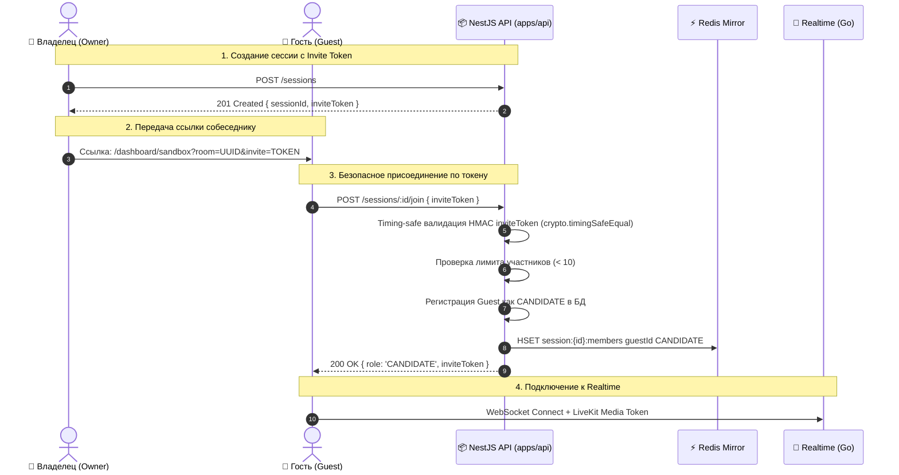

# Задачи: Безопасность Join Flow в Sandbox, WebRTC Cleanup и Синхронизация Realtime

Документ описывает устранение проблем и рисков, выявленных в ходе Senior Code Review: безопасная авторизация участников при присоединении по инвайт-ссылке в Sandbox, защита от Timing Attacks, сохранение токена инвайта владельцем, ограничение вместимости комнаты, предотвращение утечки Web Audio API контекстов и устранение риска рассинхронизации состояния редактора.

---

## 1. Описание проблем и архитектурных требований

### 1.1. Блокировка присоединения по ссылке в Sandbox и защита от Timing Attacks (CWE-862, CWE-208)
- **Проблема:** После ужесточения `POST /sessions/:id/join` метод требует обязательного наличия пользователя в таблице `interview_participants`. Однако в Sandbox совместный режим реализован через шеринг ссылки (`/dashboard/sandbox?room=<sessionId>`). При переходе по ссылке второй пользователь получает `403 Forbidden` и не может войти в сессию, так как владелец не добавлял его `userId` вручную.
- **Решение:** Внедрить криптографический механизм инвайт-токенов (HMAC Capability Token):
  - `inviteToken` генерируется как детерминированный HMAC SHA-256 от `sessionId` на секрете `JWT_ACCESS_SECRET`.
  - При `POST /sessions` и при успешном `POST /sessions/:id/join` для участников бэкенд возвращает `{ sessionId, inviteToken }` / `{ role, inviteToken }`. Это гарантирует, что владелец сессии всегда имеет актуальный `inviteToken` даже после перезагрузки страницы или перехода из закладок.
  - **Защита от Timing Attacks ([CWE-208](https://cwe.mitre.org/data/definitions/208.html)):** Валидация токена выполняется через `crypto.timingSafeEqual(Buffer.from(expectedHex, 'hex'), Buffer.from(receivedHex, 'hex'))` с предварительной проверкой равенства длин буферов.
  - **Лимит участников (Mesh Overload / DoS Protection):** Перед регистрацией нового участника проверяется лимит комнаты (`MAX_SESSION_PARTICIPANTS = 10`). При превышении выбрасывается `403 Forbidden ("Interview session is full")`.
  - Если пользователь уже является участником — он входит напрямую. Если пользователь новый, но предоставил валидный `inviteToken` (и лимит не превышен) — он безопасно регистрируется как `CANDIDATE`. Прямой подбор UUID без токена отклоняется с `403 Forbidden`.

### 1.2. Обратная совместимость и опциональность DTO в `POST /sessions/:id/join`
- **Проблема:** Если схема запроса `POST /sessions/:id/join` потребует обязательного тела, существующие вызовы без параметров (например, повторный вход владельца или вызовы из тестов) завершатся ошибкой `400 Bad Request`.
- **Решение:** Схема `joinSessionSchema` объявляется с поддержкой опционального тела по умолчанию:
  ```typescript
  export const joinSessionSchema = z
    .object({
      inviteToken: z.string().optional(),
    })
    .optional()
    .default({});
  ```
  Это гарантирует, что запросы без `body` или с `{}` проходят валидацию штатно, а генератор клиентов Orval формирует опциональный параметр `joinSessionDto?: JoinSessionDto`.

### 1.3. Утечка ресурсов Web Audio API (`syntheticAudioCtxRef`) и дескрипторов треков в `useWebRTC.ts`
- **Проблема:** При создании синтетического аудиопотока создается `AudioContext` (`syntheticAudioCtxRef.current = audioCtx`), который не освобождается при размонтировании компонента или завершении работы хука. Браузер имеет лимит на количество активных аудиоконтекстов (6–8 на вкладку), превышение которого вызывает сбой WebRTC. Кроме того, закрытие контекста без предварительного `.stop()` на `MediaStreamTrack` оставляет зависшие дескрипторы в браузере.
- **Решение:** В cleanup-функцию `useEffect` хука `useWebRTC` добавить остановку всех треков (`localStreamRef.current?.getTracks().forEach(t => t.stop())`, `screenTrackRef.current?.stop()`), закрытие `pcRef.current` и гарантированный вызов `audioCtx.close()`:
  ```typescript
  if (syntheticAudioCtxRef.current && syntheticAudioCtxRef.current.state !== "closed") {
    void syntheticAudioCtxRef.current.close();
    syntheticAudioCtxRef.current = null;
  }
  ```

### 1.4. Реконсиляция кода и устранение устаревшего буфера (`pendingCodeRef`) в `useSandboxRealtime.ts`
- **Проблема:** Если `requestId` в сообщении `code.update` сгенерирован сервером заново и не совпадает с клиентским, `pendingCodeRef` может не очиститься и при последующем реконнекте повторно отправить устаревший локальный код, затерев актуальные правки. Если при реконнекте сервер уже содержит актуальный код клиента, повторная отправка создает лишний трафик и риск коллизий.
- **Решение:** При получении `room.sync`:
  - Если `pendingCodeRef.current.code === serverCodeState.content` — локальный буфер сбрасывается (`pendingCodeRef.current = null`), так как сервер уже синхронизирован.
  - Если код отличается — локальное неподтверждённое изменение досылается на сервер.

---

## 2. Архитектура решения



---

## 3. План реализации задач

### 🛠️ Backend Tasks (`apps/api`, `packages/dto`, `packages/api`)

- [x] **1. DTO для создания и присоединения к сессии с Invite Token**
  - **Файл:** `packages/dto/src/sessions/join-session.dto.ts`
  - Добавить `joinSessionSchema` / `JoinSessionDto` (`{ inviteToken?: string }`, опциональный по умолчанию).
  - Обновить `JoinSessionResponseDto` (`{ role: InterviewParticipantRole, inviteToken: string }`).
  - Обновить `CreateSessionResponseDto` (`{ sessionId: string, inviteToken: string }`).

- [x] **2. Генерация и timing-safe валидация HMAC Invite Token в `SessionsService`**
  - **Файл:** `apps/api/src/modules/sessions/sessions.service.ts`
  - Реализовать детерминированную генерацию HMAC-токена `generateInviteToken(sessionId: string): string` на основе `jwt.accessSecret`.
  - Реализовать валидацию `validateInviteToken(sessionId: string, token: string): boolean` через `crypto.timingSafeEqual`.
  - Добавить константу `MAX_SESSION_PARTICIPANTS = 10`.
  - В `createSession`: возвращать `{ sessionId, inviteToken }`.
  - В `joinSession(sessionId, userId, body?: JoinSessionDto)`:
    - Если пользователь уже в `participants` — возвращать `{ role: existingParticipant.role, inviteToken }`.
    - Если пользователь новый:
      - Проверять лимит `fresh.participants.length < MAX_SESSION_PARTICIPANTS` (10).
      - Проверять `validateInviteToken(sessionId, body?.inviteToken)`.
      - При успехе — регистрировать как `CANDIDATE` в БД и Redis, возвращать `{ role: 'CANDIDATE', inviteToken }`.
      - При невалидном токене / отсутствии — `403 Forbidden ("User is not invited to this interview session")`.

- [x] **3. Обновление эндпоинтов в `SessionsController`**
  - **Файл:** `apps/api/src/modules/sessions/sessions.controller.ts`
  - Принимать `@Body(new ZodValidationPipe(joinSessionSchema))` в `@Post(":id/join")`.
  - Обновить Swagger аннотации для схем ответа 200/201/403.

- [x] **4. Регенерация OpenAPI и клиентов API**
  - `pnpm --filter api generate:openapi`
  - `pnpm run generate:client`

- [x] **5. Unit-тесты для бэкенда**
  - **Файл:** `apps/api/src/modules/sessions/sessions.service.spec.ts`
  - Проверить: генерацию токена, timing-safe валидацию, успешный вход с токеном, вход существующего участника (с возвратом токена), отказ при невалидном токене, отказ при переполнении комнаты (`>= MAX_PARTICIPANTS`).

---

### 🎨 Frontend Tasks (`apps/web`)

- [x] **6. Освобождение `AudioContext`, треков и `RTCPeerConnection` в `useWebRTC.ts`**
  - **Файл:** `apps/web/src/features/sandbox/lib/useWebRTC.ts`
  - В cleanup-функции хука останавливать медиатреки (`localStream`, `screenTrack`), закрывать `RTCPeerConnection` и вызывать `audioCtx.close()`.

- [x] **7. Синхронизация и реконсиляция `pendingCodeRef` в `useSandboxRealtime.ts`**
  - **Файл:** `apps/web/src/features/sandbox/lib/useSandboxRealtime.ts`
  - Сбрасывать `pendingCodeRef` при получении `room.sync` (если серверный код идентичен) и при `system.ack`.

- [x] **8. Универсальный URL-билдер `@packages/utils`, `buildAppUrl` и интеграция в Sandbox**
  - **Файл:** `packages/utils/src/url.ts` (и экспорт в `packages/utils/src/index.ts`)
    - Реализовать универсальную функцию `buildUrl(baseUrl, pathname, optionsOrParams)` с поддержкой:
      - нормализации слешей и объединения путей;
      - динамических параметров запроса (`queryParams` с поддержкой примитивов, массивов и фильтрацией пустых/`undefined` значений);
      - хэш-фрагментов (`hash`);
      - корректной обработки уже абсолютных путей.
    - Добавить unit-тесты `packages/utils/src/url.test.ts`.
  - **Файл:** `apps/web/src/shared/lib/url.ts`
    - Реализовать функцию `getAppUrl()` (чтение `NEXT_PUBLIC_APP_URL` с fallback на `window.location.origin` / `http://localhost:3000`).
    - Экспортировать универсальный `buildAppUrl(pathname, optionsOrParams)` для построения любых абсолютных ссылок в приложении (инвайты, сессии, уведомления, шаринг).
  - **Файл:** `apps/web/src/features/sandbox/ui/SandboxRoom.tsx`
    - Извлекать `invite` из `searchParams` (`searchParams.get("invite")`) и передавать в `sessionsControllerJoinSession(roomParam, { inviteToken })`.
    - Сохранять полученный `inviteToken` в состоянии компонента и передавать в `onSessionReady`.
    - При создании сессии сохранять `invite` в URL (`?room=${sessionId}&invite=${inviteToken}`).
  - **Файл:** `apps/web/src/features/sandbox/model/SandboxMediaContext.tsx`
    - Заменить прямое использование `window.location.origin` на универсальный вызов `buildAppUrl(pathname, { room: roomId, invite: inviteToken })`.

- [x] **9. Верификация и тестирование**
  - `pnpm test:api`
  - `pnpm test:web`
  - `pnpm lint`
