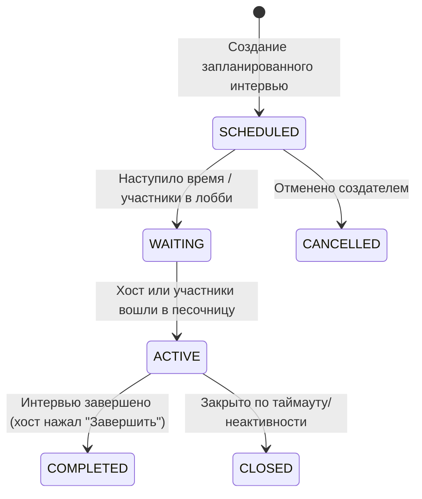
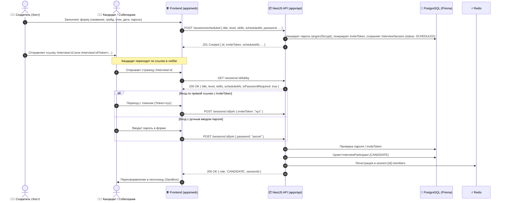

# Задачи: Планируемые интервью (Scheduled Interviews)

Данный документ описывает функционал создания и проведения запланированных mock-интервью в MockInterviewAI: форму создания с выбором грейда, стека технологий, даты/времени, опциональной защитой паролем/invite-ссылкой, залом ожидания (Pre-join lobby) и напоминаниями.

---

## 1. Контекст и цели

### Текущее состояние
В платформе реализована совместная песочница (`Sandbox`), работающая в ad-hoc режиме: пользователь создает сессию и сразу подключается к коду и WebRTC звонку.

### Цель фичи
Дать пользователям возможность заранее планировать и настраивать собеседования:
1. Задавать метаданные: название, специализацию (`Specialization`), грейд (`ExperienceLevel`), стек технологий/библиотек (`skills: string[]`).
2. Планировать дату, время старта и длительность с учетом часовых поясов.
3. Обеспечивать приватность: защита сессии паролем или вход по уникальному invite-токену.
4. Предоставлять Pre-join лобби (проверка микрофона/камеры, таймер обратного отсчета до старта, ввод пароля).
5. Напоминать участникам о предстоящем событии (через Telegram-бота и системные уведомления платформы).

---

## 2. Архитектура решения

### 2.1 Жизненный цикл сессии (Lifecycle)



### 2.2 Флоу создания и входа (Join Flow с паролем и Invite Token)



---

## 3. Модель данных (Prisma Schema)

Изменения в `apps/api/prisma/schema.prisma`:

### Расширение `InterviewSessionStatus`
```prisma
enum InterviewSessionStatus {
  SCHEDULED // Запланировано, ожидает времени старта
  WAITING   // Комната открыта, участники собираются в лобби
  ACTIVE    // Идет в реальном времени
  COMPLETED // Завершено создателем
  CANCELLED // Отменено
  CLOSED    // Закрыто системой по таймауту
}
```

### Расширение `InterviewSession`
```prisma
model InterviewSession {
  id              String                 @id @default(uuid()) @db.Uuid
  userId          String                 @db.Uuid // Владелец/хост сессии
  user            User                   @relation(fields: [userId], references: [id], onDelete: Cascade)
  
  title           String                 @db.VarChar(120)
  description     String?                @db.VarChar(500)
  
  specialization  Specialization?        // FRONTEND, BACKEND, FULLSTACK и т.д.
  level           ExperienceLevel?       // JUNIOR, MIDDLE, SENIOR, LEAD
  skills          String[]               @default([]) // ["React", "TypeScript", "Next.js"]
  
  scheduledAt     DateTime?              // Дата и время старта (UTC)
  durationMinutes Int                    @default(60) // Длительность в минутах
  
  isPrivate       Boolean                @default(false)
  passwordHash    String?                @map("password_hash") // Хеш пароля (если null — доступ открыт)
  inviteToken     String                 @unique @default(uuid()) @map("invite_token") // Быстрый доступ без ввода пароля
  
  status          InterviewSessionStatus @default(ACTIVE)
  startedAt       DateTime?
  endedAt         DateTime?
  createdAt       DateTime               @default(now())
  updatedAt       DateTime               @updatedAt

  participants    InterviewParticipant[]

  @@index([userId])
  @@index([status, scheduledAt])
  @@index([inviteToken])
  @@map("interview_sessions")
}
```

---

## 4. API Контракты

### 4.1 Создание запланированного интервью
`POST /sessions/scheduled`
* **Auth**: Bearer Token
* **Request Body** (`CreateScheduledSessionDto`):
  ```typescript
  {
    title: string;              // min 3, max 120
    description?: string;       // max 500
    specialization?: Specialization;
    level?: ExperienceLevel;
    skills?: string[];          // max 15 элементов
    scheduledAt: string;        // ISO 8601 UTC дата в будущем
    durationMinutes?: number;   // default: 60, min: 15, max: 240
    password?: string;          // optional, min 4, max 64 символов
  }
  ```
* **Response** (`ScheduledSessionDto`):
  ```typescript
  {
    id: string;
    title: string;
    description?: string;
    specialization?: Specialization;
    level?: ExperienceLevel;
    skills: string[];
    scheduledAt: string;
    durationMinutes: number;
    hasPassword: boolean;
    inviteToken: string;
    status: InterviewSessionStatus;
    createdAt: string;
  }
  ```

### 4.2 Получение информации для лобби (публичный/полупубличный статус)
`GET /sessions/:id/lobby`
* **Auth**: Optional (или Bearer Token)
* **Response** (`SessionLobbyDto`):
  ```typescript
  {
    id: string;
    title: string;
    description?: string;
    specialization?: Specialization;
    level?: ExperienceLevel;
    skills: string[];
    scheduledAt: string | null;
    durationMinutes: number;
    status: InterviewSessionStatus;
    host: {
      id: string;
      displayName: string | null;
      username: string | null;
      avatarUrl: string | null;
    };
    isPasswordRequired: boolean;
    isParticipant: boolean;
    myRole?: InterviewParticipantRole;
  }
  ```

### 4.3 Присоединение к сессии (расширение существующего Join Flow)
`POST /sessions/:id/join`
* **Auth**: Bearer Token
* **Request Body** (`JoinSessionDto`):
  ```typescript
  {
    password?: string;
    inviteToken?: string;
  }
  ```
* **Rules**:
  1. Если пользователь — создатель (`userId === session.userId`), пускает без пароля с ролью `INTERVIEWER`.
  2. Если пользователь уже есть в `InterviewParticipant`, пускает с его ролью.
  3. Если у сессии есть `passwordHash`:
     - Если передан валидный `inviteToken`, пускает.
     - Если передан корректный `password` (проверка через хеш), пускает.
     - Иначе `403 Forbidden ("Invalid session password or invite token")`.
  4. Добавляет в БД с ролью `CANDIDATE` (или `OBSERVER`, если задано) и синхронизирует с Redis.

### 4.4 Список моих запланированных интервью
`GET /sessions/my-scheduled?status=upcoming|past`
* Возвращает список запланированных интервью, где пользователь является создателем или зарегистрированным участником.

---

## 5. Frontend Архитектура (`apps/web`)

### FSD Структура:
- `src/features/schedule-interview/` — форма и модальное окно создания запланированного интервью.
  - `ui/ScheduleInterviewModal.tsx` / `ScheduleInterviewForm.tsx`
  - `model/useScheduleInterview.ts`
- `src/features/interview-lobby/` — экран ожидания перед входом в песочницу:
  - `ui/InterviewLobbyView.tsx` (таймер обратного отсчета, инфо о стеке/грейде, форма ввода пароля).
  - `ui/PreFlightDeviceCheck.tsx` (проверка микрофона, камеры и динамиков на базе `useWebRTC`).
- `src/entities/session/` — карточки и хуки отображения запланированных интервью:
  - `ui/ScheduledSessionCard.tsx` (бейдж грейда, теги библиотек, время, кнопки «Добавить в календарь», «Скопировать ссылку», «Войти»).

### UX сценарии:
1. **Календарь и время**:
   - Выбор времени в локальной таймзоне пользователя с подсказкой часового пояса (например: `Europe/Moscow (UTC+3)`).
   - Генерация ссылки `Добавить в Google Calendar` и скачивание `.ics` файла.
2. **Защита паролем**:
   - Переключатель «Требовать пароль для входа».
   - Кнопка быстрого копирования защищенной invite-ссылки: `https://mockinterview.ai/sandbox/:id?token=xyz` (для удобной отправки кандидату без необходимости отдельно пересылать пароль).
3. **Lobby / Waiting Room**:
   - Если интервью назначено на будущее, пользователь попадает на экран лобби с обратным отсчетом.
   - За 5-10 минут до начала кнопка «Войти в песочницу» становится активной.

---

## 6. План задач для реализации

### Этап 1: Backend & База Данных (`apps/api`, `packages/dto`, `packages/api`)
- [ ] **1. Миграция Prisma**:
  - Обновить `InterviewSessionStatus` (`SCHEDULED`, `WAITING`, `COMPLETED`, `CANCELLED`).
  - Добавить в `InterviewSession` поля: `title`, `description`, `scheduledAt`, `durationMinutes`, `level`, `specialization`, `skills`, `passwordHash`, `inviteToken`, `isPrivate`.
  - Выполнить миграцию базы данных.
- [ ] **2. DTO и валидация (`packages/dto`)**:
  - Создать `CreateScheduledSessionDto`, `SessionLobbyDto`, обновить `JoinSessionDto` (добавить `password?`, `inviteToken?`).
  - Экспортировать в `packages/dto/src/index.ts`.
- [ ] **3. Логика хэширования и проверки пароля (`apps/api`)**:
  - Использовать существующий сервис хэширования (`bcrypt` / `argon2`) для `passwordHash`.
- [ ] **4. Методы сервиса `SessionsService`**:
  - Метод `createScheduledSession(userId, dto)`.
  - Метод `getSessionLobby(sessionId, currentUserId?)`.
  - Обновить `joinSession(sessionId, userId, dto)` с валидацией пароля и `inviteToken`.
  - Метод `getMyScheduledSessions(userId, filter)`.
- [ ] **5. Контроллер `SessionsController`**:
  - Добавить эндпоинты `POST /sessions/scheduled`, `GET /sessions/:id/lobby`, `GET /sessions/my-scheduled`.
- [ ] **6. Генерация API-клиента**:
  - Выполнить `pnpm --filter api generate:openapi` и `pnpm --filter @packages/api generate`.

### Этап 2: Frontend (`apps/web`)
- [ ] **7. Форма создания запланированного интервью**:
  - Поля: Название, Специализация, Грейд, Теги технологий (мультиселект), Дата и время, Длительность, Чекбокс пароля + поле пароля.
  - Интеграция с API мутацией создания.
- [ ] **8. Экран ожидания и ввода пароля (Lobby)**:
  - Компонент страницы `/sandbox/[id]` или отдельный `/interview/[id]/lobby`.
  - Карточка с информацией о собеседовании (тема, грейд, стек, хост).
  - Таймер обратного отсчета до `scheduledAt`.
  - Форма ввода пароля (если сессия защищена и токен не передан в URL).
  - Тест микрофона и камеры перед входом.
- [ ] **9. Список запланированных интервью в личном кабинете**:
  - Вкладка «Запланированные интервью» в Dashboard.
  - Кнопка «Скопировать invite-ссылку», «Экспорт в календарь» (`.ics` / Google Calendar).

### Этап 3: Уведомления и фоновые задачи (Follow-up)
- [ ] **10. Напоминания о предстоящих интервью**:
  - Интеграция с Telegram-ботом: отправка сообщения со ссылкой за 24 часа и за 15 минут до старта.
  - Системное уведомление в Notification Center платформы.
- [ ] **11. Автоматический перевод статусов**:
  - Cron/Job для перевода просроченных сессий, которые так и не были запущены, в статус `EXPIRED`/`CANCELLED`.
