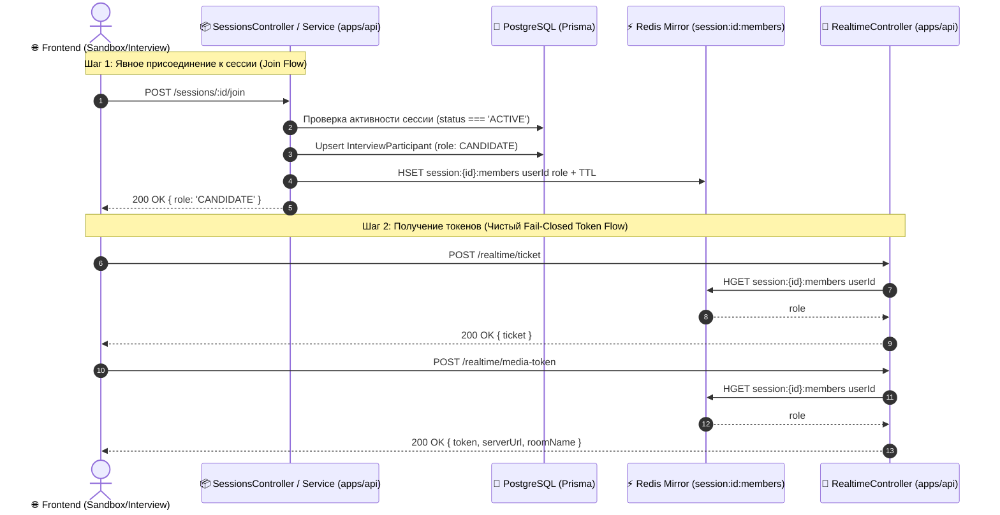

# Задачи: Явный Join Flow сессий и разделение авторизации Realtime

Данный документ описывает задачу по устранению неявной мутации БД в `RealtimeController` (`role = InterviewParticipantRole.CANDIDATE`), реализации явного эндпоинта `POST /sessions/:id/join` в `apps/api` и интеграции присоединения к сессии в `apps/web` (Sandbox / Interview).

---

## 1. Контекст и проблема

### Текущее состояние (Антипаттерн)
В `apps/api/src/modules/realtime/realtime.controller.ts` методы `getTicket` и `getMediaToken` выполняли регистрацию пользователя:
```typescript
let role = await this.redisService.hget(membersKey, userId);
if (!role) {
  try {
    await this.sessionsService.addParticipant(
      sessionId,
      userId,
      InterviewParticipantRole.CANDIDATE,
    );
    role = InterviewParticipantRole.CANDIDATE;
  } catch {
    throw new ForbiddenException("User is not a participant of this interview session");
  }
}
```

### Почему это проблема:
1. **Нарушение Single Responsibility (SRP):** Контроллер токенов (`RealtimeController`) должен быть чистым и быстрым шлюзом авторизации (fail-closed проверка Redis-зеркала), а не мутировать таблицы PostgreSQL.
2. **Race Condition & Двойные записи:** При одновременном запросе WebSocket-тикета и LiveKit media-токена оба запроса параллельно вызывали `addParticipant` в БД.
3. **Безопасность (Bypass ACL):** Любой пользователь со ссылкой автоматически становился `CANDIDATE` в БД без валидации бизнес-правил сессии.

---

## 2. Архитектура решения



---

## 3. Список задач

### 🛠️ Backend Tasks (`apps/api`, `packages/dto`, `packages/api`)

- [ ] **1. Добавить DTO для ответа Join Session**
  - **Файл:** `packages/dto/src/sessions/join-session.dto.ts`
  - Описать `JoinSessionResponseDto` (`{ role: InterviewParticipantRole }`).
  - Экспортировать в `packages/dto/src/index.ts`.

- [ ] **2. Реализовать метод `joinSession` в `SessionsService`**
  - **Файл:** `apps/api/src/modules/sessions/sessions.service.ts`
  - Проверять существование и активность сессии (`status !== "CLOSED"`).
  - Если пользователь уже участник — возвращать его существующую роль без ошибок.
  - Если новый участник — добавлять в Postgres (`InterviewParticipantRole.CANDIDATE`) и записывать в Redis-зеркало `session:<id>:members`.

- [ ] **3. Добавить эндпоинт `POST /sessions/:id/join` в `SessionsController`**
  - **Файл:** `apps/api/src/modules/sessions/sessions.controller.ts`
  - Добавить декораторы `@Post(":id/join")`, `@ApiOperation`, `@ApiParam`, `@ApiResponse`.
  - Принимать `id` (UUID сессии) и `@CurrentUser("sub") userId`.

- [ ] **4. Очистить `RealtimeController` от мутаций БД**
  - **Файл:** `apps/api/src/modules/realtime/realtime.controller.ts`
  - Удалить вызовы `this.sessionsService.addParticipant(...)` из методов `getTicket` и `getMediaToken`.
  - Сделать контроллер строго fail-closed: если `!role` в Redis, выбрасывать `ForbiddenException("User is not a participant of this interview session")`.

- [ ] **5. Сгенерировать OpenAPI и клиент API**
  - Запустить `pnpm --filter api generate:openapi`.
  - Запустить `pnpm --filter @packages/api generate`.

- [ ] **6. Unit-тесты для бэкенда**
  - **Файл:** `apps/api/src/modules/sessions/sessions.service.spec.ts` — добавить тесты `joinSession` (успешный вход, повторный вход, ошибка при закрытой сессии).
  - **Файл:** `apps/api/src/modules/realtime/realtime.controller.spec.ts` — проверить `403 Forbidden` для неучастников.

---

### 🎨 Frontend Tasks (`apps/web`)

- [ ] **7. Интеграция `sessionsControllerJoinSession` в `SandboxRoom`**
  - **Файл:** `apps/web/src/features/sandbox/ui/SandboxRoom.tsx`
  - При монтировании компонента, если в URL присутствует `?room=<sessionId>`:
    ```typescript
    useEffect(() => {
      const fromUrl = searchParams.get("room");
      const token = authToken.get();
      if (!token) return;

      if (fromUrl) {
        sessionsControllerJoinSession(fromUrl).catch((err) => {
          console.error("[Sandbox] Failed to join session:", err);
        });
      } else {
        sessionsControllerCreateSession().then((res) => {
          if (res?.sessionId) {
            setRoomId(res.sessionId);
            const params = new URLSearchParams(searchParams.toString());
            params.set("room", res.sessionId);
            router.replace(`${pathname}?${params.toString()}`);
          }
        });
      }
    }, [searchParams, pathname, router]);
    ```

- [ ] **8. Верификация и тестирование**
  - Запустить `pnpm --filter web test` и `pnpm --filter api test`.
  - Проверить сценарий подключения по инвайт-ссылке между двумя разными пользователями/вкладками.

---

## 4. Критерии приемки (Acceptance Criteria)

1. `RealtimeController` не содержит вызовов `SessionsService` и не выполняет мутаций PostgreSQL/Prisma.
2. Неавторизованный или незарегистрированный в сессии пользователь получает `403 Forbidden` при прямом запросе к `/realtime/ticket` или `/realtime/media-token`.
3. При переходе по ссылке `/dashboard/sandbox?room=<sessionId>` клиент вызывает `POST /sessions/:id/join`, регистрируется в сессии и успешно подключается к WebRTC и WebSocket.
4. Все unit-тесты бэкенда и фронтенда проходят без ошибок.
