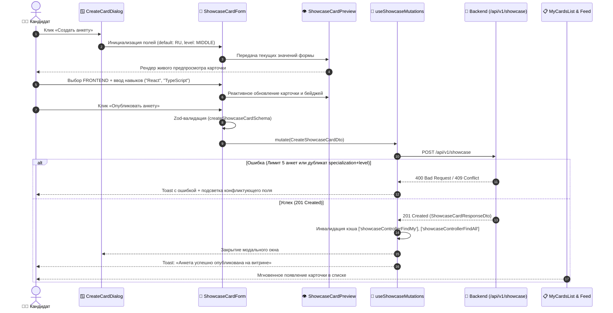

# Задачи: Фронтенд витрины кандидатов и создание анкеты (Showcase Frontend)

Данный документ содержит полную техническую спецификацию, архитектуру компонентов, интерфейсы, состояние и детальную декомпозицию задач для разработки клиентской части витрины карточек кандидатов (**Showcase**) и модуля создания/управления анкетой в приложении **`apps/web`** (Next.js App Router, архитектура **FSD**), с использованием дизайн-системы **`@packages/ui`**, векторных иконок **`@packages/icons`**, типизированного API клиента **`@packages/api`** (TanStack Query) и мультиязычности **`@packages/i18n`**.

---

## 1. Архитектурная концепция и UX-принципы

Витрина кандидатов (`Showcase`) — ключевой инструмент поиска партнеров для взаимных mock-интервью (P2P), тренировки алгоритмов и System Design.

1. **Мгновенный Live Preview при создании анкеты:**
   - Кандидат заполняет форму (специализация, грейд, навыки, bio, расписание) и параллельно видит интерактивную карточку в реальном времени точно так же, как её увидят другие пользователи в каталоге.
2. **Умный ввод навыков (Smart Tag Input):**
   - Интеграция готового компонента `TagInput` из `@packages/ui` с динамическими быстрыми подсказками популярных технологий в зависимости от выбранной специализации (например: Frontend -> React, TypeScript, Next.js, Redux, Tailwind).
3. **Строгая валидация и защита от ошибок:**
   - Проверка заполненности профиля (`displayName`, `username`) перед созданием;
   - Защита от дубликатов: отображение предупреждения, если активная анкета с такой же парой `specialization + level` уже существует;
   - Индикатор лимита анкет (максимум 5 активных карточек на пользователя);
   - Санитизация HTML и ограничение длины полей в соответствии с `createShowcaseCardSchema` из `@packages/dto`.
4. **Управление жизненным циклом карточки:**
   - Поднятие в топ (`bump`) 1 раз в 24 часа с тикающим таймером кулдауна;
   - Автопродление (`autoRenew`) и ручное продление на 15 дней (`renew`);
   - Переключение видимости (`ACTIVE` ↔ `INACTIVE`);
   - Статистика просмотров и откликов для каждой анкеты автора (`GET /showcase/my`).
5. **Премиальный UI и адаптивность:**
   - Адаптивная сетка карточек, плавная анимация бейджей (молния срочности ⚡ `isUrgent`, цветовая дифференциация грейдов);
   - Изолированные скелетоны загрузки без скачков верстки (CLS = 0).

---

## 2. Диаграмма жизненного цикла создания и публикации анкеты



---

## 3. Структура файлов в монорепозитории (`apps/web` по FSD)

```text
apps/web/src/
├── app/
│   └── (protected)/
│       └── dashboard/
│           └── partners/                           # Роут paths.partners
│               ├── page.tsx                        # Каталог витрины + кнопка «Создать анкету»
│               ├── my/                             # Страница управления своими анкетами
│               │   └── page.tsx
│               ├── loading.tsx                     # Скелетон витрины
│               └── layout.tsx                      # Табы навигации: «Каталог» | «Мои анкеты»
│
├── entities/
│   └── showcase-card/                              # Слой бизнес-сущности карточки
│       ├── api/
│       │   ├── useMyShowcaseCards.ts               # GET /showcase/my (хук списка своих анкет)
│       │   ├── useShowcaseCatalog.ts               # GET /showcase (каталог с поиском и фильтрами)
│       │   └── showcaseQueryKeys.ts                # Централизованные ключи кэша
│       ├── model/
│       │   ├── types.ts                            # ShowcaseCardItemDto, карточные фильтры
│       │   └── constants.ts                        # Конфиг цветов уровней, иконки стеков
│       └── ui/
│           ├── ShowcaseCard.tsx                    # Основная карточка кандидата
│           ├── ShowcaseCardSkeleton.tsx            # Скелетон карточки
│           ├── LevelBadge.tsx                      # Бейдж грейда (Junior/Middle/Senior/Lead)
│           ├── SpecializationBadge.tsx             # Бейдж стека с иконкой направления
│           ├── LanguageBadge.tsx                   # Бейдж языка собеседования (RU/EN/ANY)
│           └── UrgentBadge.tsx                     # Бейдж ⚡ «Готов сегодня»
│
├── features/
│   └── manage-showcase-card/                       # Создание, редактирование и действия с анкетой
│       ├── model/
│       │   ├── showcase-form-schema.ts             # Zod-схема формы с i18n валидацией
│       │   ├── use-showcase-mutations.ts           # Мутации create, update, bump, renew, status, delete
│       │   ├── use-skill-suggestions.ts            # Быстрые подсказки навыков по стеку
│       │   └── types.ts                            # ShowcaseFormValues
│       ├── ui/
│       │   ├── CreateCardDialog.tsx                # Модальное окно создания анкеты
│       │   ├── EditCardDialog.tsx                  # Модальное окно редактирования анкеты
│       │   ├── ShowcaseCardForm.tsx                # Поля формы (двухколоночный UI)
│       │   ├── ShowcaseCardLivePreview.tsx         # Живой предпросмотр заполняемой анкеты
│       │   ├── BumpCardButton.tsx                  # Кнопка поднятия в топ с таймером кулдауна
│       │   ├── CardStatusToggle.tsx                # Переключатель ACTIVE ↔ INACTIVE
│       │   └── DeleteCardConfirmDialog.tsx         # Подтверждение удаления анкеты
│       └── index.ts
│
├── widgets/
│   ├── showcase-feed/                              # Каталог анкет с фильтрами и поиском
│   │   ├── ui/
│   │   │   ├── ShowcaseFeed.tsx                    # Сетка анкет с пагинацией/бесконечной лентой
│   │   │   ├── ShowcaseFiltersBar.tsx              # Фильтры: специализация, грейд, язык, urgent
│   │   │   ├── ShowcaseSearchBar.tsx               # Поисковая строка с подсказками (+react -vue)
│   │   │   └── ShowcaseEmptyState.tsx              # Заглушка, если ничего не найдено
│   │   └── index.ts
│   │
│   └── my-cards-list/                              # Список анкет текущего пользователя
│       ├── ui/
│       │   ├── MyCardsList.tsx                     # Список карточек со статистикой и лимитом 5 анкет
│       │   ├── MyCardItem.tsx                      # Карточка владельца с кнопками Bump/Edit/Status
│       │   └── ShowcaseLimitBanner.tsx             # Прогресс-бар лимита активных анкет (напр. 2/5)
│       └── index.ts
│
└── shared/
    └── config/
        └── paths.ts                                # paths.partners, paths.partnersMy
```

---

## 4. Детализация слоев и компонентов

### 4.1. Слой сущности: `entities/showcase-card`

* **`ShowcaseCard.tsx`:**
  * Отображает имя кандидата (`displayName`), никнейм (`@username`), аватар (с fallback-инициалами);
  * Заголовок анкеты (`title`) или авто-заголовок вида: `Middle Frontend Developer`;
  * Бейджи: `LevelBadge` (цветовая гамма: Junior — зеленый, Middle — синий, Senior — фиолетовый, Lead — янтарный), `SpecializationBadge`, `LanguageBadge`, `UrgentBadge` (анимированная пульсация);
  * Навыки: горизонтальный список чипов навыков с ограничением строк и счетчиком `+N еще`;
  * Описание (`bio`) с ограничением до 3 строк (line-clamp);
  * Расписание (`scheduleInfo`) с иконкой часов;
  * Кнопка основного действия: «Откликнуться» / «Предложить интервью» (для чужих анкет) или «Управление» (для своей).

* **`ShowcaseCardSkeleton.tsx`:**
  * Повторяет форму карточки с использованием `<Skeleton className="h-6 w-3/4" />` из `@packages/ui`.

---

### 4.2. Слой фичи: `features/manage-showcase-card`

#### 4.2.1. Схема формы и валидация (`showcase-form-schema.ts`)
```typescript
import { z } from "zod";
import {
  experienceLevelEnum,
  interviewLanguageEnum,
  specializationEnum,
} from "@packages/dto";
import type { TFunction } from "i18next";

export const createShowcaseFormSchema = (t: TFunction) =>
  z.object({
    specialization: specializationEnum,
    level: experienceLevelEnum,
    language: interviewLanguageEnum.default("RU"),
    skills: z
      .array(z.string().trim().min(1).max(30))
      .min(1, t("showcase.form.errors.skillsMin"))
      .max(20, t("showcase.form.errors.skillsMax")),
    title: z
      .string()
      .trim()
      .max(100, t("showcase.form.errors.titleMax"))
      .optional()
      .or(z.literal("")),
    bio: z
      .string()
      .trim()
      .max(500, t("showcase.form.errors.bioMax"))
      .optional()
      .or(z.literal("")),
    scheduleInfo: z
      .string()
      .trim()
      .max(300, t("showcase.form.errors.scheduleMax"))
      .optional()
      .or(z.literal("")),
    isUrgent: z.boolean().default(false),
    autoRenew: z.boolean().default(false),
  });

export type ShowcaseFormValues = z.infer<ReturnType<typeof createShowcaseFormSchema>>;
```

#### 4.2.2. Мутации (`use-showcase-mutations.ts`)
* Обёртка над API клиентом:
  * `createMutation`: вызов `showcaseControllerCreate` с автоматической инвалидацией:
    * `['showcaseControllerFindMy']`
    * `['showcaseControllerFindAll']`
    * `['dashboard']` (для обновления статуса витрины в `DashboardShowcaseBanner`)
  * `updateMutation`: вызов `showcaseControllerUpdate`;
  * `bumpMutation`: вызов `showcaseControllerBump` (поднятие в топ);
  * `renewMutation`: вызов `showcaseControllerRenew` (ручное продление);
  * `statusMutation`: вызов `showcaseControllerUpdateStatus` (`ACTIVE` / `INACTIVE`);
  * `deleteMutation`: вызов `showcaseControllerDelete`.
* Интеграция с `useToast` для показа информативных сообщений об успехе и ошибках (например, при 409 — «Анкета с такой специализацией и уровнем уже опубликована»).

#### 4.2.3. Компоненты UI формы:
* **`CreateCardDialog.tsx`:**
  * Диалоговое окно размером `max-w-4xl` с заголовком «Создание анкеты на витрине» и описанием;
  * Проверка готовности профиля: если `!user.displayName || !user.username`, диалог отображает предупреждающий баннер с кнопкой «Перейти в профиль»;
  * Двухколоночный layout (на десктопе):
    * **Левая колонка:** Форма ввода (специализация, грейд, язык, `TagInput` со списком тегов, заголовок, био, расписание, свитчи `isUrgent` и `autoRenew`);
    * **Правая колонка:** `ShowcaseCardLivePreview` — динамический рендер карточки с текущими данными формы и аватаром пользователя;
  * Кнопки футера: «Отмена» и «Опубликовать анкету» (с состоянием `isLoading`).

---

### 4.3. Слой виджетов: `widgets/showcase-feed` и `widgets/my-cards-list`

#### 4.3.1. `widgets/showcase-feed`:
* **`ShowcaseSearchBar.tsx`:**
  * Поле ввода с дебаунсом 300мс;
  * Тултип/поповер с подсказками по операторам поиска:
    * `+react` — обязательно содержит react;
    * `-vue` — исключить vue;
    * слова через пробел — свободный поиск.
* **`ShowcaseFiltersBar.tsx`:**
  * Быстрые селекты:
    * Специализация (`Все`, `Frontend`, `Backend`, `Fullstack`, `DevOps`, `QA`, `Mobile`, `Data/ML`, `System Design`);
    * Уровень (`Все`, `Junior`, `Middle`, `Senior`, `Lead`);
    * Язык (`Все`, `RU`, `EN`);
    * Чекбокс/кнопка-фильтр: ⚡ «Готов сегодня» (`isUrgent=true`);
    * Сортировка: «Сначала поднятые», «Новые», «По уровню (возр./убыв.)».
* **`ShowcaseFeed.tsx`:**
  * Сетка карточек (`grid grid-cols-1 md:grid-cols-2 xl:grid-cols-3 gap-4`);
  * Пагинация или кнопка «Загрузить еще» / Infinite Scroll;
  * Кнопка «Создать свою анкету» в пустом состоянии и в шапке каталога.

#### 4.3.2. `widgets/my-cards-list`:
* **`ShowcaseLimitBanner.tsx`:**
  * Индикатор активных карточек: `Активно: X из 5 анкет`;
  * Прогресс-бар и предупреждение при приближении к лимиту.
* **`MyCardItem.tsx`:**
  * Карточка с бейджем статуса (`ACTIVE`, `INACTIVE`, `EXPIRED`);
  * Блок статистики: 👁️ Просмотры: `stats.viewsCount`, 📬 Заявки: `stats.requestsCount`;
  * Действия:
    * **Bump:** кнопка «Поднять в топ» с таймером обратного отсчета до следующего доступного поднятия (если кулдаун активен);
    * **Статус:** тумблер видимости карточки;
    * **Редактировать:** открытие `EditCardDialog`;
    * **Продлить / Удалить.**

---

## 5. Локализация (`packages/i18n`)

Добавление ключей в `packages/i18n/src/locales/ru/showcase.json` и `en/showcase.json`:

```json
{
  "title": "Витрина кандидатов",
  "subtitle": "Найдите напарника для тренировочного собеседования по вашему стеку",
  "tabs": {
    "catalog": "Каталог кандидатов",
    "myCards": "Мои анкеты"
  },
  "createCard": "Создать анкету",
  "limits": {
    "activeCount": "Активно {{current}} из {{max}} анкет",
    "limitReached": "Вы достигли максимального лимита активных анкет (5)"
  },
  "form": {
    "title": "Создание анкеты на витрине",
    "editTitle": "Редактирование анкеты",
    "specializationLabel": "Специализация",
    "levelLabel": "Уровень (грейд)",
    "languageLabel": "Язык собеседования",
    "skillsLabel": "Ключевые навыки и стек",
    "skillsPlaceholder": "Введите навык и нажмите Enter...",
    "popularSkills": "Популярные навыки:",
    "cardTitleLabel": "Заголовок анкеты (опционально)",
    "cardTitlePlaceholder": "Например: Готовлюсь к собеседованию в BigTech",
    "bioLabel": "О себе и целях тренировки",
    "bioPlaceholder": "Расскажите о своем опыте, темах, которые хотите отработать...",
    "scheduleLabel": "Удобное время и формат",
    "schedulePlaceholder": "Например: Будни после 19:00 МСК, выходные в любое время",
    "urgentLabel": "Готов провести сегодня",
    "urgentDescription": "Анкета получит бейдж срочности и привлечет больше внимания",
    "autoRenewLabel": "Автоматическое продление",
    "autoRenewDescription": "Автоматически продлевать активность анкеты каждые 15 дней",
    "previewTitle": "Предпросмотр на витрине",
    "submitCreate": "Опубликовать анкету",
    "submitSave": "Сохранить изменения",
    "profileIncompleteWarning": "Для публикации анкеты необходимо заполнить имя и юзернейм в профиле.",
    "goToProfile": "Заполнить профиль"
  },
  "card": {
    "urgent": "Готов сегодня",
    "bump": "Поднять в топ",
    "bumpCooldown": "Доступно через {{time}}",
    "views": "Просмотров",
    "requests": "Откликов",
    "respond": "Предложить интервью"
  }
}
```

---

## 6. Декомпозиция задач (Checklist)

### Этап 1: Сущность карточки (`entities/showcase-card`)
- [x] **1.1. Базовые бейджи:**
  - `LevelBadge.tsx` (цветовая дифференциация грейдов);
  - `SpecializationBadge.tsx` (иконки направлений из `@packages/icons`);
  - `LanguageBadge.tsx` (`RU`, `EN`, `ANY`);
  - `UrgentBadge.tsx` (бейдж ⚡ со стилями подсветки).
- [x] **1.2. Карточка анкеты:**
  - `ShowcaseCard.tsx` (адаптивная верстка, обработка пустых полей, line-clamp bio);
  - `ShowcaseCardSkeleton.tsx` (скелетон загрузки).
- [x] **1.3. Тесты:**
  - Unit-тесты для `ShowcaseCard` и бейджей.

---

### Этап 2: Фича создания и управления анкетой (`features/manage-showcase-card`)
- [x] **2.1. Схема валидации и модели:**
  - `showcase-form-schema.ts` (Zod + i18n ошибки);
  - `use-skill-suggestions.ts` (подсказки популярных технологий по стеку).
- [x] **2.2. Хуки мутаций (`use-showcase-mutations.ts`):**
  - Интеграция с `@packages/api` (`create`, `update`, `bump`, `renew`, `status`, `delete`);
  - Оптимистичные обновления / точечная инвалидация кэша React Query;
  - Обработка ошибок (лимит 5 анкет, дубликат specialization+level, 400 профиль).
- [x] **2.3. UI компоненты формы:**
  - `ShowcaseCardForm.tsx` (интеграция `react-hook-form`, `TagInput` из `@packages/ui`, `Select`, `Switch`);
  - `ShowcaseCardLivePreview.tsx` (живой предпросмотр в реальном времени);
  - `CreateCardDialog.tsx` (модальное окно создания с двухколоночным layout и проверкой заполненности профиля);
  - `EditCardDialog.tsx` (редактирование существующей анкеты);
  - `BumpCardButton.tsx` (кнопка поднятия с таймером кулдауна 24ч);
  - `DeleteCardConfirmDialog.tsx` (модалка подтверждения удаления).
- [x] **2.4. Тесты:**
  - Unit-тесты схемы валидации;
  - Тесты формы и модального окна создания анкеты (`ShowcaseCardForm.test.tsx`, `CreateCardDialog.test.tsx`).

---

### Этап 3: Страницы и виджеты витрины (`widgets/` & `app/`)
- [x] **3.1. Виджет каталога (`widgets/showcase-feed`):**
  - `ShowcaseSearchBar.tsx` (дебаунс, тултип по операторам `+` и `-`);
  - `ShowcaseFiltersBar.tsx` (специализация, грейд, язык, срочность, сортировка);
  - `ShowcaseFeed.tsx` (сетка карточек, скелетоны, пагинация, пустые состояния);
  - `ShowcaseEmptyState.tsx`.
- [x] **3.2. Виджет своих анкет (`widgets/my-cards-list`):**
  - `MyCardsList.tsx` (список анкет автора);
  - `MyCardItem.tsx` (карточка со статистикой просмотров/откликов, кнопками управления);
  - `ShowcaseLimitBanner.tsx` (индикатор `X / 5` активных анкет).
- [x] **3.3. Роутинг и сборка страниц (`apps/web/src/app/(protected)/dashboard/partners`):**
  - `layout.tsx` (табы: «Каталог» и «Мои анкеты», кнопка «Создать анкету»);
  - `page.tsx` (каталог витрины);
  - `my/page.tsx` (страница «Мои анкеты»);
  - `loading.tsx` (скелетон страницы).

---

### Этап 4: Локализация и полировка
- [x] **4.1. Локализация (`@packages/i18n`):**
  - Добавление переводов в `ru/showcase.json` и `en/showcase.json`;
  - Подключение неймспейса в конфигурацию i18n веб-приложения.
- [ ] **4.2. Интеграция с дашбордом:**
  - Обновление баннера `DashboardShowcaseBanner` на главной панели управления `/dashboard` для быстрого перехода к созданию анкеты или поднятию в топ.
- [x] **4.3. Регрессионное тестирование и проверка типов:**
  - Запуск `pnpm lint`, `pnpm test`, `pnpm typecheck`.
