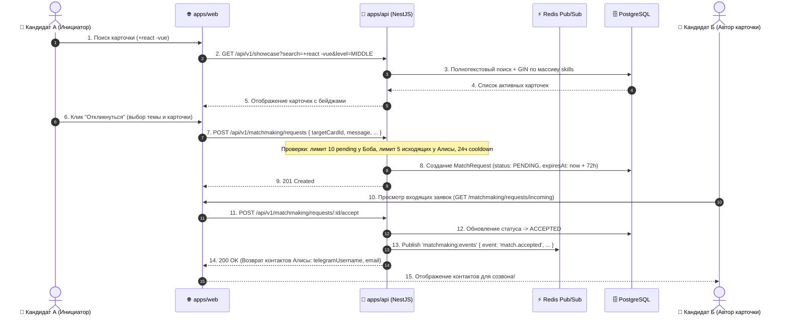

# Задачи: Витрина карточек (Showcase) и система матчинга (Matchmaking)

Данный документ содержит полное разделение функционала витрины и матчинга на задачи для **Backend** и **Frontend**, архитектурные диаграммы и структуры файлов.

---

## 1. Архитектурная диаграмма матчинга и жизненного цикла заявки



---

## 2. Структура файлов в монорепозитории

### 2.1. Packages (`packages/dto`):
```text
packages/dto/src/
├── showcase/
│   ├── showcase.enums.ts                  # Specialization, ExperienceLevel, InterviewLanguage, ShowcaseSortBy
│   ├── search-parser.ts                   # Парсер операторов + / -, санитизация SQL и HTML
│   ├── search-parser.spec.ts              # Unit-тесты парсера
│   ├── manage-showcase-card.dto.ts        # createShowcaseCardSchema, updateShowcaseCardSchema
│   ├── showcase-query.dto.ts              # showcaseQuerySchema (поиск, фильтры, пагинация)
│   └── showcase-response.dto.ts           # ShowcaseCardResponseDto, PublicUserCardDto
│
└── matchmaking/
    ├── matchmaking.dto.ts                 # createMatchRequestSchema, rejectMatchRequestSchema
    └── match-request-response.dto.ts      # MatchRequestResponseDto, UnreadMatchRequestsCountDto
```

### 2.2. Backend (`apps/api`):
```text
apps/api/src/modules/
├── showcase/
│   ├── showcase.controller.ts             # REST эндпоинты витрины (/api/v1/showcase)
│   ├── showcase.controller.spec.ts
│   ├── showcase.service.ts                # Бизнес-логика, сборка запросов, лимиты карточек
│   ├── showcase.service.spec.ts
│   ├── showcase-cron.service.ts           # Авто-продление 15 дней / перевод в EXPIRED
│   └── showcase.module.ts
│
└── matchmaking/
    ├── matchmaking.controller.ts          # REST эндпоинты заявок (/api/v1/matchmaking)
    ├── matchmaking.controller.spec.ts
    ├── matchmaking.service.ts             # Создание заявок, валидации очереди, accept/reject
    ├── matchmaking.service.spec.ts
    ├── matchmaking-cron.service.ts        # Авто-экспирация заявок через 72 часа
    └── matchmaking.module.ts
```

### 2.3. Frontend (`apps/web` по FSD):
```text
apps/web/src/
├── app/
│   └── (main)/
│       ├── showcase/
│       │   ├── page.tsx                   # Витрина карточек (каталог)
│       │   └── my/
│       │       └── page.tsx               # Управление своими карточками
│       └── matchmaking/
│           └── requests/
│               └── page.tsx               # Центр заявок (входящие / исходящие)
│
├── widgets/
│   ├── showcase-feed/                     # Лента карточек с фильтрами и строкой поиска
│   │   ├── ui/
│   │   │   ├── ShowcaseFeed.tsx
│   │   │   ├── ShowcaseFiltersBar.tsx
│   │   │   └── ShowcaseSearchBar.tsx
│   │   └── index.ts
│   ├── my-cards-list/                     # Список карточек пользователя со статистикой
│   └── match-requests-hub/                # Табы входящих/исходящих откликов
│
├── features/
│   ├── manage-showcase-card/              # Создание, редактирование, bump, renew
│   │   ├── ui/
│   │   │   ├── CreateCardModal.tsx
│   │   │   └── EditCardModal.tsx
│   │   ├── model/
│   │   │   └── useShowcaseMutations.ts
│   │   └── index.ts
│   ├── send-match-request/                # Модалка отправки заявки на карточку
│   │   ├── ui/
│   │   │   └── SendRequestModal.tsx
│   │   ├── model/
│   │   │   └── useSendMatchRequest.ts
│   │   └── index.ts
│   └── respond-match-request/             # Действия: Accept, Reject (с причиной), Cancel
│       ├── ui/
│       │   └── RejectReasonModal.tsx
│       └── model/
│           └── useRespondMatchRequest.ts
│
└── entities/
    ├── showcase-card/                     # UI карточки кандидата, бейджи грейда/языка/срочности
    │   └── ui/
    │       ├── ShowcaseCardItem.tsx
    │       └── UrgentBadge.tsx
    └── match-request/                     # UI элемента заявки, статусы, контакты
        └── ui/
            ├── IncomingRequestCard.tsx
            └── OutgoingRequestCard.tsx
```

---

# 🚀 Часть 1: Backend (`apps/api`, `packages/dto`, Prisma, Redis)

### Заголовок задачи:
`feat(api): реализация витрины карточек (Showcase) и системы матчинга (Matchmaking)`

### Чеклист задач:
- [ ] **Prisma & База данных:**
  - Модели `ShowcaseCard` и `MatchRequest` со всеми связями, перечислениями и индексами.
  - GIN-индекс для `skills` массива.
  - Частичные уникальные индексы (`unique_active_user_specialization_level`, `unique_pending_match_request_per_card`).
- [ ] **DTO и Поисковый парсер (`packages/dto`):**
  - Реализация `parseSearchQuery` (операторы `+react -vue`, DoS-защита 10 токенов, экранирование SQL).
  - Схемы Zod: `createShowcaseCardSchema`, `updateShowcaseCardSchema`, `showcaseQuerySchema`, `createMatchRequestSchema`, `rejectMatchRequestSchema`.
- [ ] **Контроллеры и сервисы (`apps/api`):**
  - `ShowcaseController` (`GET /showcase`, `GET /showcase/my`, `POST /showcase`, `PATCH /showcase/:id`, `PATCH /status`, `POST /bump`, `POST /renew`, `DELETE /:id`).
  - `MatchmakingController` (`GET /unread-count`, `POST /requests`, `GET /incoming`, `GET /outgoing`, `POST /:id/accept`, `POST /:id/reject`, `POST /:id/cancel`).
- [ ] **Бизнес-правила и защитные механизмы:**
  - Проверка заполненности профиля (`displayName`, `username`).
  - Лимит 5 активных карточек, лимит 10 входящих заявок (backpressure), лимит 5 исходящих.
  - Запрет Self-invite, Cooldown 24ч после отклонения, авто-матч при встречной заявке.
- [ ] **Фоновые воркеры (Cron):**
  - `ShowcaseCronService` (15 дней TTL / `autoRenew`).
  - `MatchmakingCronService` (72ч TTL заявок).
- [ ] **Redis Pub/Sub:**
  - Публикация события `match.accepted` в канал `matchmaking:events`.
- [ ] **Тестирование:**
  - Unit-тесты для сервисов, контроллеров и парсера поиска (покрытие >= 85%).

---

# 🎨 Часть 2: Frontend (`apps/web`, `@packages/ui`, `@packages/i18n`)

### Заголовок задачи:
`feat(web): интерфейс витрины карточек (Showcase) и управления откликами (Matchmaking)`

### Чеклист задач:
- [ ] **Страница витрины (`/showcase`):**
  - Адаптивная сетка карточек со скелетонами загрузки.
  - Умная строка поиска с подсказками по операторам `+` и `-`.
  - Фильтры: специализация, грейд, язык (`RU`/`EN`/`ANY`), бейдж ⚡ *"Готов сегодня"* (`isUrgent`).
  - Сортировка (по поднятию, по новизне, по уровню).
- [ ] **Страница «Мои карточки» (`/showcase/my`):**
  - Список своих карточек со статистикой заявок (`stats`).
  - Создание и редактирование карточки (Zod валидация).
  - Кнопка поднятия в топ 1 раз в 24ч (`bump`), тумблер `autoRenew` и перевыставление `renew`.
- [ ] **Центр заявок (`/matchmaking/requests`):**
  - Вкладки "Входящие" и "Исходящие".
  - Действия: Принять (`ACCEPT` -> показ контактов собеседника), Отклонить (`REJECT` с указанием причины), Отменить (`CANCEL`).
- [ ] **Header Badge:**
  - Индикатор количества входящих заявок в шапке сайта (`GET /matchmaking/requests/unread-count`).
- [ ] **Локализация (`@packages/i18n`):**
  - Полный перевод витрины, карточек, фильтров и модалок на `ru` и `en`.
